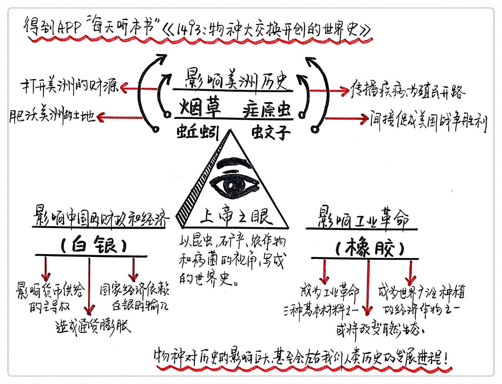

《1493：物种大交换开创的世界史》| 王谨解读
======================================

购买链接：[亚马逊](https://www.amazon.cn/图书/dp/B01KL5PC6U/ref=sr_1_1?ie=UTF8&qid=1506266216&sr=8-1&keywords=1493：物种大交换开创的世界史)

关于作者
--------------------------------------

查尔斯·曼恩是《大西洋月刊》《科学》和《连线》等知名刊物的撰稿人，曾三次进入美国国家杂志奖决赛的作者，被美国律师协会、美国物理研究会和兰南基金会授予过与写作相关的奖项。他的另一著作《1491》赢得了美国国家学院传播奖的年度图书奖。

关于本书《1493：物种大交换开创的世界史》，全新解读哥伦布登上美洲大陆之后的世界史，令人眼界大开的科学解释，真正的全球高度的研究成果，本书先后被《纽约时报》、《华盛顿邮报》、《泰晤士报》、《纽约客》、《出版人周刊》等知名刊物推荐。
 

名词解释：
--------------------------------------

物种大交换：是指1492年哥伦布到达美洲之后，随着东西半球的交流往来，一些原本是各个大陆特产的物种，经由人类的活动，被带到其他大陆，这种人为引起的爆炸性的物种交流，对自然环境和历史进程都产生了重大影响，有些影响持续至今。科学家将这一事件称为“物种大交换”，或“哥伦布交换”。

物种大交换对历史的影响：

案例一：

原产于中美洲的烟草，被移植到北美，并成为美国的前身英属北美殖民地的经济支柱；随着英美烟草贸易，英国的泥土以及其中的蚯蚓也被带到美洲，蚯蚓彻底改造了北美生态环境，造成很多原生物种灭绝，并为殖民者开拓美洲做出了贡献。

案例二：

一些携带有疟疾病病原体“疟原虫”的欧洲人将疟疾病带到美洲，并通过美洲的蚊子大范围传播，造成土著人口大量死亡，帮助殖民者征服美洲。同时由于人口锐减，劳动力不足，又催生了奴隶贸易，非洲的黑人被作为奴隶引进美洲。后来美国独立战争，以及海地独立战争期间，疟疾病又帮助他们打败了镇压独立的欧洲宗主国军队。

案例三：

西班牙殖民者在美洲开采的白银，通过贸易大量流入明代中国，促进了明朝后期的经济繁荣，但同时也影响了明朝的金融秩序，引发通货膨胀等后果，并最终压垮了明朝的财政，这是明朝灭亡的重要原因之一。

案例四：

原产于美洲的烟草、番薯、玉米等农作物，被引进亚欧大陆，改变了许多国家的饮食习惯和营养结构，同时这些高产作物也为包括中国在内的东半球人口增长做出了贡献。

案例五：

原产于南美洲亚马逊河流域的橡胶，被开发为新的工业材料，在工业革命中广泛应用。同时由于橡胶的经济价值，橡胶树被移植到非洲和亚洲的热带地区，对当地生态造成很大影响。

总结：
--------------------------------------

我们以往认为，我们人类就是历史的绝对主角，但其实我们往往忽略了，其他物种（也包括没有生命的矿物）对历史的影响，有时候来得更大，甚至会左右我们人类历史的发展进程。所以，这本书其实也提醒了我们，看待历史、看待生态环境、定位人与自然的关系，我们需要更开阔的视野，和一颗更深怀敬畏的心。这就是我们读这本书的意义。

金句：
--------------------------------------

1. 中国小孩是怎么得到他手里的番薯的呢？答案是哥伦布。科学家们将哥伦布看成是无意间开启了全球范围内爆炸性生物交换的人。在他建立了东西两半球的联系之后，数以千种的动植物物种在大陆之间往来不绝。这是恐龙灭绝以来生命史上最重要的事件。历史学家称其为“哥伦布大交换”。
2. 哥伦布大交换能在很大程度上解释为什么英国人输掉了美国独立战争，为什么墨西哥城成了世界上第一座真正国际化的城市，以及为什么数以百万不情不愿的非洲奴隶被运过了大西洋。事实上，这都与本书的主题——即哥伦布大交换有关。
3. （被作为奴隶引进美洲的）西非与中非的成年人，是世界上最不容易感染疟疾的人，因为他们有对疟疾的遗传性抵抗力……20世纪初曾有种族主义者叫嚣，是基因优势造就了他们的优越性，而西非人的遭遇恰好说明他们的谬误：他们的免疫力成了他们被奴役命运的源头。
4. 无论郑和航行多远，都没有遇到比他的祖国更富强的国家，从技术上说，中国已经遥遥领先欧亚大陆的其他地区，郑和完全可以绕过非洲，抵达欧洲，但帝国终止了航海活动，原因和美国停止送宇航员登月一样：那里没有什么东西值得支付这么大的成本。
5. 工业革命需要三种原料：钢铁、化石燃料和橡胶。
6. 全球化既带来了经济进步，同时也带来了巨大的生态和社会危机，从而可能威胁到前者的成就——4个世纪之前的历史事件，奠定了我们当下经历的事件的基础。

撰稿：王谨

脑图：摩西

转述：于浩