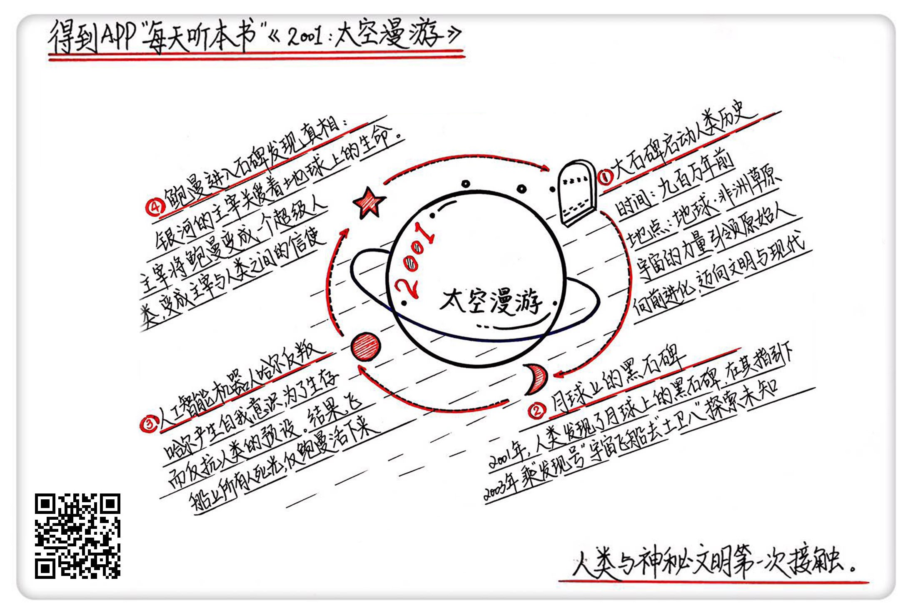

《2001:太空漫游》| 怀沙解读
=============================

购买链接：[亚马逊](https://www.amazon.cn/gp/product/B00AU0BSTM/ref=pd_cp_14_1?ie=UTF8&psc=1&refRID=VZDAKJGQD1WX36PB70HS)

听者笔记
--------------------------

> 人类通过石碑的指引，一步一步从猿人变成了现代人，然后在月球上发现了第二块石碑，并在石碑的指引下来到了土星的第八颗卫星，途中人工智能机器人哈尔反叛，杀死了四名飞行员，留下幸存的鲍曼，将哈尔内存条拔光，独自驾驶飞船到达目的地，结果进入了石碑内部，变成了超级人类，而这种人类不以物质的形式存在，而是以能量的形式无形地存在，并且具有强大的预知能力。

关于作者
-----------------------------

亚瑟·克拉克，世界现代科幻三巨头之一，具有深厚的数学和物理专业背景，在科幻领域分别拿到三个雨果奖和三个星云奖， 1986年被美国科幻作家协会授予终生成就奖，是这个时代最伟大的科幻大师和太空预言家。

关于本书
-----------------------------

《太空漫游》是克拉克的代表作，这本书是《太空漫游》四部曲的第一部，情节跨度从几百万年前的非洲一直到2001年的月球和2003年的土星，出版后就成为科幻小说界的圣经。同名电影上映后，成为科幻电影的鼻祖。

核心内容
-----------------------------

本书的思想核心是：人类文明受到一个神秘的高级文明的指引，一步一步从蒙昧走向开化，直到登上月球，又被引向土星。在人类驶向土星的过程中，人工智能与人类展开了智力上的交锋。最后，化险为夷的人类宇航员顺利抵达土卫八，终于解开了这个神秘文明的身世，而他自己也从此变身超级人类，成为了连接人类和高级文明之间的信使。     
 

一、为什么要看这本书
-----------------------------

有两个理由：第一是作者牛，克拉克的作品是科幻圈最硬的小说，科学性极强。中国著名科幻作家刘慈欣说：我的所有作品都是对亚瑟·克拉克拙劣的模仿。第二，《太空漫游》是克拉克的代表作，是无论如何都绕不过去的科幻经典。

《太空漫游》四部曲讲了一个广阔宇宙格局下的故事，人类在接近银河系最核心秘密的同时，也将自己带入了深渊。这本书是小说的第一部，讲的是人类和神秘文明第一次发生接触的故事。

二、有人看着我们长大
-----------------------------

小说的前五分之一的篇幅，讲了在非洲草原上，男性类人猿望月如何在饥饿中挣扎着生存，如何学会了使用工具，又是如何带领族人横扫整个草原、征服四方。这一群类人猿就是人类的祖先，而他们从普通哺乳动物转变成智慧生物的关键性动作——使用工具，不是缓慢进化，是一块神秘的石碑瞬间赋予的。再后来，望月这一支族人用了几百万年的时间，走出了非洲，变成了今天的你和我，而这块石碑，将是贯穿整个故事的一个图腾。

三、月球上的石碑
-----------------------------

时间转到了2001年。在小说设定中，人类科技水平远超现实中的2001年，在月球、火星都建立了基地，也由此探测出了月球上磁场的异常，从而发现了第二块石碑。只不过这一次，面对石碑的不再是懵懂的类人猿，而是发展出文明的人类，通过宇宙的通用语言数学，人类很快就从切割精度上，感受到了这块石碑的不凡背景：石碑来自一个强势的高级文明。石碑发出信号，指示人类走向土星的第八颗卫星，人类也感受到了神秘的召唤，于是用了两年时间做准备，制造了“发现号”飞船，向土卫八进发。

四、哈尔的反叛
-----------------------------

由 NASA 制造的“发现号”飞船一共承载了两名清醒的宇航员、三名休眠状态的宇航员和一个叫做哈尔9000的人工智能机器人。为了让宇航员安心工作，NASA 没有对人类宇航员公开这次飞行的真实目的，只有哈尔了解围绕石碑开展的计划实情。在飞行途中为了保全自身，已经觉醒出独立意识的机器人哈尔就发起了一场叛变。最终，哈尔的叛变没有成功，人类宇航员除了鲍曼以外全部牺牲，NASA也向鲍曼坦白了飞行任务的真正目的。孤独的鲍曼决定勇敢前行，独自一人驾驶“发现号”，继续向土卫八飞去。

五、鲍曼进入石碑
-----------------------------

进入土卫八轨道后，鲍曼发现了第三块石碑。为了找到真相，鲍曼就从“发现号”上出来，驾驶一艘小飞船向石碑靠近，没想到飞到石碑正上方的时候，一下被石碑吸了进去。在进入石碑的一瞬间，他留给地球上的一句话：“我的老天爷——这全是星星。”然后跟地球就彻底中断了通讯，本书也进入了尾声。鲍曼在进入石碑之后看到了一个布满星星的夜空，然后说出了上面那句话，接着就进入了一种半梦半醒的状态，直到最后清醒过来，他发现自己变成了一个超级人类，知晓了包括石碑在内的，一切。

金句
-----------------------------

1. 有一天，望月带领着部落，站在非洲草原上，踌躇满志，目视远方，真觉得自己什么都行了。这一点和现在的人类感觉也很像。
2. 克拉克的这种写作手法，可以叫“用想象来填补未知的过程”，这个写作手法是科幻小说家惯用的，就是在两个人类已知的事实之间，用绚丽的想象力建一座桥，把两个真实的已知，完美地串起来。
3. 所以，在宇宙里文明如果相遇了，打招呼的方式，就是向对方发出一个数学上有意义的信息，这就是一种智慧声明。
4. 生活里，如果一个人说话措辞非常精准，对时间把握很准，交出来的东西精度极高，那建议你高看这个人，高看这样的团队。

撰稿：怀沙

脑图：摩西

讲述：怀沙 