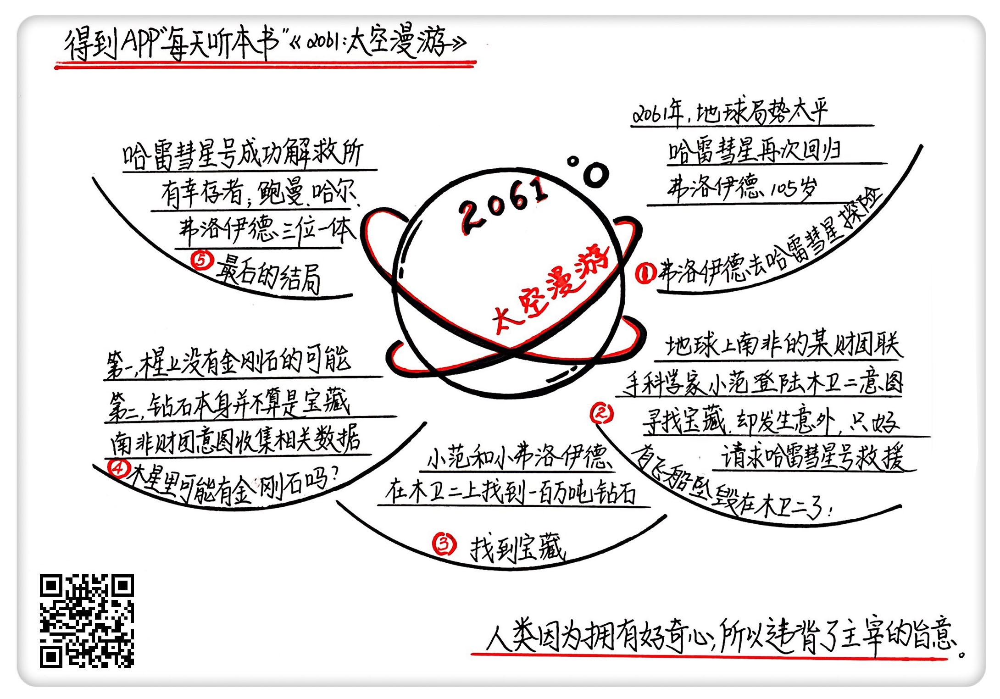

《2001:太空漫游》| 怀沙解读
=============================

购买链接：[亚马逊](https://www.amazon.cn/gp/product/B00AU0BSTM/ref=pd_cp_14_1?ie=UTF8&psc=1&refRID=VZDAKJGQD1WX36PB70HS)

听者笔记
--------------------------

> 人类怀着好奇心在登陆哈雷彗星的同时又悄悄去靠近木卫二，原本是想收集数据，探寻宝藏，但最后不小心在木卫二着陆了，犯了主宰的禁令。后来哈雷彗星的飞船去往木卫二将木卫二上探寻的人员救援返回地球。

关于作者
-----------------------------

亚瑟·克拉克，世界现代科幻三巨头之一，具有深厚的数学和物理专业背景，在科幻领域分别拿到三个雨果奖和三个星云奖，1986年被美国科幻作家协会授予终生成就奖，是这个时代最伟大的科幻大师和太空预言家。   

关于本书
-----------------------------

《太空漫游》是克拉克的代表作，这本书是《太空漫游》四部曲的第三部，写于哈雷彗星上次到访地球时的1986年，讲述的是2061年哈雷彗星再次回归时的故事。这一部的情节里，银河主宰和他的助手鲍曼都成为了幕后的观察者，作者试图用世俗的烟火欲望反衬超脱的宇宙视角。     
核心内容
-----------------------------

本书的思想核心是：在地球大和平的2061年，人类有了充分的闲情逸致，组织到哈雷彗星的表面去探险。不料中途收到信号，被派去人类禁地木卫二紧急救援，从而公开了一场蓄谋已久的禁地大冒险。最终，幸存者都安全撤回地球，但违背了主宰旨意。皆大欢喜的结局背后，注定暗藏着不知何时降临的杀机汹涌。
 

一、前情回顾
-----------------------------

银河系有一个主宰，喜欢在宇宙中扶植文明，地球上的人类和木卫二上的生物都是它扶植的生命。前两部小说里，为了更好地和人类交流，他把一个宇航员鲍曼进化成了超级人类，作为自己的助手；为了给木卫二带去更多温暖，它把木星引爆成了一颗恒星。主宰只对人类提了一个要求：太阳系的一切，都是你的；但是有一个禁区，就是木卫二，永远不要登陆。

二、弗洛伊德博士要去哈雷彗星
-----------------------------

2061年的地球繁荣昌明，也在太阳系的其他地方建了许多基地，这一年恰逢哈雷彗星回归，就组织了一次到彗星上探险的旅行活动。前两部中出现过的男主角弗洛伊德博士也被邀请参加，他欣然前往。当飞船降落在彗星上，一幅宛如煤矿开采现场般的景色展现在人们面前。正当大家尴尬地在“矿井”里自由参观，飞船收到信号，要求马上赶到木卫二，进行紧急救援。

三、有飞船坠毁在木卫二了
-----------------------------

坠毁在木卫二的飞船先于“哈雷彗星号”出发，原本想打一个“不能登录木卫二”的擦边球，却在贴着木卫二飞行的时候遭到武装胁迫，被迫着陆，随后在降落时发生意外，呼叫救援。这艘飞船上有弗洛伊德博士的孙子小弗洛伊德和科学家小范，这次行动是小范联合南非的一个财阀集团策划的寻宝行动，因为他们发现这里有一颗巨大的钻石，科研和经济价值非凡，要到现场来一探究竟。

四、找到宝藏
-----------------------------

等待救援的空档，小范拉着小弗洛伊德放下飞船去寻找宝藏。原来宝藏是一颗100万吨大小的钻石，是木星爆炸时落在木卫二上的碎屑，小范想进行科学研究，南非财阀想获取经济利益，这一次行动他们收集到了这座钻石山方方面面的数据。

五、木星里可能有金刚石吗
-----------------------------

小说里说木星的星核是钻石组成的，这次的宝藏是木星变成恒星时炸裂下来的碎屑。但是很遗憾，根据现有的科学认知，木星不仅核心不可能是钻石，就连表面也没有存在钻石的可能。另外，即使人类在地外真的找到这样一颗巨大钻石，也很难产生相应的经济效益，因为那就打破了钻石在市场上的稀缺性。

六、最后的结局
-----------------------------

在小弗洛伊德陪小范测量钻石山数据的时候，突然发生了亦真亦幻的怪事，他看到了突然出现、又突然消失、没有穿宇航服而且能在真空中跟他说话的爷爷。而此时的爷爷，应该在“哈雷彗星号”上，在飞来木卫二的途中。后来“哈雷彗星号”带着所有人返回了地球，他向爷爷求证此事，弗洛伊德博士说我并未离开过飞船，也没有来见过你。而小弗洛伊德坚信，这绝不是一个梦。     
金句
-----------------------------

1. 整个哈雷彗星表面，唯一和煤矿不一样的地方，是遍地都是的喷射到天空的水柱，样子很像我们地球上看到的那种射向天空的探照灯。这些喷到天上去的超大水柱，其实就是哈雷彗星彗尾的来源，因为哈雷彗星的引力很小，所以这些水柱一旦被喷到空中去，就再也没有引力把它们拽回来，所以哈雷彗星就像个洒水车一样，一边走一边漏水。
2. 构成木星的主要元素是氢，在木星表面几百度摄氏度的温度和好几个大气压下，钻石的碳元素和氢元素会马上发生化合反应，产生甲烷。听上去很让人崩溃，世界上最贵的东西和氢气结合，竟然等于粪坑里的气体。
3. 如果你的所谓优点不伴生着强烈的缺点，那你的这个优点可以说只是一个平庸的优点。
4. 那我们看看人类，有什么贯穿始终的优点呢？可能还真就是那种天生的探索欲望，旺盛的好奇心，我要自由地展现我的天性。再说得宽泛一些，也可以总结成那句话：不自由，毋宁死。

撰稿：怀沙

脑图：摩西

讲述：怀沙