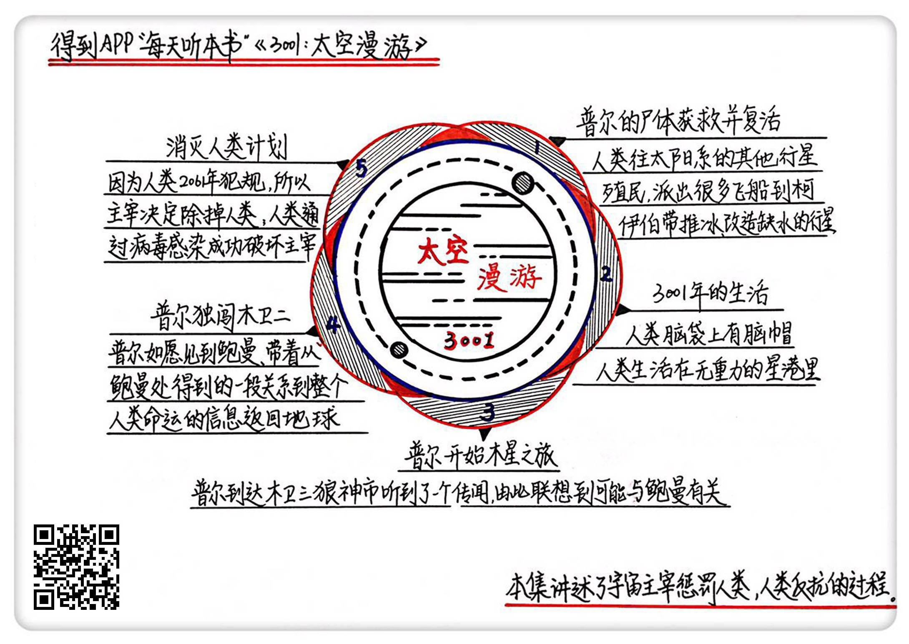

《2001:太空漫游》| 怀沙解读
=============================

购买链接：[亚马逊](https://www.amazon.cn/gp/product/B00AU0BSTM/ref=pd_cp_14_1?ie=UTF8&psc=1&refRID=VZDAKJGQD1WX36PB70HS)

听者笔记
--------------------------

> 第一部中，飞行途中被杀死的普尔，在本集中复活了，并来到了木卫三。
> 当时的科学家发现经常有神秘鬼魂出现，怀疑是鲍曼，但是又无法证实，直到普尔出现认出了鲍曼。
> 鲍曼为了见到普尔，独闯木卫二，见到了鲍曼，而鲍曼也告诉他一个惊天的秘密，主宰要灭掉人类。
> 人类为了自救，将人类长久积累的计算机病毒，都交由鲍曼，希望鲍曼将它上传到主宰那边，最后得逞了。
> 从逻辑上讲，病毒可以篡改信息，而任何生命体都可以被视为信息，从这一点上保证了科学性。

关于作者
-----------------------------

亚瑟·克拉克，世界现代科幻三巨头之一，具有深厚的数学和物理专业背景，在科幻领域分别拿到三个雨果奖和三个星云奖， 1986年被美国科幻作家协会授予终生成就奖，是这个时代最伟大的科幻大师和太空预言家。

关于本书
-----------------------------

《太空漫游》是克拉克的代表作，这本书是《太空漫游》四部曲的最后一部，写作时间距离第一部过去了29年，在小说里则是跨越千年，作者为我们描述了一个来自3001年的世界。作为四部曲的大结局，情节串联了前三部的人物和故事，人类展开了对命运的终极反抗。 
    
核心内容
-----------------------------

本书的思想核心是：在一千年以后的世界，发达的文明水平很轻松将第一部牺牲的宇航员普尔救活。普尔以极端手段再次独闯木卫二，从曾经的挚友、现在的超级人类鲍曼那里，得知了主宰要消灭人类的意图。最终，在这一场低对高的文明反间战中，人类获胜。     
 

一、前情回顾
-----------------------------

银河系里的超级文明“主宰”在银河系到处扶植别的生命，就像一个人在菜园子里到处种菜一样。在人类还是猿人的时候，他就扶植了人类。主宰还吸收了三位人类阵营的成员，把他们变成了半人半神的状态来协助管理人类。在前两部里，大家的关系比较融洽，但到了第三部，人类违背了主宰的禁令。

二、普尔活了
-----------------------------

3001年，人类已经完成了对整个太阳系的殖民占领——除了禁地木卫二。某一天一艘正在正常作业的宇宙飞船，突然接到了一个任务，去地球和木星之间拯救一位人类宇航员，这个人就是第一部中被人工智能杀死的普尔。宇宙空间的绝对零度让他的尸体保存完好，冰封了千年的普尔，被救活了。

三、3001年的生活
-----------------------------

3001年的人类已经完成了种族大融合，能够通过一个叫“脑帽”的人机互联装置迅速获取知识，并且为了配合已经扩大到整个太阳系的生活半径，大部分都生活在海拔3万米的太空环上。通过脑帽，普尔很快就适应了新千年的生活，同时琢磨着用现在的便利条件，去完成被冰封前未完成的夙愿。

四、普尔到木星
-----------------------------

普尔从地球乘坐星际航班降落在木卫三的狼神市，这里有4万常住人口，是地球在整个木星系统的集中办事处。狼神市大学有一个教授，专门在研究附近经常出现的一个神秘鬼魂，普尔认为这就是他曾经的好友、现在的人类守护神鲍曼。

五、普尔独闯木卫二
-----------------------------

为了见到飘忽不定的鲍曼，普尔决定独闯木卫二，用曾经的交情和犯规的极端方法来赌一把。鲍曼果然现身。除了叙旧，鲍曼还告诉了普尔一条关乎全人类命运的重要消息，这让普尔忧心忡忡，第一时间飞回了地球。

六、最后的结局
-----------------------------

鲍曼的信息是：主宰决定除掉人类这个不听话的生命，任务交由鲍曼执行，但鲍曼舍不得自己的人类同胞，就一边利用宇宙中信息往返产生的时间差来拖延，一边透露消息给人类，希望人类能找到自救的办法。对人类来说，这是一场无从下手的战争，从物质层面完全找不到着力点，最终，人类决定打信息战，并且取得了胜利。

金句
-----------------------------

1. 敌人在哪里，不知道。敌人是什么形态，不知道。文明到了什么程度，不知道。而且，人类掌握的所有武器，无非都是通过改变物质的分子组合形态的武器，冷兵器、热兵器、核武器都是，但是现在面对的这个敌人，是一个非物质的状态，人类根本就无从破坏。
2. 只要是一种生命，归根结底它是一种信息。所谓主宰这种生命，无非就是在一个空间里，用主宰的信息方式重新编码了所有微粒的相对位置。那你只要是有序的，我就有办法破坏你。因为病毒就是一个微观的粒子重构器。所以，用病毒侵入主宰体内，然后一点点侵蚀他的信息架构，在科学上是说得通的。
3. 在小说和电影里，每个人物做出重大抉择的时候，都要遵循他以往的人物设定。如果鲍曼在之前的情节里，是一个特别冷血、特别追求效率，像一个政客的那种性格，那人类可能就要完蛋了，因为他一定会执行主宰的指令。
4. 鲁迅说过一句话，悲剧就是将人生有价值的东西毁灭给人看，喜剧就是把那些无价值的东西撕破给人看。但克拉克的这个小说，既没有那种战胜恶魔的喜悦，也没有正义失败的悲凉，好像两边不靠。要总结成一句话，这部小说说的是：一帮不够好的人类，打败了一个不够坏的神。
5. 如果你看完之后，不是痛快淋漓的，而是有一种不安，那说明你是有敬畏之心的，那你可能偏向是一种更温顺的世界观和宗教观。但如果你看完之后，觉得人类干得好，什么宇宙老大哥，都是纸老虎，人挡杀人，佛挡杀佛，那你的宗教观就更偏向克拉克那一边。你的第一反应就是你的深层性格。
6. 其实，克拉克向我们传达的是一种我们曾经很熟悉，但现在又有点渐渐远去的左派价值观。就是《国际歌》里唱的那句话——从来就没有什么救世主，也不靠神仙皇帝，创造人类的幸福，全靠我们自己。

撰稿：怀沙

脑图：摩西

讲述：怀沙