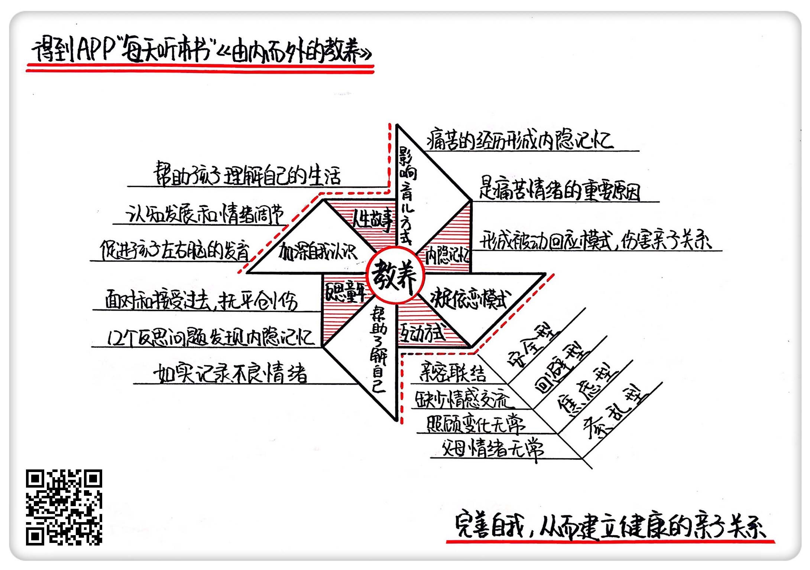

《由内而外的教养》| 秋秋解读
======================================

购买链接：[亚马逊](https://www.amazon.cn/由内而外的教养-做好父母-从接纳自己开始-丹尼尔·西格尔/dp/B01MQYT3KH/ref=sr_1_1?ie=UTF8&qid=1508238215&sr=8-1&keywords=由内而外的教养)

听者笔记
--------------------------------------

> 儿童时期的隐形记忆可能会在成年后影响人们的性格和情绪。
>
> 父母与孩子的不同互动方式，决定了孩子不同的依恋模式，可能是：回避型、焦虑型和紊乱型，这些模式可能在哺乳期就已经形成，甚至可能只是因为肚子饿要喝奶哭闹下父母的反应。
>
> 作者罗列了12个问题清单，有助于帮助了解自己。从自己的童年经历里寻找那些不愉快的事情，有助于培养自己和孩子的关系。
>
> 在父母遇到失控情绪的时候，可以通过和孩子讲故事的方式，传递自己的感受，孩子太小可能无法通过特别理性的说法来感受父母的情绪，但是讲故事可能能够降低这件事的门槛。这样做的好处还可以锻炼孩子的理性思维能力。

关于作者
--------------------------------------

丹尼尔·西格尔，哈佛大学医学博士。他创造性地将人类学、生物学、认知科学、社会学、神经科学等多门学科跟心理学融合，开创了人际神经生物学这门新学科，专门研究人际关系和大脑的密切关系。他是“情商之父”丹尼尔·戈尔曼最为推崇的脑科学家。近年来，丹尼尔将自己的研究成果应用于家庭教育，传播给大众。

关于本书
--------------------------------------

这本《由内而外的教养》，是在美国畅销了10年的育儿经典。丹尼尔经过多年研究发现，正是我们的经历，尤其是童年经历，塑造了我们的大脑，决定了我们的思维，并且影响着我们养育孩子的方式。只有更深入地理解自己的经历，解决早年未处理的精神创伤，才能以健康的心理创造温馨的亲子关系，这就是所谓“由内而外的教养方式”。

核心内容
--------------------------------------

从记忆的提取机制、亲子关系中的三种依恋模式、如何发现自己不好的童年经历三个方面，为你讲讲怎样完成由内而外的育儿之路。
 

一、过往经历影响教育方式
--------------------------------------

人类的记忆有两种，分外显记忆和内隐记忆，而内隐记忆是导致痛苦情绪的重要原因。如果过往经历的痛苦没有在心理上得到妥善处理，大脑关于这些经历的内隐记忆就会跳出来，提醒你的痛苦。如果父母有一些问题没有得到妥善解决，会很容易将自己过去不健康的行为或者心理模式传给孩子，导致历史反复重演。

【案例】

每次玛丽带孩子去买鞋，都会对孩子选择的款式挑三拣四，把鞋贬得一文不值。她就好像是控制不住自己一样，每次都这样。

其实，这跟玛丽小时候的挫败经历有关。玛丽的家里有兄弟姐妹8个，妈妈每次带他们出去买鞋的时候都要赶着大减价去，商场满是人，玛丽总是在慌乱中仓促挑选鞋子，新款又太贵妈妈舍不得买，所以玛丽总是买不到最理想的，妈妈花钱也很不情愿，还总是很爱生气，所以玛丽一想到买鞋就很痛苦。这个经历导致了玛丽成年后的焦躁行为。

二、互动方式决定孩子的依恋模式
--------------------------------------

父母与孩子的不同互动方式，决定了孩子不同的依恋模式。

1. 回避型依恋

人们如果在童年生活中缺少与父母的情感交流，他们就会好像感受不到他人的存在，对孩子的感受也不敏感，甚至对自己的情感信号也不理睬。这些人在为人父母后，不能每次都明白子女发出的需求信号，长此以往，孩子将会形成回避型依恋模式。也就是说，孩子会在情感上尽可能不去依赖父母，跟他人的关系也会变得冷淡。他们会为了防止内心变得脆弱，不断弱化右脑对情感的感知，逐渐形成依靠左脑的理性思维方式。

2. 焦虑型依恋

人们如果在童年所受的照顾变化无常，或者对照料过度依赖，成年后会对依恋过度专注，内心充满了矛盾和不确定。这种专注的态度，有可能会妨碍他们感受孩子发出的信号，常常感到内心压抑。如果类似的情况经常发生，小孩子会形成焦虑型依恋，他不确定父母是否能够满足他的需求，有时候能，有时候又不能，这种焦虑导致了不确定感，会使孩子觉得跟他人的联结不可靠。

3. 紊乱型依恋

如果童年出现过精神创伤，人们的情绪变化无常，就常常会吓到孩子。在生理上，没有抚平的精神创伤会阻碍大脑信息的流动，左右脑的协调能力也受到损害，在反思生活的时候会陷入混乱，使他们不能够连续地描述过去的生活，这就导致了他们对生活意义的感知出现问题，情感无处安放，慢慢地对情感的体察变得麻木，注意不到他人的情感，进而影响人际关系，也不太会沟通，不能控制自己的情绪。

在有了孩子后，这样的人这会使亲子关系产生隔阂和恐惧，形成紊乱型的依恋模式。孩子学不会调节自己的情绪，很难处理自己跟他人的激烈情绪，心理上可能出现分裂倾向，面对压力的时候无能为力。

三、反思你的童年经历，能够帮助你了解自己
--------------------------------------

反思你的童年经历，除了能够帮助你了解自己，还可以让你重新选择自己的行为方式。通过分析，你的感受能力和创造生活的能力也会大大提高。可以通过以下12个问题进行反思，通过记录创伤经验，发现童年经历的隐形记忆，最终找到你一贯的行为模式和一直影响亲子关系的问题。

12个反思问题：
--------------------------------------

1. 你怎么看待成长？
2. 从少年到成年一直到现在，你和父母的关系是如何变化的？
3. 在和父母的相处上，你有什么喜欢或讨厌的地方？
4. 你是否被父母拒绝过，是否受到过父母的惊吓？
5. 父母的教育对你的童年有什么影响？
6. 你能记起很小的时候和父母分离时的感觉吗？
7. 你的生命中是否有重要的人过世了？当时你的感受如何？
8. 当你高兴和不高兴的时候，你的父母有什么反应？
9. 如果小时候有其他人照顾过你，有没有发生过什么不愉快的事情？
10. 你是否因为童年的一些经历而特别讨厌某种行为？
11. 你经历过的事情中，有哪件事你希望能够有另外一种处理方式？
12. 在和他人的相处上，你最想改变的是什么？

通过反思，你会发现，过去自己的一些行为模式导致你经常出现一些做法，影响了你跟孩子的关系。清理过去，提醒自己经常反思，这时候再改变行为就会变得不那么困难了。

四、讲故事
--------------------------------------

通过讲故事的方式，向孩子讲述事件的经过，可以让孩子明白发生了什么，了解自己当下的处境，他的负面情绪就会大大减少，这不仅也有利于左右脑的发育，也是他理解世界和调节情绪的主要方式。对于父母来说，反思你的人生故事，也可以加深你对自我的认识。

金句
--------------------------------------

1. 如果你跟孩子或者伴侣经常因为某一个行为吵架不愉快，或者你会莫名其妙地发现某个行为特别不能容忍的时候，可能你就要停下来想一想，是不是你的身上还有没有妥善解决的问题。
2. 在无意识的情况下，记忆自己跳出来了，这就是内隐记忆。内隐记忆是导致痛苦情绪的重要原因。
3. 如果父母有一些没有妥善解决的问题，就很容易将自己过去不健康的行为或者心理模式传给孩子，导致历史反复上演。
4. 如果孩子和父母经常有亲密的联结，父母在孩子需要的时候能够积极回应，能让孩子感觉到自己被理解和保护，那么他们之间形成的依恋关系就是一种安全的依恋。

撰稿：秋秋

脑图：摩西

转述：杰克糖 