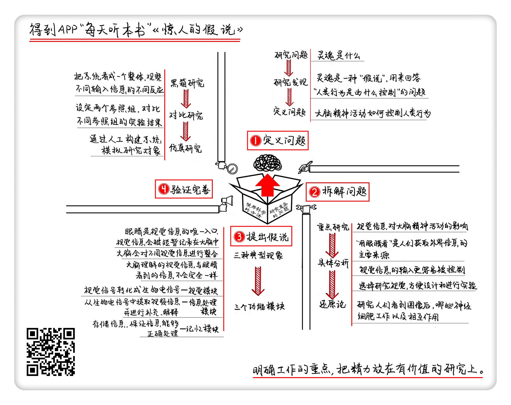

《惊人的假说》| 无锋解读
====================================

购买链接：[亚马逊](https://www.amazon.cn/第一推动•生命系列-惊人的假说-F•克里克/dp/B0079TBKFE/ref=sr_1_1?ie=UTF8&qid=1507945397&sr=8-1&keywords=惊人的假说)

听者笔记
------------------------------------

> 要解决一个复杂的问题，科学的方法包括四步：分别是定义问题、拆解问题、建立科学假说，以及通过实验，对假说进行验证和完善。
>
> 定义问题，要区别定义和假说的误区，避免将假说误认为是定义，比如灵魂，灵魂是假说，不是定义，而定义可能是“人类的行为是由什么控制”。
>
> 拆解问题，就是要将一个大的问题拆解成若干个小问题。
>
> 建立科学假说，就是通过现象／结果，提出假说，并进行逻辑推理。
>
> 验证和完善科学假说，就是通过实验来进一步求证的过程。作者也提供了三种常见的求证方法：黑箱、对比、仿真。

关于作者
------------------------------------

弗朗西斯·克里克是英国著名的生物学家、物理学家和神经科学家。他因为和詹姆斯·沃森共同发现了 DNA，也就是记载人类遗传信息的生物分子的双螺旋结构，而获得了1962年的诺贝尔医学奖。可以说 DNA 结构的发现解决了分子生物学的基础问题，从此将遗传学和生物医学带入了快速发展时期。

作为当时生物学的泰斗级人物，克里克在70年代把自己的研究兴趣转移到了神经科学，还把“灵魂”，这个哲学、心理学上的难题当成了神经科学的问题来研究，可以说是对“灵魂”这个宗教中的基础概念提出了挑战，同时也拉开了使用自然科学方法研究人类精神活动的序幕。 

关于本书
------------------------------------

《惊人的假说》这本书介绍了作者在探索“灵魂”的过程中所采用的方法，以及当年脑神经科学领域的最新研究成果。这本书最重要的价值并不是书中给出的实验结果，而是书中所描述的一套研究复杂问题的科学方法。 

核心内容
------------------------------------

要解决一个复杂的问题，科学的方法包括四步：分别是定义问题、拆解问题、建立科学假说，以及通过实验，对假说进行验证和完善。即使是面对“探索灵魂”这样复杂的问题，以上四步仍然可以帮助我们找到解决方案。 
 

一、定义问题
------------------------------------

定义问题，也就是搞清楚我们要解决的到底是什么。“定义问题”是之后所有工作的基础。如果没搞清楚要解决的问题，那就像是射箭前还不清楚靶子在哪，得到的答案也一定是错的。

1. “灵魂”并不是一个问题，而是一种“假说”，是用来回答“人类的行为是由什么控制”这个问题的。
为了解释“人类的行为是由什么来控制”，宗教提出了“灵魂假说”，认为人是由躯壳和灵魂组成的，而人的行为由灵魂来驱使。因为每个人都有不同的灵魂，所以每个人面对同样的事情会有不同的反映。一个人死后身体之所以不能再活动，是因为灵魂离开了身体，或是去天国，或是去地狱，又或者是进入了下一个轮回。
2.  在研究“人类的行为是由什么控制”这个问题的过程中，现代神经生物学家已经不需要借助“灵魂”这个宗教概念了。因为随着现代分子生物学的发展，人类对大脑的认知提高了，科学家可以提出新的假说来解释这些现象。

这就像在达尔文之前，人们一直认为自己是由“造物者”创造的。直到达尔文发表了《物种起源》这本书，人们才发现原来还可以用“进化假说”来解释人类是如何诞生的。在“进化假说”中没有“造物者”这个角色，但也一样解释得通。所以，克里克和其他神经生物学家在研究的过程中，并没有去证明灵魂是虚假的，而是在解释“什么控制着人类行为”这个问题时，不再使用“灵魂”这个假设了。

二、拆解问题
------------------------------------

“拆解问题”就是把一个复杂的问题分拆成一个一个的小问题来解决。当这些小问题被一一解决之后，大问题的答案也就找到了。克里克把问题按信息的种类进行了拆分，并且重点研究“当收到视觉信息时，大脑会产生怎样的精神活动”这个子课题。主要是出于以下三点原因：

1. “用眼睛看”是人们获取外界信息的主要来源，视觉对大脑精神活动的影响，比其他信息源更重要。
2. 视觉信息的输入更容易被控制。
3. 方便设计和进行实验。

选择视觉实验入手，可以让在动物身上得到的实验结论，更接近人体的真相。如果我们选择研究人脑对语言输入产生的精神活动，那就不能用猴子来做实验了。毕竟猴子不使用人类的语言，实验的结论也不具备可迁移性。

三、提出科学假说
------------------------------------

“假说”是对所研究的问题给出一种解释性的答案，之后的实验设计都会围绕着这个假说来进行。提出假说需要根据观察到的现象来进行逻辑推理。

1. 构思假说

在书中，作者举了三种典型的现象，作为构思假说的基础。第一种典型的现象：当我们闭上眼睛时，所有的图像都会消失，但是我们在短时间内仍然可以回忆出刚才看到的内容。这就说明视觉信息存在唯一的“入口”，那就是我们的眼睛，而且视觉信息会被短暂地记录在大脑中。

第二种典型现象：我们左眼和右眼看到的视觉画面，其实是不太一样的，但是我们并没感觉到画面有什么重叠，或者是不自然的过渡。这就说明大脑对于不同的视觉信息会进行整合。

第三种典型现象：当我们看一副油画时，虽然画只有一个平面，但是我们也能解析出它所表达的三维信息；当我们透过栏杆看到一个人时，不会因为人的图像被栏杆分割而认为看到的是多个人。这就说明，大脑所理解的视觉信息，与眼睛看到的信息并不会完全一样。 
2. 逻辑推理

根据这三种典型的现象，作者用逻辑推理的方法，来推测大脑对视觉信息的接收和处理机制。大脑不是像一块屏幕那样，只能接收眼睛的“投影”，而是能对所“看”到信息进行主动地处理。

这个过程主要包括三个功能模块，分别是视觉模块、信息处理模块和记忆模块。视觉模块的主要功能是，把视觉信号转化成生物电信号；信息处理模块负责从生物电信号中提取视频信息，并进行必要的解释和补充；记忆模块负责在整个过程中，提供信息的存储功能，保证信息能够得到正确的处理。

四、验证和完善科学假说
------------------------------------

研究过程中使用了三种关键的研究方法，分别是黑箱研究、对比研究和仿真研究。

1. 黑箱研究，就是把一个复杂的系统看成一个整体、一个“黑箱”。要想知道这个黑箱有什么功能，你可以观察，它对不同的输入信息有什么不一样的反应。
2. 对比研究，就是通过比较实验组和对照组的实验结果，来发现某个因素对于实验结果的影响。
3. 仿真研究，就是通过人工来构建一个系统，去模拟研究对象的行为，来帮助发现研究对象内部各部分之间是如何相互作用的。 

金句
------------------------------------

1. 对于一个开放性的问题，如果提出的“假说”可以解释观察到的现象，那这个“假说”就可以被认为是一种答案。
2. 克里克和其他神经生物学家在研究的过程中，并没有去证明灵魂是虚假的，而是在解释“什么控制着人类行为”这个问题时，不再使用“灵魂”这个假设了。
3. 不只是生物学，黑箱研究的方法同样被广泛应用在其他领域。举个例子，我们在研究小行星的结构时，不可能把小行星劈开来看，所以科学家就会给这个小行星制造撞击，然后采集撞击后的地震频率，推测其中的结构。
4. 作者并没有试着去解决和大脑精神活动相关的所有问题，比如他会刻意地回避“意识”这个词的使用，因为不同领域对“意识”这个词的理解有很多不同。与其在这个概念上浪费时间，作者认为，不如抛开分歧，把有限的精力放在真正有价值的神经细胞研究上。

撰稿：无锋

脑图：摩西

讲述：于浩