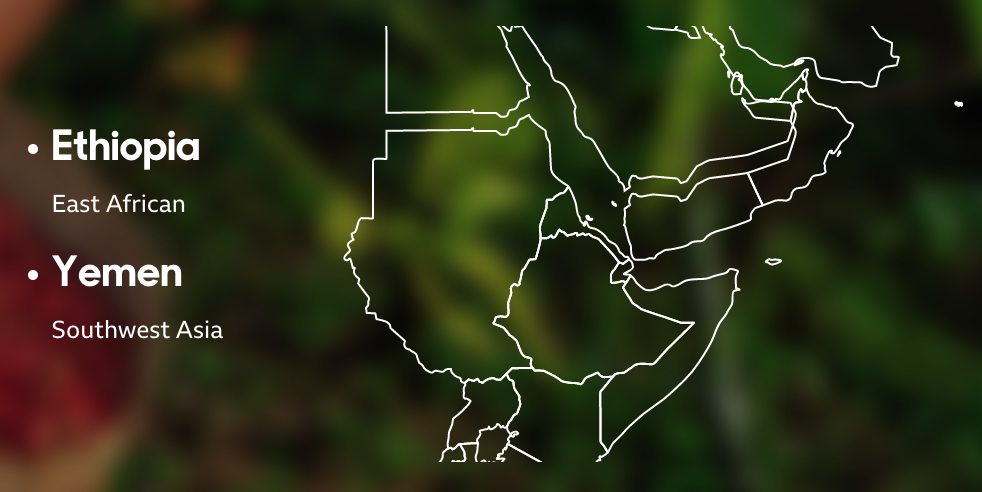

全球贸易的时间表
===================

内容来源：BBC新闻网

原文链接：http://www.bbc.com/future/bespoke/made-on-earth/a-timeline-of-global-trade/

8000多年来，对遥远国家商品的渴望推动了复杂的国际贸易网络的演变。这些贸易路线在世界各地的文化和市场留下了持久的印记，在许多情况下，今天仍然可以看到这些印记。这里有18种商品塑造了全球经济，从史前到今天。

葡萄酒-公园前6千年(6th Millennium BC)
--------------------------

格鲁吉亚（南欧）

最早的葡萄酒来自格鲁吉亚，由格鲁吉亚（[Georgia](https://en.wikipedia.org/wiki/Georgia_(country) )）生产并储存在地下的大陶罐中以保持凉爽。 但是要交易葡萄酒，必须将其运输。 在青铜时代，葡萄酒首先是在[双耳长颈瓶](https://en.wikipedia.org/wiki/Amphora )中盛载的——大的球形陶器花瓶，靠近脖子的把手上衬有蜡。

琥珀-公园前4千年(4th Millennium BC)
--------------------------

波兰（欧洲） - 立陶宛（欧洲） - 拉脱维亚（欧洲）

大约在公元前3500-2500年，从北欧的波罗的海沿岸到南欧的琥珀贸易非常活跃。琥珀-从史前森林遗留下来的树液，往往与被困的昆虫或植物物质里面 - 在波罗的海是丰富的，但高度珍贵的装饰目的，沿着地中海和亚得里亚海海岸以南，那里几乎没有。对这些宝石的需求增长如此之大，以至于早在公元前2000年就出现了赝品。

香料-公园前1千年(1st Millennium BC)
--------------------------

印度（南亚） - 印度尼西亚（南亚）

几个世纪以来，香料贸易以阿拉伯为中心，据说商人发明了故事来保护他们商品的起源。香料是首批真正进行全球交易的产品，为我们今天所依赖的贸易网络铺平了道路。

丝绸-公园前2世纪(2ND CENTURY BC)
--------------------------

中国（东亚）

丝绸之路（实际上是道路网）通常被视为真正的全球首批贸易路线之一，从中国通往罗马。 这始于中国丝绸商人寻求将其有价值的商品交换给中亚更大更强壮的马匹。 这条路的鼎盛时期在公元15世纪左右结束，因为西方的商人找到了通过海路到达东方的更快路线，从而切断了中亚的贸易。

玻璃-公园前1世纪(1ST CENTURY BC)
--------------------------

埃及（东非）-以色列（西南亚）-叙利亚（西南亚）

玻璃珠在非洲已有数千年的历史了，但在整个伊斯兰时期，它已广泛用于国际贸易中。 珠子是一种货币，也因它们的美丽而倍受珍视。 在公元前一世纪的当今叙利亚，随着玻璃吹塑技术的发展，玻璃物体在日常生活中变得越来越普遍。

纸-公园2世纪(2ND CENTURY AD)
--------------------------

中国（东亚）

纸最早于公元2世纪初在中国制造。这种单一材料改变了我们永远沟通的方式，使大众识字成为可能。它作为塑料的可持续替代品，在今天发挥着同样重要的作用。

盐-公园5世纪(5TH CENTURY)
--------------------------

摩洛哥（北亚）-意大利（欧洲）-德国（欧洲）

在不同文化中，对盐的旺盛需求——用于食品和传统医学——已经推动了数千年的长途贸易。在罗马帝国晚期和整个中世纪，从意大利的[Via Salaria](https://en.wikipedia.org/wiki/Via_Salaria ) 到德国的[旧盐路](https://en.wikipedia.org/wiki/Old_Salt_Route )，几种食盐贸易路线都发生了变化。在5世纪，加纳的路线横穿撒哈拉沙漠，与非洲等国（如加纳）的黄金进行贸易（在包括今天的摩洛哥在内的西北非洲丰富的盐）之间进行贸易。

黄金-公园7世纪(7TH CENTURY)
--------------------------

加纳（西非）-马里（西非）

在中世纪的西非，盐业的另一半是黄金。 在现在的加纳和马里，土壤和河流中的黄金丰富。 一年一度的商队用骆驼运输黄金穿过沙漠。 今天，一些交易者仍在经历同样艰辛的旅程。 撒哈拉以南地区的黄金交易在任何时候都出现了相对少量的到达北部的情况。 14世纪的马里皇帝穆萨一世（MūsāI）带着一吨黄金前往埃及开罗时，以压倒市场而闻名于世。

茶叶-公园9世纪(9TH CENTURY)
--------------------------

中国（东亚）-印度（南亚）-日本（东亚）

茶花（Camellia sinensis）-茶树（the tea plant），在中国，印度和斯里兰卡等地区发展起来并盛行。 一个中国的传说认为，中国的史前统治者神农坐在树下，当它的叶子掉进水壶里时。 他喝了其浸泡的液体，发现其清醒特性。 在9世纪，茶在中国以外的地方扎根，在日本成为和尚和精英阶层的普遍饮品。 后来，大约在17世纪，这种饮料在欧洲流行起来。

威士忌-公园12世纪(12TH CENTURY)
--------------------------

爱尔兰（欧洲）-苏格兰（欧洲）

爱尔兰和苏格兰争夺威士忌的发源地，谁先到达那里是一个悬而未决的问题。 但是今天，苏格兰威士忌的产量已远远超过爱尔兰，苏格兰威士忌在国际上享有的声誉是其他烈酒所无法比拟的。

橘子-公园15世纪(15TH CENTURY)
--------------------------

西班牙（欧洲）-印度（南亚）-中国（东亚）

橘子最初不是生长在佛罗里达州的小树林，而是来自喜马拉雅山的山麓。 15世纪左右，它很可能被意大利或葡萄牙旅行者带到了更远的地中海。 随着全球贸易的扩大，它与其他柑橘类水果一起发挥了重要作用，帮助船员避免了坏血病。 水手们在其航行路线的海岸上种了柑橘树，以帮助橘子在世界范围内的贸易和传播。

咖啡-公园15世纪(15TH CENTURY)
--------------------------

埃塞俄比亚（东非）-也门（西南亚）

认真的咖啡种植始于15世纪左右。 从那以后，它引发了一系列社会革命，从17世纪的欧洲咖啡馆到意大利永恒的意式浓缩咖啡文化，再到今天从伦敦到上海的邪教商店（能让人产生信仰的店铺）。

鲜花-公园17世纪(17TH CENTURY)
--------------------------

荷兰（欧洲）

几个世纪以来，荷兰一直是花卉贸易的中心。 如今，肯尼亚等国家作为竞争力越来越强生产者，给机会稀少的农村地区带来了就业和经济发展。

自行车-公园19世纪(19TH CENTURY)
--------------------------

法国（欧洲）

最早的自行车模型之一被称为“ velocipede（人力车）”。 自行车的名字就让它看起来很快，而且它看起来就是很快，因为它没有刹车。尽管起源不确定，但自行车已发展成为世界上最受欢迎的交通工具之一。

半导体（Semiconductors）-公园19世纪(19TH CENTURY)
--------------------------

美国（北美）-英国（欧洲）

半导体（电子电路的重要组成部分）背后的思想于1833年被发现，为现代计算奠定了基础。 由此导致的半导体贸易的爆炸式增长改变了我们生活的几乎所有领域。

风力发电（Wind turbines）-公园19世纪(19TH CENTURY)
--------------------------

美国（北美）-苏格兰（欧洲）

自上古以来，我们就利用风来发电–尤其是帆船，抽水和磨谷。 但是，第一批利用风力发电的涡轮机是19世纪发明的，该发明是由美国和苏格兰的发明家于1887年开发的。如今，全球风能发电量超过515吉瓦，占世界电力供应的4％ 。

手包-公园20世纪(20TH CENTURY)
--------------------------

意大利（欧洲）-中国（东亚）

在20世纪，随着越来越多的女性加入劳动力市场，手袋变得不可或缺，导致手工皮包的贸易激增。

手表-公园20世纪(20TH CENTURY)
--------------------------

英国（欧洲）-瑞士（欧洲）

伊丽莎白皇后（Queen Elizabeth I）在16世纪曾收到礼物赠予手表，但它们的普及速度缓慢。 它们在战争时期很流行，当时必须计划和精确地进行军事演习。 在19世纪中叶，瑞士人主导着钟表市场，主要是怀表。 第一次世界大战后归来的士兵使手表变得时尚之后，手表终于在20世纪初占领了大众市场。
