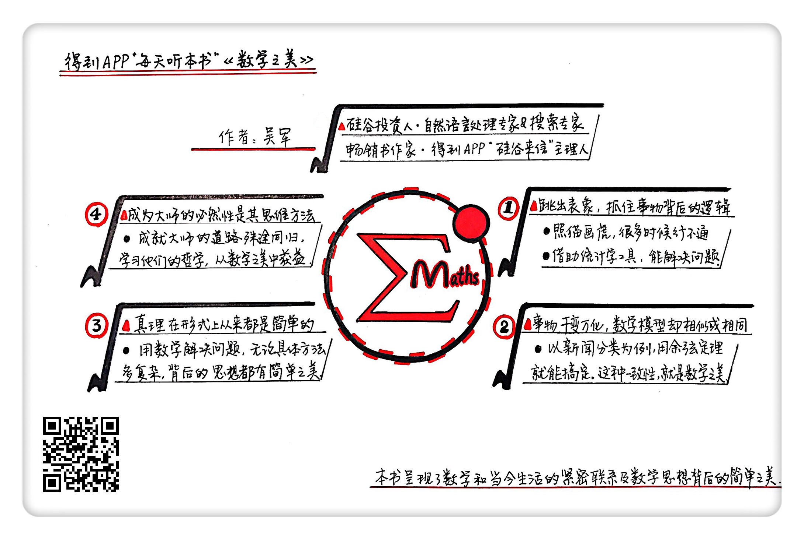

《数学之美》| 田正赓解读
=========================

购买链接：[亚马逊](https://www.amazon.cn/图书/dp/B00P6OJ09C/ref=sr_1_1?ie=UTF8&qid=1506265068&sr=8-1&keywords=数学之美)

听者笔记
--------------------------

> 数学是无处不在的，数学通常可以用来描述事物的一般规律。
> 相似相同的数学模型作用于不同的领域，体现了数学的一致性。
> 数学之美在于能够用简单的方法来解释复杂的问题。
> 数学之美不仅在于它的简单，也在于它的严谨。

关于作者
--------------------------

吴军，毕业于清华大学和约翰霍普金斯大学，他有很多个身份。

他是硅谷投资人，丰元资本的创始合伙人，是著名的自然语言处理专家和搜索专家，也是“得到”App专栏《硅谷来信》的主理人。他是谷歌的早期员工之一，在谷歌期间领导参与了很多研发项目，是谷歌中、日、韩搜索算法的发明人。同时他还是位畅销书作家，除了这本《数学之美》以外，还写过《文明之光》《智能时代》《浪潮之巅》等多本畅销书。 

关于本书
--------------------------

在本书里，吴军从他的亲身经历出发，为我们介绍了数学在信息科学领域的种种应用，以及两位著名的数学信息科学大师的数学智慧。通过这些实际案例，他为我们展示了数学和我们当今生活的紧密联系，以及数学思想背后蕴含的简单之美。 

核心内容
--------------------------

本书的核心思想是：数学和我们的生活联系非常紧密，生活中很多意想不到的问题，其实都能用数学方法来解决。数学能够帮助我们跳出问题的表面现象，抓住事物发展背后的逻辑，从而用一种巧妙的方法去解决复杂的问题；同时因为数学也具有简单的一致性，这就让我们经常能用一种思想来解决不同种类的问题。而数学之美，就体现在这种实用和简洁之中。 

 
一、数学能帮我们跳出表象，抓住事物发展背后的逻辑
--------------------------

让计算机能处理人类的语言是我们今天很多工作的基础，所以科学家们很早就在这个问题上展开了研究。

其实最开始让计算机处理语言的时候，科学家们按照仿生学的思路，坚持认为，要让机器学会翻译或者语言识别，就必须像人一样，先让计算机学会语法。但是后来人们发现，语法规则实在是太多，根本没有办法穷尽。这种方法在上个世纪70年代逐渐被证明是不可行的。

与此同时，著名计算机科学家贾里尼克和他领导的实验室，发明了用统计学处理自然语言的方法，大大提高了语音识别的识别率和识别规模。他们的方法主要用了“马尔科夫假设”， 这个假设是说，假定一个句子里每一个词出现的概率，只和前一个词有关，就好比“涨停”这个词，最有可能出现在“股票”之后。那么，只要给计算机量足够大的机读文本，计算机就能算出来，在一个特定词后面出现某个词的概率。这样，只要把一句话里所有词出现的概率相乘，就是这个句子出现的概率了。概率最大的句子，就是我们需要的正确句子。

在解决问题时，过度地注意模仿却不懂变通，也是导致失败的重要原因。就像当年人们最开始制造飞机时，总是想把飞机的机翼设计成鸟的翅膀，但是最后莱特兄弟制造出来的第一架飞机，靠的不是仿生学，而是空气动力学。所以说，不被事情的表面现象迷惑，是一种很重要的能力，而数学就能帮我们跳出表象，抓住事物发展背后的逻辑。

二、数学的“一致性”体现着数学之美
--------------------------

余弦定理是一个揭示三角形边角关系的重要数学定理，使用余弦定理，就可以仅凭三角形两个边的向量，计算出这两个边的夹角。科学家为了让计算机能处理人类的语言，要先把新闻里的文字变成一组可以计算的数字，再设计一个算法，这样就能让计算机通过余弦定理，来算出任意两篇新闻的相似性，从而确定新闻的分类。

新闻里的词分为实词和虚词，“之乎者也的”这种虚词对判断新闻分类无益，就不考虑，而“股票”“利息”这种实词，对判断新闻分类很有帮助，是我们关注的重点，我们就要用这些实词计算出一则新闻的特征向量。只要给每一则新闻都计算出其独特的特征向量，再根据每一类新闻经常出现的词的特征，就可以判断出任意一条新闻的分类。

在新闻分类的工作中，计算机不需要去理解每篇新闻，只要找到同一类新闻的相似点就可以了，用余弦定理就能搞定，这就证明了数学的“一致性”。虽然事物发展千变万化，但处理它们的数学模型却是相似、甚至相同的。这种一致性，就是一种“数学之美”。

三、数学的妙处就是，一个好方法，常常也是最简单明了的方法
--------------------------

现在我们每个人几乎每天都会用到搜索引擎，它可以在极短的时间内搜索到大量你需要的网页，这背后的关键就是数学。

搜索引擎背后的基本数学原理，其实特别简单。二进制是世界上最简单的计数方法，因为二进制只有0和1两个数字，并且二进制还可以表示逻辑里的“是”和“非”。布尔运算，就是一种针对二进制的运算，它是19世纪英国的一名名叫布尔的数学家发明的，基本的运算只有“与”“或”“非”三种，非常简单。

搜索引擎会把用户查询的语句，转换成布尔运算的算式，看看搜索关键词有没有出现在这个网页，1就代表出现，0就代表没出现。这样一来，每个网页就会转换成一个数字。最后只要把显示为1的网页拿出来，就是你要的搜索结果了。计算机做布尔运算的速度非常快，所以搜索引擎可以轻松地在很短的时间里搜索出大量网页。

牛顿曾经说过，“真理在形式上从来都是简单的，而不是复杂和含混不清的”。数学之美也体现在这里，如果你能拿数学工具来解决问题，那么不管你的方法有多复杂，这里面的基本思想都应该是简单的。

四、两位数学信息科学大师的数学思维
--------------------------

本书的作者吴军认为，技术其实分为两种，分别是“术”和“道”。“术”指的是具体做事的技艺和方法，而“道”指的是做事的原理和原则。

这本书的目的是讲“道”，而不是去讲多么具体的“术”。因为很多具体的技术很快就会变得落伍。追求“术”的人，一辈子都会很辛苦。只有掌握了技术的本质和精髓，做事才能游刃有余。

第一位大师是阿米特·辛格。他是美国工程院院士，谷歌公司内的一位技术大神。辛格做事情的哲学，是先帮助用户解决80%的问题，再慢慢解决剩下20%的问题，这就让他总是能在较短的时间里较好的解决问题。阿米特·辛格还奉行简单的哲学，他认为最简单的东西往往是最好的。因为他认为越简单的事情越容易解释道理，这样可以方便查找错误。

第二位大师是迈克尔·柯林斯，他是一个擅长用数学把工作做到极致的人。柯林斯的哲学是追求极致和完美。比如他曾经设计了一个帮助计算机处理自然语言的分析器，目的不是为了验证什么理论，而仅仅是为了做出世界上最好的分析器。柯林斯的特点，就是把事情做到极致。他并不是刻意去追求繁琐和复杂，也不是和阿米特·辛格完全对立，他只是在追求数学上的严谨和完美。

不管是阿米特·辛格的简单哲学，还是迈克尔·柯林斯的完美哲学，都把数学的力量发挥到了极致，让数学用最好的方式来解决复杂的问题。这两种哲学，不是硬币的两面，而是相互补充的。 
金句
--------------------------

1. 其实在解决问题时，过度地模仿却不懂变通，也是导致失败的重要原因。就像当年人们最开始制造飞机时，总是想把飞机的机翼设计成鸟的翅膀，通过上下摆动来起飞。但是最后莱特兄弟制造出来的第一架飞机，靠的不是仿生学，而是空气动力学。
2. 虽然事物发展千变万化，但处理它们的数学模型却是相似、甚至相同的，这种一致性，就是一种“数学之美”。
3. 牛顿曾经说过，“真理在形式上从来都是简单的，而不是复杂和含混不清的”，数学之美也体现在这里。如果你能拿数学工具来解决问题，那么不管你的方法有多复杂，这里面的基本思想都应该是简单的。
4. 追求“术”的人，一辈子都会很辛苦，只有掌握了技术的本质和精髓，做事才能游刃有余。
5. 很多人的失败，不是因为不优秀，而是方法不对，如果一开始就追求“高大全”，但是很长时间都不能解决问题，最后的结果反而会很差。

撰稿：田正赓

脑图：摩西

转述：于浩