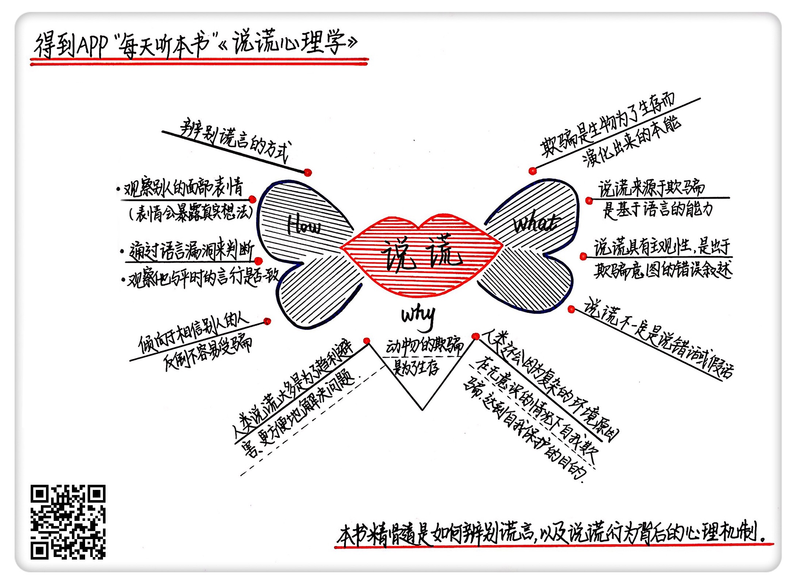

《说谎心理学》| 梁境心解读
=============================

购买链接：[亚马逊](https://www.amazon.cn/说谎心理学-为什么不说谎-我们就活不下去-伊恩•莱斯利/dp/B00C947MNI/ref=sr_1_2?ie=UTF8&qid=1508766299&sr=8-2&keywords=说谎心理学)

听者笔记
-----------------------------

> 说谎是用语言来虚构不存在的事物，以达到欺骗的目的。
>
> 说谎可能是为了生存、利益，也可能是因为环境的不同，导致人们被误导从而说谎（自欺欺人）。
>
> 检测说谎，可以通过表情来识别，表情通常难以伪装，还有一种就是让说谎者多说，说的越多，越有可能露出破绽。
>
> 实验表明，和我们以为的认知相反：总是怀疑别人的人反而比愿意信任别人的人更容易受骗。

关于作者
-----------------------------

伊恩·莱斯利，心理学专家、专栏作家、记者、广告从业人士。他曾经写过《成为总统》，深度揭秘了美国总统奥巴马在入主白宫时的戏剧化情绪与反应。他专长研究人们在特定情况下的心理表现。
  
关于本书
-----------------------------

《说谎心理学》揭示了人们说谎背后的心理机制，帮助人们理解自己的行为。这本书在广受好评的同时，也引发了人们对于自己行为方式的深思。这本书曾经被 BBC 广播4台评为“本周最佳图书”，被《每日邮报》赞誉为“一气呵成，令人着迷”。《说谎心理学》利用了诸多案例、实验与总结来帮助人们学会识破谎言。

核心内容
-----------------------------

核心内容分为三个部分：一、什么是说谎；二、人们为什么会说谎；三、怎样辨别谎言。     
 

一、什么是说谎
-----------------------------

欺骗和痛苦不同，欺骗可能会用到声调、表情或者道具，而说谎是用语言来虚构某些不存在的事物，是基于语言的能力。

【案例】

美国最伟大也最古怪的魔术师杰瑞·安德鲁斯毕生有一个重要的原则，在他的魔术生涯中，他从不说谎。尽管他看起来和其他魔术师一样，都是靠着欺骗的手法在变魔术，但他在进行表演时，虽然施展障眼法，却不说假话，这让他的表演很有意思。比如他常说“接下来我会反反复复地一直切牌，这样你们就无法知道我到底做了什么手脚。”由于他经常指出哪里可能是障眼之处，这使得安德鲁斯的表演变得很困难，但又正因如此，观众们会觉得他的表演更加神奇。

说谎具有主观性。就是说，如果说话的人以为自己说的是事实，那么就算他说错了，也不意味着他在说谎；但是如果他明知道自己在说错话，却假装自己说的话是真的，那这就是说谎。

所以，演员、剧作家和小说家并不是在说谎或者欺骗，因为规则是大家预先就知道的。

【案例】

美国演员马龙·白兰度拍摄过一个关于演技教学的录影带《为生计而撒谎》。在现存的镜头中，白兰度为年轻的莱昂纳多和西恩·潘传授他的表演技巧。白兰度对他们说“你要学会欺骗别人，让观众相信你的所作所为。要像说谎一样去演戏。”

说谎不一定是说错话、说假话，而是意图上的欺骗。

【案例】

19世纪中叶，美国巡回演出马戏团老板菲尼亚斯·巴纳姆在美国博物馆开办了一场展览，展览内容是各种畸形人和动物怪胎。展览十分火爆，但也带来了麻烦。观众在每一件展品前都停留很久不肯离开，这让博物馆十分拥挤，每天卖出的门票变得特别有限。巴纳姆决定想办法解决这个问题，他把出口指示牌上的单词换了一个，客流量就大大提高了。巴纳姆换上的这个单词，在英文中既有出口的意思，又暗示了某种奇怪的生物。观众想当然地以为前方有更精彩的展览，结果却被这个误导带出了博物馆。

二、人为什么要说谎
-----------------------------

首先，在远古环境中，动物可以通过欺骗获得好处；其次，许多物种把欺骗当作存活下去的必要手段，甚至发生了用于欺骗的进化。

【案例】

比如东部猪鼻蛇在受到威胁时会将腹部朝上、使身体发出恶臭并让舌头滑出口腔，它的种种动作都是为了装死；印尼巴厘岛外海的拟态章鱼，类似章鱼里的变色龙，它能够伪装成至少15种不同的海洋生物，只为骗取猎物或避开天敌。

对于人类来说，欺骗也是存活下去的必要手段。但人类比其他物种要相对复杂得多，人类面临的困境也要相对复杂得多。当我们的生存必要条件从食物变成了金钱，我们的威胁从大型猛兽变成了失去工作，当需要解决的问题变得越来越复杂，最方便的方法就是说谎。比如说，为了得到一份工作，我们会夸大自己的能力，甚至在简历中作假。只要我们的谎言不被揭穿，看上去只需要简单的几句话，我们就能立刻得到自己想要的结果。很多时候，成年人撒谎是为了立刻取得眼前的利益。

【案例】

贝尔实验室是世界上最老牌的重量级实验室，从这里走出了6位诺贝尔奖获得者。1998年，一名叫做舍恩的德国青年科学家加入了贝尔实验室。3年期间，他在《科学》《自然》等世界权威学术期刊发表了超过100篇论文。通常，一个科学家一年发表一两篇重要论文已经算是非常多产的了，所以，舍恩的成就令人惊叹，成了无数科学家追捧的对象。

2002年，舍恩的丑闻暴露。他为了追求学术上的高产和快速成功，在三篇毫不相关的论文中使用了完全相同的图表，这个漏洞被普林斯顿大学和康奈尔大学的物理学教授分别发现。科学神童成为了史上最臭名昭著的作假者。

不仅仅是对别人，人有时也会对自己说谎。人会受到环境的影响，不受控制地进行自我欺骗。

【案例】

瑞典有两位科学家做了一个实验。他们让一位年轻的女助理拿着一份调查问卷接近公园内的年轻男士们，请他们填写调查问卷。写完后，女助理把自己的电话号码留给了他们。研究者要统计的结果是：有多少人在事后打给她，并约她出去。之后，研究者变换了调查地点，这次是在一座人造峡谷的吊桥上，同样还是那名女助理，同样邀请路过的年轻男士们参与调查。结果，吊桥上有65%的男士打电话约了女助理，公园里却只有30%的男士打了电话。

我们也会为了别人而说谎。

【案例】

十六世纪人文主义思想家蒙田在《想象的力量》中写过一个故事。一位女性相信自己吞下了面包上的一根针，结果生病了。她的医生不相信她，但又无法消除她的病痛。有一天，医生给她服用了催吐剂，又偷偷在她的呕吐物中放了一根针，她就康复了。

三、如何辨识谎言
-----------------------------

有两个派别的理论告诉我们如何辨识谎言：一派锁定在说谎者的脸部表情上；另一派则认为线索就藏在说谎者的语言中。

【案例】

朴茨茅斯大学的一位教授做过一项有名的实验，叫做“写生测验”。在实验中，31名警官分别被安排参与同一个任务，就是去找一位特工接头，再回来描绘出接头的场景，而特工又对警官提出了不同的要求，一半的警官被要求说真话，另一半被要求保密，也就是作假。在实验结果中，这位教授发现，说谎者会参照自己曾经去过的其他地方，尽可能用各种细节丰富画面，而刻意减少对特工的描绘；而说实话的人都倾向于更多描绘那位特工，因为在他们的意识中，那位特工才是场景的中心。

与我们固有认知不同的是，总是怀疑别人的人反而比愿意信任别人的人更容易受骗。

【案例】

多伦多大学的两位心理学家做过一个实验，他们找到了一批受试者，在他们参加实验之前，先对他们进行标准化判断，知道他们是高度信任者还是低度信任者。高度信任者是倾向于相信别人的人，低度信任者不轻易相信别人。接下来，他们又找来另外一群学生进行模拟面试，要求其中一部分学生说实话，另一部分学生则要在几个关键问题上说谎。最后，他们让受试者观看这些学生的录像带，要求他们找出在面试中说谎的人。结果表明，高度信任者的表现远远好过低度信任者。     

金句
-----------------------------

1. 人类在狩猎时会利用环境隐藏自己，又尽量不发出声音，给猎物造成没有危险的假象，这就是人类最早的欺骗。
2. 孩子的谎言通常是利己的、单纯的，目的是为了避免被惩罚而隐瞒过错。
3. 我们的行为受到复杂的心理影响，但我们很难对内心的运作有所察觉。
4. 人会受到潜意识的驱动，产生应激反应，对自己说谎，给自己找到合理借口，从而获得解脱。
5. 医生会对患者说谎，但他们的目的并不在于欺骗，而是为了替患者考虑，减轻对方的精神负担，也就是我们所说的“善意的谎言”。

撰稿：梁境心

脑图：摩西

转述：于浩  