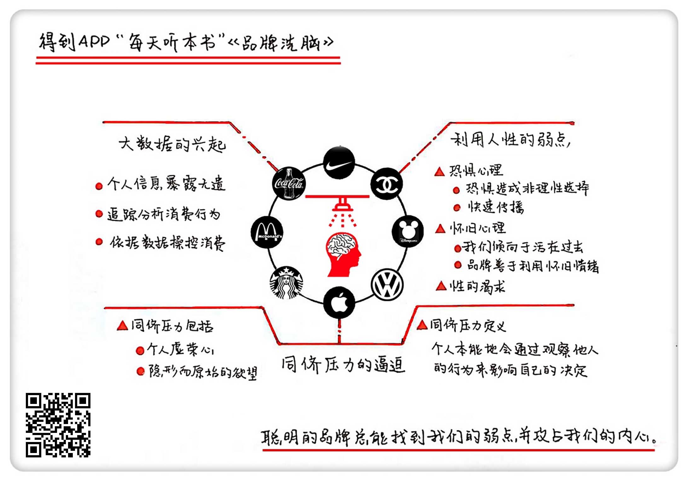

《品牌洗脑》| 陈药师解读
=================================

购买链接：[亚马逊](https://www.amazon.cn/图书/dp/B01HI1US3M/ref=sr_1_1?ie=UTF8&qid=1506607049&sr=8-1&keywords=品牌洗脑)

听者笔记
------------------------------

> 品牌给我们洗脑的方式主要有三种：
>
> 1. 利用人性弱点：恐惧、怀旧、诱惑（如：对性的渴望）
> 2. 同侪（chai）压力：需要和别人抢（饥饿营销）、有的同侪压力对特定地域人有不同的特点。
> 3. 利用大数据手段更深入地了解人：免费试用、优惠券、邻接空间（比如会买印度咖喱的人和兑换印度货币的人））

关于作者
---------------------------------

马丁·林斯特龙，世界知名的品牌营销大师。他是很多知名企业的营销顾问，比如可口可乐、麦当劳、宝洁、雀巢和微软等。品牌希望马丁告诉它们如何有效营销，而马丁也在剖析品牌使用了哪些伎俩来给消费者洗脑，最终让消费者拿出钱包买下商品。

关于本书
---------------------------------

这本书揭示了品牌营销过程中，那些最隐蔽但又最实用的手段。正是这些难以察觉的方式，让消费者彻底放弃了理性消费的可能。

核心内容
---------------------------------

品牌是如何给我们洗脑的？一、品牌善于利用人性中的弱点来兜售它们的产品；二、同侪压力，让我们变成了购物狂；三、大数据的兴起让我们更加赤裸裸地暴露在品牌面前，我们终于成为了品牌的忠实“奴隶”，并且甘之如饴。
 

一、品牌善于利用人性中的弱点来兜售产品
---------------------------------

品牌会充分利用我们的恐惧心理、怀旧情绪、对性的渴望来兜售产品。聪明的品牌总是能找到我们的弱点，然后攻占我们的内心，从而给我们洗脑。

1. 恐惧

利用恐惧心理来推销产品，是个屡试不爽的方法。

【案例】

20世纪五六十年代，有一个保温餐盒做了一个广告，广告词只有一句话：牛奶里的一只苍蝇意味着坟墓里的婴儿。
2. 怀旧情绪

很多大脑专家已经证明，人类倾向于活在过去，而聪明的品牌特别善于利用我们的怀旧情绪。

【案例】

柯达的经典广告“柯达时刻”，捕捉到了值得我们纪念的情感体验和经历：儿子吹熄第一根生日蜡烛的瞬间、女儿接过高中毕业证书的那一刻、和老婆结婚牵手的那一天……难怪马丁说了，那些有野心的品牌不仅仅想霸占你的今天和未来，还试图霸占你对过去的回忆。
3. 对性的渴望

很多品牌特别热衷于利用我们对性的渴望来勾起消费的欲望。

【案例】

凌仕男性护理产品有一个广告，表现的是一个优质男士能获得诸多女性的青睐，而不是其中的一个。心理学家发现，男性对性的渴望不满足于只有一个伙伴，而是多多益善。这个广告利用了这一点。

二、同侪压力，让我们变成了购物狂
---------------------------------

同侪压力，是指人们会本能地通过观察他人的行为来影响自己的决定。

1. 如果被别人拿走，我们就要错过了

【案例】

苹果公司发售新产品的时候，大都会利用饥饿营销的手段。
2. 同侪压力是有地域性的

亚洲人受同侪压力的影响更加明显。像生活在中国、印度或者俄罗斯这些新近崛起国家的人，更渴望获得认可，换句话说，他们的同侪压力更大，他们渴望能受到全世界的尊重，于是迷恋那些奢侈品牌。

三、大数据的兴起让我们更加赤裸裸地暴露在品牌的面前
---------------------------------

互联网时代，个人信息越来越暴露无遗，实际上，可能比你想象得还要可怕。品牌会根据追踪和分析你的消费行为，然后依赖于这些数据来说服或者操纵你的购买行为。

1. 免费试用是引导消费的绝妙方法

大数据显示，商家如果知道你的喜好并给你一次免费试用的机会，那么你就会有80%的可能性购买这个产品，而且使用周期能达到一年半以上。
2. 优惠券在获取你的信息

作者在书中指出，越来越多的零售商在收集优惠券的使用信息，然后把他们数据库中关于你的资料配对整合，这样下来，你的年龄、性别、收入、购买的历史或者你使用手机应用的习惯，甚至你家里的宠物是猫是狗，都会被他们采集到，因为每一个手机都是一个 IP 地址。
3. 大数据推动了邻接空间

邻接空间，简单说，就是把两种看似不相关的东西放在一起，但是会对同一类目标消费者产生吸引力。

【案例】

几年前，玛莎百货通过数据发现，购买印度风格餐具和印度食品的人越来越多，管理者意识到肯定有大量印度一代和二代来店里购物了，于是陆续在店里开设了货币兑换业务、英国国内旅游业务。也就是说，一个印度人在玛莎能买吃的用的，还能兑换货币，同时用玛莎的积分卡预定旅游线路还能享受折扣。这就是邻接空间的妙处。

金句
---------------------------------

1. 你越恐惧，品牌就越高兴。它们善于利用你的恐惧心理，一边渲染这种恐惧，一边把看似能消磨这种恐惧的产品卖给你。
2. 一提到恐慌，很多品牌都会兴奋异常，因为恐慌会让消费者失去理性，品牌卖出产品的机会就来了。
3. 刷遍朋友圈的北冰洋袋凌真的好吃吗？不好说，但它能勾起我们的回忆，于是我们就买了，我们希望能重新回到20多年前的那段岁月里。很多大脑专家已经证明，我们倾向于活在过去，而我们的大脑也喜欢这样。
4. 别害羞，心理学家早就发现，男性对性的渴望是多多益善的。很多品牌，比如凌仕和一些汽车厂商，都在利用男性对性的渴望来促进消费。
5. 在很多时候，同侪压力是促进我们消费的原因。“人有我无”会给我们造成一种难以抑制的焦虑，然后，我们就掏出了钱包。
6. 亚洲人的同侪压力更大，因为他们更渴望获得认可，更渴望获得尊重。
7. 你以为大数据是什么好东西？它不过是一窥我们灵魂的窗口。无论是优惠券、积分卡或者是免费促销手段，都会让你的个人信息进入品牌的数据库，通过对这些数据的分析，距离你下一次消费就不远了。

撰稿：陈药师

脑图：摩西

讲述：于浩