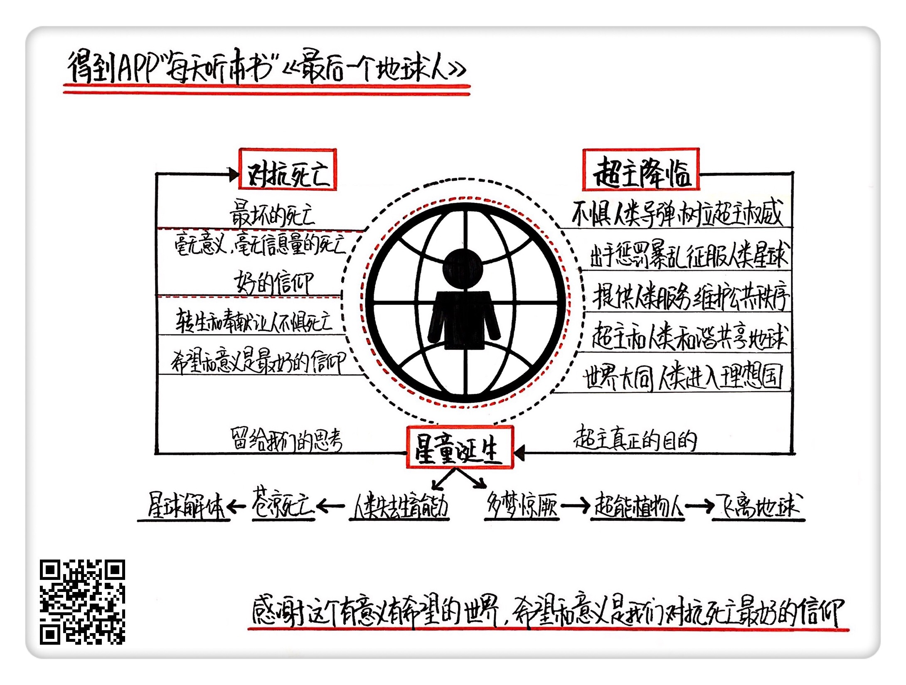

《最后一个地球人》 | 怀沙解读
=============================

购买链接：[京东](https://e.jd.com/30227836.html)

听者笔记
-----------------------------

> 组织里掌握绝对优势武力的一方，可以决定游戏规则，比如小说中的超主，只需要停止某一小片区域的阳光供应，瞬间就震慑了所有地球人。
>
> 人类在面对死亡这件事上，没有做好无意义死亡的心理准备。希望和意义是我们能对抗死亡的最好信仰。

关于作者
-----------------------------

亚瑟·克拉克，世界现代科幻三巨头之一，硬科幻的代表作家，获过三个雨果奖和三个星云奖，是20世纪用科幻预言未来最成功的小说家。 
    
关于本书
-----------------------------

《最后一个地球人》是克拉克“地球末日三部曲”之一，在这本书里他预言的是人类进化的终极形态，一经出版就造成巨大轰动，克拉克也由此开始迈向科幻小说宗师宝座。这本书是外星人科幻的经典，讲的是人类的宿命由更高级的智慧生物主宰，地球在平静里走到尽头。
  
核心内容
-----------------------------

本书的思想核心是：一个高级的外星文明“超主”忽然降临地球，插手人类内部事务，通过自己的暴力威慑，消除了战争和不公，将地球变成了一个世界大同的理想国。但是很多年之后，他们的真实意图突然在孩子身上暴露，变异的人类后代失去了自我意识，成为了另一种更高级的外星文明“超智”的养分。最后一代人类在没有一丝抗争的漫长凋零中，完成了种族灭亡。     
 

一、为什么要说这个系列
-----------------------------

科幻小说的使命不只是带来对人类文明的想象，还要探讨灭亡。“地球末日三部曲”讲的都是地球文明灭绝的不同可能性，三个故事彼此独立，有的危机人类扛过去了，有的危机没扛过去，这一部作品，带来的是满含悲凉的坏消息。但这本书为读者提出了两个好问题，分别是“人类社会怎么能实现世界大同”和“什么样的信仰能够最好地对抗死亡”，作者给出了他的解答。

二、超主降临
-----------------------------

小说用40%的篇幅，为我们描述了拥有高级文明的外星人“超主”降临地球后，是怎么帮助人类迅速实现世界大同的。来到地球后超主只做了两件事，而这两件事的本质，就是攻守兼备地向人类展示了具有绝对优势的武力。组织里掌握绝对优势武力的一方，可以决定游戏规则，还可以凭借威慑提高运作效率，达成目标。

三、星童诞生
-----------------------------

“超主”降临地球的目的，原来是保证星童的诞生。许多年后，人类所有10岁以下的孩子都变成了星童，而星童是另一个更高级文明“超智”的养分，或者说是“超智”这种超级生物的“细胞”。星童被“超主”接走，送给“超智”，10岁以上的人类再也没有后代，在地球上静静等待死亡。

四、什么样的信仰能够对抗死亡
-----------------------------

故事的结局之所以让人怅然若失，是因为人类最后的死亡，没有指向任何一个明确的意义。人类的心理机制不愿意接受这样绝望的死亡，这种死亡的方式比死亡本身更可怕。那什么样的信仰才能对抗死亡？能把死亡解释成另外一个段落的信仰，和能把死亡解释成换取更伟大意义的信仰，才能让人坦然面对和接受死亡。也就是说，希望和意义是我们能对抗死亡的最好信仰。
 
金句
-----------------------------

1. 停止供应阳光这个武器，真是世界上最可怕最优秀的战略性武器。它是一种非常绿色的惩罚，它不带来真的伤害，不杀人，不毁灭财富，也没有核污染。说停就停，没有不可逆的后果。
2. 在很多时候，一个企业的管理者如果有最强的暴力，当然这个“暴力”是打引号的，它在公司的框架里是财权和人事权，或者董事会给你的尚方宝剑，那就能提高这个团体的运作效率。
3. 地球就是像是一棵46亿年的作物，在做了46亿年的漫长准备之后，终于结出了果实，果实被摘走，这颗枯萎的行星也就失去了存在的意义。。
4. 第一种叫转生式死亡，也就是把死亡解释成一个段落。只是你的这段生命结束了，接下来你还会迎来另外一段新的旅程，那段还可能比现代更美好，比如极乐世界，比如天堂，所以你就不惧怕死亡了。而第二种叫奉献式死亡，就是我的死亡换来了一些伟大的事情的成功，或者我爱的人们因此获得了好生活，他们活得很好，这也可以，我的死亡是有意义的。

撰稿：怀沙

脑图：摩西

讲述：怀沙 