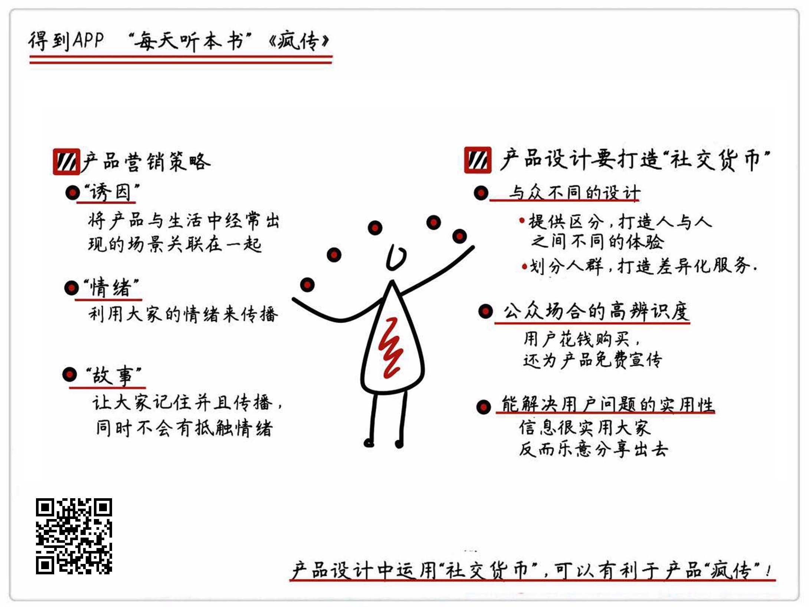

《疯传》| 无锋解读
==============================

购买链接：[亚马逊](https://www.amazon.cn/图书/dp/B00HALILL2/ref=sr_1_1?ie=UTF8&qid=1507725403&sr=8-1&keywords=疯传)

听者笔记
-----------------------------

> 这本书讲述的是营销的方法，“社交货币”“公共性”“实用价值”“诱因”“情绪”和“故事”这六种元素可以帮助提高效果。
>
> 社交货币：与众不同的设计、公共场合的高辨识度，还有能解决用户问题的实用性。这三个特点是社交货币的必要条件。将产品打造成社交货币，有助于它被传播。
>
> 公共性：容易被一眼认出来，比如独特的外观。
>
> 实用性：确实解决了问题。
>
> 诱因：关联到另一个产品，且被关联的产品广为人知。
>
> 情绪：调动人们的情绪，比如“不转不是中国人”
>
> 故事：要会讲故事，同时故事也要突出产品的特点，符合产品利益。

关于作者
-----------------------------

乔纳·伯杰是宾夕法尼亚大学沃顿商学院的市场营销学教授，是市场营销学方面的顶级专家。他在全球营销学顶级期刊 JMR 上发表了大量关于营销学的专著，同时也在《华尔街日报》《哈佛商业评论》《连线》等刊物上发表过多篇热门文章，是活跃在一线的营销学权威，还被沃顿商学院授予了“钢铁教授”的称号。 

关于本书
-----------------------------

《疯传》这本书对作者在营销领域多年的研究成果做了一次系统性的概括，对能够引发“疯传”的六个基本元素进行了介绍。针对每一种元素，作者都通过案例来阐述其具体的应用方法，可以说是学习营销的必读书目。 

核心内容
-----------------------------

想要做出好的营销方案，实现“疯传”的效果，可以在产品设计和产品营销过程中考虑融入以下六种元素，分别是“社交货币”“公共性”“实用价值”“诱因”“情绪”和“故事”。 
 

一、如何设计一款能够“流行”的产品
-----------------------------

根据作者的研究成果，想要产品能够流行起来，就需要在产品的设计中加入“社交货币”。“社交货币”就是支持社交活动的媒介，也就是能为人与人之间的交流互动提供话题和谈资。从具体落地的操作来说，可以让自己的产品包含以下三种要素，分别是与众不同的设计、公共场合的高辨识度，还有能解决用户问题的实用性。

1. 采用与众不同的产品设计

新闻想要传播，就要与众不同。同样，如果一件产品能够让使用者变得与众不同，产品连同使用者本身就会变成了一个新闻源，从而引发传播。

所谓的“与众不同”，其实就是要求产品能够提供区分，打造人与人之间不同的体验。比如 Life Water 公司推出了只装半瓶的矿泉水，并承诺另外半瓶水会被捐赠给缺水地区的孩子们。虽然都是矿泉水，但是因为产品本身的独特设计和定位，购买的人也变得与众不同了。买“半瓶水”的人不再是千篇一律的为了缓解口渴的普通人形象，而更多地展示了自己的爱心和社会责任感。这种“与众不同”，让购买产品的人拥有了可供聊天的“话题”，同时还收获了更多好评和更积极的印象。

另一种“区分”的方式是在产品的使用者中划分人群，打造差异化的服务。比如大部分航空公司会根据客户的“里程积分”来给老顾客提供升舱、贵宾厅等升级服务；信用卡会在普通权益的基础上，针对更高等级的持卡人群提供更多、更优质的权益；QQ 通过星星、月亮、太阳以及各种钻石来标榜不同的虚拟身份，为不同人群提供不同的网络服务。这种类似“特权”的专属服务同样可以成为话题，引导大家的讨论和传播。
2. 打造产品在公共场合的高辨识度

乔纳·伯杰在书中提到的“公共性”原则，就是指产品要能够在公共场合被人轻易地认出来。不然做的再好别人也不知道，更别说引发传播了。

拿美国电动车及能源公司特斯拉公司举例。特斯拉公司在设计电动车 Model X 的时候引入了很多新科技，但只有鹰翼门是 CEO 埃隆·马斯克一个人坚持要部署的。鹰翼门就是打开时，会像老鹰的翅膀一样高高翘起来的车门。马斯克的目的其实就是要增加产品的公共可视性，让人们可以轻松地从一堆车中认出特斯拉。

提高产品在公共场合的辨识度，除了像特斯拉公司那样打造一项“高辨识”的功能，还需要考虑让自己的产品品牌能够更频繁地出现在人们的生活中。大家见得多了，自然能够轻易的辨别出来。书中举了耐克公司售卖亮黄色腕带的例子。颜色百搭，男女均可佩戴，而且还会带来持续的曝光，这些帮助耐克进一步提升了品牌知名度。
3. 确保产品的实用性

产品不能只有哗众取宠，要重要的是要有能解决问题的实用性。这是因为我们天生就抵触无用的信息，对于无用的信息，我们不仅不愿传播，甚至不愿意记录。原因很简单，这些无用的信息会降低我们在朋友心中的形象，是对自己朋友圈的“污染”。

所以，产品在包装设计上要突出实用性，让大家明确地知道这个产品的功效。例如《17天搞定 GRE》《一分钟看懂中国》等标题，都是通过数字列举，用最直白的表述向用户强调产品的实用性。

二、如何设计产品营销方案
-----------------------------

好的产品更要配合好的营销思路，可以说，一个优秀的营销方案可以大大提升产品的传播范围和知名度。在营销过程中，可以采用以下三个技巧。

1. 试着将产品与生活中经常出现的场景关联在一起

人类大脑有一个特点：一件事情之所以出现在脑海里，是因为看到了另一件相关联的物品。书中将这种引起关联思维的因素称为“诱因”。所以，在营销方案的设计中，尝试把产品与生活中经常出现的“诱因”做关联，可以提高产品被提及的频率，也就更容易被人们讨论和传播。

书中举了美国奇巧巧克力的营销方案做例子。为了提高市场占有率，奇巧巧克力推出了这样一则广告：一个人拿着咖啡去找奇巧巧克力，而另一个人则拿着奇巧巧克力去找咖啡。因为“喝咖啡”在美国人生活中属于高频事件，而广告的每次播放，都在强化着奇巧与咖啡的关联关系。广告推出后，奇巧一年后的销售额就增加了30%，品牌价值也从3亿美元飙升到5亿美元。
2. 利用大家的情绪来传播

利用文字来唤醒读者的情绪，是营销中常用的经典技巧。我们很多人应该都见过“不转不是中国人”这种标题的文案，它就是在利用大家的情绪来进行传播。

书中举了加拿大歌手戴夫·卡罗尔的例子。戴夫在一次乘坐美联航的过程中，发现自己3500美元的吉他被摔得粉碎。他花了9个月的时间与美联航谈判希望得到解决，但都没有得到满意的答复。于是戴夫写了一首歌，就叫《美航毁了我的吉他》，把自己的愤怒情绪通过音乐表达出来。这首歌在上传到 YouTube 上不到四天就被点击了超过130万次，而美联航的股价在这四天里跌了10%，直接损失高达1.8亿美元。这就是愤怒情绪在传播中的力量。

因此在设计营销文案时，可以适当注入一些对人们行为有高唤醒的情绪因素，比如愤怒、敬畏、幽默、紧张等。广告很有看点，大家看完当然也更愿意去传播和分享。
3. 用故事的形式来传递信息

相比于直白的信息，我们的大脑更容易记住一个跌宕起伏的故事，所以人们才更愿意听故事。就像很少有人能说清特洛伊战争的过程，但是特洛伊木马的故事却几乎是家喻户晓。

可以说，想要营销，最好的方式是把营销的内容整合进一个故事中，通过故事来传播我们想要表达的内容。书中举了跨国快餐连锁店赛百味的例子。赛百味最初的广告只是陈述赛百味的特点，就像“赛百味有7款低于6克脂肪含量的三明治供你选择”之类的描述。这个广告不仅没有人推广而且还很容易被遗忘。后来，赛百味用了一则征集的故事来做宣传，叫《小伙子因为吃赛百味三明治瘦了245磅》，相信不管是想减肥的人还是不需要减肥的人，都会对这个故事感兴趣。

所以故事能够提供一个心理上的包装，不像广告推销那样使人厌烦，反而会让大家非常乐于接受。当然，我们在设计故事的时候，应该时刻提醒自己，故事的目的始终是为了传播产品信息，所以产品利益一定要与故事紧密结合，要防止传播过程中产品信息的遗失。 

金句
-----------------------------

1. 与众不同的产品可以带来新鲜感和话题感，能够吸引人们的好奇心；而对于产品的用户来说，与众不同的产品让他们感到更优秀、更自信，有更多可以向别人“炫耀”的资本。
2. 楚霸王项羽说过一句话：“富贵不归故乡，如衣锦夜行，谁知之？”意思是有钱了就要回家秀一番，不然就像在夜里穿好看的衣服走路，谁也不知道。同样，好的产品也要能够被人一眼认出，不然做得再好别人也不知道，更别说引发传播了。
3. 在城市生活中，能够直接帮助别人的机会越来越少，你可以想想，自己和邻居朋友之间见面的频率，是不是远低于手机联系的频率？可以说大部分情况，我们都是通过朋友圈来了解朋友近况的。因此，与朋友分享一些“实用”的信息就变成了最高效的帮助他人的方法。
4. 在营销方案的设计中，尝试把产品与生活中经常出现的“诱因”做关联，可以提高产品被提及的频率，也就更容易被人们讨论和传播。
5. 相比于直白的信息，我们的大脑更容易记住一个跌宕起伏的故事。就像书中提到的“特洛伊木马”的例子，很少有人能说清特洛伊战争的过程，但是特洛伊木马的故事却几乎是家喻户晓。

撰稿：无锋

脑图：摩西

讲述：于浩