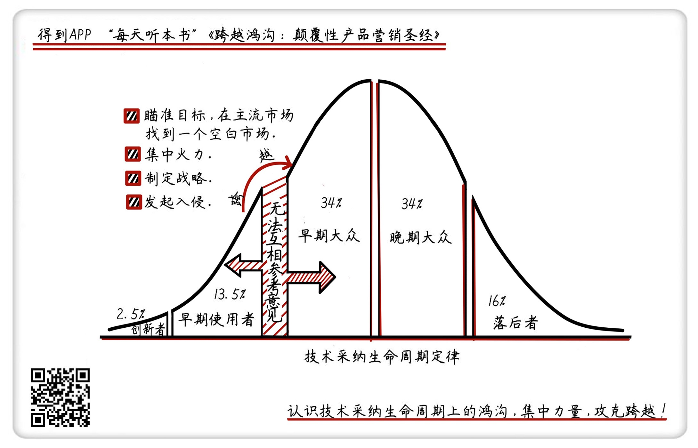

《跨越鸿沟》| 仲为国解读
=======================================

购买链接：[亚马逊](https://www.amazon.cn/图书/dp/0062292986/ref=sr_1_1?ie=UTF8&qid=1506686972&sr=8-1&keywords=跨越鸿沟)

听者笔记
---------------------------------------

> 作者将消费者分成了五种，创新者->早期使用者->早期大众->后期大众->落后者。
>
> 传统的营销观念可能会认为商品的推广是从前往后，按照不同的人群不断覆盖，而作者认为这里面有很多鸿沟需要逾越，并不是简单地顺序传递。
>
> 作者首先对于市场的定义中有一点非常重要，就是同一个市场中的人，在决定购买的同时会相互参考，只有这样才被是为一个市场，才可以用同一种营销策略。
> 
> 不同的市场之间存在着不可调和的矛盾，针对不同的市场要有不同的营销策略。
> 
> 作者也根据不同的市场（消费群体）提供了一些可以参考的方法，详见文稿最后一段。

关于作者
---------------------------------------

杰弗里·摩尔，在高科技行业鼎鼎大名。他提出了“新摩尔定律”，入选了“全球50位思想者”，成立了鸿沟咨询公司，为惠普、微软、甲骨文等公司提供高科技产品营销咨询。在美国《福布斯》杂志评选出的“最具影响力的20本商业书籍”中，这本书名列第七。他的著作已经成为哈佛、斯坦福等许多商学院的必读书目。

关于本书
---------------------------------------

本书要回答的核心问题是，究竟是什么原因让一个朝气蓬勃的科技型企业一蹶不振，甚至走向衰败，并找出解决这个问题的办法。作者认为，关键都在于对市场的认知上：在本书之前，关于市场的认知都是片面的、不准确的；在本书之后，你对市场的认知可以帮助你跨越失败的“鸿沟”。

核心内容
---------------------------------------

本书思想核心是：高科技企业因为某项产品而失败的根本原因是没能跨越市场中的“鸿沟”。要想破除失败的诅咒，必须做到认识鸿沟、跨越鸿沟。首先，认识鸿沟。在主流市场之前，还有一个早期市场。高科技企业的早期市场和主流市场之间存在着一条巨大的“鸿沟”。能否顺利跨越鸿沟并进入主流市场，决定着一项高科技产品商业化的成败；其次，跨越鸿沟。关键是瞄准主流市场中的一个目标高度具体的细分市场，集中所有兵力，攻克那个细分市场。然后，“以点带面”，把这个细分市场作为阵地，逐步扩大战果到整个主流市场。
 

一、关于技术采纳生命周期定律
---------------------------------------

作者提出，根据消费者对新技术产品的不同态度，消费者对新的高科技产品的采纳有五个相互联系、依次递进的阶段，这五个阶段又对应五种类型的消费者。

包括：

（1）创新者：真正的“技术控”、“行家”，新技术、“黑科技”是他们生活中的最大乐趣，他们买的是新功能，无论产品好坏，只要新就会买，为此可以忍受产品的不足和缺陷；

（2）早期使用者：通常是一群具有远见的人，能够看到新产品的长期价值，喜欢做别人还没有做的事，利用新技术产品完成他们的梦想，来获取战略优势；

（3）早期大众：对高新技术产品有点兴趣，但他们更实际，需要看到实际价值才会决定购买，他们更关心新产品公司是不是有名气，支撑体系是否完整，服务是否可靠，对价格非常敏感；

（4）后期大众：后期大众与早期大众基本类似，但没有能力和意愿学习和运用新技术，本质上相信传统，反对不断创新，只要产品能用就行；

（5）落后者：怀疑一切改变现有模式的新技术产品，死活都不愿意用你的产品。

这五种类型的消费者从左到右按照他们各自的比例依次排开，形成一个连续的、没有缝隙的曲线，高科技产品的市场发展沿着这条曲线进行。

二、只有每一个消费者在决定是否购买的时候，都需要参考其他消费者的意见时才能形成市场
---------------------------------------

古代的市场，简单地说，就是卖东西的和买东西的交易场所。杰弗里·摩尔认为，市场必须满足四个条件：

（1）有顾客；

（2）有产品或服务；

（3）顾客有着普遍的需求；

（4）顾客通过互相参考决定是否购买。

第四个条件对于高科技产品最重要。如果两个人购买了同一件产品，但是两人无法相互参考对方的意见，那么两个人就不处于同一个市场中。比如说，我把特斯拉卖给了一位数学老师，又把另一辆特斯拉卖给了老师家隔壁的一位研究汽车的工程师。数学老师和工程师之间无法相互参考对方的意见，这时我面对的就是两个不同的市场。

这个认知完全颠覆了以往关于市场的认知。在这之前，企业把上面的数学老师和工程师可能都划分为一个市场类别，比如个人消费者。而现在，摩尔把他们划分成了不同的市场类别，数学老师很可能是早期大众，而那位工程师很可能是创新者。显然，把市场划分准确，高科技产品的营销策略才能更有效。

三、早期使用者和早期大众之间的裂缝就是鸿沟
---------------------------------------

在本书之前的高科技营销策略，都是建立在技术采纳钟形曲线上的。之前的一个普遍认识是，各个消费群体是平滑过渡的，没有裂缝。杰弗里·摩尔认为之前的认识是错误的，五个消费群体之间是存在着裂缝的。每一个裂缝都可能导致企业的营销力量失去前进的势头，忽视这些裂缝的传统高科技营销策略必然失败。

第一个裂缝产生在创新者与早期使用者之间。当一项非常热门的技术产品不能马上寻找到更多的新客户时，这个裂缝就产生了。如果用推销给创新者的策略，将产品销售给早期使用者，你会发现根本没有用。

第二个裂缝产生在早期大众和后期大众之间，后期大众太懒，不愿意，也没有能力学习和运用新技术。运用销售给早期大众的策略，根本不适用于后期大众。

作者进一步指出，第一个裂缝在早期市场内、第二个裂缝在主流市场内，这两个裂缝都不严重。而代表早期市场的早期使用者和代表主流市场的早期大众之间的裂缝，是不同市场之间的裂缝，难以调和，早期使用者和早期大众之间无法互相参考对方的意见，传统营销策略想象的平稳过渡，也就不可能实现。它们之间的裂缝，才是高科技产品市场中最危险，也是最关键的鸿沟。

四、跨越鸿沟，不可能一下子成功，需要首先找到能够打入“敌人内部”的切入点
---------------------------------------

成功跨越鸿沟的基本原则，就是确定一个具体的空白市场作为出击点，瞄准目标，在主流市场中找到这样一个空白市场。此外，还需选择唯一的一个前沿阵地目标。前沿阵地目标选择的关键是，要遵循“宁做鸡头，不做凤尾”的原则，按照收入目标选择适当的市场规模。比如，你在某一细分市场的收入目标是1个亿，就不要选择一个新订单总额会超过1个亿的细分市场，要把市场再细分，直到成为“鸡头”。但也不能太小，要保证来年能为你的新产品带来至少50%的销售量。

接下来，就是集中全部资源，与其他的产品和公司结合起来，组成“整体产品”策略，集中全部力量，彻底攻下主流市场中的一个战略性目标细分市场，然后以这个细分市场为根据地，打败竞争者，找到一个能让早期大众满意、放心的销售渠道，赢得尽可能多的早期大众，扩大战果，最终掌握主流市场。

五、定位就是在目标顾客的头脑中创造一个烙印，你的产品就是现在最好的购买选择
---------------------------------------

对应技术采纳生命周期，一般有四类定位：

（1）命名并归类，主要针对创新者，定位要包括有关产品名称和类别的信息，比如，ERP系统；

（2）用户和用途，主要针对早期使用者，定位要包括针对的用户和产品用途，比如，微信，是一个生活方式；

（3）竞争和差异化，主要针对早期大众，定位要能将具体的产品与其他可比的产品进行比较，比如，ofo小黄车——共享单车原创者和领骑者；

（4）财务状况和发展前景，主要针对后期大众，定位要能包含财务情况和发展前景，比如，华为——更美好的全联接世界。

金句
---------------------------------------

1. 技术采纳生命周期五个阶段的过渡存在着裂缝，每一个裂缝都可能导致企业的营销力量失去前进的势头，忽视这些裂缝的传统高科技营销策略必然失败。
2. 只有顾客通过互相参考，决定是否购买才能构成市场。
3. 第一个裂缝在早期市场内，第二个裂缝在主流市场内，但它们都属于人民内部矛盾，而早期使用者和早期大众之间的裂缝不可调和，是高科技产品市场中最危险，也是最关键的鸿沟。
4. 什么是产品定位？就是在目标顾客的头脑中创造一个烙印——你的产品就是他现在最好的购买选择。
5. 和诺曼底登陆一样，跨越鸿沟首先要找到那块滩头阵地，竭尽全力获得整个市场细分的绝对领导权，最终掌握主流市场。

撰稿：仲为国

脑图：摩西

转述：成亚