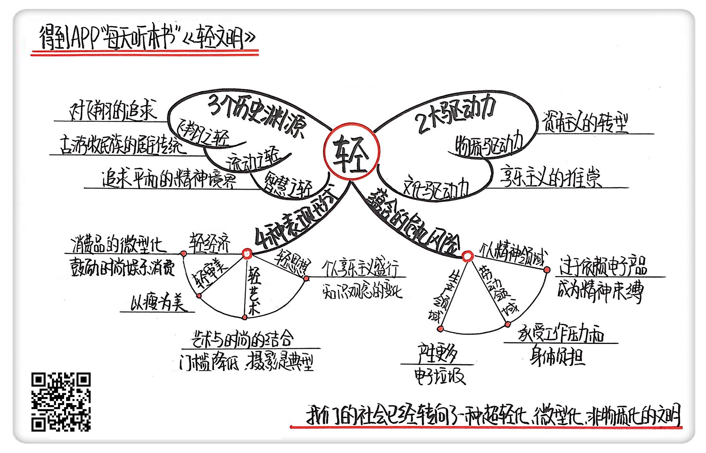

《轻文明》| 韩巍解读
======================================

购买链接：[亚马逊](https://www.amazon.cn/轻文明-吉勒•利波维茨基/dp/B06X94XHTR/ref=sr_1_1?ie=UTF8&qid=1508237937&sr=8-1&keywords=轻文明)

听者笔记
--------------------------------------

> 作者认为“轻”是现代社会的一个显著特点，源于物质和文化两种驱动力。
>
> 对轻的追崇是古已有之的，然而作者可能将“轻”的部分拿出来单独讲，也不能说明什么。
>
> 物质驱动力，作者认为是来自于生产模式的变化，从重型工业向日常消费品转移。而文化驱动力则来自于人们对完美设计的不断追求。
>
> 轻文明，主要表现在“轻经济”、“轻审美”、“轻艺术”、“轻思想”。
>
> 在轻文明的大背景下，也存在很多不可调和的问题，比如轻的生产模式，并不减少人们的工作强度。而且有时候，人们对轻的追求甚至需要伤害自己的健康，也从一个侧面体现了人们的空虚。

关于作者
--------------------------------------

吉勒·利波维茨基，法国哲学家、作家和社会学家，他毕业于巴黎索邦大学，在格勒诺布尔大学任哲学教授，同时还是法国教育部计划委员会成员。他长期观察并研究后现代社会的典型问题，擅长从一系列具体而微的社会细节中透视大的历史变迁。比如，在2007年的另一本书《空虚时代》中，他就敏锐地观察了当今时代的空虚、自恋、冷漠、暴力等一系列社会元素，揭示了人们对主体自立的渴望和当代社会的个人主义特征。

关于本书
--------------------------------------

本书延续了作者对于当代社会特征的探索，从生活健康、材料科技、艺术时尚、家庭与性、政治与思想等多个角度分析了当代世界对“轻”的推崇，提出了“轻文明”的概念，并为我们揭示了这种文明的独特面貌。 
核心内容
--------------------------------------

本书思想核心是：我们当前的社会处于一种超现代的文明状态，其核心的特点就是“轻”。轻文明的概念是多元的，轻文明的“轻”不但包含了在生产领域对大型机械、重工业生产方式的升级，也包括了消费和生活领域中对物质生存负担的摆脱，甚至更包括了精神领域对严肃意义的逃离。工业社会以来，技术经济领域的重心都倚赖于重型设备、大型机械、复杂流水线生产，以及巨型工业项目。在那个阶段，“重”成为定义文明的重要特征。如今，它转向了超轻化、微型化、非物质化。轻是对物质负担的摆脱，轻是对自由的追求。当然，轻这一概念承载着无边无际的愿景，也承载着可怕的危机。 
 

一、轻文明的历史渊源和发展
--------------------------------------

人们对“轻”的这种追求也并非凭空而来。如果我们追溯渊源，可以发现从原始时代开始，人类就已经开始了对“轻”的追求。首先，是飞翔之轻。在诸多文明中，历史学家都发现了古人对于飞翔的渴望。无数神话、故事、宗教信仰都包含上升、悬空、抵达苍穹的意象。其次，是流动之轻。我们常说的轻装上阵，就有流动之轻的意思。这种流动的轻，在古老游牧民族的居住传统中也有所表现。最后，在古代文明中还有一种智慧之轻。在众多古代哲学和宗教中，都提倡人们追求一种平和的精神境界，追求平静、简单，让灵魂卸下负担，排解忧虑和激情，卸去痛苦的重负，达到自由和洒脱的境界。这种境界的核心正是对“轻”的追求。

二、轻文明在当代的流行源于两种驱动力
--------------------------------------

第一个驱动力，是所谓“物质驱动力”，其实也就是生产模式的转变。具体来说是经济的发展动力由以前的大型机械生产转向了日常消费。

第二个驱动力：所谓“文化驱动力”，也就是消费资本主义要诱惑大众进行日常消费，商家就不得不让商品变得更有吸引力。在这种情况下，物品的设计不再仅仅追求使用价值，还开始越来越多地增添轻松趣味的内涵，也呈现出一种向“轻”靠拢的趋势。

三、轻文明的四种重要表现形式
--------------------------------------

轻文明的第一个表现形式在于“轻经济”。“轻”在经济和物质领域的一个核心原则是“小的更好”，技术的发展也使得产品变得微型化、轻量化、去物质化。除了消费产品体积的变小，轻经济还体现在鼓励人们消费用于娱乐的产品。在当代社会，大量的生产资料和资本都被用于打造时尚、品牌以及奢侈消费品，最终的目的是通过各种方式引导消费者不停地购买、享乐。

轻文明的第二个表现在于“轻审美”。作者在这里给我们提出了一个“轻审美”的例证：以瘦为美的审美标准。本书认为轻审美在一定程度上是被制造出来，为促进消费并支持这些产业而服务的。

轻文明的第三个表现在于“轻艺术”。在经济消费模式和审美领域的蔓延，在很大程度上也影响了当代艺术。所以艺术之轻也成为了轻文明的一大表现形式。艺术之轻体现在艺术和时尚之间的壁垒在逐步消失，以及艺术作品的审美缺乏意义的承载，人与艺术品的关系变得娱乐化和庸俗化。

轻文明的最后一个表现在于“轻思想”。本书认为，近三四十年以来，西方社会的思想领域出现了一个现象，就是一些宏大的价值体系开始瓦解，知识分子和理论的重要性开始下降。不关注集体的宏大的价值体系，不关注沉重的深刻的理论知识成为这个时代思想的重要特征。

四、轻文明之重：轻文明里潜在的危机
--------------------------------------

生产领域的消极影响在于，虽然产品更多地采用轻型材料，也越设计越小，但这并不意味着生产过程中的垃圾产量也相应减少了。在劳动剥削方面，轻经济产业模式的变化也带来了资本主义剥削形式的转变。轻经济不像劳动密集型产业，需要工人付出超长的体力劳动。但是科技企业的大量员工，每天一动不动地盯着电脑屏幕，这种与电脑的捆绑可能会带来新型的痛苦。

在个人精神领域，对于轻的过分推崇也带来了负担。比如刚才谈到的以瘦为美。很多人天天称重量，严格控制饮食，甚至因为身材问题陷入自卑，节食、做手术、切胃，失去了身体健康。
除此以外，因为缺乏宏大信仰，个体很容易陷入到某种空虚的状态中，而电子产品的流行也加剧了这种情况。

金句
--------------------------------------

1. 从重工业到轻型商品再到服务，是“轻”的规则在定义我们的经济。
2. 当代社会的消费品不再有工业资本主义时代那种生产机器的沉重，更多的是对轻便、轻松、有趣的追求。
3. 在消费主义的驱动下，当代艺术世界在结构上被时尚的轻逻辑所控制。艺术作品不再承担沉重的思想和意蕴，而金钱在其中起到了越来越重要的作用。
4. 电子产品虽然让我们突破了时空的限制，但对它的过于依赖，其实形成了对人类精神的另一种束缚。

撰稿：韩巍

脑图：摩西

转述：成亚