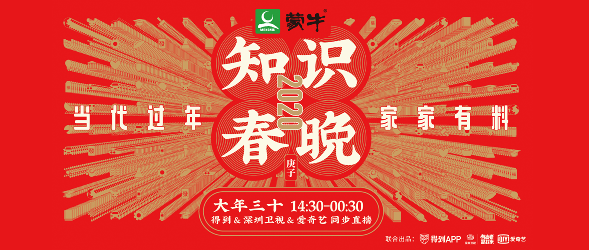

2020知识春晚 - 观看笔记
============================

> 2020的深圳卫视在春晚的目标客群上又做了一次新尝试，你被选中了吗？

播出频道：得到APP、深圳卫视、爱奇艺（https://live.iqiyi.com/s/19rs6khuff.html）

播出时间：2020-01-24 大年三十 14:30-00:30​

玩得好
----------------------------

#### 邢立达 - 怎样把自己玩成一个专家？

一个学金融的外行，通过对恐龙的喜爱，发现了很多个世界第一。

#### 徐亚乐 - 怎么把工作变好玩？

通过画画的方式，把一些很复杂的知识表达出来，让团队得了不少大奖。

斯科特亚当斯说过：
- 在某个领域做到前2%
- 在两到三个领域做到前25%

http://m.sohu.com/a/304916006_100268083

#### 房海滨 - 怎样把一个常规动作变好玩？

设计了深圳大学的入学通知的盒子，让大学新生有“仪式感”

贵在坚持，比如和家里的孩子可以有个约定的“仪式感”，比如约定一个特殊的敲门声音，约定每天向孩子汇报工作。

**罗胖：仪式感：让此刻此地与众不同**

#### 王弘治 - 如果孔子也拜年，他会说点啥？

如何能够知道古代人的发音？

孔子：以“万寿无疆”为例，在孔子的年代，没有汉语声调。

唐朝：音调和广东话有点像。

如何才能知道古代的发音呢？利用很多资料的关联性来

#### 那莎：怎么养猫更好玩？

晒过太阳的猫，身上的味道，是猫身上的螨虫被烤焦的味道。

如果猫不愿意出门，就需要每次使用遛猫绳，就需要给它好吃的东西作为奖励，等它再次看到遛猫绳两眼放光的时候，就可以带出门了。带出门后应该是猫想去哪里，就跟它去哪里，这样才符合猫的心性。

#### 吴世杰：怎样零基础学会唱歌？

如果是五音不全的人，是无法通过耳朵听出自己五音不全的。

- 用丹田之气唱歌：练习“一个枣、两个枣……”，感受丹田的气息
- 用嘴巴的力量咬字
- 学放松：因为放松了，气息才会通畅，可以尝试发出气泡音

**罗胖：深度投入才会玩**

更舒心
----------------------------

#### 老浦 - 为什么我们应该学几个甲骨文？

甲骨文一共才4000多个字，目前已经辨认出来的有1000多个，如果能新辨别一个甲骨文出来，甲骨文博物馆会奖励10万元。

年字的甲骨文版本：年并不是神兽，参考“年”字的甲骨文，可以看到顶部是个“禾”，下面是个弯着腰的“人”，代表着：浓浓的谷香，满满的舒心。

福字的甲骨文版本：双手捧着美酒，端正地送上祭台祭拜祖先。酒是粮食酿的，有余良才能酿酒，说明丰收了，富足了，要感恩祖宗神灵对自己的保佑。所以挂福字，一定要正着挂，否则反过来，其实是近代才出现的一种现象。

#### 冯宇坤 - 贫困地区脱贫，什么最管用？

全国832个贫困县，绝大部分已经脱贫了，仅剩的一些也将在年底脱贫。

给钱给物并不能长久解决脱贫问题。

给老百姓有可发展的产业。[河边村](https://baike.baidu.com/item/河边村/9903607)，通过发展民宿产业，在2019年已经实现了脱贫。利用中国完备的基础设施，连接到全国不同的人。

#### 任岚 - 工作没意思，怎么办？

上海的一个普通的居委会的主任，通过走访社群群众，将他们的故事整理成文字，同时也成了他们的朋友。

利他才是最大的利己，找一件你自己觉得工作中有意思的小事，坚持做下去，等待时间的回报。

#### 卓克 - 如何让家人远离谣言？

- 不看广告看疗效：说一个最简单的结论，让他们自己见证。“比如一个人晕车，你不用和他讲原理，你就让他一上车就闭上眼睛，然后到下车的时候，如果不晕车，他自然就信了”
- 偷天换日：帮父母取消谣言公众号，关注类似“谣言过滤器”这种公众号。
- 注意态度：接受父母发来的谣言观点，但是让“无效”来反驳。

#### 李大伟 - 怎样守护我们的钱包？

- 多拍照：和骗子拍照，骗子就害怕了。
- 入群需谨慎，想着多录像：不要随便入陌生群，如果是线下活动，还要多拍点现场视频
- 不要转账给外人，第一时间拨打电话给110可以终止银行转账（1小时以内）

#### 雷啸光 - 怎样改造家，让老人过得更舒心？

要防止老人在家跌倒，每年约有4000万老人跌倒，50%是在自己家跌倒的，15%是因为年龄原因，其他绝大多数都是因为设计问题导致的跌倒。

- 检查一下沙发：沙发低于40cm，如果沙发两侧没有扶手，坐垫太软，沙发下面没有双脚后撤的空间，这些是需要换掉的。
- 购买夜灯：购买感应型的夜灯。要把夜灯放在床脚下面放拖鞋的附近，去卫生间的路上，卫生间里。
- 在马桶边上安装L型扶手
- 在淋浴间安装浴凳、防滑垫

**肯德基天使餐厅**半数以上的全职员工为听障、智障等特障人士，餐厅为本地特障人士提供一个自在工作、自在交流、展现自我价值的平台。

**张泉灵：舒心，其实是每一个人的价值可以被看见**

**罗胖：积极参与社会生活才能真舒心**

### 更健康

#### 宋大我 - 怎样把食堂变成课堂？

人民大学的食堂，把食堂做成课堂，让学生们动手实验，从制作美食的过程中，学习特殊的知识。

#### 欧茜 - 过节怎样安全逗娃？

- 认真洗手：在抱孩子之前认真洗手，不要随便摸别人家的孩子
- 不要随便给孩子喂东西吃：4岁以下孩子的吞咽功能不成熟，花生、葡萄、果冻
- 心理健康也很重要：不要对着孩子随便乱讲话，比如“欺骗孩子”，会造成很大的心理阴影，以后就很难再相信大人了
- 和孩子多玩：玩互动游戏，躲猫猫、石头剪刀布，蹲下来和他的视线平齐，不要让他感到压迫。泡泡机，荧光棒等都可以和孩子一起玩

#### 薄世宁 - 怎样正确做体检？

体检的真正价值：是和时间赛跑。

- 肺癌5年生存率在90%以上。
- 乳腺癌5年生存率在100%以上。

关于肺部检查，一般人拍个胸片，以下人群建议
每年做一个定期肺部低剂量扫描：

- 长期大量吸烟的中老年人
- 戒烟少于5年
- 长期吸入粉尘和厨房油烟
- 室内空气污染

乳腺超声，配合专科医生筛查，以下人群增加2年做一个“钼靶检查”：

- 40岁以上
- 有家族史

胃肠道，胃镜做食管和胃检查，建议第一次40岁左右的时候做，如果没有问题，或者没有胃癌家族史，两年做一次就够了：

- 肠镜检查结肠，有没有容易癌变的息肉
- 有息肉当时切除

中老年，每年做颈动脉超声，看看有没有硬化斑块，可以反应心血管和脑血管的情况：
- 减肥
- 运动
- 吃药

#### 王家伟 - 怎样帮家人避开用药风险？

头孢和酒不能一起吃。

- 拍照片：把父母正在用的药拍下来，存在手机里，
- 按时按量的吃药：可以使用智能药盒
- 药物重整：一个专科医生开的药，一般都没什么事，但是很多人的是好几个病，正在吃不同的药，将不同的药放在一起，可能会引发各种不良反应。可以在各地大医院门诊药房的边上，药物咨询中心，可以检查不同的药，是否需要“药物重整（专业名词）”

#### 程玉芳 - 如何帮父母接受新事物？

嘉兴图书馆，帮助老年人学习新鲜事物，安装手机app视频聊天、编辑照片。

- 耐心：一个问题可以重复上百遍
- 拆开高科技产品给他们看，降低他们的恐惧
- 社交：和同龄人在一起，不会觉得自己落后
- 仪式：开学典礼、结业典礼
- 免费：政府有补贴

#### 郑伟 - 怎样让爸妈喜欢上朗诵？

带领8万多中老年，在公众号里学习朗诵。

朗诵的好处：

- 文化会让人更有气质
- 更健康，改善气短等症状，学会吸气
- 普通话不好也没关系：练习朗诵本身可以提高普通话水平，而且方言也可以用于朗诵

更健康
----------------------------

#### 王太平 - 怎么给父母拍出海报级艺术照？

- 选好服装：单色、有质感、带领子、厚的纯色围巾
- 光线：早上的朝南的窗户+半透明纱帘+反光板
- 近：距离要近，半身特写，人像模式在1- 2米之间，脸部特写1米之内，避免把脸拍胖
- 道具：手上拿点东西，会让人不紧张，拍出来会比较舒服
- 多：拍个20多张选1张
- 不紧张：一开始别就看镜头，先多沟通，拍一会后，再看镜头
- 不用开美颜功能，鱼尾纹等其实是年龄的标志，没必要美颜磨掉

#### 冯雪 - 每逢佳节胖三斤，怎么破？

- 少吃主食多吃肉：只要不是肥肉，糖不可以（馒头、面条、大米饭、红薯……）
- 搞定你的臀大肌，轻松得到大长腿：臀桥、跪姿后踢退
- 躺着瘦：好好睡觉，睡眠时间在6- 8小时之间，要有高质量的睡眠，白天多动，睡前4小时千万别吃东西

阜外医院2020年成立生活方式健康中心。

#### 赵辉 - 怎样跑得更潇洒？

跑步会伤膝盖吗，做到下面两条，可以保护膝盖：

- 姿势：身体略有前倾15度
- 前中脚掌着地

但是如果不跑的话，心肺功能就会损坏。

肌肉和骨骼一样，会自己修复。

即便真的有一天骨头损坏了，目前骨骼更换手术，很普遍，全国一年需要做20多万个这类手术，很成熟，无疼痛。

#### 敬子 - 怎么不花钱还能把家里变更好看？

家里乱可能是因为你最近一段的生活“乱了”，一个方法让自己能够更好地做室内整理，这个方法就是：郑重地告别：

- 找一个安静独处的房间：确定这件物品对你的作用将是正面的还是负面的
- 对要扔掉的东西拍个照片
- 郑重对这个东西表达感谢之情：谢谢你陪伴过我，感谢，再见。

#### 唐勇 - 怎样把城市变得更好看？

设计厕所，重要的是细节。

- 小学厕所的小便池里，画一只苍蝇，小男孩就会瞄准不乱尿
- 纸巾盒设在水龙头上方，这样洗完手就可以直接擦手了

#### 马徐俊 - 怎样做一个漂亮的自我介绍？

做自我介绍的时候，按以下三个问题来作答，效果会很好。

- 我是谁：给我一个关键特征，关键特征可以重复多次，你说了什么不重要，对方听到什么才重要——听觉锤。
- 我跟你有什么关系：我和你是老乡、我经常住你们对面那栋楼都是和对方建立一种关系，相似才会喜欢
- 我对你有什么用

受欢迎
----------------------------

#### 周奇墨 - 如何用自嘲拉近距离？

- 早安北京，晚安北京
- 房子太贵买不起

一句自嘲，是为了让对方产生优越感，从而喜欢你。

思路：是 而且。

- 是：接受他说的话，顺着他的话往下说
- 而且：还要比他还狠，对方就没话说了

#### 乌日娜 - 怎么才能那么“牛”？

奶牛脚上的脚环，可以用来监测奶牛的发情。

- 奶牛的床，需要靠人认真地去测试
- 奶牛听音乐已经是奶牛场标配了，但是选什么样的歌，需要人付出努力，经测试听贝多芬的田园交响曲，能够让奶牛产量增加3%

即便在一个现代化的牧场里，机器已经发挥了越来越大的价值，但是人的价值也是越来越大。

#### 王仲焘 - 怎样制造一个惊喜时刻？

一个魔术要想成功，你必须要想到所有的可能。

#### 戴愫 - 微信拜年，怎么不动声色当最大赢家？

感动我：

- 交往中我的感受：张总，给您拜年了
- 今年的一个行动：自打认识你，我的感觉很不一样
- 这个行动的帮助：年初您带我去吃的那个火锅很暖心
- 一个祝福：开春了，我祝您新春快乐

感动我：利用朋友圈动态

张总，给您拜年了，您朋友圈发的蛋糕越来越精致了，新年马上就要到了，祝您的小宝贝健康快乐。

可以手写短信，拍照后发过去。

可以将团队照片做成短视频，发过去。

#### 林特特 - 过年如何避免尴尬？ 

面对尬聊，主动出击：自己带动聚会的节奏。

任何场合任何人都适用的句式：**那一年，你在哪里，在做什么？**

共同经历过的那些事情，也可以成为共同的话题。

最熟悉的人也有你不知道的故事，最陌生的人也会为你敞开心扉。

#### 吕铁马 - 怎样越老越能成为家里主心骨？

认真过好自己的人生，以身作则，不论多大年龄，你都能处处受欢迎，成为家里的主心骨。

**张泉灵：**

家长们关心怎么好好学习？

孩子最关心怎么在学校受欢迎，孩子们如果问了下面问题，可能都是在向家长求助：

- 我和我朋友吵架了，我不知道该怎么和好
- 我觉得老师冤枉我了，但我不知道该怎么和他说
- 同学们都看了一本书，我没看过

**罗胖：成人世界做到“靠谱”两个字。**

找对象
----------------------------

#### 郭珈希 - 怎样一分钟就能“学会”弹钢琴？

- 黑：只弹黑键，黑键对应中国的音素
- 右：踩下右边的踏板
- 八：需要用八度弹奏低音，中间相隔四个黑键
- 慢：慢可以让节奏舒缓g
- 刮：从右到左拨动黑键

#### 李松蔚 - 过年回家父母催婚，怎么办？

利用“课题分离”来解决父母催婚的问题。

- 父母的课题：对孩子的担心？——父母以为找对象是解决这些问题的方法
- 你的课题：你如何让父母不担心？
- 亲情课题：因为双方是相互关心的，所以大家都希望对方过得好。

同时回应刚才的课题：“我正要跟你说”——可以说正在为找对象做的一些准备，也可以说我已经找到了一些让自己过的更好的方法。表达：我理解你是在担心我，但是我有自己的打算，我也在努力让你放心。

#### 张慧 - 相亲时如何正确释放信号？

- 相亲的时候坐姿要端正，显得特别有诚意
- 不要交叉手坐着
- 不要摸鼻子，显得像在撒谎

- 当您说话的时候，可以轻轻拖着下巴
- 当您和人分别的时候，握手要握整只手

#### 付政 - 怎样做一个“认真”的红娘？

组织不同的人到相同的局里，而不是直接让他们进行相亲，让他们有机会真实地展现自己。比如搞个兴趣小组，让他们在一起。

谈恋爱，认真才会赢。

#### 李铁夫 - 怎样跟别人解释清楚自己的工作？

需要将自己的工作，和他人的知识、经验、生活，建立联系，不能站在自己的角度去解释自己做的是什么。

#### 高爽 - 没用的东西有啥用？

- 可以用星星
- 可以用不同星座的光线传过来的时间，来描述时间
- 孩子懂得耐心

教好娃
----------------------------

#### 张百兴 - 怎样“对付”青春期的孩子？

玩乐队，能够培养人的耐心，组织能力，管理能力，占用他们的闲暇时间。

#### 杨毅 - 面对熊孩子，怎么办？

正强化：通过饲养大象，告诉我们，教好孩子要学会鼓励他们正确的行为，时间久了，就能教好娃。

#### 刘润 - 如何让孩子爱上写作文？

增强回路：小孩不喜欢写作业，可能是因为没有建立他心中的增强回路。

比如为孩子开通公众号，留言和打赏都是建立增强回路的过程。

把孩子写完作业之后的自由，交还给孩子自己。

**张泉灵：所有的有效跨界，就是省时间。**

#### 陈朝 - 怎样做一个很酷的大人？

三个实验：

- 隐形密信：调制墨水，小苏打泡水，写字，晾干，用葡萄汁，快速一刷。花青素和碱碰到一起会显色。
- 彩虹杯：四杯汽水，不同的颜色，4/2/1/0勺白糖，然后把它们慢慢倒到杯子里，因为白糖密度不同，所以会分层。
- 武术- 一阳指：橘子皮，桔子皮里有一种精油，能融化橡胶，触碰气球就会破裂。

#### 时朝莉 - 怎样让更多的娃都能享受好的教育？

传统的支教方式，可能很难覆盖更多的娃，不仅条件艰苦，而且范围有限。

利用互联网直播平台，给孩子们上课，是一种新的方式。现在有全国20万个孩子，接受了这种教育。更多的老师也以志愿者的身份加入了平台。

#### 庞玮 - 怎么和孩子谈论一幅画？

美商教育，不是要灌输知识。

问他：你觉得它看起来像什么？即便回答和作品本身的内涵相去甚远，也没有关系，因为这才是孩子的世界。

孩子们用他们这个年龄所具备的能力来认知这个世界。

**张泉灵：永远不要对孩子说的两句话：**

- 你就不是什么什么的料
- 你就跟你爸一样，脾气坏

因为他把孩子逼进了一个两难的境地，父母也把自己逼进了两难的境地。

**罗胖：永远不要对孩子说：你真聪明**

- 多夸行为，少夸结果
- 多夸努力，少夸聪明

让孩子为他的行动，所产生的结果，负起责任。

会挣钱
----------------------------

#### 陈泉柳 - 如何正确地遛狗？

- 要当狗的老大，不能让狗冲在前面，因为狗是群体动物，头狼有头领意识，不能让它们建立这种意识，否则就不听人的了。
- 遇到别的狗的时候，如果对方比较凶，作为老大的你，要挡在前面，护住狗。

#### 小马宋 - 怎样做好一个小买卖？

2019年倒闭的火锅店，就有10万多家。奶茶店，开10家倒5家。

找到店里客户最常卖的东西，将其中一种不赚钱地卖，顾客来了，总会买点别的：

- 餐厅：5块钱成本的饮料，完全免费，也没有多少成本。
- 超市：把鸡蛋进货价卖，但不能放在超市门口，目的是为了让顾客多逛逛。

#### 黄冬梅 - 为什么女性更擅长当老板？

女性有性别优势，处事的方式与男士，可以不同。比如软磨、硬泡，很多男士做不出来。

同样的事，如果是女性来做，可能就可以得到特别的赞许，但是男士做，大家可能觉得理所当然。

#### 高松 - 怎样做一个高效率的网约车司机？

- 不违章的地方停车，下车迎接顾客
- 说话有讲究，提高乘客满意度
- 索要好评：请问您手机尾号是xxx的乘客吗，我是跟导航走还是听您的，您着急吗如果着急我就快点开但是保证安全，矿泉水就放在您的左手边，您对本次服务还满意吗？
- 静态热力图：把自己的跑车数据和别人的车的数据，汇总画到自己的地图里

#### 肖欣 - 怎样做一个“捡钢镚”的生意？

鲜生活创始人肖欣。

- 引人入胜：将水、饮料这些东西放在最里面。每多30秒让人留在店里，能多卖出1件东西
- 关联性：把可能一起买的东西放在一起
- 东西诱惑：食物的香味来引用顾客
- 应急：便利店卖丝袜，换季的时候，还需要更换厚度

大数据、人工智能计算如何优化摆放，可以无穷无尽挖掘便利店的想象空间。

#### 汤君健 - 想加薪，怎么让老板给加薪？

- 不要用离职来威胁老板
- 要让他感觉到这是个人才，如果你走了他损失就大了

没有谈加薪的技巧，只有“赢得加薪的技巧”，所以首先要有良好的工作基础：

- 开会的时候：早到15分钟
- 开完会30分钟内，发会议纪要，同时提醒老板后面要做什么
- 说结果的同时，还要说反思

谈加薪的技巧，三长一短一请求：

- 结合自己的工作说三个自己的优点，比如自己今年在做计划、搞活动、带新人上获得了提升。
- 你告诉老板公司的一个短板和问题
- 给老板画大饼，表达自己能胜任这份工作
- 表达自己能够获得工资上的提升

有前途
----------------------------

#### 邓伟琳 - 怎样成为世界顶尖的工程师？

如果要做一份有前途的工作，那就要做中国在全世界做的最牛的行业，在行业里做到最牛。在中国，基础设施是最牛的，比如中国桥梁就是一个永远也做不完的工作。

#### 张银屏 - 怎样挖一条通向未来的隧道？

现在挖隧道也像是搭乐高，预制拼装隧道，目前只有中国人做到了。

先在电脑里模拟一遍，可以完整进行模拟。

海底隧道也是最难的，33根隧道拼接在一起，然后沉入海底，新的世界七大奇迹之一。

在隧道里也引入了自然风、自然光，创造和改变这个世界。

#### 杨勇 - 怎样把快递工作干成一个事业？

在每件事上，多努力一点，多问一句，多看一眼，什么事都能做好。

#### 施展 - 每个中国人，都有好前途

历史学都是为了解释当下。

中国的经济是靠一点点小的事情聚集起来的。

#### 侯智薰 - 如何适应快节奏的生活？

- 迟到红利：要比地图导航告诉时间早15分钟
- 学习新知：去提问、去分享、去搜索
- 自律：强迫自己去做一些事情，比如持续问候朋友、关心身边的人
- 站在巨人的肩膀上，来到北京做个北漂

#### 李树欣 - 码农的广阔天地在哪里？

一般的创业都是集中在城里做一些热门话题，追风口，比如共享经济……

但这些项目竞争激烈，去农村，做很多实体产业，帮助别人提高效率，比如猪脸识别，程序养殖……

#### 金颖 - 选行业，为什么要选“无人”的？

找工作要找“无人”的：

- 人越多就越无人：一个市场的人越多，无人技术就会发展地越好。人多，数据就多。
- 越无人就越需要人：无人技术发展得越好就需要更多的专业人才。

无人不仅不会取代人，而且会产生很多无人机器的操作员的职业机会。
