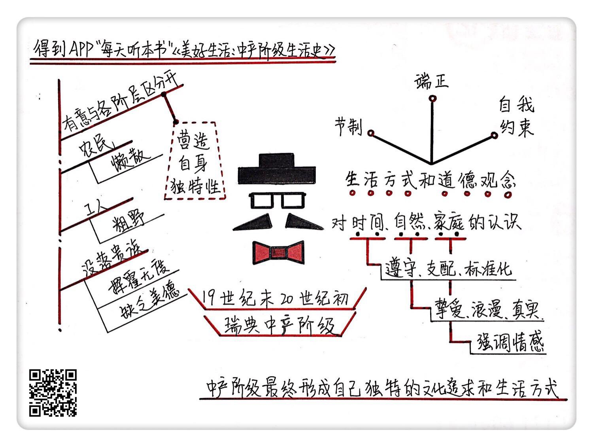

《美好生活》| 韩巍解读
================================

购买链接：[亚马逊](https://www.amazon.cn/美好生活-中产阶级的生活史-奥维·洛夫格伦/dp/B004HO50OG/ref=sr_1_1?ie=UTF8&qid=1506523248&sr=8-1&keywords=美好生活)

听者笔记
--------------------------

> 中产阶级是一种社会阶层，他们为了区分和底层阶级的差异化，会不断自我约束，学习上层阶级的一些行事作风，从而形成了中产阶级的独有的文化和特性。

关于作者
--------------------------------

奥维·洛夫格伦，瑞典隆德大学欧洲民族学教授，主要关注文化分析这一新研究方法的运用与发展。他的研究课题包括中产阶级生活的兴起、文化与经济，以及当下人们日常生活中常常碰到的“超负荷工作”与“劳累过度”问题等。

乔纳森·弗雷格曼，瑞典隆德大学欧洲民族学教授，主要研究身体、记忆和近现代欧洲的日常生活。他的专题研究十分广泛，包括维多利亚时代的中产阶级生活、日常习惯、欧洲文化的地方化，以及福利国家与地方文化、日常生活的互动等。

关于本书
--------------------------------

本书以1880-1910年间瑞典中产阶级的生活方式为观察对象，通过丰富多彩的民俗材料，描述了中产阶级的生活图景。在研究方法上，本书融合了历史学和民族学的方法，方法新颖，角度创新。由于人类学和历史学的融合，本书打开了一个极富成效的新领域。将斯堪的纳维亚半岛的中产阶级形成第一次介绍到英语世界中，堪称当代人类学的经典之作。

核心内容
--------------------------------

本书的思想核心是：19世纪与20世纪之交的瑞典中产阶级，在他们的形成阶段，不仅尝试摆脱“暴发户”的嘴脸，而且希望与农民、工人和没落贵族之间划清界限。他们努力营造自身的文化和生活方式，并热心在全社会加以推广。正是对“美好生活”的包装和塑造，中产阶级自身的文化和价值观成功地渗透到了现代生活的每一个角落。
 

一、什么是中产阶级，中产阶级有着怎样的文化？
--------------------------------

中产阶级是一种社会阶层，指在现代社会中拥有一定程度的经济独立、有安定的且较高薪酬工作的群体，虽然最常用的方法是按照收入作为标准，但是中产阶级本身是一个非常复杂的划分，不只是经济方面，更在文化方面也有着显著的特征。在作者看来，1880-1910年是瑞典现代化进程加速发展的时期。在这一时期，瑞典完成了工业化进程，开始走上发达国家的道路。瑞典的中产阶级开始逐渐形成，不仅收入普遍增加、人数逐渐增多，更在文化层面上开始有意地塑造属于自己的文化行为和生活标准。

瑞典中产阶级在形成过程中，在文化生活方面将自身定义成为具有领袖气质的阶层，他们对自我的想象包括：严格的自我控制和节制、清洁与卫生、优雅的礼仪、理性的生活态度、对科学和进步的坚定信念等等，其中最主要的代表就是餐桌礼仪。中产阶级通过对自身礼仪的强化，通过对洁净观念的强调，有效地突出了自身的优越性，与下层阶级做了区分。透过对这一时期瑞典中产阶级的文化生活的反思和理解，我们可以更好地反思当下，反思什么是中产阶级文化。

二、瑞典中产阶级在形成过程中，对时间、自然和家庭有着怎样的认识？
--------------------------------

与不会掌控时间的下层农民相反的是，瑞典的中产阶级从孩童时，就已经有意识地培养自己形成一系列标准化的时间规范，并且通过工作和学习内化成为中产阶级世界观的基础。这种遵守和支配时间的新观念与近代工业化的进程相同步，因为在劳动分工不断细化的背景下，需要一种纪律化的时间观，来实现协作与规模化生产。

在传统的农民社会中，自然既是生产的场所也是生活的场所；而在中产阶级的世界里，自然逐渐被孤立出来，不再是生产的主要场所。于是在中产阶级的生活中，比之于人造的、商业化的城市环境，自然界成为了真实的、未加修饰的象征。

对于情感的强调成为中产阶级独特的家庭观，这与农民阶级把婚姻作为实际的考虑有着明显的不同。19世纪的中产阶级将浪漫的爱情视作婚姻的基石，他们把这种对爱情的真诚作为一种武器，以此反对传统上层阶级对情感的任意挥霍。二人世界的新观念造就出夫妻关系的新模式。

三、中产阶级如何既同农民和工人阶层区分开来，又同没落贵族的道德观念区分开来？
--------------------------------

这一时期的瑞典中产阶级，认为农民和工人阶层不仅代表粗野、混乱无序，更代表一种欠发展的状态。中产阶级炫耀自身对秩序的认识，把它当做更成熟老练的标志。

18世纪晚期到19世纪，中产阶级的发展既依赖于贵族精英，却也为了定义自身，同时与没落的贵族进行对立，以获得权力和社会地位。他们把昔日的贵族精英文化描述成堕落分子、缺乏德行、挥霍无度、在公共和私人消费上极不负责的形象。对于贵族标志的宫廷生活圈子，中产阶级认为其充满了奢靡仪式和空洞礼仪，而自己的生活方式代表了一种更负责、更理性的生活风格。

总之，通过与社会其他阶层的区分，中产阶级有效地标识出自身独特的价值取向。

金句
--------------------------------

1. 正是对“美好生活”这个概念的包装与塑造，中产阶级自身的文化与价值观成功地渗透到现代日常生活的每一个琐碎平凡的角落。
2. 中产阶级的餐桌文化有很多禁忌，比如仆人们从来不与中产阶级家庭的主人们一起共餐。还比如，狼吞虎咽、不讲秩序，或者把手放在桌子上的人都被认为不受欢迎。在公共场所或者在街道上吃东西，也是中产阶级不能接受的事情，因为他们认为这样与动物太接近了。
3. 对农民来说，时间是循环的，而对中产阶级来说，时间是线性的。
4. 有序成为中产阶级世界观和日常行为中最重要的美德。对手工劳动的贬低、对肮脏和兽性的厌恶，以及强加在事物上的各种禁忌，都是中产阶级彰显自己在道德上高人一等的手段。

撰稿：韩巍

脑图：摩西

转述：于浩