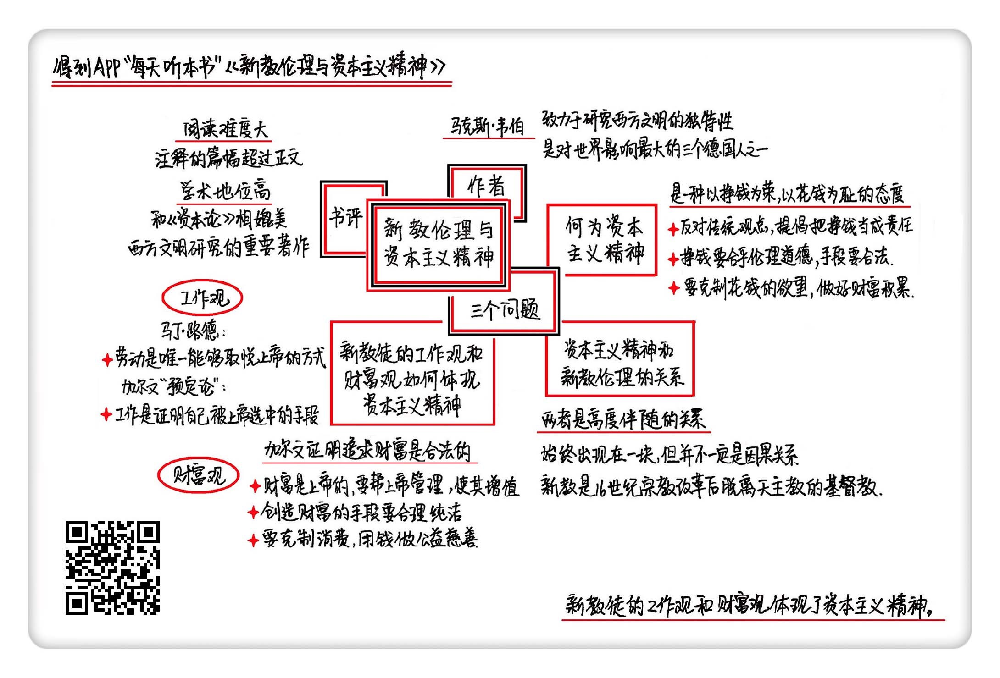

《新教伦理和资本主义精神》| 果旭风解读
=======================================

购买链接：[亚马逊](https://www.amazon.cn/新教伦理与资本主义精神-马克斯·韦伯/dp/B0051RM50U/ref=sr_1_1?ie=UTF8&qid=1506686867&sr=8-1&keywords=新教伦理和资本主义精神)

听者笔记
---------------------------------------

> 作者认为资本主义精神是一种以挣钱为荣、以花钱为耻的态度。钱是会生钱的，花钱，不仅是花掉了手中的数字，还同时等于花掉了它可能额外产生的钱。
> 
> 新教的意义在于改变了传统天主教认为劳动是对人类的惩罚，而是承认了劳动的意义，认为大家不必注意天主教的繁文缛节，履行好上帝交给你的世俗义务就能得救。
>
> 加尔文的“预定论”更加有力地证明了劳动的重要性。预定论，是指你的命运已经事先安排好了，如果你劳动有收获，则说明上帝早就选定你了，而劳动的收获正是上帝对你的恩赐。
>
> 新教徒的财富观是：人类只是上帝的管家，因此要帮上帝打理好钱财，但是不能花上帝的钱，因为钱是上帝的。

关于作者
---------------------------------------

马克斯·韦伯，德国思想家、社会学家，被称为对世界影响最大的三个德国人之一。有人做过一个调查，韦伯是英语人文社会科学文献中被引用次数最多的人，可见他在学术界影响之大。韦伯是个跨界大牛，他的研究范围极广，除了社会学以外，他在哲学、政治学、经济学、法学、管理学、历史学，乃至宗教与艺术等多个领域，都有独特的贡献。

关于本书
---------------------------------------

本书在思想史上的地位非常重要，甚至可以和《资本论》相媲美。它还曾被100位哈佛大学教授联名推荐过，多次入选世界名校的各类必读书目。无论你是想了解资本主义，还是想了解西方文明为何能领先世界的秘密，都绕不过这本《新教伦理与资本主义精神》。 

核心内容
---------------------------------------

本书的核心观点是：资本主义精神是一种以挣钱为荣、以花钱为耻的态度。它与新教伦理是高度伴随的关系。高度伴随指的是资本主义精神和新教伦理是经常出现在一块的，但并不一定是因果关系。最后，作者详细分析了这种联系之下新教徒的工作观与财富观。 
 

一、关于资本主义精神
---------------------------------------

资本主义精神，简单来说，就是一种以挣钱为荣，以花钱为耻的态度。以挣钱为荣并不是从一开始就被确立的观点，恰恰相反，一开始人们鄙视商人，认为挣钱是肮脏和贪婪的表现。

但资本主义精神反对传统的以挣钱为耻的态度，积极怂恿大家多挣钱，要把挣钱看成一种责任和义务。然后，挣钱要合乎伦理道德，手段要合法。韦伯列举了富兰克林的例子。富兰克林是18世纪美国的政治家、外交家、发明家，也是成功的商人，做过印刷、出版。韦伯认为他真正把挣钱当成了责任和目的，证据就是富兰克林不仅从商，而且还写有大量劝解人们努力挣钱的文章，也强调了能够挣钱的几种道德品质：勤劳、守信、诚实、节俭等。

最后，要克制花钱的欲望，别剁手，要积累起来。

二、关于资本主义精神与新教伦理的关系
---------------------------------------

资本主义精神与新教伦理之间并不存在因果关系，而是一种高度伴随的关系。所谓高度伴随性，就是这两个东西始终出现在一块，但并不一定是谁影响了谁。

两者的伴随性体现在：自16世纪起，新教徒聚集的地区与资本主义发展明显的地区有相当程度的重叠。

新教主要指的是16世纪宗教改革后脱离罗马天主教的各个基督教派。他们与天主教的一个主要区别是，新教认可世俗劳动的意义，鼓励信徒从事经济活动。因此新教徒一般也比天主教徒更加有钱，更愿意从事商业活动，比如以技术工人、资本家、其它工商行业为职业。而天主教徒宁愿收入微薄也不愿意从事商业，他们宁愿选择一种更安逸、宁静的生活方式，比如历史学、语言学等。

所以相比天主教，资本主义精神与新教伦理更为接近。

三、关于新教徒的工作观和财富观如何体现了资本主义精神
---------------------------------------

新教徒体现了资本主义精神，主要表现在他们的工作观与财富观上。

新教徒的工作观来自于一种叫做“天职”的教义。就是说人履行在现世中的职责是上帝安排的。这里的现世职责就是劳动，或者理解成我们所说的工作。按照这种“天职”教义，人应该努力工作。这种观点非常重要，因为它第一次让劳动变得有意义起来。证明了劳动是上帝的要求。

鄙视劳动的观点在宗教改革之后发生了变化。宗教改革发生在16世纪，新教站起来反对天主教对于宗教信仰的控制。天主教自诩为上帝的经纪人，认为信徒需要通过他们的中介才能与上帝沟通，而新教认为这种中介完全是多余的，每个人都可以和上帝直接沟通。你不用去参加天主教各种繁琐的仪式，你履行好上帝交给你的世俗义务就能得救。这种义务主要就是劳动。

宗教改革的主要发起人马丁·路德甚至认为，劳动是唯一能够取悦上帝的方式。他严厉批判了天主教瞧不起劳动的观点。因此，到了这里，劳动就开始变得有意义，它是在服务上帝，是道德的，光荣的。

加尔文的“预定论”更加有力地证明了劳动的重要性。“预定论”提出你是否能被得救，已经被上帝提前安排好了。这种观点产生了巨大的宗教恐慌，为了寻找自己已经被上帝选中的证明，新教徒努力工作，认为工作创造的世俗成就是上帝选中自己的信号。

新教徒的财富观建立在这样一个基础上：财富是上帝的。

财富是上帝的，我们创造财富不过是在帮上帝打理财产。就是说，财富实际上是上帝所有，人不过是上帝财富的一个托管者，我们人是上帝的管家。这个观点非常重要，因为它直接证明了追求财富的合法性。

具体逻辑是这样的：财富的所有权是上帝的，但是上帝信任人的智慧和忠诚，因此把钱财交给人来管理。于是，人具备了对上帝的责任。你要当好管家，好好帮他老人家打理他的财产，包括让这个财产升值什么的。你相当于一个基金经理的角色。因此，创造财富，对财富进行使用完全就是在服务上帝。这样一来，人追求财富变得合法，而且还具有道德上的崇高感。 

金句
---------------------------------------

1. 人们并不是一开始就把挣钱当作目的，要在“干得少”与“挣得多”之间做一个选择，他们宁愿干得少。
2. 工作在一开始受人鄙视，只有奴隶才干活。但宗教改革之后，人们意识到工作是服务上帝的唯一手段，自此变得光荣且崇高。
3. 财富是上帝的，人不过是上帝的管家，要好好帮上帝打理财产，因此创造财富是合法且神圣的。
4. 新教徒与天主教徒的生活观截然不同。新教徒选择“吃得好”，愿意为了生活优裕而冒险挣钱；但天主教徒选择“睡得好”，宁愿受穷，也不愿进行商业冒险，不愿意忍受道德谴责。

撰稿：果旭风

脑图：摩西

转述：吴笑