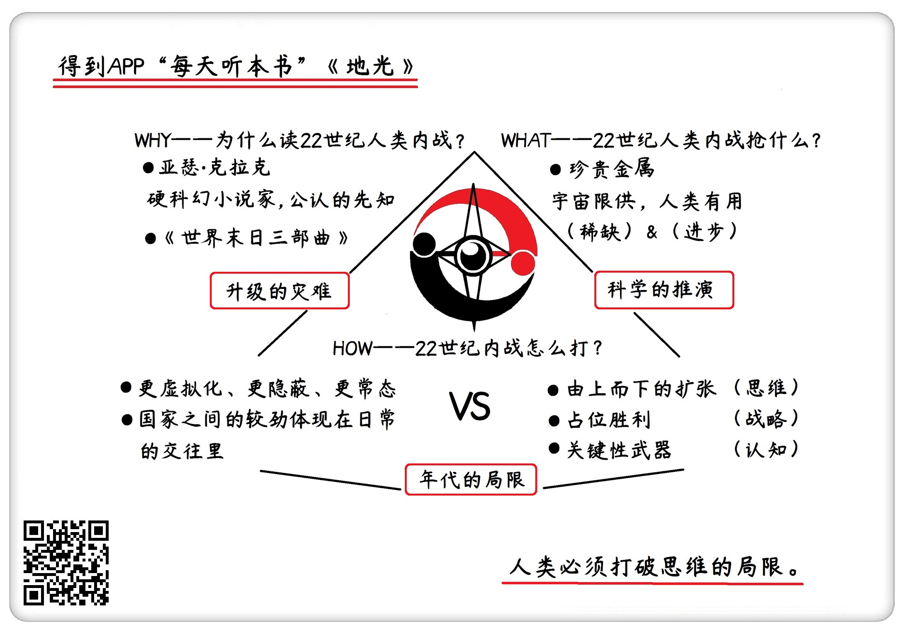

《地光》| 怀沙解读
=============================

购买链接：[京东](https://e.jd.com/30227838.html)

听者笔记
-----------------------------

> 元素周期表中的编号越大，都是需要超大型的恒星爆炸才能产生的，所以金属是非常珍贵的。

关于作者
-----------------------------

亚瑟·克拉克，世界现代科幻三巨头之一，硬科幻的代表作家，获过三个雨果奖和三个星云奖，是20世纪用科幻预言未来最成功的小说家。    

关于本书
-----------------------------
《地光》是克拉克“地球末日三部曲”之一，在这本书里，他讲述了22世纪在人类之间发生了一场星际内战的故事。下个世纪的人类已经殖民了整个太阳系，但还是为了争夺资源，在不同利益群体之间发生了内战，经过一场发生在月球上的星际大战，地月联盟和行星联盟最终握手言和，人类过上了太平的生活。

核心内容
-----------------------------

本书的思想核心是：22世纪的人类开始殖民太阳系，但因为资源的问题太阳系被分为两派，一边是重金属资源丰富的地月派，一边是能从外太空补给地球的行星派。月球上被探明蕴藏巨大矿藏之后，一场争夺战在月球附近展开。     
 

一、为什么要读“地球末日”系列
-----------------------------

读“地球末日三部曲”有两个理由，第一个来自作者，克拉克是预测未来最准确的硬科幻小说家。他在20世纪50-70年代，完整地预测出了今天科技环境下的生活方式，还完整地描写出了人类飞向外太空的执行流程，他的想象是一种负责任的想象；第二个理由，是克拉克为地球末日设定了三个层级，分别是人类和自己的矛盾、人类和环境的矛盾、人类和未知的矛盾。听完这三个音频，我们能感受到人类的顽强，同时体会到宇宙的深邃。

二、22世纪的人类抢什么
-----------------------------

人类的几千年的抢夺史是按照从“抢资源”到“抢能源”发展的，但是现在人类科技发达，本世纪就很有希望彻底解决能源问题，那么在现有的认知框架里，人类接下来要抢的东西，就是珍惜的元素，也就是金属。这也是克拉克在小说中的设定，抢夺稀有元素成为22世纪的人类矛盾的焦点，合情合理。

三、重金属为什么珍贵
-----------------------------

宇宙生产元素的机制是原子序列越靠后的元素，生产起来越难。恒星是宇宙的炼金炉，恒星级别不同、阶段不同，生产的元素也不同。比如平时的太阳只能生产氢和氦，就算到了太阳的红巨星爆发阶段，也只能生产到原子序列26的元素——铁；而像金、银、铀这样的重金属元素，则至少要报废一个质量是太阳八倍的恒星。所以，金属都是恒星的舍利子，重金属尤其珍贵。

四、人类未来的战争什么样
-----------------------------

克拉克笔下22世纪的星际战争过程可以总结成“由上而下的扩张”“占位性胜利”和“关键性武器”三个概念。但今天看来，这几乎是人类未来战争的反例，因为现在的世界，最能创造财富的是一个健康的、持续的关系网，国家的博弈被均摊在各种各样的空间和参数里，“战争”会变得更隐蔽、更常态、更虚拟化，甚至消失。

五、感慨
-----------------------------

这个音频最希望达成的目的是提醒我们自己，今天的一些看法，在未来有可能是多么的局限。因为就算克拉克这样世界公认的先知，都会被一个年代的认知墙壁困住。这就是重读经典的作用，他让我们更看得清我们是怎么一步步从过去进步来的，同时又让我们对未来充满期待和敬畏。
 
金句
-----------------------------

1. 如果克拉克的想象力是风筝，那不管这个风筝飞得多远，它都是被科学这根绳子牢牢拽着的。
2. 只有质量大于太阳的1.44倍的恒星，才有资格发生二次爆炸，像一个二踢脚一样又炸一次，这个过程叫超新星爆发。超新星爆发提供的温度和压力，才能生产原子序号是26以上的金属，这时候，原子序号在26以上的尖儿货出现了。
3. 我们回看整个人类的发展史，就是一个在元素周期表里往上爬格子的过程，一个文明能利用的元素在元素周期表里越靠后，就说明这个文明的层级越高。
4. 22世纪的国家之间的“战争”会变得更隐蔽，更常态，更虚拟化。国家之间的较劲已经打薄和均摊到一切交易和一切接触的过程里了，经济、金融、债务、生产，每一个过程都在决定这两个国家的强和弱。

撰稿：怀沙

脑图：摩西

讲述：怀沙