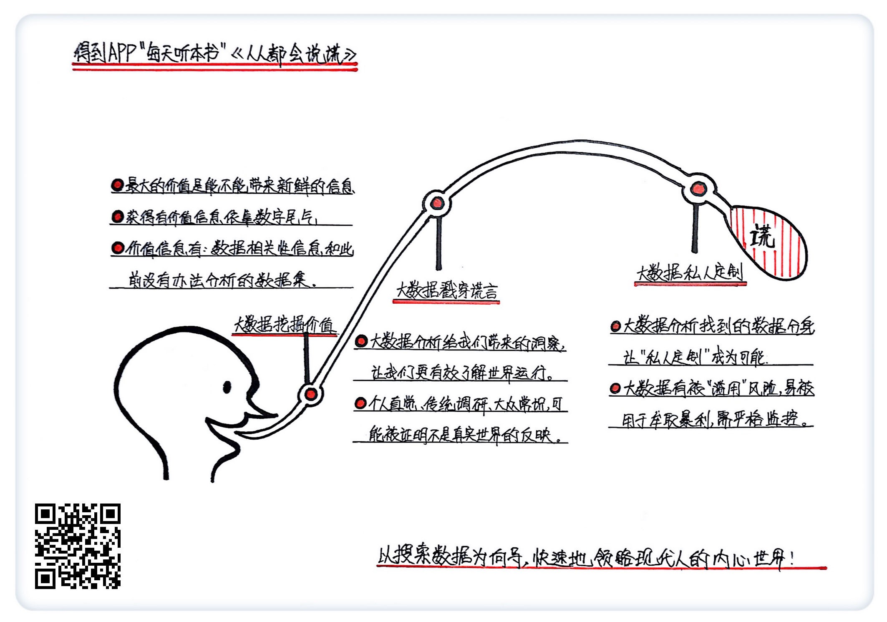

《人人都会说谎》| 季火解读
==================================

购买链接：[亚马逊](https://www.amazon.cn/Everybody-Lies-Big-Data-New-Data-and-What-the-Internet-Can-Tell-Us-About-Who-We-Really-Are-Stephens-Davidowitz-Seth/dp/0062390856/ref=sr_1_1?ie=UTF8&qid=1507814896&sr=8-1&keywords=人人都会说谎)

听者笔记
----------------------------------

> 大数据的价值在于是否能够提供新的信息。
> 
> 传统的统计调查方式可能无法反映人们的真实想法，就像人们在社交网络上，总是无意中隐藏了自己的某些心里，但是大数据通过大量的数据尾气，更客观地反映了一个人的真实想法。
>
> 大数据的这项特性是否真的有益呢，可能会面临道德方面的考虑，也有可能在一些个体上失灵。

关于作者
----------------------------------

赛斯·斯蒂芬斯-大卫德维茨，曾经担任谷歌大数据科学家，离开谷歌之后，在《纽约时报》专门撰写大数据相关的专栏，是大数据领域的资深研究者。     

关于本书
----------------------------------

这是一本介绍大数据研究领域最新发展的书。大数据分析相比传统方法，可以让我们更清楚去了解这个世界到底在怎么运作。     

核心内容
----------------------------------

利用大数据分析来了解普通人的喜好，了解真实的世界到底怎么运行，是科技推动认知发展的全新研究领域。大数据研究也正在颠覆许多人类常识的认知。随着未来可以搜集的大数据越来越多，颗粒度越来越细，大数据可以揭示的真实世界会更多。了解更真实的世界，是我们做出正确决策的第一步。 
 

一、什么样的大数据是有价值的
----------------------------------

我们未来将面临大数据以几何级别增长的状态，更需要从中找到新的信息。一种大数据有没有用，重点是它能不能提供一些新的信息，特别是此前从没有搜集到的信息。

首先是相关性的信息。书中举了作者和谷歌首席经济学家哈尔·瓦里安做的一个研究的例子。他们利用谷歌的一项功能“谷歌相关性”（Google Correlate）来做经济学的研究。这个工具能够找到不同数据之间的相关性。研究的问题是，用户搜索哪些信息，能预测一个市场内的房价。

其次，随着技术的进步，图像、视频等信息也越来越多地被广泛使用，成为新的大数据。新的数据很可能是混乱复杂的，并不像平常人认为的是那种一目了然、简单清晰的数据。

二、大数据是如何戳穿那些人人都在说的谎言的
----------------------------------

无论是调研的结果，还是人们的直觉，甚至是许多人相信的常识，都不一定能反映真实的世界。而大数据研究恰恰可以戳穿各式各样的谎言。

一个明显的例子就是，为什么美国2016年总统大选的民调那么不靠谱。在大选前一天，希拉里还领先特朗普好几个百分点，哪知道大选结果却是特朗普反超。美国人不真实的回答可能导致川普的支持率少报了至少两个百分点，因为不少特朗普的支持者并不愿意在接受民调的时候说出自己真实的想法。社会学中将这种行为称作社会期望偏差（social desirability bias），也就是人们会把自己非主流的想法藏起来，担心自己的想法跟别人不一样而遭到歧视。美国选民对待特朗普的态度就凸显了这种偏差。

大数据分析还能挑战一些常识，推翻我们固有的认知。

很多美国人认为，穷人更容易入选 NBA，因为 NBA 给了穷人家的孩子一条出人头地的出路。因此穷人家的孩子会特别努力，肯吃苦，而中产家庭的孩子缺乏这样的努力与吃苦精神。

对过去几十年所有 NBA 选手的家世背景的大数据分析显示，恰恰是中产家庭的孩子更有可能被 NBA 选秀。因为首先，NBA 需要个子高的球员，而家境比较好的孩子更容易长高，那些吃救济、单亲家庭的孩子很可能成长阶段营养不够，不容易长高。其次，NBA 不仅需要高个子和体能，也需要团队配合能力，需要比较高的情商。而美国的穷人很可能生长在单亲家庭，缺乏情商教育，不合群。

三、大数据分析可以让我们更好地了解每一个个体，为什么这种发展不一定是件好事
----------------------------------

当我们有了海量数据之后，可以更精准地对特定地区和特定人群做出分析，我们甚至有机会精准地对某个特定的人进行画像。未来可以利用大数据做到各种各样的 “私人定制”。

“私人订制”会带来巨大的福利。比如“私人订制”是未来医学发展的一大领域。大数据分析可以帮你找到一个病史记录上跟你的身体信息类似的人，或者跟你的某种身体体征类似的人，即为每个人找到你的数据分身。医生可以根据你的数据分身的病史记录，预测你未来接受治疗的反应，并可能提出更稳妥的诊疗方案。

但同样是数据分身，如果被滥用，则会带来极大的风险，使用起来需要特别慎重。比如，如果允许在保险业里找到你的数据分身，也就是找到跟你的风险喜好相同的人，保险公司就能更好判断你能够承受多高的保费，因此定价更精准，宰你也就更没商量。

依赖大数据模型去判断具体个人的行为，并侵犯个人权益，与之相关风险需要从两方面来思考：

首先，这是一个道德问题。比如，政府是不是应该监管分析个人的 “数据尾气”的行为？企业能不能利用大数据的 “私人定制”牟利？

其次，大数据分析可以让研究者测试许多变量。但是当你测试特别多的变量的时候，很有可能某个特定变量在预测群体行为时在统计学意义上有效，这并不意味着这一变量真的能预测个体的行为。  

金句
----------------------------------

1. 大数据将为社会科学带来一场革命，就像显微镜和望远镜彻底变革了自然科学那样。
2. 无论是有意还是无心，每个人都可能说谎，他们可能在调研时掩藏自己真实的想法，他们的常识可能是错误的。
3. 有时候我们对自己撒谎，很可能自己有好高骛远的想法，或者宏大的计划，却无法抵挡住诱惑。比如我们说要读高深的书，其实更喜欢小道消息；声称自己喜欢文艺片，其实还是更愿意看火爆的商业大片。
4. 个人的直觉、传统的调研、大众的常识，在大数据时代都可能被证明并不是真实世界的反映。

撰稿：季火

脑图：摩西

转述：孙潇