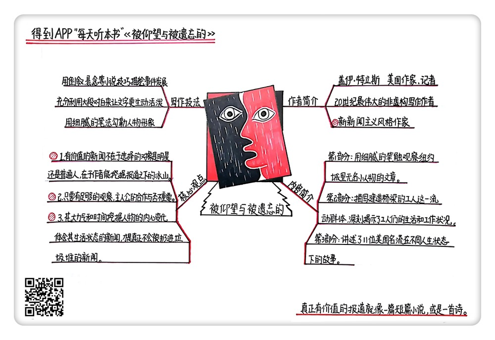

《被仰望与被遗忘的》| 玉裁解读
=================================

购买链接：[亚马逊](https://www.amazon.cn/被仰望与被遗忘的-盖伊-特立斯/dp/B06ZZBPP23/ref=sr_1_1?ie=UTF8&qid=1506607104&sr=8-1&keywords=被仰望与被遗忘的)

听者笔记
------------------------------

> “新新闻”是指用文学/小说的手法（倒叙、悬念等），来写新闻。
>
> 不一定是写大人物，也可以写小人物，但是一定要深入、要有细节。
>
> 有时候观察比采访更重要。

关于作者
---------------------------------

盖伊·特立斯是美国著名的非虚构作家，曾任《纽约时报》记者。二十世纪六七十年代，他写下了许多既细致深入，又宏大全面的小品文。其独特的行文风格和观察视角产生了广泛影响，为非虚构写作树立了一种典范。

关于本书
---------------------------------

一本精彩的人物和城市特稿集。它让人读来既信服又不乏感动，因为稿子里的名人——“被仰望的”人，被特立斯写出了其在某一时刻的凡人心境。同时，书中还收录了特立斯写布鲁克林大桥的几篇文章，他不仅访问了设计师、修桥工，还更多地访问了生活受到了造桥影响，甚至被大桥彻底改变的普通人。这些“被遗忘的”人同样真实可信，因为他们的故事吻合了读者心中的期待：人定胜天的另一面，是命运无常。

核心内容
---------------------------------

所谓有价值的新闻并不容易获得。一个普通的新闻只是冰山一角，一个普通的记者去写，只是看到海平面上的部分，真正的冰山是藏在水面之下的。而真正能够深入到冰山之下的，就是这个时代的伟大新闻写作者。
 

一、什么是新新闻主义？
---------------------------------

新新闻主义，作为一种新闻写作方式，是从二十世纪六七十年代兴起的。汤姆·沃尔夫、亨特·汤普森等都是其代表人物。在《被仰望与被遗忘的》的序言中，特立斯说：“‘新新闻’虽然读起来像小说，但本质上不是虚构的小说。它追求的是一种更广泛的真实性，这种真实性光靠简单罗列事实、使用直接引语及坚持传统报道的严格组织形式这三种新闻撰写手段是不能达到的。”

二、特稿与普通的新闻文章有何不同？
---------------------------------

这本《被仰望与被遗忘的》，是一本精彩的人物特稿和城市特稿精选集，基本涵盖了二十世纪六七十年代美国社会生活的各个方面，音乐、体育、文学、媒体、时尚、犯罪等等，无所不包。

本书中的每一篇文章，都如同非虚构写作的案例一样值得学习。一般认为，记者是新闻工作者，需要公正客观中立，不带自己的评论。因此“新新闻主义”一直饱受诟病，有人认为使用“新新闻主义”体裁的记者是为了追求戏剧性的效果，因此他们往往会对事实进行篡改加工，从而歪曲事实真相。

然而对于特立斯来说，他不想写那些“第二天就要被扔进垃圾桶的新闻”，他希望像一个作家那样写作，而不是像一个记者。他的鲜明观点是，出色的新闻稿件应该读起来像短篇小说，但本质上却不是虚构的，而是具有一种更广泛的真实性。这一手法允许，而且要求作者像大多数作家一样把自己融入文章当中。

特立斯觉得自己的工作和小说家没有区别，都是在讲故事，只是记者用了真名。他在新闻故事里采用戏剧性的场景描写事件，用倒叙、悬念等小说技巧来描绘事件的发展。

三、纽约这座城市里的小人物究竟怎样生活
---------------------------------

特立斯在开始自己的非虚构写作之前，曾在《纽约时报》工作了十年。大多数记者都梦想在《纽约时报》工作，去报道那些名人政要和国家大事的新闻，梦想着通过自己写的新闻来记录时代。

对特立斯而言，生活不是由名人组成的，他对那些普通的小人物和平凡的生活细节更感兴趣。

他写一系列纽约城小故事、人物肖像、城市速写等，要知道没有人用如此多细腻的笔触观察着这个城市不为人知的一面。黑暗中的野猫、开豪车的出租车司机、为各国元首剪发的理发师、为名人擦鞋的擦鞋匠，还有退休的拳击手转行去做明星们的按摩师、每天凌晨开始清扫大街上动物尸体的专车、纽约城最好的手推车制造匠……

比如，在《纽约：匿名者之城》里，总共出现了十几个人物，只描写每个人最有特色的一点。文章的第一句就写道：“纽约是一座有许多人工作时看不见面孔的城市。”之后，小人物们依次登场：始终保持沉默的公共汽车司机、脚踩高跟鞋的写字楼白领、晚间工作的大厦清洁工、在免费澡堂排队洗澡的乞丐和小偷、对收入缄默不语的擦鞋匠、停电时带着正常人走出楼梯的盲人……这些人彼此之间联系不大，但共同点是：看不见面孔，工作很安静，容易被人遗忘。

四、采访被拒绝后，如何写出比采访稿更好的新闻
---------------------------------

特立斯的写作当然不只是关注小人物，《被仰望与被遗忘的》第三部分就写到很多社会名流和娱乐明星。一般认为，面对大明星或者公众人物，只有面对面的访谈才能写出有信服力的新闻故事，但是特立斯有自己的观点。他认为学会观察最重要，只要有足够的观察力，主人公的合作与否都不是最重要的。

他那篇经典的《弗兰克·辛纳屈感冒了》就是最好的例证。在特立斯准备采访时，这位二十世纪美国流行乐坛的巨星正处在由于感冒引发的坏情绪中。采访不是不可以，但是辛纳屈的宣传人员表示，要特立斯签署一份让他们提前看稿的协议。

特立斯拒绝了，所以也同时失去了采访辛纳屈本人的机会。但特立斯觉得这并不是最重要的，他想尽了一切办法在每一个公开场合追随并且观察辛纳屈：他看见了辛纳屈内心中更深刻的一面，体会到了他在陌生人面前的不满和怀疑，以及他在信赖的朋友中充分放松时的那种快乐、礼貌和魅力。

金句
---------------------------------

1. “新新闻”虽然读起来像小说，但本质上不是虚构的小说。它追求的是一种更广泛的真实性。
2. 他们在一个地方只逗留一段时间，一旦大桥建好，他们就开拔到另一座城市，去修建等待着他们的另一座大桥。他们把所有的地方都连接了起来，但他们自己的生活却永远孤独、飘零。
3. 有些东西和时代无关，那就是品质。

撰稿：玉裁

脑图：摩西

转述：成亚