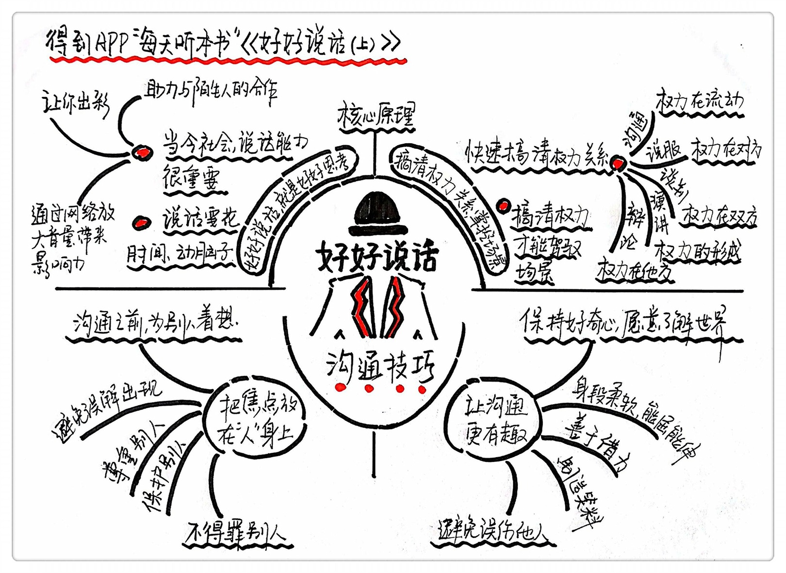

《好好说话1》| 张凯解读
========================

购买链接：[亚马逊](https://www.amazon.cn/好好说话-新鲜有趣的话术精进技巧-马东/dp/B01MS2EBDQ/ref=sr_1_1?ie=UTF8&qid=1506182656&sr=8-1&keywords=好好说话)

关于作者
------------------------

著名综艺节目《奇葩说》的成员马薇薇、黄执中、周玄毅等人。

本书序言
------------------------

1.樊登：

他们最厉害的武器就是专注，不做别的事，几个人在一起住在朝阳公园的一个公寓里每天研究怎么说话，比樊登读书会累得多，我只是知识的搬运工，他们是知识的伐木工。

2.李笑来：

“我是个相信‘道’比‘术’重要一万倍的人，但在好好说话这件事上，道这个东西常常用处不大，为人要真诚是道，说话要坦率也是道，但是由于这世界是极其复杂的，而语言本身就是个含糊不清，凑合着用的工具，所以不得不掌握各式各样的术，不频繁操练，就有可能后悔莫及。”

3.马东：
我理解他们作为一群自以为是的知识分子，对印在纸上的文字有一种病态的执着，而文字本身又是对这个音频产品一个很好的补充，至少他们重新校订。

关于本书
------------------------

说话的能力就是一门功夫，这本书把说话分成了5大模块，分别是沟通、说服、演讲、辩论、谈判，共同构建起了一个全息话术。一个会说话的人，一定在任何场景都能把这5种能力融会贯通地使用。
 

一、说话的核心原理
------------------------

不善于说话的原因不是嘴巴出了问题，而是思考出了问题。语言就是思考的全部，一个人的语言边界就是他思考的边界。

二、说话不得体的两个原因
------------------------

一方面是说话不过脑子，是一个下意识的行为。农业社会中说话的技巧对大多数人来说不是刚需，在现代社会说话能力就是一个人的核心竞争力所在。

另一个方面是拎不清境况，搞不清自己说话的目的和情景。

很多人把工作时候的话术带到家里，和家人沟通起来也都一本正经的很严肃，这就让沟通这件事变得很困难。

我们说任何话的时候都必然身处一个权力关系中，你需要影响谁，谁就握有这场语言游戏里得终极权力。在开始一段对话的时候，先快速搞清楚这种权力关系，才能使用最合适的话术。

【案例1】

乔布斯的新品发布会，乔布斯精心设计演讲的目的是让媒体关注，所以媒体就拥有权力。

【案例2】

销售员在说服一个顾客时，最后决定掏不掏钱的是顾客，所以权利就在顾客的手中。

沟通的时候权力在流动，因为沟通偏重的是理解；说服的时候权力在对方的手中，因为说服偏重的是改变，让对方接受我们的思想；谈判时候的权力在双方，因为谈判偏重的是协调；演讲是权力的形成，就是形成话语权的过程；辩论的时候权力在他方，观众才有权力决定胜负。

三、各种场景下有哪些说话技巧
------------------------

很多人在沟通的时候容易得罪人，分为显性的和隐性两种，隐性的言外之意很伤人。

【案例1】

想表达一下关心，但是在别人听起来却像是在指手画脚。“你这人怎么这样啊”“你房间怎么这么乱啊”“你走路怎么不看路呀”。

【案列2】

想表达安慰，别人听起来却像漠不关心。“没事，我是过来人，这都是小事”“生活就是这样，谁还没犯过错”。

【案例3】

有的人想说话前先表达礼貌，别人听起来却像是暗藏心机。“在吗”“你现在有空吗”对方一旦明确表示有空，就意味着很难拒绝你的要求。
怎么说话不得罪人呢？核心的诀窍就是把焦点放在“人”身上。

【案例4】

表示关心时，把“你这人怎么这样啊”换成“你这样，让我很难做”；想要安慰别人的时候，把“没事，这都是小事”换成“这件事对你来说也够难的，我能想象得到”；想要找别人帮忙，直接把你的需求说清楚，把是否帮忙的权力交给对方。

四、在沟通中如何才能做到有趣
------------------------

有趣和性格没有什么关系，有趣也不等于讲笑话。

首先是保持好奇。

【案例1】

只对自己世界感兴趣的“话题终结者”。

其次是身段柔软，开得起玩笑；

还要善于借力，多转述别人有意思的事情；

还需要注意在说话的语气上要避免先笑；

最后，说话的时候要避免误伤，自嘲的时候要注重场合。

【案例】

一个收入不错的中层自嘲说：“哎这个月还完房贷就要吃土了。”有比你年老的人在场，就不要拿年龄开玩笑，有比你笨的人在场，就别拿智商开玩笑。

总结：
------------------------

这一集中我们讲了说话是一种权力关系这个概念，来帮我们分清楚说话的具体场景，我们还重点说了在沟通中如何说话不得罪人，如何成为一个有趣的人，如何说话才能有幽默感。

启示：
------------------------

这本书的真正价值不在于具体的技巧，而在于让我们重新审视说话这件事。以前说话都是下意识的行为，当真正把说话当做一项重要的事情来对待的时候，你会突然发现自己不会说话了，过一段时间之后你就会发现自己的说话水平有了明显的提高，因为你有了更多的选择。

金句：
------------------------

1. 不会说话是个大问题，没意识到自己不会说话，是更大的问题。说话之伤，自带缓释效果，若无人点醒，致死不知。
2. 不会好好说话，归根结底是因为拎不清状况。一个最明确的指标是：权力关系。它决定了现在的语际关系，决定了各类场景下说话的基本原则。
3. 说话大师和你的区别，就像是黑板前面站着的人，和黑板上的蚂蚁看着同一个五边形。后者看到的是特定的边角，前者看到的是完整的图案，你看到的是沟通，说服，谈判，演讲，辩论各个专项的高手，而真正的高手，却是在不同环境下呈现不同的面貌。

撰稿：张凯 

脑图：摩西

讲述：孙潇