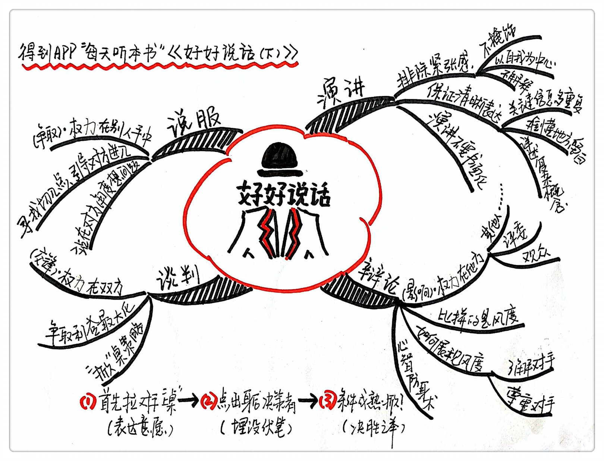

《好好说话2》| 张凯解读
========================

购买链接：[亚马逊](https://www.amazon.cn/好好说话-新鲜有趣的话术精进技巧-马东/dp/B01MS2EBDQ/ref=sr_1_1?ie=UTF8&qid=1506182656&sr=8-1&keywords=好好说话)

关于作者
------------------------

著名综艺节目《奇葩说》的成员马薇薇、黄执中、周玄毅等人。

关于本书
------------------------

说话的能力就是一门功夫，这本书把说话分成了5大模块，分别是沟通、说服、演讲、辩论、谈判，共同构建起了一个全息话术。一个会说话的人，一定在任何场景都能把这5种能力融会贯通地使用。

一、说服别人

说服别人的时候权力在别人的手中，意识到权力关系，是说服的第一步，我们要做的是争取到权力。说服的过程就比较迂回，都是找一个切入点，好让对方从中找出一个去做的理由。

案例：

用问题来引导对方从“为什么我不能”转变为“为什么我想要”。把“为什么你找不到对象”换成“你有没有想过找对象”。

这套提问的方法不止可以用来劝导别人，也可以用来自我激励。

【案例】

如果总是想自己为什么会有拖延症，就一定会想出一大堆理由来安慰自己，而要问“为什么这件事我不想拖”。

说服人还要站在对方的角度想问题，找到对方的诉求和痛点。

【案例】

西游记里三打白骨精，唐三藏屡次冤枉孙悟空。从表面上看唐三藏是不相信孙悟空的专业水平，真正的原因是他们想问题的方向不同。孙悟空的职责就是打妖怪、保护师傅，可是唐三藏是十世修行的金蝉子，万一他错杀一个，他的修行就泡汤了，他的第一诉求是想要普度众生。孙悟空要站在唐三藏的角度说，“师傅，我知道您是怕我万一看走眼乱杀无辜了，但是您想想，万一我们放走一个吃人的妖精，那周边的百姓可要遭殃了，到时候在佛祖面前要怎么交代啊。”这样一说，师傅就算不消气，也至少不会念紧箍咒了。

二、谈判

谈判是一种权力在双方的关系，就是在双方都持有退出权力的条件下达成共识。

【案例】

砍价的“掀桌策略”想获得成功，需要三步准备工作。首先表达意愿，增加对方的预期还有和你聊天的时间是关键；第二步，说出你没有最终的拍板权，身后还有一个人决定是否最终成交；第三步，等条件成熟了果断掀桌。

成功的掀桌策略只是能让我们在砍价的时候获得一定的优势，但是并不意味着只要掀了桌就一定能成交，只有摸清对方的底线，在掀桌后开出合理的价格，在谈判中保持清晰的思路，才能正确地使用好掀桌策略。

三、演讲

演讲是一个形成权力的过程，一场好的演讲能让演讲者建立一种权威感。

在演讲的时候，紧张是要越过的第一道关卡。只要你自己表现得不紧张，没人会去关注你的紧张。在我们的工作中出了差错，用这种坦荡的态度面对错误也是最好的方式。

【案例】

何炅在一个颁奖典礼上，主办方本来设计了一个高大上的触屏电脑，让嘉宾通过电脑来读获奖名单，电脑突然死机了，嘉宾在台上一脸茫然，何炅一句话就带过去了，“其实除了最炫的高科技设备，我们也同时准备了最原始的手段”，然后通过原来拆信封的方式顺利完成了整个颁奖典礼。

演讲练习应该是不管通不通畅都继续往下说，遇到经常犯的错误可以停下来反复练习。

演讲还要分清口语表达和书面表达的区别，口语清晰表达的三个方法：

第一个，关键信息要多重复。

第二个，难懂的地方要留白。

第三点，复杂的概念要进行操作性的表述。

【案例】

我们给别人指路，如果说：”过这个路口，先往东，再往南，再转西，多数人会听不明白，如果我们说：“前面第一个路口左转，然后两个路口右转就到了”，这样听起来就是明白很多。

四、辩论

辩论是一种权力在第三方的说话场景，权力在观众的手中，辩论其实就是一个风度的展示场。

【案例】

特朗普和希拉里的辩论每次的发言时间两三分钟，说的都是像医疗改革、国家安全这样的世纪难题，所以表面上看他们的观点都很明确，但是其实都是避重就轻地在回答，其实比的不是内容而是风度。

怎么展现出风度呢？唯一的办法就是了解和尊重你的对手。

【案例】

马英九先生准备辩论，他们的幕僚团队要求他读一本他对手的传记，这个举动就是要让马英九从心里知道，他的对手是和他一样值得尊敬的，这样在台上就不会不经意间表现出蔑视。

虽然沟通、说服、演讲、谈判、辩论的特点不同，但说话样式是相同的，是可以转化的。高水平的演讲一定要和观众有交流，这就过渡到了沟通。在沟通过程中难免会加一些自己的观点，又过渡到了说服。同理，说服的时候其实也是在谈判，谈判的时候也是在辩论，辩论的时候实质上就是一段演讲。

总结：

这本书给我们从5个方面全面讲解了说话的具体技巧，从沟通、说服、辩论、演讲、谈判的各种误区开始，最后通过分析，纠错，一步步帮助我们找到更好的话术。

启示：

说话的技巧都是次要的，这本书带给我们最大的价值就是重新认识说话这件事，我们从小就以听话的方式被教育，却以说话的方式被考核，我们所学的东西全都是以表达为指向的，所以表达能力是一个人必须具备的基础能力。

金句：

1. 说服并不是什么如洗脑般的超能力，而是一门跨领域的学科，其核心主题无非有两方面：一是人如何形成看法；二是人又为什么会改变看法。
2. 演讲，颁奖，工作中都是信息高速流转，关注点不断变迁的场景。除非真的别有用心，否则没人有那功夫把注意力盯在你的错误上，我们连长微博都不愿意读完，生活中偶尔的小错误，谁又愿意被你揪着，没完没了的听你解释呢？更何况误会才需要解释，错误只需要承认。
3. 我们生活在由话术建构的现代世界，这个秘密，少有人知。

撰稿：张凯

讲述：孙潇

脑图：摩西