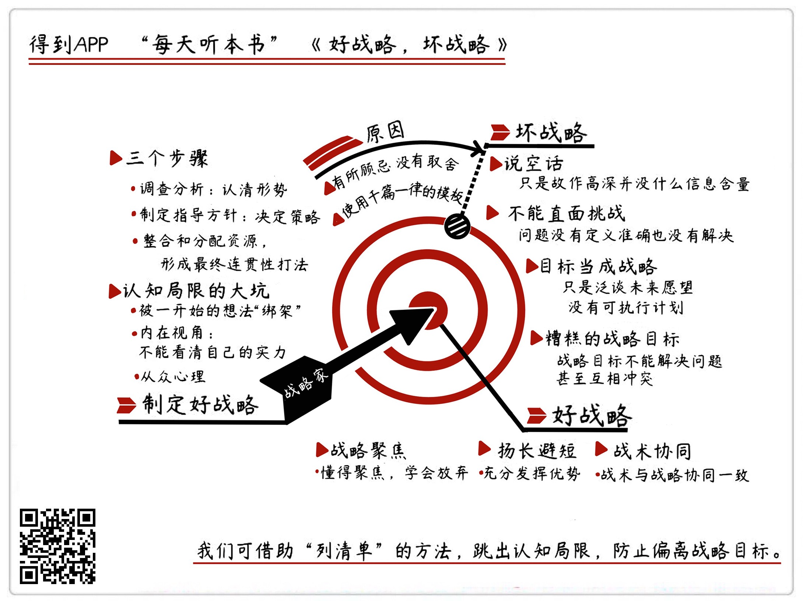

《好战略，坏战略》| 王海解读
======================================

购买链接：[京东](https://item.jd.com/14869857625.html)

听者笔记
--------------------------------------

> 作者认为坏战略有下面的特征：说空话、不解决当前面临的实际问题、只有目标但是没有行动计划、错误的战略或者和其他战略冲突的战略。
>
> 好战略有下面的特征：战略聚焦（集中火力搞定一件事）、扬长避短（发挥自己的优势）、战术协同（要有正确的方法）。
>
> 想要和战略家一样思考，就要学会克服认知局限，克服目光短浅，敢于对自己的想法进行批判。
>
> 制定好战略的基本方法是：调查分析、制定指导方针、根据指导方针制定行动计划。
>
> 可以通过列清单来梳理自己的思路，明确目标，提高执行力。

关于作者
--------------------------------------

理查德·鲁梅尔特，加州大学洛杉矶分校管理学院的教授。麦肯锡把他称为是“战略中的战略家”。他还被《经济学人》评为“当今25位对管理理念和公司行为最具世界影响力的思想家之一”。

关于本书
--------------------------------------

本书讲述了什么战略是坏战略，为什么坏战略普遍存在；还详细讲述了什么是好战略，如何制定一个好战略。     

核心内容
--------------------------------------

一、什么坏战略，坏战略为什么普遍存在。二、什么是好战略。三、怎么制定一个好战略。     
 

一、什么坏战略，为什么坏战略普遍存在
--------------------------------------
坏战略的四个特征：

1. 说空话。所谓的空话，就是一些伪装成战略理念的没有信息含量的话。

【案例】

有一家零售银行的战略是这样的：我们的基本战略，是发挥以客户为中心的中介作用。所谓的“发挥中介作用”，就是吸纳储户的存款，然后再把这些存款贷出去。这不就是一家银行该做的事情吗？一个好战略，要做到让专业知识和深刻洞察变得清晰易懂，像这种故作高深的说法，是坏战略的典型特征。

2. 不能直面挑战。也就是说，战略要解决的问题，不是现在真正面临的问题。

【案例】

联合收割机公司曾经就制定过一个和实际问题不匹配的坏战略。这个战略要让每一项业务的市场份额都要提高，成本都要削减。这个战略的问题，在于它没有关注公司真正要面对的问题。联合收割机公司的业绩之所以疲软，主要是因为劳资关系非常糟糕，员工们的工作效率低下。把问题定义准确，然后直面挑战的战略，这样的战略才有效。

3. 把目标当成战略。很多战略只是泛泛地谈到了未来的美好愿望，没有具体的、可执行的计划，这样的战略也属于坏战略。

【案例】

作者有一次给一家图形艺术公司做咨询。这家公司的老板说，他们公司的战略很简单，就是每年公司收入增长20%，利润率达到20%。为了达到这个目标，公司会给客户提供优质服务，员工都要努力奋斗云云。像这种打鸡血、喊口号式的战略，就是一个失败的战略。

4. 糟糕的战略目标。如果战略目标没有解决关键问题，或者各个战略目标之间是相互冲突的，这就属于糟糕的战略目标。

【案例】

有些公司在开战略会议的时候，会把各个利益方提出的要求都一股脑地放在公司的战略计划当中。等发现战略目标太多，根本没法完成的时候，就在战略目标前面加上“长期”两个字，因为这样可以暂时不去管这些目标了。好的战略目标，应该把精力和资源集中在一个或者少数几个关键目标上，而且这个关键目标一旦实现，就能带来一系列的优势和成果。

为什么坏战略还是普遍存在呢？主要有这么两个原因。第一是不敢放弃。要制定好战略，需要在不同的备选方案里做出取舍，选择一些目标，放弃其他目标。第二是使用所谓的“战略模板”来制定公司战略。这种千篇一律的模板，根本没有考虑到自己公司的具体情况。

二、好战略有三个特征
--------------------------------------

1. 战略聚焦。战略聚焦的第一步就是“放弃”。真正有效的好战略，从来都不是使用所有的资源去达成所有的目标，而是选择关键目标，次要目标都让路。

【案例】

1991年的海湾战争，美军开展了“沙漠风暴”行动，使用“正面假装进攻、侧面包抄”。很多人觉得这样的战略非常简单，谁也能想到。但这个战略难就难在它高度聚焦。这个战略放弃了一大堆的资源，放弃了一大堆其他目标，压制了所有不符合主要战略的提议。这种割舍和聚焦，才是这个战略真正厉害的地方。

2. 扬长避短。不要想着通过弥补劣势，去和别人的优势竞争，更不要用自己的劣势去攻击对手的优势。

【案例】

《圣经》里面有个“大卫战胜歌利亚”的故事。说的是身体弱小的大卫，战胜了巨人歌利亚。在大卫出征前，周围人都知道大卫太过于弱小，都劝他穿上厚重的盔甲。但是大卫知道，穿盔甲是在弥补自己身材小的劣势，但这个劣势怎么弥补，都不可能强过巨人歌利亚。所以大卫真正要做的是想办法找到一个有利战场，发挥自己灵活、速度快、投射准的优势。

3. 战术协同。战略中最关键的一步，就是让战术行动能够协同战略。如果战术不能协同战略，战略就会变成一句口号。

【案例】

有一家定位于安全出行的专车公司，搞过一个专车司机讲笑话的活动。这个活动获得了很好的传播效果。但如果从战略的角度来看，这次活动其实是失败的。首先这个打法没有实现战术协同，这家专车公司的定位是“专业安全的专车服务”，但让司机讲笑话这个战术是和整体战略不匹配的。其次，这个活动也没有扬长避短，这家专车公司的优势是“自家车辆、专业司机”，但对于讲笑话这类有趣的活动，并不擅长。

三、如何像战略家一样思考
--------------------------------------

要制定一个好战略，你先要学会像一个战略家一样思考。所谓的战略家，就是具备战略眼光，比别人看得更长远。他们能突破自己的认知局限，保持一个冷静、理智、批判的头脑。所以想要和战略家一样思考，就要学会克服认知局限，克服目光短浅，敢于对自己的想法进行批判。

在进行战略思考的时候，人们很容易掉进三个认知局限的大坑。

第一个坑：被一开始的想法锁死。

第二个坑：从众心理。就是别人干什么我就干什么，完全不顾这些动作和自己公司的实际情况匹不匹配。

第三个坑：内在视角。意思就是人们经常高估自己的实力，相信自己成功的概率远高于结果，觉得自己比普通人更有才华，更精明能干。

四、怎么制定一个好战略

1. 调查分析。调查分析的方法千千万，但目的只有一个，就是搞清楚目前发生了什么。确定了当前形势之后，你就可以根据历史上相似的情况做出相应判断。
2. 制定指导方针。要提出整体性的战略。好的指导方针就像是高速公路上的护栏，作用在于引导并且约束人们的活动。指导方针不是目标或者愿景，也不是对于理想状态的终极构想，而是某种处理问题的方法。
3. 根据行动方针，来设计具体的打法，形成一套连贯性的动作。各个战术行动之间不能发生内部冲突，所有战术要根据指导方针来进行取舍和修改，要具备连贯性。

五、通过列清单，避免认知局限的干扰
--------------------------------------

列清单得到的不仅仅是一张清单，重点在于列清单的这个过程。在这个过程中，我们会开始思考，对于现在的情况来说，什么才是当下最重要的事情，战略聚焦点应该在哪儿？自己的优势在哪儿？有没有被对手带偏，忽略了扬长避短？还可以回顾一下最近的战术打法，有没有协同战略。列清单是一个克服我们认知局限的基本方法，在列清单的过程中，我们可以把事情按照轻重缓急排序，实现战略聚焦，明确目标提高执行力。     

金句
--------------------------------------

1. 战略目标都是针对具体的事情或任务而制定的，而不是空泛的大好前景，商业竞争不仅仅是力量与意志的竞争，还是眼光和能力的竞争。所以不能用信念代替行动，用愿景代替方案。
2. 要制定好战略，需要在不同的备选方案里做出取舍，选择一些目标，放弃其他目标。但只要放弃的目标会牵涉到某些人的利益，就必然会遭到反对，尤其是在大型组织里，更是阻力重重。
3. 当你聚焦关键资源，去攻击少数的正确目标的时候，往往就能获得意想不到的胜利。相反地，如果想要同时实现多个互相冲突的目标，就会陷入被动，最终鸡飞蛋打，一个也实现不了。
4. 战略不是一句口号，不是会议文件，不是一个 PPT，而是企业一切行动的指导方针。战略定出来，就意味着一切的活动都要协同战略。否则，缺乏战术协同的战略，就会沦为一句口号。

撰稿：王海

脑图：摩西

转述：孙潇 