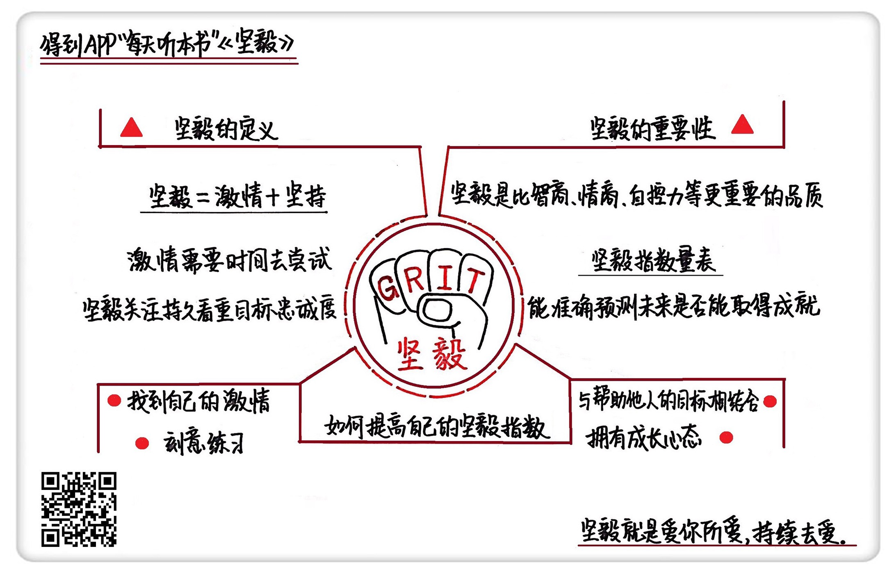

《坚毅》| 陆一解读
================================

购买链接：[亚马逊](https://www.amazon.cn/坚毅-安杰拉•达克沃思/dp/B071HLZWG6/ref=sr_1_1?ie=UTF8&qid=1506523224&sr=8-1&keywords=坚毅)

听者笔记
--------------------------------

> 坚毅=激情+坚持
> 
> 提高自己的坚毅指数的方法：找到自己的激情，刻意练习，人生使命（找到做事的意义），拥有成长心态（不害怕失败）。

关于作者
--------------------------------

安杰拉·达克沃思，宾夕法尼亚大学心理学副教授，2013年荣获美国麦克阿瑟学者奖，简称“天才奖”。2013年，安杰拉·达克沃思进行了名为“坚毅：释放激情与坚持的力量”的TED演讲。截至目前，点击量已超过1000万。

关于本书
--------------------------------

很多人认为，成功的要素在于智商和情商。但是，宾夕法尼亚大学心理学副教授安杰拉·达克沃思认为，坚毅的品质对成功起到了关键性的作用。在这本书里，安杰拉·达克沃思为我们介绍了她的研究成果，并给出实操性的方法，对我们如何提高自己的坚毅指数给出了建设性的答案。本书让我们看到了关于成功的另一面，那就是：发现自己的兴趣所在，找到自己的人生使命，在挫败中不断磨炼自己，成为一个坚毅的人，从而拥有自己想要的生活。

核心内容
--------------------------------

本书思想核心是：Grit，坚毅，是当下非常时髦的新概念。它由激情和坚持两部分组成，二者缺一不可。没有人愿意在不喜欢的事情上挣扎，但不断转换目标，四处打井也不是正确的方法。一个真正坚毅的人，是在对的方向上持续努力。坚毅，是比智商、情商、自控力更重要的品质。与它配套的坚毅指数表，可以测试一个人的坚毅指数，并能有效预测一个人未来是否能取得成功。同时，一个人的坚毅指数并非固定不变。你可以通过4个步骤，有效提升自己的坚毅力。
 

一、坚毅=激情+坚持
--------------------------------
1. 激情

我们都说兴趣是良师益友，可是，长大后的我们，却在自己不喜欢的工作上苦苦坚持。为什么不敢追随自己内心的激情？为什么追随激情会被认为是不靠谱的表现？原因是，我们对激情存在很深的误解：
（1）激情不是刹那间的决定，相反，它需要时间去慢慢发现；
（2）激情并不是从小就决定的志向，相反，它需要不断摸索和尝试。
2. 坚持

坚持的人更像是跑马拉松，跑得多快并不重要，重要的是坚持了多久。一个创业者为了筹集资金，熬了多少个通宵，并不能说明他有多坚毅。是否能长期坚持下去，对自己的目标保持忠诚，才是坚毅看重的标准。

二、坚毅，比智商、情商、自控力更重要的品质
--------------------------------

1. 智商

早期的心理学家曾认为，智商是预测一个人未来能否取得成功的重要因素。这个观点根深蒂固，以至于现在，大众对智商仍偏爱有加。然而，对天才的偏爱反倒为我们的懒惰或不求上进提供了绝佳的借口：我之所以不能取得成功，不是因为后天不努力，而是我先天不足。
2. 自控力

棉花糖实验是一个有关延迟满足范式的经典实验。在棉花糖实验中，一个小朋友等待时间的长短与他长大后参加“美国高考”SAT考试所取得的分数具有显著的相关性。不只是美国，这个实验在世界多个国家都进行过，结果都非常类似。这一实验引起了人们的广泛关注，从而自控力取代智力，成为决定一个人能否成功的重要因素。

3. 情商

情商由心理学家丹尼尔·戈尔曼提出。他认为，在现代社会中，相较于智商论提倡的左脑的逻辑思维能力，右脑的共情力作用更大。情商高的人，既善于控制自己的情绪，也善于管理他人的情绪，做起事情来也就更加游刃有余。因此，情商的重要性被越来越多的人所接受。
4. 坚毅
坚毅指数量表开发于西点军校，之后被广泛应用于教育界、商界等领域。坚毅指数量表一共有10道题，描述了10种情况。测试者需要对照自身情况，从“一点儿都不像我”到“特别像我”5个答案中做出选择。这个量表不仅能测出测试者的坚毅指数，还可以分别测出测试者的“激情”指数和“坚持”指数。

比如说，题目“挫折不会让我气馁，我不会轻易放弃”，测试的是你在“坚持”上的分数。你觉得这句话是“一点儿都不像我”、“不太像我”、“有点儿像我”，还是“很像我”或者“特别像我”？如果你认为“特别像我”的话，那么这道题，你可以得到5分。如果你选择了“一点儿都不像我”，那么你在这道题上的得分只有1分。

另一个题目“我曾在短时间内迷上了一个想法或项目，但后来又失去了兴趣”。你觉得这句话是“一点儿都不像我”、“不太像我”、“有点儿像我”，还是“很像我”或者“特别像我”？如果你认为“一点儿都不像我”的话，那么这道题，你可以得到5分。如果你选择了“特别像我”，那么你在这道题上的得分只有1分。

三、如何提高自己的坚毅指数
--------------------------------

1. 找到自己的激情

如何寻找到自己的激情？这需要前期大量的尝试。作者安杰拉·达克沃思认为，即使是在发展兴趣这件事上，人们也是需要努力的。大多数的坚毅典范都花了很多年去探索自己的兴趣，而那个最终占据他们心灵的事情，并不是他们第一次遇到时就被认出的。

虽然成功人士在接受采访时，经常会说，“我无法想象自己会选择其他的职业”。但是，事实上，很多人早期都曾有过从事其他行业的经历或想法。所以，不要坐在那里想自己到底喜欢什么，而是要勇于尝试，勇敢追求，实践出真知。
2. 刻意练习

坚毅，不仅在于一个人投入到某项兴趣上的时间，还在于投入的质量。专业高手是如何进行一万小时的刻意练习的？先找到需要改进的一个微小方面，然后全神贯注地投入和努力，并寻求外界的反馈，之后再依据反馈一遍又一遍地调整和练习，直到此前的不足变成无意识的能力。
3. 人生使命
激情源于兴趣，也源于目标。所谓目标，就是你的人生使命，也就是造福他人的意图。

虽然只有少数人真正做到了把工作当作人生的使命，但这并不是因为人们缺乏渴望。每个人在赚取“面包”的同时，也在追寻生活的意义。那怎么才能知道人生使命呢？答案是，无论你从事什么工作，都需要不断审视自己，不断思考如何与其他人联结，如何与更广阔的世界联结，如何展示你内心深处的价值观。也就是说，一个曾经说“我在砌砖”的泥瓦匠，也可能在某一刻意识到自己在创建“上帝之屋”。

4. 拥有成长心态

在积极心理学领域有一个非常著名的实验——习得性无助实验。实验发现，那些对电击没有控制力，只能被动承受痛苦的小狗，在面临逃跑的机会时，也仍然倾向于被动承受电击，不做任何反抗。

但是，并不是所有的小狗都是这样，还有1/3的小狗，表现出坚毅的特性。尽管经历了先前的痛苦，它们仍然没有选择放弃，逃到了安全地带。正是这些小狗，让研究者将研究对象转为处于类似逆境却仍然不会放弃的人类。

到底是什么因素，让那些屡屡遭受失败的人，仍然心怀希望，一遍又一遍地尝试呢？答案是“成长心态”。成长心态帮助你用乐观的方式解释逆境，它让你充满希望，不断寻求新的挑战，并让自己更强大。成长心态和坚毅总是并肩同行，换句话说，拥有成长心态的人更为坚毅。

金句
--------------------------------

1. 要想成为一个真正“坚毅”的人，你要在“对的方向上”持续地“努力”。
2. 坚毅的人更像是跑马拉松。速度有多快，比赛用时有多少并不重要，你用一个速度坚持了多久才是最关键的。
3. 坚毅就是爱你所爱，持续去爱。
4. 有所成就者，必备热情与坚持。

撰稿：陆一

脑图：摩西

转述：成亚