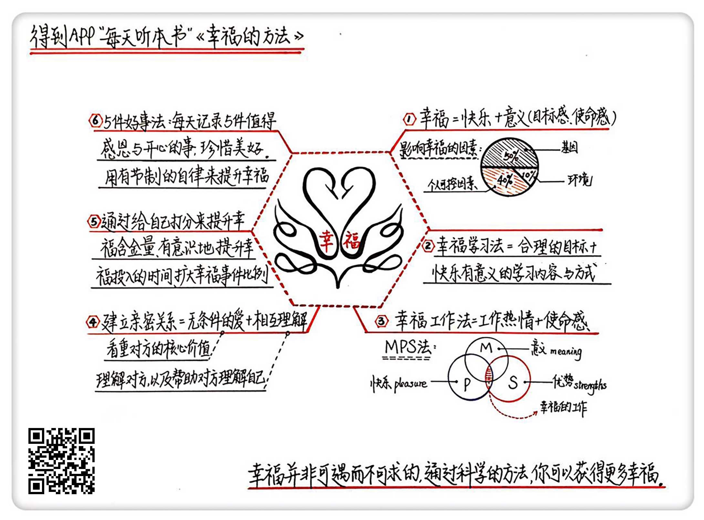

《幸福的方法》| 苏菲解读
================================

购买链接：[亚马逊](https://www.amazon.cn/幸福的方法-哈佛大学最受欢迎的幸福课-泰勒•本-沙哈尔/dp/B00ASTRHS6/ref=sr_1_1?ie=UTF8&qid=1506523276&sr=8-1&keywords=幸福的方法)

听者笔记
--------------------------

> 幸福，是快乐与意义的结合
> 
> 幸福学习的方法，就是享受学习本身
> 
> 幸福工作的方法，就是在工作中找到热情和使命感。
> 
> 营建幸福的亲密关系，需要无条件的爱和相互理解。
> 
> 为自己打分，提升整体幸福指数。
>
> 用5件好事法(每天记录5件值得感恩又快乐的事情)和有节制的自律来提升幸福感。

关于作者
--------------------------------

泰勒·本-沙哈尔，哈佛大学积极心理学课程讲师，在哈佛创造了选课人数最多的记录，他本人也被哈佛学生评为“最受欢迎的哈佛导师”。

关于本书
--------------------------------

在本书里，作者阐述了幸福是什么，影响幸福的因素有哪些，以及如何提升幸福水平。“积极心理学之父”马丁·塞利格曼对这本书进行了高度评价，认为它把教给人们获得幸福的方法和关于幸福的科学研究成果完美地结合了起来。

核心内容
--------------------------------

幸福是快乐与意义的结合。幸福需要兼顾当下利益和未来利益，既有长远而有意义的目标，也享受实现目标的过程。影响一个人幸福水平的因素中，有40%的部分是个人可控的，也就是说，每个人都可以通过自己的努力让自己更加幸福。
 

一、幸福的定义
--------------------------------

幸福，是快乐与意义的结合。以当下利益和未来利益为横竖两个坐标轴，人生可以分为四个象限：注重未来利益轻视当下利益的“忙碌奔波型”、注重当下利益轻视未来利益的“享乐主义型”、两者都放弃的“虚无主义型”、两者都看重的“感悟幸福型”。积极心理学认为，只有最后一种类型才是真正的幸福，也就是做到了快乐与意义的结合。

影响一个人幸福水平的因素中，50%与基因相关，10%与环境相关，剩下的40%是个人可控因素。由此可见，尽管有着先天的决定因素，每个人依然可以通过自己的努力提升幸福水平。

财富属于环境因素中的一个。心理学家发现，当生活已经解决了温饱，获得了基本保障，幸福与财富之间的关联性非常低。要想获得幸福，不应该以追求财富为目标，而应该直接追求幸福。当然，这并不意味着要牺牲成功，因为人在获得快乐感受到意义的时候，会激发出更大的潜力，所以幸福的人往往会取得更大的成就。

二、幸福学习
--------------------------------

幸福学习的方法，就是享受学习本身。

作者认为学习有两种模式：溺水模式和性爱模式。注重过程和结果的性爱模式，会让学习更加具有幸福感。学习的巅峰体验是“心流体验”，也就是在学习的过程中忘记了时间的流逝。为了获得心流体验，需要设置清晰的目标，并且寻找难度合适的任务。

三、幸福工作
--------------------------------

幸福工作的方法，就是在工作中找到热情和使命感。

MPS 方法可以帮助你理清思路，找到既适合自己又具有幸福感的工作。其中，M 代表意义，P 代表快乐，S 代表优势。依次写下所有觉得有意义的事情、所有令自己感到快乐的事情以及所有能发挥自身优势的事情，这三部分的交集就是理想的工作。

即便目前不具备更换工作的条件，也可以从现有工作中找到令自己感到快乐的部分，并积极培养工作使命感，在工作中感到幸福，也会带来更优秀的工作表现。

四、幸福恋爱
--------------------------------

营建幸福的亲密关系，需要无条件的爱和相互理解。

无条件的爱就是看重对方的核心价值，而不是外在成就。获得无条件的爱，能令人更好地激发潜能和价值。理解是爱的基础，熟悉会带来更强烈的亲密感。

五、自我打分法
--------------------------------

为自己打分，提升整体幸福指数。

记录自己所做的主要事情，为每一件事的快乐和意义打分，根据分数来评估是该增加这件事的投入还是该减少。通过有意识地记录和评估，可以对自己的时间投入有更深层次的认知，从而更好地调整行为。

六、5件好事法
--------------------------------

用5件好事法和有节制的自律来提升幸福感。

每天记录5件值得感恩又快乐的事情，无论大小，重复也没有关系，这样能让自己的情感体验保持新鲜，对抗适应性的司空见惯和理所应当，珍惜所拥有的美好，会增强幸福感受。把健康的生活方式形成惯性，用有节制的自律来提升幸福感。     

金句
--------------------------------

1. 不要追求绝对的幸福水平，而应该在自己的原始幸福基准之上，通过努力不断提升幸福水平，达到更幸福的状态。
2. 追求幸福并不意味着牺牲成功，相反的，幸福的人往往会取得更大的成就。
3. 如果你无条件地爱一个人，你就会看重对方的核心价值，而不是他的外在表现。
4. 把追求财富当作人生目标，并不能保证会得到幸福。

撰稿：苏菲

脑图：摩西

讲述：于浩