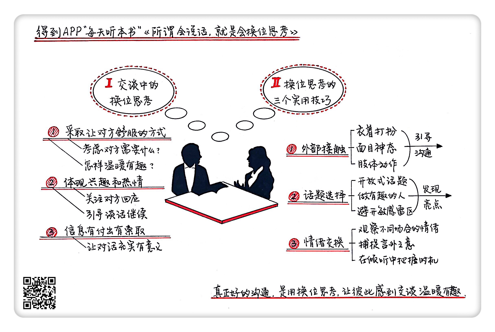

《所谓会说话，就是会换位思考》| 冰柠解读
=============================

购买链接：[亚马逊](https://www.amazon.cn/所谓会说话-就是会换位思考-学习做一个温暖有趣的人-卡洛琳·塔格特/dp/B06Y571XYM/ref=sr_1_1?ie=UTF8&qid=1508766274&sr=8-1&keywords=所谓会说话，就是会换位思考)

听者笔记
-----------------------------

> 只有学会换位思考，才能变成“会说话”的人。
>
> 通过外部接触（衣着打扮言行举止要得体）、话题选择（话题尽量选择开放式话题，避免冷场，要学会倾听，让别人多发表自己的观点，成为谈话的主角）、情绪交换（站在对方的处境考虑问题）等方法来实现换位思考。

关于作者
-----------------------------

卡罗琳·塔格特，英国著名的畅销书作家、资深媒体人。在她长达三十多年的编辑、出版生涯中，由于经常会去拜访英国各地的作家，参加各地的文学派对和文学节，因此积累了大量的社交实战经验。她用这些社交经验帮助那些不善于人际交往的作家，让他们成为了社交场合的明星，被人称为“作家的人生导师”。卡罗琳·塔格特把自己在社交过程中积累的实战经验进行提炼后，为我们奉上了这本《所谓会说话，就是会换位思考》。 

关于本书
-----------------------------

本书作者结合自己多年参与社交和指导社交的经验，提出了一个很独到的观点：真正好的沟通技巧是转变自己的思维角度，用换位思考来让对方感到温暖有趣。我们在与人交谈的过程中，要学会换位思考，仔细考虑对方需要什么，努力为对方着想、让对方感到舒服，才能让谈话成为一次高质量的人际沟通。如果你在日常生活中不知道如何与陌生人开始一场谈话，和别人谈话不知道该选什么样的话题，交流时别人对你的谈话没有兴趣，那么这本书会成为你的“社交宝典”。此书受到了英国多位著名作家、报纸主编等社交大咖的强力推荐。 

核心内容
-----------------------------

作者对如何通过换位思考来掌握谈话技巧，提出了自己独到的见解。其主要讲了两个方面的内容：一、什么是交谈中的换位思考。交谈中的换位思考就是在交谈中仔细考虑对方需要什么，努力为对方着想、采取让对方感到舒服的说话方式。二、换位思考的三个实用技巧。在交谈过程中，我们可以通过外部接触、话题选择和情绪交换三个技巧，做到换位思考。 
 

一、什么是交谈中的换位思考
-----------------------------

交谈中的换位思考就是在交谈中仔细考虑对方需要什么，努力为对方着想，让对方感到舒服、有趣。只有在谈话中做到换位思考，才能避开自说自话、尴尬冷场的陷阱，让别人都有机会表达自己，让交谈变得温暖有趣。而要做到这一点，你需要对别人感兴趣，关注别人对你的回应，根据回应来决定怎样继续进行谈话。还要注意信息的付出和索取，考虑对方的需求和期望，想想什么是你可以提供给别人的，以及你希望从对方那里获得哪些信息。

二、换位思考的三个实用技巧
-----------------------------

想要在交谈中做到换位思考，作者给我们介绍了外部接触、话题选择和情绪交换三个实用的技巧。

一个是外部接触。

外部接触是指借助衣着打扮、面目神态和肢体动作来进行换位思考。社交场合大家接触的时间比较短，得体的服装和形象会让别人感觉舒服，进而产生与你沟通的欲望。你要注意自己的衣着是否恰当、面目神态和肢体动作是否自然。建立在为别人考虑基础上的外部接触，是实现换位思考的第一步。

第二是话题选择。

在选择谈话的话题的时候，首先要注意选择能让对方往下说的话题，也就是开放式话题。要想启动一个开放式话题，你就不能简单地问别人是或者不是，而是要选择那些能让对方参与谈话并且发表看法的问题。

再者，想让交谈温暖有趣，你还要成为一个有趣的人，只有自己先成为一个有趣的人，才能让别人被你的谈话所吸引。你需要不断拓展你自己的知识面、主动去发现别人身上有趣和友善的一面，还要多准备一些有趣的问题。

在话题选择的时候要避开敏感的话题。你需要先了解一下对方的观点，站在一个信息量平等的位置进行对话，才能更好地避开令自己和别人尴尬的话题。

此外，还要注意不要在社交场合向专业人士咨询专业问题。一旦遇到让你和对方感到尴尬的话题，你可以通过含糊其辞，或者通过一些善意的谎言来避免让谈话陷入尴尬。

第三是情绪交换。

情绪交换指通过观察不同的场合下人们的情绪，来决定自己说什么、不说什么。要做到这一点，首先你要学会观察场合和人们情绪背后的真实想法，设身处地地为交谈对象进行考虑，并根据对方的需求来安排谈话内容。其次你还要学会倾听，要学会听出对方的言外之意，在倾听中寻找参与谈话的好时机。

金句
-----------------------------

1. 谈话不是困境，而是机遇，它是一种很有乐趣并且能够丰富生活的经历，所以没必要把交谈当成你的敌人。最快乐的谈话里没有竞争，也没有毫无价值的空话，而是一次平静、平和的情绪交换。
2. 优秀的谈话者是那些真正对别人感兴趣，并且以了解别人为乐的人。
3. “弱连接”是指你与和你有过一面之交的人、朋友的朋友之间的关系，这种关系往往能在机缘巧合下给你带来惊喜和好运。
4. 谈话的时候，即使是面对同一个人，在不同的场合下，他和你交谈的情绪和目的也是不一样的。所以要想真正做到换位思考，就要观察人们情绪背后的真实想法，设身处地地为交谈对象进行考虑，并根据对方的需求来安排谈话内容。
5. 成为一个好的倾听者是成为一个好的谈话者的前提。

撰稿：冰柠

脑图：摩西

讲述：于浩