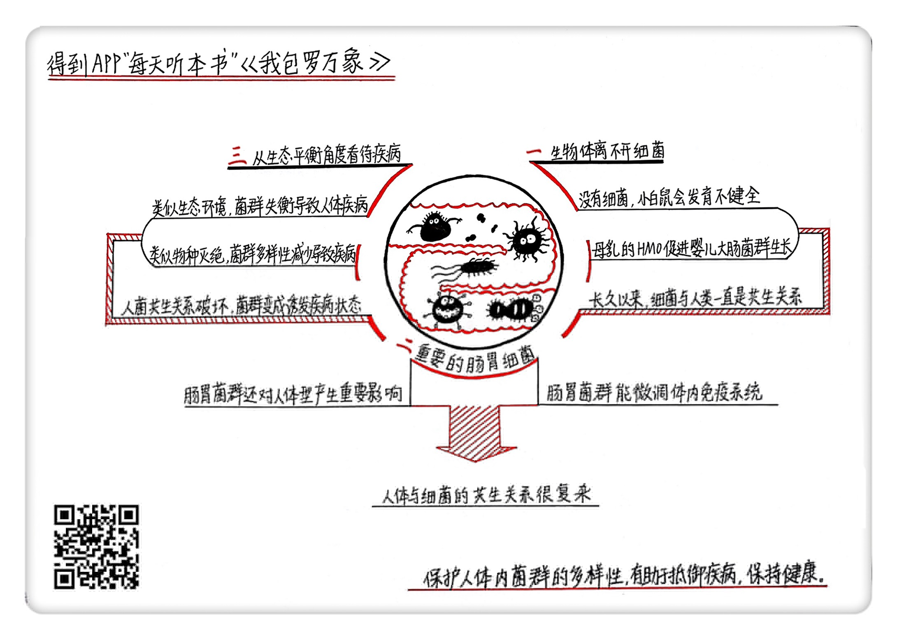

《我包罗万象》| 季火解读
==================================

购买链接：[亚马逊](https://www.amazon.cn/I-Contain-Multitudes-The-Microbes-Within-Us-and-a-Grander-View-of-Life-Yong-Ed/dp/0062368591/ref=sr_1_1?ie=UTF8&qid=1507814860&sr=8-1&keywords=我包罗万象)

听者笔记
----------------------------------

> 细菌并非都对人体有害，相反，大多数的细菌对人体有益。
>
> 人体内共生菌群数量越多，人可能就越来健康，抵抗疾病的能力就越强。很多营养人类并不能直接吸收，要靠细菌先消化后，才能被人体吸收。
>
> 关于胖和瘦，实验证明肥胖的人体内的菌群更偏向于适应多脂高热的食物，而瘦的人体内菌群偏向于适应粗纤维等食物，即便给肥胖的人增加瘦对应的菌群，但不改变饮食习惯，也无异于解决问题。
> 
> 让孩子亲近泥土等方式更有益于孩子健康。

关于作者
----------------------------------

勇埃德，新晋华裔科普作家，被称为是当代最优秀的科学记者。勇埃德供职于《大西洋月刊》，同时也是一个多产的科普作家，给《国家地理杂志》《纽约客》《纽约时报》《自然》和《科学美国人》等杂志撰稿。     

关于本书
----------------------------------

该书是勇埃德的第一本专著，不仅介绍了微观的世界，也带来了透过微生物看世界的新视角。    

核心内容
----------------------------------

本书的核心内容是：如何看待人与细菌的共生关系，以及用一个新视角来理解疾病。     
 

第一、为什么说生物体离不开细菌
----------------------------------

大多数人对细菌的印象是，细菌就是致病的微生物，它是肮脏污秽的代名词，会直接引发疾病。人们唯恐避之不及，小朋友更要远离细菌。其实不然。生物和细菌在千万年的进化过程中形成了共生的关系。导致疾病的细菌或者说病原体，只是细菌中很小的一部分，大多数存活在人体内的细菌都与人体和平相处，甚至形成了不可或缺的“共生”关系，也就是说，细菌从人的食物中获得养分，同时细菌的存在和细菌产出的化学物质对人体的成长也有很大的帮助。

无菌小白鼠的实验证明，没有细菌，小白鼠的肠胃发育都不是很完全，很难在外部环境中存活。对母乳的研究则发现了更为神奇的共生关系。母乳里的200多种叫做HMO的多糖，其实并不能让婴儿直接吸收，而是培育了婴儿肠胃里的特定菌群，而菌群产生的化学物质又可以促进肠胃的发育。

第二、为什么肠胃里的细菌很重要
----------------------------------

前边说的母乳喂养的例子已经告诉我们，细菌与人类共生的奇妙关系。细菌在哺乳动物体内聚集最多的地方就是肠胃。一个人肠胃里聚集的菌群，不仅在婴儿阶段可以帮助大肠的发育，开发智力，也可能影响到一个人的体型。

科学家通过实验发现，给无菌小白鼠的肠胃里添加一种常见细菌，可以让小白鼠的免疫系统迅速恢复正常工作。肠胃里这种常见的细菌和它表面的PSA分子，就是调节免疫系统的调节剂。人体也是一样。人肠胃内的细菌，对维护免疫系统的稳定状态很有作用。它们产生的化学物质，能微调体内的免疫系统，让免疫系统调节到最适宜的防卫状态。

肠胃里的菌群也可能对人体产生影响，比如说导致肥胖或者帮助减肥。不过，并不是在肠胃里换上了变瘦细菌，人就一定能减肥。人与细菌的共生关系要复杂得多，需要从整个共生的生态圈来看细菌带来的影响。

第三、从生态平衡的角度来看待疾病是如何发生的
----------------------------------

自然生态环境的破坏，可能让我们失去大堡礁。以同样的角度去理解人体内的生态环境，就能从另一个角度看待到底什么是疾病。在大多数情况下，疾病就是人体内的菌群失调，人与细菌的共生关系发生了破坏，菌群整体变成了诱发疾病的状态。肠胃炎就是一个很好的例子。导致肠胃炎的原因，并不是因为一个导致疾病的细菌，而是一系列内部外部因素共同作用的结果，有基因的原因，有感染病毒的因素，也因为人体内部免疫系统的失调，也有外部环境污染的原因，最终导致整个肠胃的菌群变成生病状态，引发炎症。

此外，人体内菌群多样化的减少，不仅可能引发菌群失调的风险，也让导致疾病的细菌容易侵入人体。相比西方社会干净的环境，乌干达人生活的环境要简陋得多。但科学家的研究发现，乌干达人的身体比西方人好得多。其中原因在于两者肠胃里细菌的区别，乌干达人的肠胃里菌群种类比西方人要多得多。从这一角度去看问题，可以让我们对诊疗疾病有新的认知，也对孩子的成长有了新的理解。从鼓励多样性的角度，让孩子多接触自然，多亲近泥土，同样可以帮助他和他体内的细菌更茁壮成长。     

金句
----------------------------------

1. 致病的细菌，或者说病原体，其实是极少数，绝大多数生活在人体内的细菌，都能与人体和平相处。
2. 人体内细菌的多样性正在迅速减少，和拯救濒危动物一样，我们也需要保护人体内菌群的多样化，这样有助于我们抵御疾病，保持健康。
3. 人和动物的免疫系统很像家里空调的温度调节器，要让人体感觉舒服，关键要温度适宜，不能太高，也不能太低。类似的，免疫系统调节的不是温度，而是人体内的菌群，免疫系统的作用就是保证人体内的几百万细菌正常生活，同时对一小撮有风险的外来细菌做好防护。
4. 站在微生物的视角来看，宏观与微观竟然那么相似，微生物的世界和宇宙苍穹一样，藏有亿万的个体；用宏观来分析解读微观，用生态平衡的视角解读人的健康与疾病，也给了我们看待疾病、治疗疾病一个全新的角度。

撰稿：季火

脑图：摩西

转述：顾一菲  