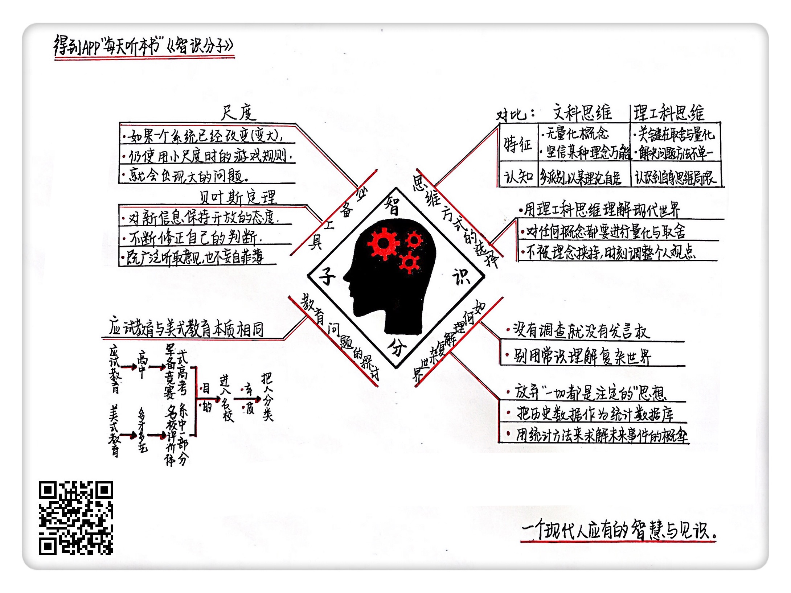

《智识分子》| 王海解读
====================================

购买链接：[亚马逊](https://www.amazon.cn/智识分子-做个复杂的现代人-万维钢/dp/B019DA3PS6/ref=sr_1_1?ie=UTF8&qid=1507945324&sr=8-1&keywords=智识分子)

听者笔记
------------------------------------

> 理科生和文科生的区别就是使用量化的思维来看问题，一切都是基于可度量的数据。而这些数据不应该是感觉而应该是依靠证据或者逻辑推理得出来的结论。
>
> 各国教育其实就是在培养这些理性思维的方法，从而筛选出这样的人才。
>
> “智识分子”必备的思维工具：
> 
> 尺度：不同大小的问题通常要用不同的思维去解决，通常不是一成不变的，需要不断地修正。
> 
> 贝叶斯思维：根据已知的变量，来不断修改对一个问题的看法，知道的越多，看问题就越全面，而不能以偏概全。

关于作者
------------------------------------

万维钢，前物理学家，现科学作家，“得到”App订阅专栏《精英日课》的主理人。

关于本书
------------------------------------

本书讲的是一个现代人应该有的智慧和见识，会详细解释理工科思维看待世界的方式，调查往往比常识更可靠。会谈到教育问题，了解高中的本质和所谓的“美式素质教育”的真相。除了思维方法，还会介绍智识分子必备的思维工具。     

核心内容
------------------------------------

一、理工科思维和文科思维有什么不同？二、为什么说别用常识理解复杂世界？三、很多人追捧的“美式素质教育”，真相到底是什么？四、智识分子必备的两个思维工具，尺度和贝叶斯定律。     
 

一、理工科思维和文科思维有什么不同
------------------------------------

文科思维，主要特征是没有量化的概念，经常坚信某种理念能解决一切问题。理工科思维的关键就在于取舍和量化。也就是说，不管面对什么问题，用理工科思维看来，都没有一个绝对的、完美的解决方案。任何方案，我们都要对它进行取舍，量化，还要用科学的方法检验。

解决问题的关键，往往并不在于你有没有一个高大上的理念，而在于“度”，复杂世界中几乎所有东西都有利有弊。想要学会寻找合适的“度”，你至少需要掌握两个不同的理念。但是很多人，往往只知道宣传自己的理念，最后被理念给劫持了。用查理·芒格的话来说，就是：如果你手里拿着锤子，看什么都像钉子。

二、别用常识理解复杂世界，调查往往比常识更为可信
------------------------------------

【案例】

研究表明，像社会科学这样的软科学，所谓专家们的看法不见得就比普通人更正确。美国的心理学家泰特洛克曾经做过一个研究，调查了284个专门预测政治经济趋势的专家，研究项目就是让这些人预测各种问题。这个研究做了二十年，结果是，这些所谓的专家预测的准确性还比不上直接抛硬币。

【案例】

格拉德威尔在《引爆点》这本书里提出一个观点，说一个消息想要在人群中流行开来，就需要某些特别有影响力的关键人物推波助澜。根据这个“关键人物”的理论，扩大知名度的最好办法，就是找名人做广告。这个说法符合人们的常识。但问题是，这个理论并没有获得大规模统计实验的支持。

研究人员在 Twitter 上找了一批“关键人物”，这些人有很多粉丝，而且在最近的一个月内，成功引发了某个消息的大量传播。但这些关键人物在第二个月，不一定还能引起这么大的传播。也就是说，名人虽然比一般人更容易导致一条消息被广泛传播，但这个能力的实际效果起伏极大，一点都不可靠。

【案例】

一个东西突然流行开来，我们的常识思维总是以为，这个东西一定有特别出类拔萃的地方，或者是一定有幕后推手。但 Twitter 的研究表明，所谓的幕后推手其实没那么厉害。那为什么有些书能畅销，有些音乐能上榜呢？另外一项研究表明，成功很可能是因为“运气”。

实验人员设计了一个歌曲排行榜的实验。研究结果是，具体哪首歌能登上排行榜第一名，是非常偶然的事件。有些歌可能纯粹因为运气好，在实验的早期就获得了更多的下载次数，后来的受试者们就会受到影响，也认为这首歌好听，会给予它更多的关注，形成正反馈。最初的运气，很大程度上决定了最后谁能脱颖而出。

三、所谓“美式素质教育”的真相，到底是什么
------------------------------------

很多人都认为，应试教育会扼杀孩子们的创造力，培养不出现代社会真正需要的人才，如果我们的教育像美国的素质教育一样就好了。实际上，这个问题没那么简单。

很多人都误会了高中的本质，一般人们认为，高中是用来传道授业解惑的地方。但这个答案是错的。高中学的大部分知识，一般人在工作生活中根本用不着。高中最根本的目的，并不是传授知识和培养人，而是把人分类。高考题之所以那么难，并不是因为这些题目有什么实际意义，只是因为它们够难，只有这样，才能把人和人区分开。

名校是一种稀缺资源，只要想进名校的学生比招生名额多，高考就一定是激烈的竞争。那如果全国高中都用极端的手段玩高考这个游戏，大搞军备竞赛，会不会让全国高中生都只是为了考试而学习，从而影响了中国学生的创新能力呢？答案是：不会。

韩国的高考竞争比中国更激烈。可韩国不管是科学还是技术方面的创新，都没有被高考的军备竞争所影响，它是亚洲科技创新最强的国家之一，甚至在电影、音乐这些文化领域也很强。所以说，军备竞赛式的高考，并不会影响一个国家的创新能力。

我们再来看看美国教育。通常人们看到的美式教育，其实只是皮毛。就比如说，人们普遍认为美国学生多才多艺，从小就参加很多社会活动，德智体美全面发展。但深入了解一下，你就会发现他们之所以多才多艺，并不是自己愿意做那么多事，而是因为这些活动是美国学生评价体系里的重要组成部分，像考试分数一样重要。所以从本质上来看，中美教育并没有那么大的差别。

四、“智识分子”必备的思维工具
------------------------------------

1. 尺度

你有一家创业公司，全公司上下一共几十个人，基本上不需要怎么管理，绝大部分人都在干具体的事情。可如果你公司的规模扩大了一百倍，成为了大公司，你要是还按创业初期的人员结构，等比放大，那肯定是行不通的。尺度是一个重要的思维方式。这个规律不仅仅是个认知问题，而且有非常紧迫的现实意义。如果一个系统已经变得很大了，可是它还在使用过去小尺度的游戏规则，那就会出大问题。

【案例】

为什么现在美国的政客不干实事，整天忙竞选，像个娱乐明星一样搞煽情演讲，靠演技争取民意支持？这个现象背后，其实也是个尺度问题。美国的政治制度是200多年以前设计的。第一届国会众议院中，总共只有65位议员，是按人口比例从全国各个州中选拔而来，而当时美国的总人口只有400万。65个议员代表400万人口，平均每个议员只需要代表6万人。而现在每个议员要代表超过70万人。面对6万人，那都是父老乡亲。面对70万人，那可能都是粉丝。议员们倾听民众的呼声以及和民众交流的方法变得和过去完全不同了。美国人现在有必要反思，200多年制定的这套体制，是否还适合今日的美国。

2. 贝叶斯定理
------------------------------------

贝叶斯定理是统计学上的一个概念，它是用来计算主观概率的。咱们就不说贝叶斯定理的计算公式了，它的核心思想就是在做决策的时候，要时刻调整自己对事情的看法，千万不要非黑即白。

比如我们经常会遇到这样的问题，你相信上帝吗？你信中医吗？你相信转基因食品是安全的吗？面对这些问题，如果我们把“相信”仅仅当成一个表态，那它的意义就相当有限，“相信不相信”的真正意义，在于给我们自己的决策提供依据。一个智识分子，应该拥有复杂的信念体系，时刻调整自己对各种事物的看法，要不断地变动自己的世界观。观点随事实改变。     

金句
------------------------------------

1. 解决问题的关键，往往并不在于你有没有一个高大上的理念，而在于“度”。复杂世界中几乎所有东西都有利有弊，用与不用，不仅仅要看这个东西好不好，还要看你能承受多大代价。
2. 我们总是习惯于把事情的成败归结为人的因素，归结为某个领袖人物，甚至归结为阴谋论，好像什么都是注定的一样。但事实却是，很多事情只不过是偶然而已。
3. 我们经常会遇到这样的问题，你相信上帝吗？你信中医吗？面对这些问题，如果我们把“相信”仅仅当成一个表态，那它的意义就相当有限，“相信不相信”的真正意义，在于给我们自己的决策提供依据。
4. 一个智识分子，应该拥有这种复杂的信念体系，时刻调整自己对各种事物的看法，要不断地变动自己的世界观。观点随事实改变，这就是我们从贝叶斯定理里学到的东西。

撰稿：王海

脑图：摩西

转述：孙潇