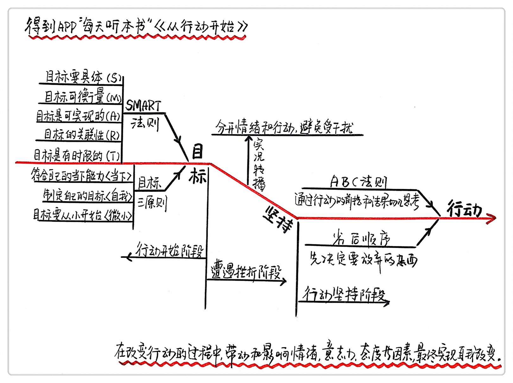

《从行动开始》| 成甲解读
==========================

购买链接：[亚马逊](https://www.amazon.cn/图书/dp/B01HXNSAD0/ref=sr_1_1?ie=UTF8&qid=1506348284&sr=8-1&keywords=从行动开始)

本书和作者
--------------------------

本书从分析日常生活中的“认知偏差”入手，系统科学地详细介绍了在日本和美国广受推崇的“行为科学管理方法”，引导你走出行动误区，掌握行动的最基本法则，科学系统地进行自我管理，轻松提升行动力。

作者石田淳，被誉为日本研究行为科学管理第—人。日本行为科学管理研究所的所长，也是美国行为分析学会和日本行为分析学会的会员。他将科学分析人类行为的“行为分析学”和“行为心理学”方法改进为“行为科学管理”，这个方法被包括美国太空总署和波音公司在内的600多家公司采用。

本书核心内容
--------------------------

行为科学管理术：源自“行为分析学”和“行为心理学”，简单来说就是排除一切抽象的概念和无法预测的因素，只以“行动”作为一切判断的标准。在行动管理术的理论中，一切结果都是行动的积累。好的结果是好的行动不断重复来的，而不断重复坏的行动只能带来坏的结果。

掌握行动科学管理术，需要掌握三个原则，一个工具，两个技巧：

第一、行动开始时，提供三个原则帮助顺利启动;

第二、遇到挫折时，使用一个工具避免放弃行动；

第三、行动坚持中，应用两个技巧让行动更有效；
 

第一、行动开始阶段，提供三个原则帮助顺利启动
--------------------------

在行动开始阶段，重要的是正确的设定目标。

1、有SMART法则还不够

要让目标更有效，就要用科学的方法制定目标。

大多数人都知道的制定目标的SMART法则，但是实际执行仍然会容易坚持不下去。

[知识点“SMART法则”：S就是specific，意思是目标一定要具体；M就是measurable，指目标要可衡量；A是attainable，说的是目标是可实现的；R是relevant，目标要和其他目标有关联性；T是time bounding：代表时限，也就是目标制定有截止日期。]

2、目标制定的三个原则

一个让行动启动更容易的目标，除了要符合SMART法则外，还要符合“当下、自我和微小”这三个原则。

当下原则：指目标应当符合自己当下能力。

具体的目标要和当下的能力结合，否则即便制定了一个大目标也启动不了。

自我原则：指制定自己的目标。

大多数人容易把别人的目标当做自己的目标在追求。只有去为自己内心真正想要的目标努力，才能让改变真正发生。

微小原则：指把目标拆解为简单易行的步骤。

把一个大目标拆解成微小的步骤，容易操作，成功率就会大幅提升。

第二、遇到挫折阶段，使用一个工具避免放弃行动；
--------------------------

行动开始了，不代表你就能坚持下去，你会经历挫折阶段。

1、放弃行动的两方面原因

一方面是困难本身，但更重要的是另一方面，在遭遇挫折之后延伸出来的负面情绪和错误假设，会让我们很容易丧失信心，自暴自弃。

想要坚持下去，就必须处理好遇到挫折和困难时的负面情绪。

2、有效工具“实况转播”

实况转播：指把刚才发生的行为像电视转播一样，只确认能够看见的现象事实，不做解读和描述。

实况转播这个工具，能把情绪和行动区分开来，让你不被那些假设的负面情绪所阻碍，避免放弃行动。

第三、行动坚持阶段，应用两个技巧让行动更有效；
--------------------------

在解决了负面情绪问题之后，还得运用科学的方法和技巧让自己继续坚持下去。

1、ABC法则

ABC法则：是指人是否坚持一个行为是受到A、B、C三方面的因素影响。A是这件事发生的前提，B是发生的行为，C是最后这个行为的结果。B是受到A和C的影响，也就是行为受到前提和结果影响。

通过改变前提A，来改变行为B

比如要成功减肥，就把减肥不成功的前提条件进行隔离。

类似习惯培养的一个理论“物理隔绝”，就是隔绝各种外部的诱惑，从而改变行为。

通过改变结果C，来改变行为B

比如写公众号坚持不下去的结果带来的感受，是没人看的失落感，那么可以自己创造成就感。

2、劣后顺序

不管做任何事我们都习惯从优先顺序开始，但要想更有效率地行动应该选择劣后顺序。

优先顺序：是指按待办事情的紧急程度排序。

劣后顺序：是指先决定要放弃的事情。

劣后顺序的优势：减少因做不完任务带来的精神压力，并能让你将精力和注意力集中在必须完成的重要任务中，从而提高效率。

案例：乔布斯如何运用劣后顺序从100件要做的事中筛选出1件最需要做的事。

本书金句
--------------------------

1. 能够导出结果的只有“行动”。
2. 认为失败是由“意志薄弱”造成，这种想法本身就是阻碍你改变人生的最大敌人。
3. 如果能够长期采取有效的行动，甚至可以控制自己的意志。
4. 人的心灵和身体是息息相关的，通过身体的行动可以大幅度减轻心理上的不安。
5. 行动开始的关键在于“降低行动的难度”。
6. 为了实现目标成为理想中的自己，你需要的不是坚强的意志，而是从小做起的行动。
7. 不管做任何事我们都习惯从优先顺序开始，但要想更有效率地行动应该选择劣后顺序。与其决定“应该拿什么”，不如先决定“应该扔什么”。
8. 不要被他人的价值观束缚，不要让自己的人生变得复杂。

撰稿／讲述：成甲

脑图：摩西