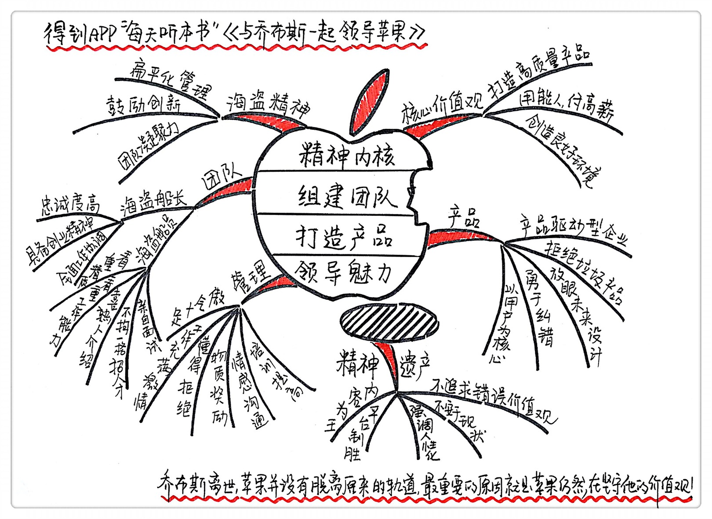

《与乔布斯一起领导苹果》| 张宾解读
=================================

购买链接：[亚马逊](https://www.amazon.cn/图书/dp/B01LYKYZ60/ref=sr_1_1?ie=UTF8&qid=1506349144&sr=8-1&keywords=与乔布斯一起领导苹果)

关于作者
---------------------------------

1980年，44岁的杰伊·艾略特被25岁的乔布斯亲自从英特尔挖到苹果，后来在苹果公司先后担任过人力资源副总裁和高级副总裁，在他执掌期间，苹果的业绩从1.5亿美元跃升至30亿美元。艾略特也被乔布斯视为左膀右臂，是乔布斯“唯一相信的超过四十岁的商业伙伴及导师”，堪称真正的曾经“与乔布斯一起领导苹果”的人。

关于本书
---------------------------------

本书是苹果与乔布斯传奇的亲历者艾略特，通过近距离观察，对乔布斯一生的卓越贡献和经营理念、管理经验的全面深刻的记录与总结。不同于一般传记作家和随身记者为乔布斯撰写的传记，作为与乔布斯相处多年的商业伙伴，艾略特全面、完整地记录了乔布斯真实、鲜活的创业之路，更为读者详尽展示了苹果公司创造世界奇迹的崛起之路。
 

艾略特从五个方面入手，解析他眼中的乔布斯与苹果公司：

一、精神内核
---------------------------------

乔布斯提出“海盗精神”，并以此为基础，培养苹果公司独特的企业文化。所谓海盗精神，就是鼓励叛逆、创新、敢于冒险、崇尚自由、追求与众不同。有了“海盗精神”这个概念，乔布斯成功提升了团队的创造力、战斗力，避免苹果成为他讨厌的那一类“海军式”千篇一律的平庸公司。

在此基础上，乔布斯制定了苹果的价值观，可以概括为以下九条：

1. 对用户进行换位思考；
2. 进取精神；
3. 对社会做出积极的贡献；
4. 创新和远见；
5. 个人表现；
6. 团队精神；
7. 质量；
8. 个人回报；
9. 杰出管理。

可以说苹果的独特企业文化，就是这么铸造起来的。

二、组建团队
---------------------------------

乔布斯的用人理念：

1. 确定职位要求，但不拘泥于此，不拘一格用人才。
2. 让团队在招募环节发挥作用，让自己的员工推荐认为合适的朋友或者熟人来应聘职位，举贤不避亲。
3. 在寻觅人才方面不要墨守成规。利用任何可能的渠道挖掘适合的人才。

三、打造产品
---------------------------------

核心原则：注重用户体验，“一切以用户为核心，打造满足用户需求的产品。

具体操作：不追求廉价、拒绝垃圾产品、及时放弃落伍的技术和产品、不迷信市场调研、引导而不是追随用户、及时纠错。

四、领导魅力
---------------------------------

乔布斯的领导力是由哪些因素构成的？

1. 傲气。这种傲气源于他的产品，并非他本人。出色的产品让他有了更多底气。
2. 激情。激情源于对工作发自内心的热爱、极强的创业精神、敢于承担风险及快速行动的能力。
3. 懂得拒绝的力量。拒绝让他可以持续提高标准。
4. 推崇创新。努力为团队营造出一个支持鼓励积极创新的氛围，甚至苛求创新。
5. 让员工拥有更好的回报，包括物质激励、仪式感营造的团队氛围、懂得向员工表示感谢、想方设法给员工更好的工作环境，以此来提高员工的创造力。

五、精神遗产
---------------------------------

1. 不追求错误价值观；
2. 内容为王，平台制胜，永远不要害怕违反常规；
3. 不可太过安于现状；
4. 强调人性化。

总结：
---------------------------------

“与乔布斯一起领导苹果”的人，杰伊•艾略特总结了乔布斯领导哲学的精髓，如果你是一个有着远大理想的领导者，不妨也通过这几方面，偷师乔布斯，提高自己的领导力，也体验一把“与乔布斯一起领导苹果”的感觉。

金句：
---------------------------------

1. 领导力并非直觉使然，也并非与生俱来，而是如果你愿意保持开放的心态，就可以从生活中总结凝练出来。
2. 乔布斯在他年纪尚轻的时候，就意识到任何精准的商业眼光都要关注用户体验，而并非一味把成本降到最低，或是用炫目的科技，抑或是某种个别竞争优势打动人心。
3. 当你能赋予团队一个与众不同的特殊身份，奇迹就会发生。
4. 仅仅是员工接受企业价值观和文化还远远不够，这还需要在企业的顾客身上得到体验。
5. 若要想在瞬息万变的世界中获得真正的成功，每天都需要将昔日的条条框框尽数打破，我们要学会勇敢面对，拒绝平庸，要推陈出新。
6. 当你身处创业公司时，最先加盟的10个员工是决定企业成败的关键。
7. 并非是要从芯片或设计开始考虑问题，应该从“用户体验会是怎样”来考虑问题。
8. 有想法的产品具备哪些明显特征呢？这些问题不难回答：具备深思熟虑且设计周密的用户界面即可。
9. 史蒂夫·乔布斯的热情源于他极强的创业精神，敢于承担风险及快速行动的能力，并毫不动摇坚信自己的所作所为。当你能做到这点时，众人也会自然地聚集在你的旗下。
10. 通过价格获取的成功肯定无法长久，通过真正付出努力夺得的胜利才会经久不衰。

撰稿：张宾

脑图：摩西

转述：杰克糖