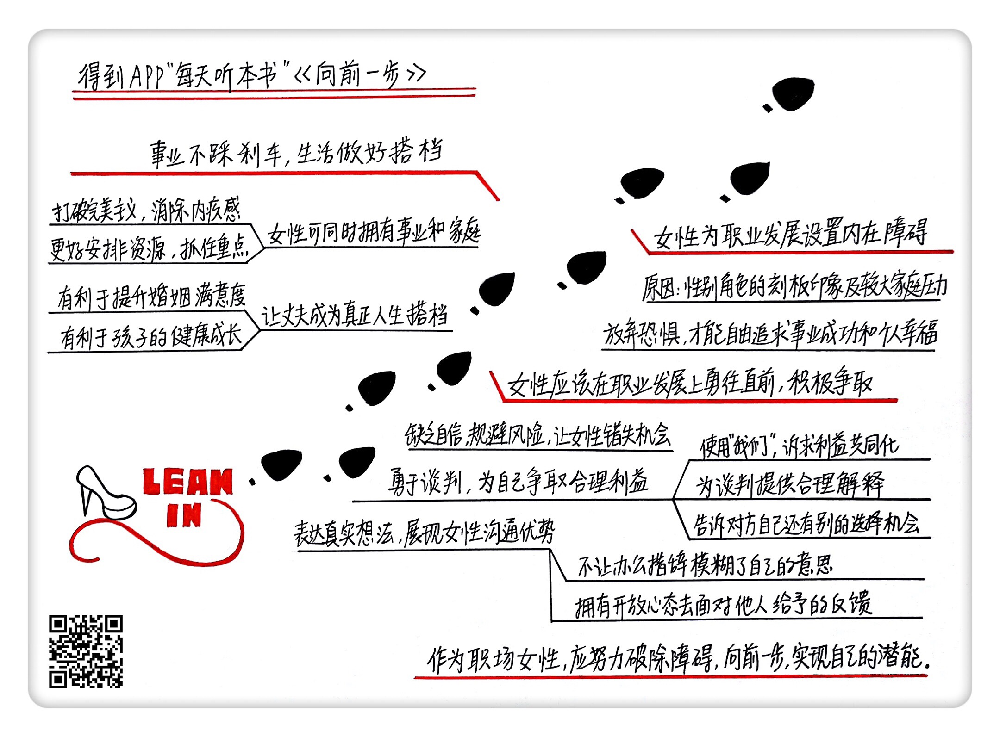

《向前一步》| 苏菲解读
==================================

购买链接：[亚马逊](https://www.amazon.cn/向前一步-谢丽尔·桑德伯格/dp/B00NFCPRRG/ref=sr_1_1?ie=UTF8&qid=1508396992&sr=8-1&keywords=向前一步)

听者笔记
----------------------------------

> 女性在职场中的地位，通常是由自身心态决定的，而女性的这种心态也让社会对女性有了一些类似的固有思维。女性应该像男性一样在职场中保持自信、争取机会。在生活中也应该让男性更多地分担家庭，而不是让男性觉得自己在家庭里没有存在感，反而使女性更难以脱离家庭的束缚。

关于作者
----------------------------------

谢丽尔·桑德伯格，全球最有影响力的女性之一。桑德伯格拥有令人羡慕的履历，毕业于哈佛大学，曾任克林顿政府财政部长办公厅主任，之后出任全球最大的搜索引擎Google在线销售和运营部门副总裁，现在担任全球最大的社交网络Facebook首席运营官。在福布斯评选的最有影响力的五十位女性中，桑德伯格排名第五。 

关于本书
----------------------------------

在本书里，桑德伯格为我们分享了自己在职场多年的观察和感受。她分析了女性事业发展的障碍，给出了女性在职业发展上应该采取的态度和做法的建议，并谈到了女性很关注的家庭工作如何平衡的问题。桑德伯格鼓励女性追求更高远的梦想，破除障碍，向前一步，实现自己的潜能。 

核心内容
----------------------------------

本书思想核心是：在职场中，女性领导者非常缺乏，职位越高，男女比例越悬殊。其中一个重要原因就是，女性给自己制造了内在障碍。女性在事业发展中，应该更加勇敢、自信、积极主动。女性需要学会抓住机会甚至是创造机会。对于同时追求事业和家庭的职场女性，需要让伴侣成为自己真正的生活搭档。 
 

一、女性职业发展的障碍往往来自于自身。
----------------------------------

高等教育人才中有很多女性，但职场中到达领导职位的，却是大量男性。这么一个社会矛盾现象产生的重要原因就是女性缺乏想当领导的进取心。在各个行业里追求高级职位的人，基本都是男性多于女性。

女性为自己设置了这样的限制，一方面是社会对性别角色的刻板印象，当一个女孩尝试领导者角色时，她经常就会被贴上“爱使唤人”的标签，积极进取和作风强硬违反了社会对女性的刻板印象，被认定为不被接受和喜欢。另一方面，女性被社会施加了很大的家庭压力，一个婚姻失败的女性，即便事业上再成功，也难影响人们对她的看法。人们很少问男性如何平衡事业和家庭的问题，而对于女性，这是无法回避的问题。

女性害怕不被人喜欢，害怕失败，害怕飞得越高摔得越惨，害怕成为失败的母亲、妻子和女儿。只有放下了这样的恐惧，女性才可能去自由地追求事业成功和个人幸福。

二、女性应该在职业发展上勇往直前，自信主动，积极争取。
----------------------------------

女性的一个倾向就是低估自己。比如说，当让一个男性解释自己为什么取得成功时，他通常会归因于自己的能力；而问女性同样的问题，她通常会归因为外部因素。而如果把问题换成解释失败，男性通常会认为这是外部因素，女性却会认为是自身能力不足。

在应聘一个新工作时，女性总是过于担心自己不具备该工作所需要的能力。惠普公司内部的一项报告显示，女性只有在认为自己100%符合条件时，才会公开申请职位；而男性只要觉得自己有60%的条件符合，就会申请。这样缺乏信心和规避风险的做法，会导致女性错失机会。女性需要学会抓住机会甚至是创造机会，主动为自己争取利益。

除了勇敢谈判，积极主动为自己争取利益之外，为了更主动地抓住机会，女性还需要在事业上更加敢于冒险。当桑德伯格加入Facebook时，Facebook还比较小，不够成熟，但是正在快速发展。她原先Google团队中想要跟她一起离开的女性很少，而男性下属却更加敢于冒险，对新的机会充满了兴趣。当Google团队中的许多女性在若干年后最终表现出对加入Facebook的兴趣时，Facebook那时已经是一家成熟的公司了，这样追求稳定规避风险的代价导致错失高速成长的机会。

桑德伯格认为，选择机会首先考虑的是一个公司成长的潜力，而不是工作职位的头衔。Google前CEO施密特对桑德伯格说，选择一份工作时只有一个标准是重要的，就是它是否能让你快速成长。当公司快速发展时，要做的事情就会多到人手不够；而当公司发展缓慢时，就会人浮于事。如果有人邀请你上一艘火箭，不要问上去之后能去哪儿，只要坐上去就可以了。这段话对桑德伯格影响很深，于是她加入了当时规模很小的Google，上了这艘火箭。几年之后，她又加入了当时规模很小的Facebook，上了另一艘火箭。

三、在事业上，女性不要踩刹车；在生活中，女性要让自己的丈夫成为真正的生活搭档。
----------------------------------

女性在很小的时候，就明白今后要在发展事业和照顾家庭之间做出选择，这种想法会让她们在职场里踩刹车，主动让自己发展放缓，拒绝新的机会。

桑德伯格认为，女性可以自由地抉择选择事业，还是选择家庭，但完全没有必要在还没到必须选择的时候，就踩刹车，让自己为了所谓的将来的计划做出牺牲。实际上，一个人对自己的职位越满意，成就感越高，越不可能轻易地辞职。而女性似乎落入了一个恶性循环，为了将来照顾家庭，不敢选择有挑战性的工作，等到了必须选择时，又会因为没有吸引力的工作而轻易离开职场。

对于职业女性如何兼顾工作和家庭，桑德伯格认为女性需要帮助丈夫成为自己真正的生活搭档。在事业成功的女性中，绝大多数都拥有全力支持她们事业的伴侣。没有配偶的支持，女性难以在事业上全力以赴。尽管女性已经走向职场很多年了，但社会传统还是期待女性从事更多的家务，花更多的时间照顾孩子。

当女性和男性都突破固有的性别分工角色，婚姻会更加平等，也会提升满意度。一方面，丈夫多做家务，妻子就不会那么郁闷，两人的冲突随之减少；另一方面，当女性在外工作，分担家庭的经济压力时，夫妻关系也会更加稳固。据说，当妻子贡献一半的家庭收入，丈夫分担一半的家务劳动时，离婚的风险率也会降低一半。通过承担不同的职责，夫妻双方也都有机会发展自己的全面能力。

让丈夫成为真正的生活搭档，首先就要把丈夫看成是和自己平等的伙伴。很多女性控制欲过强或者太挑剔，常常指责丈夫做得不好，打击了他们分担家务的积极性。女性除了要抑制住自己的控制欲，还要让对方和自己一起分担责任。

金句
----------------------------------

1. 如果克服了恐惧，你会做什么？
2. 选择一份工作时只有一个标准是重要的，就是它是否能让你快速成长。
3. 女性当然可以自由地抉择选择事业，还是选择家庭，但完全没有必要在还没到必须选择的时候，就踩刹车，让自己为了所谓的将来的计划做出牺牲。
4. 作为女人，很重要的一个人生决策就是，人生伴侣是否理解支持她。
5. 当女性，乃至所有人都不再受到限制，自由地根据自己的意愿选择自己的人生时，就实现了真正的平等。

撰稿：苏菲

脑图：摩西

转述：于浩