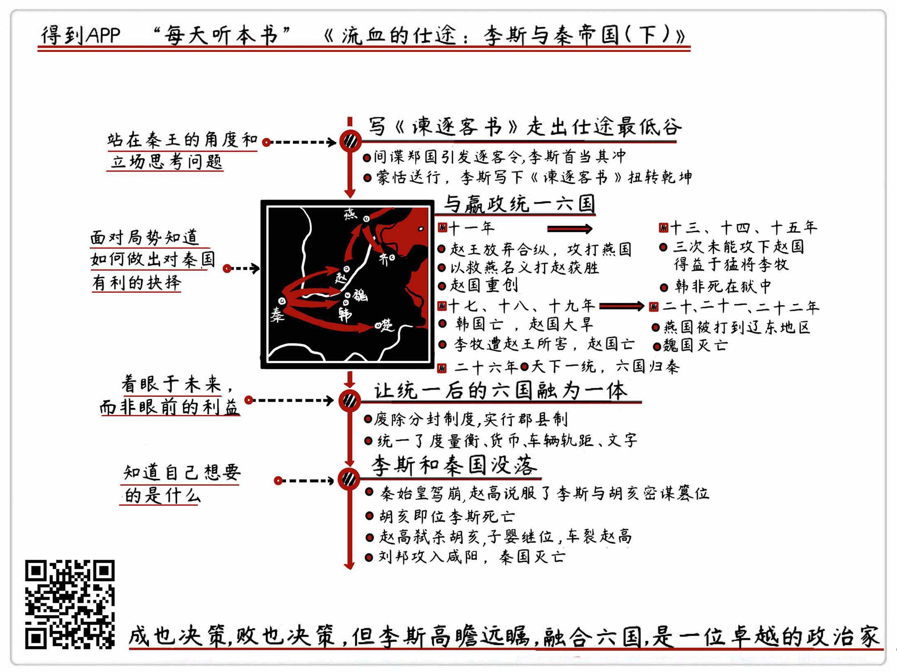

《流血的仕途：李斯与秦帝国（下）》| 梁淼解读
=======================================

购买链接：[亚马逊](https://www.amazon.cn/图书/dp/B01M9JVQFC/ref=sr_1_1?s=books&ie=UTF8&qid=1507725522&sr=1-1&keywords=流血的仕途)

听者笔记
-----------------------------

> 李斯通过一篇《谏逐客书》扭转乾坤，与嬴政一起完成六国统一的大业，通过制度建设巩固六国统一，后随着秦始皇驾崩，李斯的势力也逐步被赵高瓦解。

关于作者
-----------------------------

曹昇，历史作家，人称“曹三公子”。15岁进入浙江大学，19岁毕业。研究历史十余年，对历史的认知有自己独特的视角，成名于天涯论坛。

关于本书
-----------------------------

本书最初连载于天涯论坛煮酒论史板块，在连载期间，人气始终稳居第一，而后才出版成册。作者通过描述李斯跌宕起伏的仕途，来思考整个秦帝国的发展、强大与没落。这本书被公认为是对李斯描写最为全面生动的一部历史作品，虽然它并不是一部正史，却在正史的基础上结合一些适当的推理，完整呈现了李斯这个人物，书中对人性的洞察、对历史的看法，也值得我们细细品味。地产大亨潘石屹评价这本书时，说它不但是在讲历史、讲古人的智慧，更是在讲人性。

核心内容
-----------------------------

本期将为你解读李斯后半生的仕途之旅，以及他参与的那些对秦国历史走向甚至之后两千多年历史都有着深远影响的大事件。
 

一、面临仕途低谷，李斯通过一篇《谏逐客书》扭转乾坤
-----------------------------

时值嬴政十年，李斯三十七岁，官居客卿。随着吕不韦被驱逐出境，韩国水利工程师郑国修关中水渠被揭发真正身份是韩国间谍，真正目的是借庞大水利工程削弱秦国的国力民力财力，秦王觉得“非我族类，其心必异”，于是下逐客令，不论是谁，一律都驱逐出境。

李斯首当其冲成为这道政令的牺牲品。他随后上书秦王，也就是史上著名的《谏逐客令》，站在嬴政的立场上思考问题，提出了自己的主张：宗室之所以排挤外客，不外乎三点。第一，贵贱之别。在宗室眼里，自己是贵族，而外客多为普通的民众。第二，公私之别。宗室觉得江山是自己家的，是私有的，但是外客觉得江山是天下人的，是公有的。第三，宾主之别。宗室以主人自居，认为外客可以挥之即来招之即去。李斯提出，宗室可以这样想，但是秦王却不能，因为他是打算一统天下的王，不应该内外有别。

李斯打动了秦王，众多外客因此可以留在秦国为秦继续效力，而李斯也晋升为廷尉。与此同时，李斯支持郑国继续修建水利，筑就了后来著名的郑国渠，为秦国征战六国奠定了物质基础。可以说，李斯通过这两件事帮助秦王嬴政完成了强秦的人才储备和物质储备。其中最值得我们学习的，就是李斯在面对低谷处境时，可以站在对方的立场思考问题、解决问题。

二、李斯与嬴政一起完成一统六国的霸业
-----------------------------

秦国最担心的是什么呢？就是六国联合起来抗秦。所以，秦国一方面要用武力来对抗六国，另一方面又需要合纵之士游走六国，想办法破坏六国结盟。而李斯负责的主要就是后者。

嬴政十一年，赵王放弃合纵，也就是放弃和其他国家结盟，开始攻打燕国，六国联盟开始破裂。嬴政十三年，李斯和姚贾联手陷害韩非，将他毒死在狱中，自此韩国主动称臣，于十九年亡。嬴政十九年，王翦攻破邯郸，赵国灭亡。嬴政二十二年，秦国同时进攻楚国和魏国，魏国亡。嬴政二十三年，秦国六十万大军发兵攻楚，楚国大败。嬴政二十五年，燕国亡，代国亡，齐王开门投降，就此灭亡。嬴政二十六年，也就是公元前221年，天下一统，六国归秦。

李斯作为软实力，帮助秦王嬴政统一六国功不可没。可以看到，李斯在面对六国局势时，可以敏锐地做出抉择，找到敌人的软肋，而这也正是值得我们学习的地方。

三、让六国融为一体，不分你我
-----------------------------

天下已经统一，六国尽在秦国的掌控之中，如何让六国实现政治上的统一，李斯做了这几件事：

1. 废除分封制度

李斯提出了一种新的制度——郡县制，把天下分为三十六个郡，每一个郡都模仿政府的政治制度，由郡守、郡尉、郡监构成。之前的分封制度让大家相互疏远，甚至经常发生战争，不利于天下稳定，而李斯力排众议，将郡县制提出来并且推广到全国，可以说是政治上的一大革新。郡县制被后来很多王朝继续使用，经过两千多年的演变，成为现在的省市县制度。
2. 统一度量衡

保证了全国上下有统一的计量标准，并且由政府分发给地方标准的度量器械。这极大地促进了天下的经济发展。
3. 统一货币

废除了六国之前通行的货币，在全国内实行统一的货币，主要是黄金和铜币。同时规定只有国家有权力铸造货币。
4. 统一文字

此举也可以理解为统一文化。文字统一之后，李斯把官方规定的文字书公布于世，用来教授学童和民众查看学习。现在很多人认为，中国几千年都没有分裂成一个个的小国家，秦国统一文字是一个非常重要的因素。
5. 焚书坑儒

这一点备受史学界争议。值得注意的是，虽然下了焚书令，但这些书籍在中央都有完好的备份。作者认为，所谓坑儒令，极有可能只是对一些坑蒙拐骗术士的一次清洗，与儒家和儒生或许根本没有什么关系。

四、始皇驾崩之后，李斯与秦帝国的没落
-----------------------------

人人都知道，生老病死是人间的规律，但是，嬴政一生足以成为历史上的传奇，因此他在晚年一直认为自己不仅仅会是历史上的传奇，也会是人间的传奇，拥有不老的生命。

嬴政三十七年，秦始皇从咸阳出发，开始了他人生中的第五次巡游，也是最后一次巡游。在沙丘，秦始皇驾崩，传位于公子扶苏，也就是未来的二世皇帝。赵高与李斯密谋，传位于胡亥。没有人知道赵高对李斯说了什么，也许此时李斯想要的，不过是一份权力的保障，他不想有未知的不确定性，他要把权力握在手中，甚至是皇帝也奈何不了他，所以，胡亥是最好的选择。

李斯的一念之间，让秦国的走向发生了新的变化。随着赵高登上政治舞台，蒙氏一族被铲除，李斯和李氏一族以谋反之罪被盖棺定论。李斯死后十个月，赵高弑君，杀死了秦二世胡亥。十一个月后，子婴继承王位，车裂赵高。十二个月后，刘邦攻入咸阳，子婴投降，秦国灭亡。     

金句
-----------------------------

1. 李斯知道，千古文章容易，但是要依靠这篇文章改变嬴政的决定，改变千万个外客被驱逐的命运，才是最难的事情。
2. 李斯懂得此时需要的不是埋怨宗室如何陷害自己，更不是打感情牌，说自己为秦国付出了多少、为嬴政做了多少，而是要站在嬴政的立场上思考，该如何说服嬴政。
3. 当时的六国国君还有一个幼稚的想法，就是吞并六国之中别的国家以增强自身国力，而后和秦国一比高下。
4. 任何交易成功的决定性因素，无非是利益的分配。

撰稿：梁淼

脑图：摩西

讲述：徐惟杰