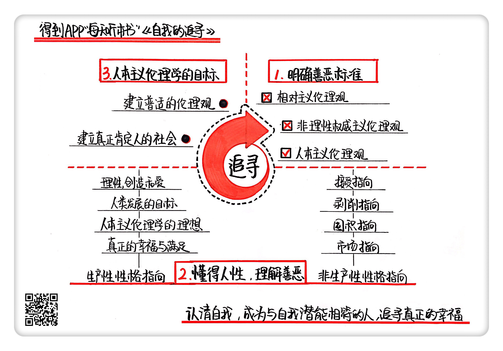

《自我的追寻》| 风君解读
================================

购买链接：[亚马逊](https://www.amazon.cn/图书/dp/B00BP627CC/ref=sr_1_1?ie=UTF8&qid=1506523191&sr=8-1&keywords=自我的追寻)

听者笔记
--------------------------------

> 作者反对相对主义（不同的人有不同的标准，导致每个人都的道德伦理观念都不一样）。
> 
> 作者提出了权威主义和人本主义，前者只是相信权威的判断，然而这样会导致希特勒式的极端主义，因此作者并不认同。而作者提倡人本主义，也就是以人为中心判断是非善恶，而这种判断不应该是满足少数人的特点，而是要满足大多数人。
> 
> 作者使用生产性指向和非生产性指向来判断人性的好坏。
>
> 为了突出人本主义伦理的普遍性，弗洛姆又从伦理与社会和人的关系出发，划分了“社会观的伦理”和“普适观的伦理”。虽然作者认为存在只有“普适观的伦理”的社会，但是两种伦理实际上共存，分别代表了个体利益和全社会共同利益。

关于作者
--------------------------------

埃里希·弗洛姆，德裔犹太人。他不仅是精神分析领域的重量级人物，“人本主义精神分析”的开创者，也是一位极负盛名的社会学家和哲学家。弗洛姆的理论特点，就是融合了弗洛伊德和马克思这两位大师的思想，并在此基础上形成自己的风格。由于他善于将精神分析的心理学方法运用于人的社会行为的分析，因此也被尊为“精神分析社会学”的奠基人之一。

关于本书
--------------------------------

在本书中，弗洛姆借助心理学方法，来考察人的行为动机，从而明确什么是善恶对错这一伦理学问题，并以此指导个人和社会，去让人发展自我，学会创造和爱，追寻真正的幸福，并实现健全的社会。

核心内容
--------------------------------

本书思想核心是：人要追寻自我，实现自我，就必须先认清自我，明确对自己来说什么是对，什么是错，即明确是非善恶；而通过心理学的方法，去考察人的行为动机，我们可以认为，善就是肯定生命，展现人的力量，而恶则是阻碍人的发展，削弱人的力量。人唯有发展自己，学会创造与爱，才能够获得真正的幸福与满足。
 

一、如果一个人不能建立普遍且客观的伦理观，就无法真正地追寻自我
--------------------------------

在这本书里，弗洛姆首先明确批判的是一种相对主义伦理观。什么是相对主义伦理观呢？就是认为价值判断和伦理规范，即是非对错、道德善恶，完全是个人选择的问题，或是一种个人的偏爱，在这方面只有主观标准，没有客观标准；只有相对善恶，没有绝对善恶。比如说一件事在美国是道德的，在中国却是不道德的。

弗洛姆明确反对这种观点，因为在他看来，这种每个人都有自己的真理的说法必然导致道德上的混乱。往极端上说，按照这种相对主义道德观，我们甚至可以得出杀人犯也有自己的道德标准这样荒谬的结论。所以他提出，应该给伦理建立一种普遍、客观的标准，而这就是弗洛姆写这本书的目的。

二、我们需要建立人本主义的伦理观，其标准就是人性
--------------------------------

既然要给伦理建立一种普遍标准，那么问题就在于建立何种标准。弗洛姆提出了“权威主义”和“人本主义”两种伦理观。所谓权威主义，就是凡事皆要听从某个高于众人的权威意见，而非自己的。善恶对错的问题要服从权威，服从了就是善，不服从就是恶。

而人本主义，就是以人为中心，认为人所做的一切对错判断，甚至一切知觉，都只有和人的存在相关才有意义。具体到伦理观，就是认为，肯定人的，促进人的发展的，就是善；否定人的，阻碍人的发展的，就是恶。

弗洛姆倡导“人本主义”而反对“权威主义”，因为权威可能只代表少数人，不代表所有人的利益。如果社会上所有人都只是满足于倾听权威的话，却没有自己的判断，那就会产生严重问题。比如纳粹德国时期，全体德国人被希特勒的言辞蛊惑，发动侵略战争，屠杀犹太人，还觉得自己的行为很正当，很符合良心道德。这是十分可怕的。在弗洛姆看来，正是权威主义伦理学的盛行，最终导致了像纳粹德国这样的极权主义国家的出现。

所以，弗洛姆认为应该建立一种人本主义的伦理学，而其标准就是“人性”。

三、性格可以划分为生产性指向和非生产性指向，只有学会创造和爱，才能追寻真正的幸福
--------------------------------

要建立人本主义伦理学，就要明晰人性是否具有普遍性。我们很多时候看到各种各样人的行为、品质、性格，那只是人格的表象。当务之急是构建一种普遍的人格，或者说性格的模型，同时又能反映人性的复杂多变。这就要求我们运用心理学手段去考察性格背后的动机，给性格定一个大的框架，然后据此来判断行为的善恶。

在本书中，弗洛姆首先为性格划分出了非生产性指向和生产性指向两个大的范畴。非生产性指向，更多体现人的动物本能，而生产性指向更多体现人的理性和创造力。

然后，他又在非生产性指向里分出了四种主要类型，分别是：

1. 接受指向，这种性格指向的人认为包括物质、知识、爱情、快乐在内的一切，都要从外界得到；
2. 剥削指向，这种性格指向的人也认为好的东西是来自外界的。不过不同的是，他获得外界的东西，不是靠接受别人的帮助，而是自己去抢夺；
3. 囤积指向，这种性格指向的人和前两种都不一样，他们对从外界获得的任何新东西都没有信心，所以他们的安全感建立在囤积和节省之上；
4. 市场指向，具有这种性格指向的人，把所有的东西都当成可以交换的商品，它的价值就是交换价值，包括他自己，也都是可以交易的对象。

而和这四种非生产性性格指向相对的，就是生产性性格指向。弗洛姆认为，这种性格才是人类发展的目标，同时也是人本主义伦理学的理想。因为只有人类，可以运用理性和想象力，改变眼前的世界，生产出物质和精神财富，甚至思想体系。当然，还有最重要的生产，也就是完善他自己。只有具备这种性格特征的人，才拥有理性和爱的能力。

但是弗洛姆并不是武断认为，生产性的性格指向就是善的，非生产性的性格指向就是恶的。非生产性性格指向代表的是人的一种生存本能，对人的生存是正常和必要的。所以，关键在于你是不是拥有生产性性格，如果有，那么其余性格指向就可以转化为积极面；而如果没有，那么这些性格就会表现出消极和破坏性的一面。

所以，人本主义伦理学的善就是发展人的生产性力量，而恶则是阻碍人的发展，削弱人的力量。人只有发展自己，学会创造与爱，才能够获得真正的幸福与满足。

这种人本主义的善恶标准也会带来争议。比如人本主义说，人的首要目的就是发展自己，成为自己，这是不是在宣扬利己主义和自私呢？对此，弗洛姆首先驳斥了把爱自己和自私等同起来的观点，认为一个人要么爱自己，要么爱他人，两者必择其一的说法是不对的。他认为，爱自己是爱他人的前提。一个人只有爱自己，才有能力去爱他人，去爱全人类。爱不是你给了他人就无法给自己的有限能量。相反，只要心中有爱，一个人就可以源源不断地创造出爱。这就是他所说的“生产性的爱”。也只有这种生产性的爱，才能创造出真正的快乐和幸福。

四、在“健全的社会”中，个人的追求与社会的发展进步是结合在一起的
--------------------------------

为了突出人本主义伦理的普遍性，弗洛姆又从伦理与社会和人的关系出发，划分了“社会观的伦理”和“普适观的伦理”。

所谓社会观的伦理，就是为了维持某个特定社会的运行而必需的伦理，比如在奴隶制社会中，要求奴隶具备的美德就是忍让和逆来顺受。这种伦理是这个社会的权威，也就是奴隶主宣扬的，目的是巩固自己的利益，而不是为了奴隶着想。

而普适观的伦理，就是以人的成长和发展为目的的伦理，它以人为根本，所以并不会因为社会的变迁而不同。毫无疑问，人本主义伦理是一种普适观的伦理，而权威主义伦理是一种社会观的伦理。因为以往的社会大部分都是少数人为压迫多数人建立的，所以他们建立的伦理只是为了维护自己的统治，就必然只是社会观的伦理，而不是普适观的伦理。也就是说，不是社会中所有的人都能够发展自己，实现自己。

个人目标和社会目标不能完全调和，这就是两种伦理观的冲突。那么这种冲突可以消弭吗？弗洛姆认为当然是可以的。他构想了一种“健全的社会”，也就是两种伦理的内在冲突消失，社会利益等同于社会全体成员利益的社会，是真正肯定人，而不是摧残人的社会。但是，这种社会从来没有在历史上实现过，所以还只是乌托邦。因为即使在今天，两种伦理观的矛盾虽然有减少，但始终存在。

但弗洛姆并不因此而改变其乐观心态，他认为我们现在处在一个过渡阶段，未来有着各种可能性，关键在于我们自己。而个人作为社会的一分子，只要努力认清自我，发展自我，成为自我，摆脱束缚，追寻真正的幸福，就可以在健全自我的同时，让这个社会朝着健全的社会迈进。

金句
--------------------------------

1. 肯定人的，促进人的发展的，就是善；否定人的，阻碍人的发展的，就是恶。
2. 人不仅是动物，不是只有生理本能，他还可以运用理性和想象力，改变眼前的世界，生产出物质、精神财富甚至思想体系，当然，还有最重要的生产，也就是完善他自己。
3. 人只有发展自己，学会创造与爱，才能够获得真正的幸福与满足。
4. 只要每个人努力认清自我，发展自我，成为自我，摆脱束缚，追寻真正的幸福，就可以在健全自我的同时，让这个社会朝着健全的社会迈进。

撰稿：风君

脑图：摩西

转述：杰克糖