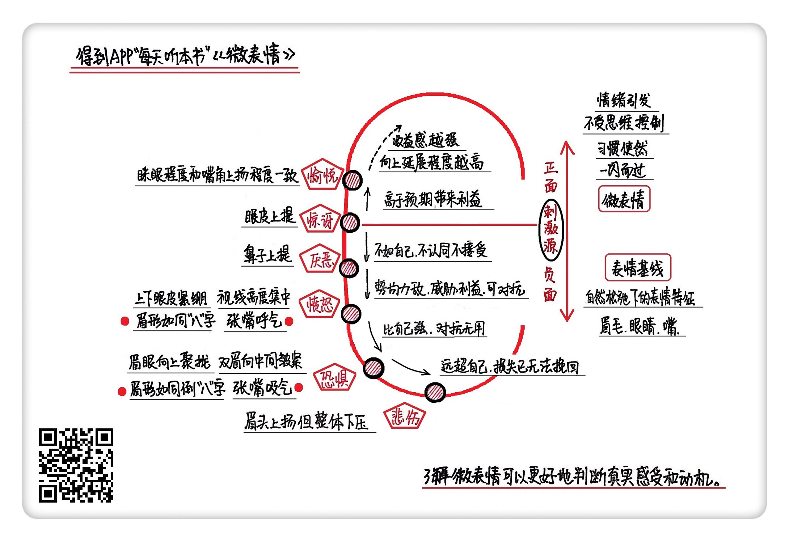

《微表情》| 含月解读
==============================

购买链接：[亚马逊](https://www.amazon.cn/微表情心理学-读心识人准到骨子里-哈里-巴尔肯/dp/B00J02VMJ2/ref=tmm_pap_swatch_0?_encoding=UTF8&qid=1507725341&sr=8-1)

听者笔记
-----------------------------

> 人在受到刺激的时候，表情会通过：惊讶 -> 厌恶、愤怒、恐惧、悲伤、愉悦，根据刺激源的不同而不同。
>
> 人的表情可以客观反应出这些特性，很难掩饰。

关于作者
-----------------------------

姜振宇，国内著名测谎专家，中国政法大学中国法律信息中心主任，领导着国内首家应用微反应理论进行测谎的研究团队。著有《微表情》《微反应》《掌控者》等畅销书籍。     

关于本书
-----------------------------

《微表情》总结了惊讶、厌恶、愤怒、恐惧、悲伤、愉悦6种人类最基本情绪产生的原因，以及情绪产生时所呈现的不同微表情。通过大量案例、实验与总结，科学解码微表情，帮助你了解面孔背后的真实情绪，并更好地了解自己。

核心内容
-----------------------------

本书思想核心是：微表情有助于判断他人真实感受和动机，并更好了解自己。

6种人类最基本的情绪及所对应的微表情：惊讶的微表情是眼皮必须上提，厌恶的微表情是鼻子向上提，愤怒的微表情是眉眼距离越来越近、视线高度集中，恐惧的微表情是眉眼有向上聚拢的趋势，悲伤的微表情是眉头上扬但整体保持下压，愉悦情绪的微表情是眼部眯起的程度和嘴角上扬的程度相匹配、相一致。     

一、6种人类基本情绪的内在联系
-----------------------------

无论是人还是动物，在感觉到意外刺激的时候，会停下所有动作，产生第一种基本情绪——惊讶。如果面对的是负面刺激，刺激源不如自己，并且不认同不接受的，产生第二种基本情绪——厌恶。如果刺激源和自己差不多厉害，但会形成威胁，可以通过对抗来保护自身利益的，产生第三种基本情绪——愤怒。如果负面刺激源比自己厉害，即使对抗也没有希望消除威胁的，产生第四种基本情绪——恐惧。如果负面刺激源非常厉害，并且已经造成无法挽回损失的，产生第五种基本情绪——悲伤。如果面对的是积极的刺激源，会给自己带来利益，会产生第六种基本情绪——愉悦。

二、6种基本情绪及所对应的微表情
-----------------------------

1. 惊讶

惊讶，是因为关心的事情发生了意外变化。最典型的惊讶表情就是五官全部打开：眉毛抬高，眼睛瞪圆，嘴巴张大。惊讶的微表情特征中，眼皮必须上提。这是为了对所处环境看得更清楚，了解更多信息，眼睛会不自觉睁大一点，因而眼皮会提起来。

【案例】

面试中如何抓住面试官的关注点来介绍自己？不妨注意观察你讲到哪个经历时，面试官的眼皮会轻微抬起来。眼皮提起意味着产生了惊讶，一旦惊讶表情出现，就意味着关心的事情被刺激到了，表明这个经历可能正是面试官想进一步了解的。
2. 厌恶

厌恶情绪的本源，是对腐烂食物的排斥，就是对肮脏的、臭的东西不想看，不想闻，不想吃。厌恶的经典表情是整个面部似乎都皱在一起：眉毛紧紧皱起，双眼紧闭，鼻子皱起，上嘴唇努力上提，下嘴唇努力顶上。厌恶的微表情特征中最重要的一点是：鼻子向上提。

【案例】

了解这个微表情，可以在谈判中了解对手态度，甚至试探对方底线。我们可以仔细观察对手鼻子的变化，如果交涉到哪个条款时，对方鼻子皱了一下，就意味着反感、厌恶情绪的产生，表明对方可能从心里并不接受你提出的解决方案。
3. 愤怒

愤怒情绪的来源其实是利益威胁，并企图通过攻击来消除危险。愤怒的微表情往往表现在眼睛，直接表达进攻的趋向。愤怒时，上下眼皮是紧绷的，视线也是高度集中的。

【案例】

比如一个常见的场景，夫妻吵架，在真正大爆发之前，其实会有一些愤怒微表情作为预警。如果夫妻中无意争吵的一方发现，对方的眉毛和眼睛之间的距离越来越短，同时视线越来越集中，那很可能就是暴风雨的前兆。
4. 恐惧

恐惧就是负面刺激超过了人的防御能力。典型的恐惧表情特征是：双眉向中间皱紧，眼睛睁大，嘴巴大张。恐惧的微表情就是眉头向中间聚拢、上扬，上眼皮也随之上提。整个眉眼的形态是因害怕躲避而努力向后撤的状态，所以会有整体上扬的趋势。

【案例】

公开演讲时，如何表现得镇定自若？那你就要控制自己的眉毛和眼睛不要有向上聚拢提升的趋势，否则观众很容易就会发现你内心的惊慌。
5. 悲伤

悲伤源自损失，哭是悲伤情绪最直接的反应。小朋友摔倒时哇哇大哭，眉毛紧皱，眼睛紧闭，鼻子和嘴巴大咧着，就是悲伤情绪的经典表情。悲伤情绪微表情的最关键因素在于眉毛，也就是：眉头处上扬，但整体眉毛保持下压。

【案例】

了解这个微表情，可以帮助我们在聊天中，更敏锐发现哪些话题是对方不愿过多谈及的话题。结合前面讲到的不同情绪的微表情特征，如果对方鼻子皱了一下，表明对方对聊的话题可能有点反感；如果对方眉毛“眉头上扬，但整体下压”地拧巴了一下，可能聊的话题触动了ta一些悲伤的记忆，不妨适时换个话题。
6. 愉悦

愉悦来源于接收到了高于自己预期的积极信息，从而引发自我满足感甚至优越感。最典型的愉悦表情就是笑。愉悦的微表情要看一组配合，就是眼睛笑眯眯的程度和嘴角上扬的程度是要相匹配、相一致的。

【案例】

日常打招呼时，哪些是真诚的笑容，哪些又是客气一下、伪装出来的笑容？鉴别关键就看眼睛眯起来的程度和嘴角上扬的程度是否同步，等幅度，反相关。如果眼睛睁得大，嘴也张得大，或者眼睛眯得小，嘴也是抿着的，基本都是伪装出来的笑容。

三、表情基线
-----------------------------

“表情基线”就是人在自然松弛状态下的表情特征，重点关注三个指标：眉毛、眼睛、嘴。确定了“表情基线”后，就可以更准确判断到底是扬眉还是皱眉，是睁眼趋势还是闭眼趋势，是嘴角上扬还是嘴角下弯，也有助于更好识别表演出来的假表情。     

金句
-----------------------------

1. 一旦惊讶情绪产生，即使为了隐藏过于直白的表情流露，控制得住眉毛和嘴巴，但最控制不住的是眼皮，眼皮必须上提。
2. 厌恶的微表情特征中最重要的一点是：鼻子向上提。
3. 愤怒的微表情中，眼睛是在用力的，因为用力而上下眼皮紧绷，而且视线也集中指向刺激源。
4. 恐惧情绪瞬间流露出来的微表情是眉头向中间聚拢、上扬，整个眉眼的形态是因害怕躲避而努力向后撤的状态。
5. 当哭泣不再表达悲伤时，面孔会逐渐放松，嘴巴慢慢闭上，眼睛也慢慢睁开，然后脸颊不再那么鼓起。就算撅嘴也退去了，纠结的眉毛还是会最后提示悲伤的信息。
6. 愉悦的微表情中，眼睛笑眯眯的程度和嘴角上扬的程度是要相匹配、相一致的。眼睛的闭合程度和嘴巴的张咧程度，是反相关的。
7. “表情基线”就是人在自然松弛状态下的表情特征，重点关注三个指标：眉毛、眼睛、嘴。

撰稿：含月

脑图：摩西

转述：于浩