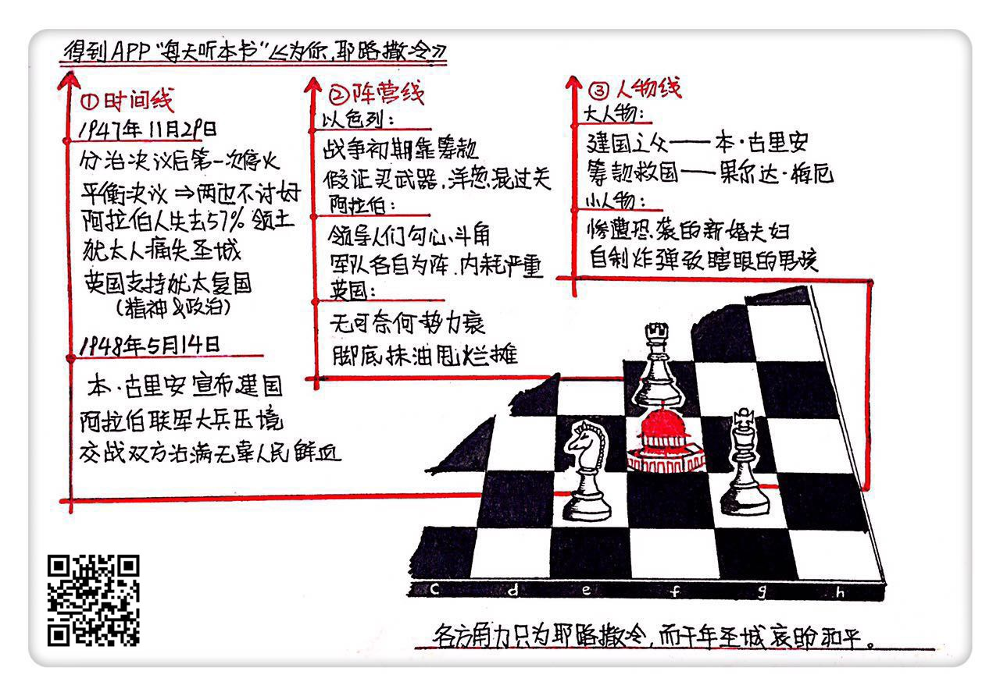

《为你，耶路撒冷》| 风君解读
================================

购买链接：[亚马逊](https://www.amazon.cn/为你-耶路撒冷-拉莱·科林斯/dp/B01MRP8WQL/ref=sr_1_1?ie=UTF8&qid=1509111539&sr=8-1&keywords=为你，耶路撒冷)

听者笔记
--------------------------------

> 巴勒斯坦分治决议是第一次中东战争的导火索，交战双方都没有从这个决议中得到自己想要的。
>
> 英国出于同情和感谢，支持犹太复国主义。
>
> 犹太人没有钱，没有石油，通过赞助费，难以维持高额的战争费用。阿拉伯人则内斗严重。英国人自己挑起的是非，却已经无暇沉迷于二者的争斗之中，不负责任地逃离了。
>
> 这本书的特色，是用大量的小人物的描绘，来刻画战争的一幕幕悲喜剧。

关于作者
--------------------------------

本书由美国《新闻周刊》记者莱拉·科林斯和法国《巴黎竞赛》记者多米尼克·拉皮埃尔合著。两人曾经合著过另一本纪实文学经典《巴黎烧了吗？》。该书在纪实文学领域是不折不扣的代表之作，在全世界范围内有数百万的读者，被翻译成30多种语言。两位作者在纪实领域的地位由此也可见一斑。 

关于本书
--------------------------------

两位作者为了写作本书，花费两年多时间，采访了大量的历史亲历者，又查阅了浩如烟海的历史资料和珍贵文献，在此基础上，再花三年写成本书。在本书中，两位作者用一种“清明上河图”式的细腻描摹，刻画了众多栩栩如生的历史人物形象，并通过他们的经历和遭遇，为我们呈现了一部极具细节感的以色列建国史，全景再现了70年前发生在耶路撒冷的一幕幕惊心动魄的场景。 

核心内容
--------------------------------

本书的核心特点是它的详实和细腻。作者用60多万字的篇幅讲述了一百多天里发生的历史事件，细腻程度令人发指。书中出场的人物，从国家元首，到普通士兵；从前线指挥官到平头百姓；从犹太人到阿拉伯人，可谓不胜枚举。不同的视角互相穿插，来回交错，全方位再现了当时发生在耶路撒冷的历史细节。 
 

一、关于联合国大会通过巴勒斯坦分治决议的是非对错
--------------------------------

本书以1947年联大在纽约法拉盛草地公园通过巴勒斯坦分治决议之日为叙述起点。为什么？因为这可以说是之后爆发的第一次中东战争的导火索。没有这个决议，就没有本书中所叙述的种种冲突和博弈。

这个决议规定在巴勒斯坦分别建立一个阿拉伯国家和一个犹太国家，而对于备受争议的耶路撒冷，则交给国际共管。这样一个努力实现双方平衡的决议，结果却是两边不讨好。阿拉伯人认为自己千年以来一直是这块土地上的主体民族，当时占总人口的2/3以上，拥有一半以上的土地。可是分治决议却把巴勒斯坦57%的土地划给了犹太人，明显不公。而且犹太人流离失所，遭受迫害，也不是阿拉伯人的错，所以他们不接受分治决议。而犹太人虽然得到了建国所需的承诺和土地，代价却是失去耶路撒冷，所以也并不满意。但是为了建立国家，他们做出了让步，接受这一决议。由于阿拉伯人不接受，所以耶路撒冷的归属，只能再次由刀剑、投石器或榴弹炮来决定。

二、关于“犹太复国主义”
--------------------------------

作者考虑到读者对历史背景可能不了解，所以在叙述中用了插叙的方式，对一些历史背景做了简要介绍。比如犹太复国主义的产生背景，比如英国为什么支持犹太人建国？用作者的话说，一半是同情犹太复国主义，一半是因为犹太人在“一战”的时候对协约国一方的大力支持。犹太人虽然没有国家，但是富可敌国，在欧美政治领域的影响力是很大的。有很多银行家都是犹太人，比如在中国因为《货币战争》这本书的流行变得家喻户晓的罗斯柴尔德家族。在历史上极为有名的，表明英国支持犹太复国主义态度的《贝尔福宣言》，就是英国外务大臣贝尔福写给当时罗斯柴尔德勋爵的信件。了解这些历史背景，也有助于更好地看清当时的形势。

三、以色列建国过程中，发生的种种事件
--------------------------------

作者在按照时间线进行叙述的过程中，除了分治决议，也有其他重要节点。比如1948年5月14日，英国殖民当局撤离的前一天。下午4点，在特拉维夫博物馆内，本•古里安在犹太复国主义的首倡者赫茨尔的肖像下宣布建国，国名以色列。当时以色列面临的是什么情况？可以说是绝境。刚刚建国已是强敌环伺，耶路撒冷被重重围困，阿拉伯联军大兵压境，而以色列的武器装备还未到位，人们甚至连庆祝独立的时间都没有，就要奔赴战场。这个时候的以色列有什么？有的是对重建家园无比坚定的信念。可以说，正是依靠这种信念，让他们挺过了最危险的时刻。

还有双方第一次停火。当时以色列处境极其危险，耶路撒冷老城被阿拉伯联军占领，军队缺乏重武器屡战屡败，已是弹尽粮绝，山穷水尽。而阿拉伯方面虽表面团结，但暗地里各怀鬼胎，人心不齐，最后双方在美国斡旋下停火。当时埃及军队距离耶路撒冷新城只有25英里。只可惜重新开战后，在重振旗鼓的犹太人面前，他们就再没有机会前进了。

四、犹太人、阿拉伯人和作为原统治者的英国人这三大阵营之间的博弈冲突
--------------------------------

在这场冲突中，可以大致分出三个阵营：以色列一方，阿拉伯国家一方，以及作为巴勒斯坦地区原先统治者的英国一方。本书对这三个阵营的表现都进行了较为详尽的记录和再现，提供了全面的视角。

犹太人一方，在战争初期的处境是最不妙的，没钱没武器也没正规军队，还面临阿拉伯联军的联合绞杀。这时候犹太人体现了自己不屈不挠的信念。建国需要经费，筹款面临困难时，一位叫梅厄夫人的犹太女子挺身而出，口袋里怀揣10美元只身前往美国筹款。凭借慷慨激昂的演说和义无反顾的气概，她成功打动了美国的犹太人群体，筹到五千万美元，是当时沙特阿拉伯全年石油收入的三倍。为了获得武器装备，犹太人想尽办法，通过走私，或者将武器设备拆成零件打包运回国再重新组装等种种方法，为自己争取生存空间。“犹太复国主义”的是非对错暂且不论，但这些犹太人为了自己的信念的付出，确实值得钦佩。

阿拉伯一方，战争开始之前占尽优势。他们的领导人放出狂言，要把犹太人都赶到海里去。只可惜，阿拉伯联盟表面上团结强大，实际上却是内斗不停，各个领导人之间勾心斗角，彼此不服。巴勒斯坦宗教领袖哈吉·爱敏想要在巴勒斯坦建立由他主导的政府，巩固自己的权力。但外约旦国王阿卜杜拉自己想做“耶路撒冷王”，所以不能容忍哈吉·爱敏大权独揽。在战场上，联军缺乏统一调度，各自为战，群龙无首，一盘散沙。结果，阿拉伯人虽然占领了耶路撒冷老城，但最终输掉了战争。

英国人一方，曾经的日不落帝国已经风光不再，巴勒斯坦地区越来越激烈的矛盾冲突也让英国当局焦头烂额，恨不得立马甩掉这个烂摊子。所以分治决议一通过，他们已经迫不及待要脚底抹油了。但这种局面其实是英国自己一手造成的。如果不是当初英国对阿拉伯人和犹太人分别许下了彼此矛盾的承诺，巴勒斯坦的局势也不至于如此。现在大战将起，英国人留下一个烂摊子，自己倒全身而退。这实在不是一个负责任大国应有的表现。

五、战争期间众多底层小人物所经历的悲欢离合
--------------------------------

以往的历史作品，在涉及历史事件的时候，更多把目光投在那些大人物的身上。而在本书中，作者为了避免脱离历史事件的真实面目，在叙述人物时不仅把目光投向了那些大人物，也花了很大的篇幅，去描摹一些在传统的历史书写中微不足道，被忽略掉的小人物。

大人物的视角当然很重要，他们对整个历史事件的进程起到了举足轻重的作用。但是这并不意味着小人物的视角就无足轻重。相反，通过本书的叙述，我们发现，通过回顾和审视这些底层人物的悲欢离合，爱恨纠葛，我们才能更深入还原当时的历史真实，对当时所发生的一切有更深刻的体会。书中有很多这样的场景：蜷缩在战壕里发抖的普通士兵；遭遇大屠杀的阿拉伯村民；因为耶路撒冷被围困而陷入饥荒的母亲和孩子；被自己安装的炸弹炸瞎双眼的男孩；因为战争而选择逃离，却永远再也没有机会回到家园的难民……这是本书最鲜活也最吸引人的部分。当你翻开下一页时，永远不知道会有怎样的一个故事等待着你，会给你带去怎样的震撼。在这些时候，你会觉得自己真的回到了70年前的耶路撒冷，用和当时人一样的视角，观看这座神圣之城中所发生的一幕幕悲喜剧。

金句
--------------------------------

1. 这个时候的以色列有什么？有的是对重建家园无比坚定的信念。可以说，正是依靠这种信念，让他们挺过了最危险的时刻。
2. 不得不说相比犹太人，阿拉伯人真的缺乏那种志在必得的信念。
3. 如果只用一种宏观大历史的视角来看待历史事件，我们看到的往往是一个冷冰冰的伤亡数字。你永远没有办法了解那些被裹挟的亲历者所经历的，没有办法感受到那种失去至亲所带来的撕心裂肺的伤痛，也没有办法真正体会战争和冲突给普通人带来的深重灾难。

撰稿：风君

脑图：摩西

转述：顾一菲