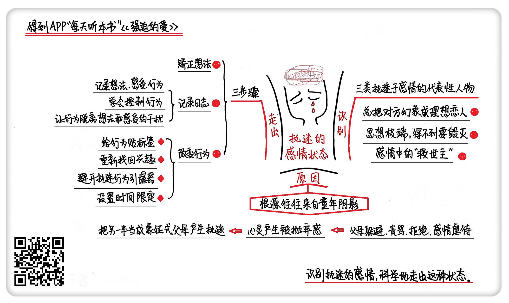

《强迫的爱》| 静静解读
======================================

购买链接：[亚马逊](https://www.amazon.cn/强迫的爱-苏珊·福沃德/dp/B00FWOGLIE/ref=sr_1_1?ie=UTF8&qid=1508238173&sr=8-1&keywords=9787511341013)

听者笔记
--------------------------------------

> 作者分析了一些处于执迷的感情状态中的表现，如对对方存在幻想、思想极端得不到就毁掉、把自己当作感情中的救世主。
>
> 而产生这些行为的原因，可能跟儿时的经历有关。
>
> 作者同时给出了如何走出困境的方法，首先是要转变自己的概念，目标不是要改变他人，而是要改变自己，让自己能够不被这种情感绑架，打破执迷系统，学会控制自己的行为。其次，要区分想法、感受和行为，可以用记日志的方法来实现。最后，要改变行为。

关于作者
--------------------------------------

苏珊·福沃德，国际知名心理治疗师，拥有20多年的心理治疗经验。是婚姻关系，恋爱关系及人际关系研究领域的顶级专家。她的代表作曾连续44周在《纽约时报》畅销书榜单排行第一，仅在美国就卖出了200多万册。在心理学方面，苏珊·福沃德最擅长的就是剖析人物心理。除此之外，苏珊·福沃德还是颇受欢迎的演说家、节目嘉宾和媒体人，她曾在美国广播公司主持谈话节目长达6年。

关于本书
--------------------------------------

《强迫的爱》是一本非常实用的恋爱指南。苏珊·福沃德利用自己20多年的心理治疗经验，结合现实生活中的案例，为我们解读了什么样的感情属于执迷的感情以及如何科学地走出执迷的状态。

核心内容
--------------------------------------

本书的核心内容主要有三个方面：一、如何识别自己是否处已经在执迷的感情状态中；二、这种执迷的感情状态是由什么造成的；三、如何科学地走出这种状态。     
 

一、执迷感情的三种表现
--------------------------------------

1. 把对方幻想成自己的理想恋人

在完全不了解对方的情况下，就把对方当成了自己的完美情人，急于和对方建立亲密关系。
产生这种理想化倾向的原因是，在刚开始一段感情时，恋人们都会极力表现出自己最好的品质来吸引对方，却无法一直坚持下去。

2. 思想极端，得不到要毁灭

总是希望掌控对方的一举一动，认为只要足够爱对方，对方就必须爱你。当被对方拒绝时，会使用暴力手段报复对方，或采取自残的方式，来唤起对方的罪恶感。

3. 感情中的“救世主”

享受被对方需要的感觉，总觉得只要自己多付出一点，就能帮助恋人度过难关。

二、造成执迷感情的原因
--------------------------------------

造成执迷感情的根源往往是童年时期的阴影。在成长的过程中，父母的躲避，责骂，拒绝和感情上的虐待，往往会让执迷者的心灵产生强烈的被抛弃感。于是长大后，执迷者就把另一半当成了象征式的父母。

【案例】

当一位女士被自己的恋人抛弃后，还在努力通过暴力等各种手段挽回这段不属于自己的感情。这位女士其实就是把恋人当成了自己象征式的父亲。

她的感情经历其实和她小时候被父亲抛弃的经历极为相像：她的父亲是突然离开她的，她的恋人也是；她的父亲是因为看上了别的女人，所以才抛弃了她们母女。她的恋人也找了别的女人，才抛弃了她；她的父亲偶尔会给她和妈妈打电话，而这位女士的恋人也会偶尔回来找她。

三、科学地走出执迷的状态要遵循三个步骤
--------------------------------------

1. 转变自己的概念

在做出改变之前，必须明白，你最重要的任务是改变自己，而不是改变别人。很多人总是想通过改变，把自己打造的更有魅力，然后再把对方追回来。这是一种错误的想法，想要走出执迷，第一步就是要把关注点从对方的身上转移回自己身上。要让自己回头，而不是让恋人回头。

2. 通过记录日志，打破执迷系统

执迷系统由想法、感受和行为三者共同构成。执迷状态中的人往往很难控制自己的想法和感受，所以想要走出来，需要先把想法、感受和行为区分开，打破执迷系统，学会控制自己的行为，让行为脱离想法和感受的干扰，再通过行为的改变来带动想法和感受的转变。

区分想法、感受和行为需要用到记录日志的方法。记录时要注意以下6个问题：第一、是什么引起这种想法的？第二、你想到了什么？第三、你有什么感受？第四、你想做什么？第五、你做了什么？第六、结果怎么样？

【案例】

一个女孩子被男朋友甩了，当她正难过时，电话响了，她觉得是男朋友打来的，但当她接起电话发现对方并不是男友之后，对电话里的人发了一通无名火。

这个女孩子就可以这样记录自己的日志：第一、是什么引起这种想法的？电话铃响了。第二、我想到了什么？可能是男朋友打来的。第三、我当时有什么感受？希望，紧张和兴奋。第四、我想做什么？接电话。第五、我做了什么？接了电话。第六、结果怎么样？电话不是男朋友打来的，所以我把打电话的人骂了一顿。

3. 改变行为的四个关键方法

改变，从行为入手最有效。因为它是最容易被辨认和控制的一个。改变行为的四个关键方法分别是：第一、给你的行为贴上标签；第二、重新找回自己的兴趣；第三、避开执迷行为的引爆器；第四、给自己一个时间限定，更有计划地走出不良状态。

金句
--------------------------------------

1. 改变，从行为入手最有效。
2. 你的目的并不是要让恋人回头，而是要让自己回头。
3. 父母的爱是唯一一种以分离为终极目标的爱。
4. 希望的破灭是暴力行为的催化剂。
5. 你没办法让一个不爱你的人爱上你，就像你永远都叫不醒一个装睡的人。

撰写：静静

脑图：摩西

转述：顾一菲