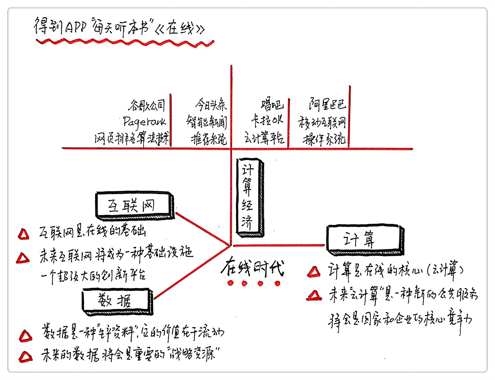

《在线》| 丁雨解读
=============================

购买链接：[亚马逊](https://www.amazon.cn/在线-数据改变商业本质-计算重塑经济未来-王坚/dp/B01LWQ6240/ref=sr_1_1?s=books&ie=UTF8&qid=1512226104&sr=1-1&keywords=在线)

听者笔记
-----------------------------

> 在线三定律：每一个比特都应该在互联网上；每一个比特都可以在互联网上双向流动；每一个比特所代表的对象都应该可以被计算。在线三定律是判断事物是否符合未来趋势的方法。
>
> 随着云计算和大数据技术的发展，未来大规模的在线计算将变得更容易。
>
> 但是随之而来的各种问题也有待解决。

关于作者
-----------------------------

王坚，阿里巴巴集团技术委员会主席，原为浙江大学心理学系教授、系主任，后担任微软亚洲研究院常务副院长。2008年加盟阿里巴巴集团担任首席架构师，2009年创建阿里云计算公司并担任总裁，被称为“阿里巴巴技术教父”。

关于本书
-----------------------------

本书是一本帮助你洞察今天与未来发展趋势的书。作者揭露了大数据、云计算和万物互联网等关键概念的本质与核心，为读者阐明了在线的力量。更重要的是，本书为我们指明了未来人类经济与社会的发展趋势与方向。

核心内容
-----------------------------

“在线”是未来世界发展的关键。一个事物是不是符合未来发展的趋势，就是要看它是否在线。在线三定律，将帮助我们理解互联网的发展趋势。而围绕着在线，互联网、数据和计算将会有着全新的发展方向，它们的碰撞将会重新定义经济，改变未来的社会与生活。 
 

一、在线三定律
-----------------------------

怎样判断一件新生事物是否符合未来的发展规律呢？本书认为，我们可以通过在线三定律来判断。

1、第一条定律，每一个比特都在互联网上。这里的比特，你可以把它理解为物理上所说的对象。其实定义无所谓，不论定义如何，事物的最终状态一定要在线，这样才能够和其他事物连接在一起。而互联网就是在线的基础。

2、第二条定律，每一个比特都可以在互联网上流动。事物到了线上，线上就记录了它的各种数据，但是光有数据还不行，这个数据必须是流动的，也就是说，这些数据信息是都够被需要他们的人收集到的。数据的价值在于流通。大数据的本质是在线，而且是双向在线。

3、第三条定律，比特所代表的每个对象都是在互联网上可以被计算的。这是在线世界天然具备的属性。

计算未来必然像电一样，在我们的生活中越来越普及，需求量越来越大，看不见上限，我们只需要通电的服务，而不需要自带发电机。因此，更为理智的做法，是建立一个像国家电网那样的公共服务网络，让计算在线，建立真正的云计算。

二、新经济——计算经济
-----------------------------

在线的基础是互联网，数据只有在线才有意义，计算是在线的核心。互联网、数据和计算这三者的结合裂变会导致新经济的出现，也就是计算经济的出现。

【案例1】

以谷歌引以为傲的Pagerank网页排名算法为例，Pagerank的基本想法很简单，它分析超链接之间的关系：一个网页的重要性会随着被其他网页链接的数量增加而增加。用超链接来评估网页的权重，是谷歌击败其他搜索公司的秘诀，这个算法成为这家公司的核心价值。这是计算经济的一个典型成功案例。谷歌算法成功的关键就是网页搜索的在线。

【案例2】

利用大数据双向在线特性的最典型案例是“今日头条”。这个新闻应用，号称能够在“5秒钟算出你的兴趣”并且“根据兴趣智能推荐新闻”，它秉承的就是双向在线的理念。你在这头输入自己的兴趣爱好，它在那头输出匹配的新闻信息，这就形成了不需要人工编辑的新闻引擎。“今日头条”本身并不生产内容，但是这个新闻应用在2年内激活了1.2亿用户，4000万月活跃用户，一跃成为传媒新贵。

实际的案例告诉我们，搭建云计算的公共平台，让计算在线，这是在线的核心。只有这样才能让更多的企业拥抱互联网，让在线的数据通过云计算产生价值，更好地发挥自己的核心优势。

三、互联网、计算和数据的发展趋势
-----------------------------

互联网在未来将成为一种基础设施。互联网要想成为基础设施，必须达到一定的规模，有了规模互联网才能发挥出作用。互联网成为基础设施，能带来两个好处，一是成本降低，二是互联网深入我们生活的各个角落会使我们的生活工作更便捷。当互联网成为基础设施，它就会变成一个创新的平台。

数据会成为未来重要的生产资料。只要在互联网上走过，数据就会留下脚印。这些数据沉淀下来，将为人们提供重要的参考。在未来，数据将会是一种重要的战略资源。

云计算会成为一种新的公共服务，而且会成为国家和企业的核心竞争力。想要实现大规模的计算，只有通过在线计算、云计算才能实现，只有当云计算成为公共服务的时候，才有可能低成本的实现。当计算成为公共服务的时候，人们的创造力就更有可能被激发出来。

四、未来在线社会的挑战
-----------------------------

一切在线后，意味着许多前沿技术可以再度融合。例如，未来我们通过可穿戴设备和虚拟现实技术，通过在线网络，在家中就可以获得在博物馆或旅游胜地现场的体验。

当然，在线社会带给人们的冲击，必然很大。我们会看到形形色色的问题和担忧。比如，隐私的泄露往往是在线社会中人们极易见到的问题。又如，在线的维基百科在“自由、免费、开放”的大旗之下，也不免被嵌入有水分的内容，遭遇水军的围攻。

在线会带来未来发展的契机，改变人们的生活方式，也会带来我们难以预料的变量和冲击。但无论如何，人们必将学会驾驭以在线为核心的时代和生活方式。

金句
-----------------------------

1. 移动互联网真正带来的影响，是人们越来越多的时间都沉浸于在线的世界了。
2. 在线社会，云计算就相当于发电产业，云存储就是钢铁产业，而大数据就是福特汽车生产线。
3. 数据要流动才有价值，数据在线到了互联网上的流动，是信息社会和数据社会的本质区别。我们已经从过去企业内部的信息封闭流动，走向了互联网上的数据开放流动。如果一定要讲“大”，那么变大的就是数据流动的时间和空间，因而数据的价值也变大了。
4. 数据就像石油和煤炭一样，我们确实挖掘出了石油和煤炭，但是实际上它们都是经过几十亿年沉淀下来的太阳的能量。互联网的出现让数据真正变成了世界的自然资源，因为数据沉淀变得极其容易了。
5. 万物互联网存在巨大的机遇，这种机遇的结果一定是，在万物互联网时代将不再区分互联网和传统产业。
6. 当你有目的地去搜集数据的时候，你拿回来的数据的用途一定会有局限。因为你设想的目的会束缚你对于数据用途的想象。
7. 云解放了计算机这台机器，让计算的能力彻底从一个箱子里释放出来，回归了计算的本质。
8. 互联网之前的信息革命，完成了原子的比特化；而互联网的出现，则要完成比特的在线化。在线是一片新大陆，就像当年的美洲大陆，我们还需要深入探索。

撰稿：丁雨

脑图：摩西

讲述：于浩