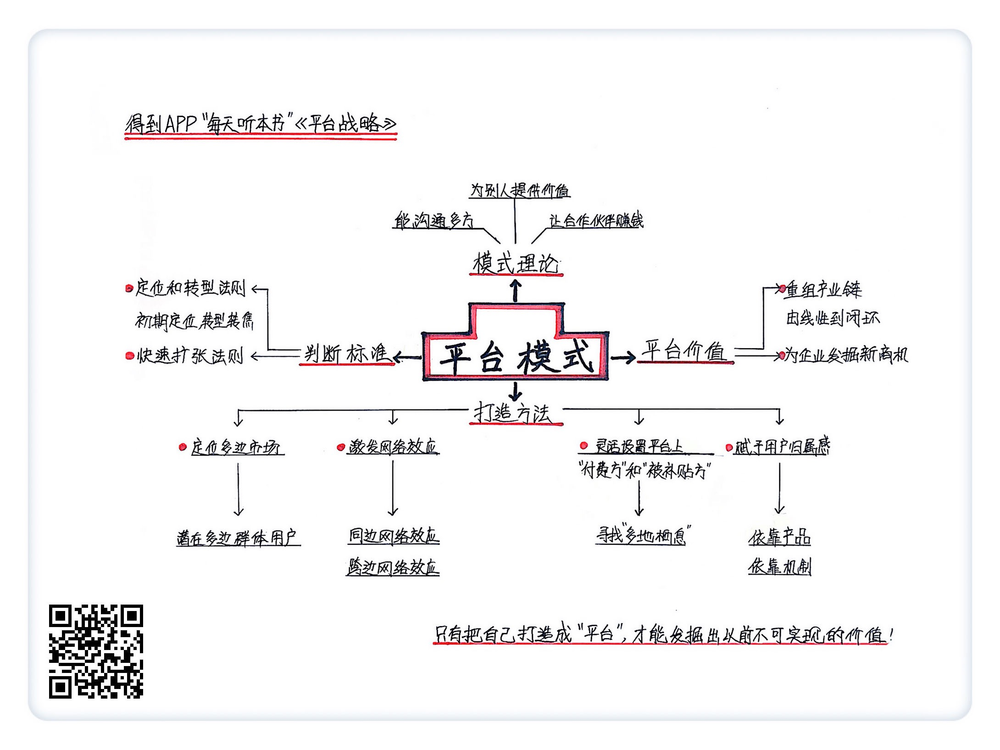

《平台战略》| 曾翔解读
==================================

购买链接：[亚马逊](https://www.amazon.cn/平台战略-正在席卷全球的商业模式革命-陈威如/dp/B00AOG15AO/ref=sr_1_1?ie=UTF8&qid=1508397005&sr=8-1&keywords=平台战略)

听者笔记
----------------------------------

> 成为平台，让企业有机会重组产业链、发掘新的商业机会。
>
> 企业可以通过：定位多边市场、激发网络效应、明确定义平台的付费方和被补贴方来达成平台的最大利益、让平台的用户有更多的归属感四种策略，来打造平台。
>
> 更容易成功的平台，都要有明确的定位，并在平台发展的过程中，根据市场情况，适时转型。同时要能够在成为平台后，掌握快速扩张的技能，才可能在平台竞争中，充分利用赢者通吃的规律。

关于作者
----------------------------------

陈威如，美国普渡大学战略管理学博士，中欧国际工商学院战略学副教授，主要研究商业模式、战略规划，在众多世界知名的学术期刊上发表过文章，比如《管理学会期刊》《组织科学》《战略管理期刊》等。

余卓轩，自由作家，曾在中欧国际工商学院读管理学硕士，现在主要从事创意概念与平台战略的研究。     
关于本书
----------------------------------

本书通过剖析电商行业、互联网行业、传媒行业几十家公司的商业模式，解读了“平台模式”的价值和它的设计机制，帮助你重新理解商业世界。     

核心内容
----------------------------------

一、平台模式为企业赋予了两种新的价值；二、打造一个平台企业需要四个步骤；三、如何判断一个平台在竞争中能不能成功。     
 

一、平台模式为企业赋予了两种新的价值
----------------------------------

第一，它能重组产业链，第二，它能为企业发掘新的商业机会。

【案例】

先看重组价值链。传统出版业的价值链是这样的：作者负责生产内容，然后出版社和印刷厂负责排版印刷，接下来是经销商和零售商，他们负责各个渠道的销售，最后才是读者买到手。但是互联网出现之后，线上阅读平台崛起了，平台方直接对接了小说的生产者和消费者，打破了原本单向又冗长的价值链。

再来看平台模式怎样帮企业发掘新的商业机会的。

【案例】

苹果公司过去最赚钱的业务就是卖 iPhone 之类的电子产品，但是你再去看它最近几年的财报就会发现，苹果正在搭建自己的软件服务平台，比如它在2016年从 iTunes、App Store 等软件服务赚到的钱已经有几十亿美元。不再单纯依靠硬件赚钱，而是通过软件服务来吸引用户，搭建一个平台，然后通过每一笔交易来收取费用的平台模式，比单纯卖硬件有竞争力多了。

二、打造一个平台企业的四个步骤
----------------------------------

第一步，定位多边市场。也就是找到可能使用你平台的多边群体。

【案例】

淘宝找到了“卖家”和“买家”，然后把他们连接在一起；滴滴找到的是“司机”和“乘客”，通过手机软件也把他们连接到一起。

第二步，激发网络效应。如果使用产品或者服务的消费者变多，产品本身的价值也会不断增加。

【案例】

微信现在的用户已经有好几个亿了，他们之间就有非常强的同边网络效应。比如你把自己生活中好玩的事发在朋友圈，对你的朋友来说就是一种正向刺激，他们就会不断参与进来，在这个过程中，微信也因为这种同边网络效应有了更大的价值。

第三步，灵活设置平台上的“付费方”和“被补贴方”吸引用户。如果某个群体更有可能“多地栖息”，对他们收费就很不明智，所以反而应该给他们补贴。

【案例】

在电商行业刚发展起来的时候，淘宝上的商家开店成本非常低，而且在2006年，电商平台的前三名分别是淘宝网、拍拍网、易趣网，他们占据的市场份额相差不大。这时候商家们“多地栖息”比较容易，所以淘宝很难向商家收费，反而需要自己主动帮优质商家引流。但是几年之后，淘宝的市场占有率远远领先，而且商家在淘宝上积累了大量资源，这时候商家就没什么“多地栖息”的可能性了，淘宝才有底气向商家们收取一定的开店费用和推广费用。

最后一步，作为平台方，你必须赋予用户一定的归属感。方式有两种，要么靠产品，要么靠机制。

【案例】

先说靠产品。还是苹果这家公司，它推出 Mac、iPhone 这些产品都卖得很好，首先当然是因为这些电子产品的确美观简洁，而且系统和软件也很可靠。但是你再深入想想，为什么使用苹果产品的人忠诚度非常高，愿意买比一般品牌更贵的产品呢？其实更深层的原因在于用户的归属感，苹果一直想让所有使用它的人认为，苹果的产品是很酷的，而且这种“酷”的特质也是用户自己人格的投射，这样一来，苹果的品牌和用户身份之间产生了连接，用户对产品就有了更多的情感，这就是能赋予用户归属感。

【案例 】

再看靠机制。比如在线阅读网站的用户，因为网站能够让他们和作者直接对话，有了表达自己意见的权力，读者们感觉自己得到了更多尊重，甚至还能通过特定的机制去催促作者赶快更新，这些玩法也让他们对在线阅读平台有了更多的归属感。

三、怎么判断一个平台在竞争中能不能成功
----------------------------------

符合这样两条法则的平台企业更有成功的可能，第一条是定位和转型法则，第二条叫快速扩张法则。

先看定位和转型法则。

【案例】

在线视频网站有一个共同的商业模式，就是通过视频内容来吸引观众，然后再靠观众数量吸引广告商，从而赚取广告费。几乎所有的视频网站，在最开始的阶段都不认为自己需要一个清晰的定位，而是不管遇到什么内容，先抓取到自己的平台再说。

但是优酷意识到了定位的重要性。它把“用户原创视频”作为主要策略，鼓励大家拍下生活中的精彩片段，然后上传到网络平台和其他人分享。通过很多活动，优酷一下子带动了其他人拍摄、上传视频的热情，于是优酷的用户量和视频浏览量一下子跑到了同类平台的前列。这就是定位法则帮助优酷在竞争早期取得了优势。

但是因为“用户原创视频”本身没什么壁垒，在其他对手都跟进之后，这个方法就慢慢失效了。于是有眼光的玩家开始把目光转向了下一个能够确保流量和广告收益的内容——版权视频，有资源的网站开始砸重金买 IP，拍电影，拍网剧。对于在线视频平台们来说，这就是转型法则开始发挥作用的时候。

再说快速扩张法则。平台企业为了达到“赢家通吃”的效果，需要确保在机遇来临的时候，自己的模式能够迅速扩张，这就是更有可能成功的企业，而那些因为门槛、人力等问题容易错失机遇的平台企业，就没什么潜力。

【案例】

婚恋平台这个行业最开始有好几个大玩家。首先是珍爱网，它主打为单身男女提供专业“红娘”的“优选配对”，而且宣称这批“红娘”经过了专业的心理学培训，可以在适当时候给会员提供有效的约会建议。而百合网不仅为用户提供专业的咨询服务，而且和“全国妇联”这类机构一起制定“婚姻咨询师”职业标准，雇佣“婚姻咨询师”们给会员进行服务。

到了2010年年初，“80后”马上进入30岁了，这非常令人恐慌，所以在这一年的春节，寻求婚恋网站帮助的人数开始迅速增加。面对市场规模的突然扩大，珍爱网和百合网没有抓住机会，因为不管是依靠“红娘”还是“婚姻咨询师”，都不可能一对一地为好几十万、上百万的用户提供服务，所以它们没法快速、低成本地获得新用户的信任。

但是世纪佳缘可以，只有它依靠算法，把人工介入的程度降到最低，单纯依靠兴趣爱好、交往条件这些需求推荐匹配，让用户自己进行选择，把寻找“潜在配偶”的价值快速复制给每一个用户，这种模式就符合我们之前说的快速扩张法则。     

金句
----------------------------------

1. 不论是电商行业、互联网行业还是传媒行业，只有把自己打造成“平台”，公司才有和产业上下游进行对话的资本。
2. 传统出版业的价值链是线性的，轻易跳过哪个环节都不行。但是线上阅读平台崛起之后，平台方直接对接了小说的生产者和消费者，这就打破了原本单向又冗长的价值链。
3. 不再单纯依靠硬件赚钱，而是逐渐通过软件服务来吸引用户，搭建一个平台，然后通过每一笔交易来收取费用，这样的平台模式更加有竞争力。
4. 为什么使用苹果产品的人忠诚度非常高？深层的原因在于用户的归属感，苹果一直想让所有使用它的人认为苹果的产品很酷，而且这种“酷”也是用户自己人格的投射，这样一来，苹果的品牌和用户身份之间产生了连接，用户对产品就有了更多的情感。
5. 依靠算法，把人工介入的程度降到最低，让用户自己进行选择，这是一种让用户规模快速扩张的好方法。

撰稿：曾翔

脑图：摩西

转述：孙潇 