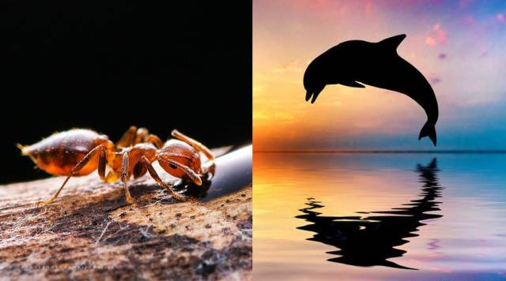

# r-K繁殖选择理论

> r-K理论：[百度百科](https://baike.baidu.com/item/r-k选择)、[维基百科](https://zh.wikipedia.org/zh-hans/R/K%E9%80%89%E6%8B%A9%E7%90%86%E8%AE%BA)

这是一个进化理论，认为生存策略大致分为两种：

- r策略，就是按照概率（rate）来进行繁衍的，生1万个，成活100个，就能延续后代，剩下的死了就死了吧。
- K策略，就是少生优生，将所有的资源都用于个体的发展，比如生5个，成活3-4个，才能延续后代。

所以在生物进化中，从适用场景看：

- r策略，适用于：环境多变，不稳定。
- K策略，适用于：环境稳定，资源充足。

但是既然是进化的产物，必然也有各自的弊端：

- r策略，劣势：对资源消耗大，所以在生物界通常是个体较小的动物能够实现“量产”。
- K策略，劣势：对环境稳定性要求高，一旦环境多变，种群就容易灭绝，比如恐龙。

r-K策略之所以被生物界以外广泛引用，是因为它是个普世的道理：

在日常工作生活中，这些策略同样适用：

- r策略：典型代表：资本投资，创新孵化。
- K策略：典型代表：大型企业。

以上结论是在假定市场环境稳定的情况下的静态分析结果。

以实施K策略的企业视角看：如果市场环境多变，可能就要适当转换为r策略。

- 如果谈转型是因为环境多变的问题，那么就可以广种薄收，选择多元化经营思路。
- 如果某个产品具有稳定的市场和环境，那么就要集中所有人力物力，转型K策略。

其他场景同理。

思考心得，和你分享。

## 关于r-K策略的一些讨论（起于生物学但终于社会学）

这是在《万维钢精英日课第5季》-《野生问题》（下）：从r策略到K策略一文的[评论](https://www.dedao.cn/knowledge/note/detail?id=gZdLwQEoAnOQkzD7kQGVV1PGmVDY2K)中，我的描述。

结论：

- r-K 是极值，至少作为非生物学的启发而言，足够解释大部分的现象和现实策略了。
- r-K 是和环境协调共生的，生物靠进化而获得，但是人类可以靠决策来选择，不必拘泥于 r-K，适时调整、实时进化。

## See also

本文最初于2017-12-07 22:45发表在微信公众号[极简思维](https://mp.weixin.qq.com/s/aMm040Wcs7jSLW-AcselpQ)中，未在此留原稿，特此同步更新（更新时进行语句上的微调）。
