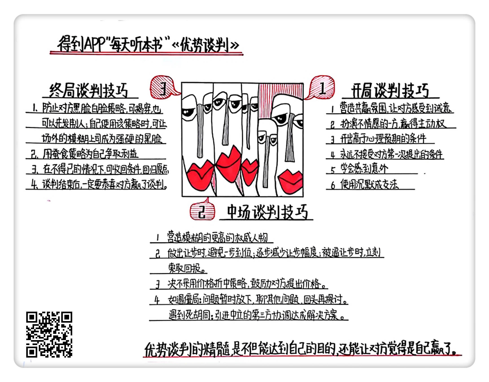

《优势谈判》| 闫霖解读
==================================

购买链接：[亚马逊](https://www.amazon.cn/优势谈判-罗杰•道森/dp/B0015BUZSU/ref=sr_1_1?ie=UTF8&qid=1508396964&sr=8-1&keywords=优势谈判)

听者笔记
----------------------------------

> 作者按谈判的时间顺序，把谈判分为开局、中场、终局三个阶段。
>
> 开场：以双赢为目标，以假装不情愿、故意开高价等手段来获得想要的报价，以惊讶、沉默等方式锁定想要的价位。
>
> 中场：避免自己守不住价格底线，可以营造出自己定不了，有个更高的权威存在。如果一定要让步，就要把握节奏，控制粒度，尽量少让步。如果陷入僵局，视不同情况，先稳定局面缓和气氛，再进一步和谈。
>
> 终局：可以用黑脸白脸的策略，自己演白脸。使用蚕食策略，最后赢回一些利益。如果对方想要争取更多的利益，可以通过收回自己的一些已经答应的条件，来阻止这种行为。最后，无论如何，尽可能让对方觉得自己才是这场谈判的赢家。

关于作者
----------------------------------

本书作者美国的罗杰·道森先生，是美国前总统克林顿的首席谈判顾问，美国 POWER 谈判协会的创始人兼首席谈判顾问。他曾经被《福布斯》杂志评选为“全美最佳商业谈判教练”，他开设的谈判课程，被称为是“国际上最权威的商业谈判课程”。

关于本书
----------------------------------

在本书里，作者按谈判的时间顺序把谈判分为开局、中场、终局三个阶段，让读者有一个清晰的谈判框架。并且对这三个部分提出了相应的谈判技巧，教我们怎样取得双赢的谈判效果。

核心内容
----------------------------------

本书的核心思想是达到自己谈判目的的同时，还要让对方有一种赢了的感觉。这就需要我们掌握一些谈判原则，并且要学会开局、中场和终局的技巧。 
 

一、开局谈判技巧

1. 营造一个共赢的谈判氛围

（1）谈判不是一种你死我活的“零和游戏”，谈判的目标是要达成一种共赢的状态。

（2）避免产生对抗性的气氛，不要表现出咄咄逼人的态度。

（3）不要马上去反驳对方，因为反驳会让对方拼命强化自己的立场，最好先能表示理解对方的感受，引向一个新的方向。

2. 扮演一个不情愿的买家或者卖家

【案例】特朗普在急需资金的情况下，扮演不情愿的卖家，把酒店卖出了高价。

3. 开出一个高出你心理预期的条件
4. 永远不要接受对方第一次的报价

【案例】苏丹叛乱分子劫持人质

5. 表现得非常惊讶
6. 沉默成交法

（1）“对不起，你可以给我一个好的价格”，然后就闭嘴。

（2）如果对方和你使用沉默成交法，你可以反问对方：“那你希望给你一个怎样的价格呢？”要想办法迫使对方不得不给你一个具体的数字，在这一点上一定要把注意力集中到具体的金额上，不要去理会交易总额，不要去理会百分比。

二、中场谈判策略
----------------------------------

1. 营造一个模糊的更高的权威

（1）不要沉浸在一种大权在握的感觉里，喜欢自己拍板在谈判中是对自己非常不利的。

（2）模糊的权威可以是董事会、委员会、合伙人、或者某一个部门。

（3）你从一开始就要防止对方用这个策略，要激起对方的自我意识。同时你也可以让对方作出承诺，一定会在他所谓的上司面前积极地推荐你的方案。如果对方没完没了地请示他的“上级”，那么你就以其人之道还其人之身，你也去请示自己的“上级”，对方就明白了，会及时停止这个把戏。

2. 怎样让步才最合理

（1）避免一步到位。

（2）不要让对方发现你的让步模式，不要每次让步的幅度都一样，更不要越让越多。

（3）正确的做法是逐渐减少让步的幅度，也就是越让越少。

（4）如果对方逼你作出让步，你要立刻索取你的回报，你可以问对方：“如果我做出这个让步，你会给我什么好处呢？”

（5）绝对不要采用价格折中的策略，尤其是不要自己主动提出来把价格折中，要鼓励对方说出来。

3. 陷入僵局、困境、死胡同的策略

（1）僵局就是双方产生了巨大的分歧，但是还愿意继续谈下去。这个时候你可以把遇到的问题先放下，暂时搁置一会，先从其他的问题入手。

（2）困境就是谈判双方都无法取得实际有意义的进展。你可以更换一下小组的谈判成员，或者建议双方休息一下，吃完饭之后再讨论，聊聊双方的爱好，暂时缓和一下气氛，约定好一个时间再接着谈。

（3）死胡同是双方都认为已经没有必要谈下去了，认为不可能有进展了。唯一办法就是引入第三方来协调，这个第三方一定要以一个“中立者”的形象出现。

三、谈判终局策略
----------------------------------

1. 黑脸白脸策略

（1）应对这种策略最好的方式就是识破他。你可以微笑着和对方说：“你们不是在和我玩黑脸白脸的把戏吧？快坐下来好好谈谈吧。”通常情况下，对方会很尴尬，不得不选择放弃这种策略。

（2）告诉对方的白脸：“我知道你们是在用黑脸白脸策略，从现在开始，无论你们的黑脸在说什么，我都会理解成是你的意思。”这样你就可以把对方的白脸也变成黑脸，巧妙地化解掉了对方的策略。

（3）如果一开始，对方就带着一个明显要扮演黑脸的角色出现，你可以采用先发制人的策略。直接告诉对方：“我知道你是来扮演黑脸的，我建议你不要这样做，你知道我们都想解决问题，所以还是来讨论一个双赢的方案吧。”

（4）你可以在谈判小组中制造一张黑脸，或者你亲自扮演黑脸。

（5）在场外虚构一张更强硬的黑脸，可以让你的模糊上司成为一张更黑的黑脸了。

2. 蚕食策略

（1）在谈判快结束之前，为自己争取更多的利益。你可以让对方答应一些一开始对方回绝的要求。

（2）如果你发现对方在对你使用蚕食策略，可以先微笑着拆穿对方，和他说：“你这样做很没档次啊。”然后你可以用书面的形式告诉对方这些条件的价格，同时告诉对方你没有权利这么做，需要请示上司才能同意，最后再来一个黑脸策略，让对方知难而退。

3. 收回策略

如果你发现对方一直在使用各种策略，不断地榨取你的利润，想把你逼到墙角。在这种不得已的情况下，你还有最后一个策略，就是收回你的条件，让一切回到原点。

4. 让对方感觉自己赢了

（1）如果你的对手受到过良好的谈判训练，对自己的谈判能力很自负，非常不喜欢那种输掉谈判的感觉，这个时候不妨做出一些小让步。

（2）在结束谈判之后，一定要恭喜对方赢得了这场谈判。 

金句
----------------------------------

1. 优势谈判的精髓是不但能达到自己的目的，还能让对方觉得是自己赢了这场谈判。
2. 你开出比较高的薪资条件，会让对方感觉你是个比较有能力的人。
3. 谈判高手们都知道，在谈判开始，双方提出的条件都是比较离谱的，所以他们也不会太在意。
4. 就连美国总统在谈判中，也要和对方说，我要去咨询一下谈判顾问和议员们的建议。所以就算你是可以最终拍板的那个人，也要塑造一个模糊的、更高的权威。
5. 如果遇到很狡猾的对手，在不得已的情况下，你可以收回你的条件，让一切回到原点。

撰稿：闫霖

脑图：摩西

讲述：于浩 