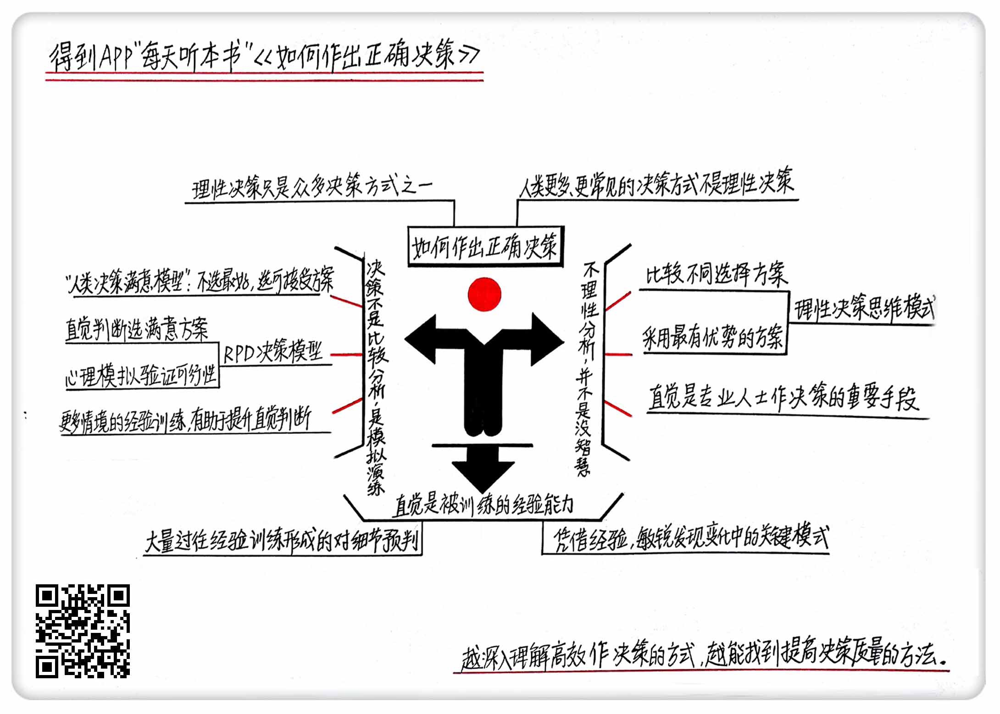

《如何做出正确决策》| 成甲解读
=======================================

购买链接：[亚马逊](https://www.amazon.cn/图书/dp/B01DOWBBPI/ref=sr_1_1?ie=UTF8&qid=1506686921&sr=8-1&keywords=如何做出正确决策)

听者笔记
---------------------------------------

> 虽然理性分析看起来很科学，但是人们在真实世界里更多的是靠直觉来做决策。
>
> 直觉并不是与生俱来的第六感，其实是经验积累起来的。
> 
> 做决策的过程，不是进行一堆方案比较的结果，而通常都是将直觉所提供的方案进行演绎，寻找可行的方案。
> 
> 但是能够凭借直觉做决策，通常需要在该领域内有大量的时间沉淀，只有这个领域内的专家能够通过直觉决策，而新手通常没有这种直觉。
>
> 而新手如果想要成为专家，就得在这个领域内投入大量的时间，对各种场景进行经验积累，才能成为专家。
>
> 【听者思考】：这样的决策通常是指需要快速进行决策的过程，有一些场景更适合于理性决策的过程，专家或许是可以在理性决策后，在多个方案中，通过直觉进行最后决策的人，这样的决策相对可以复制，也更容易大规模协作。

关于作者
---------------------------------------

加里·克莱因，美国著名认知心理学家，是自然决策方法的发明者之一。他是美国政府和企业敬佩的决策导师，麦肯锡公司和美国心理学会赞誉他为“决策思考思想学派大师”。诺贝尔经济学奖得主丹尼尔·卡尼曼，曾评价克莱因是“恰当运用应用心理学的绝妙人物，也是一个一流的观察家”。

关于本书
---------------------------------------

本书基于一种非常客观且全面的观察，即人们在现实约束、时间压力、高风险、个人责任、条件转移等情况下，直击决策真相，揭秘是什么在影响人们作决定，从而指导你如何快速作出决策，并稳妥地采取行动。

核心内容
---------------------------------------

一、决策时不进行理性分析，并不代表分析没有智慧；二、直觉判断未必是一种天生的能力，而是可以被训练出来的；三、作决策不是比较的过程，而是模拟演练的结果。
 

一、决策时不进行理性分析，并不代表分析没有智慧
---------------------------------------

1. 理性决策

理性分析判断的思维模式是先明确目标是什么，然后思考这个目标可能有哪些解决方案，比较每个方案优点是什么、缺点是什么，最后从不同的方案当中选择一个优势最明显、劣势最少的方案进行执行。
2. 真实情况下，人们并不总是用理性来作决策

人们在现实约束、时间压力、高风险、个人责任、条件转移等情况下，往往无法采用理性分析判断的思维模式，而是凭借着直觉作决定。也就是说，直觉是经验丰富的专业人员在真实情况下作决策的一个重要方式。

【案例】面对火灾灾情的变化，消防员如何快速作出决策。

二、直觉判断未必是一种天生的能力，而是可以被训练出来的
---------------------------------------

1. 有些直觉判断为什么是正确的？

直觉，是可以通过大量过往的经验训练形成的很多对细节的预判。如果现实情况和预判不一致，人就会产生一种有哪里不对劲的直觉，它会帮助人们作出正确决策。

【案例】消防中尉的“第六感”救了消防兵们的命。
2. 反常识的结论：直觉是可以被训练出来的能力

直觉并不像大多数人想象的那样，是一种天生的不可言说的感觉，相反，直觉是一个可以不断被训练的结果。

【案例】有经验的护士凭直觉判断婴儿是否生了病。

三、作决策不是比较的过程，而是模拟演练的结果
---------------------------------------

1. 人类决策的满意模型

（1）在现实环境中，人们作决策不是选择最好的方案，而是选择满意的、可接受的方案。这个理论是由诺贝尔经济学奖的另一位得主赫伯特·西蒙提出来的。

（2）选择最优的决策方式需要耗费很长的时间，而选择满意的决策方式能让效率高得多。
2. RPD 决策模型

（1）作决策并不是去一一比较各种方案之间的优劣，而是去看令自己满意的方案在经过心理模拟之后是否可行。这种通过直觉产生解决方案，再利用心理模拟来验证是否可行的方式，被作者称为 RPD 决策模型，也叫识别启动决策模型，是人在真实环境下作决策的一个非常主要的方式。

【案例】高速公路上的车祸救援方案，是救援指挥官心理模拟后的结果。

（2）反常识的结论：大多数情况下，专家会凭直觉作决策，新手则做不到。经验越丰富、识别能力越强、应对不同情况越多的专家，越能高效正确地作出决策判断。

【案例】国际象棋大师大多数情况下是依赖直觉来下棋。
3. 解决问题的力量之源

理性决策只是众多决策方式中的一种，在时间紧、压力大、变化复杂的自然状态下，人们往往依赖经验直觉来作出决策。

（1）分析式的力量之源：比如逻辑演绎和数据分析等能力。

（2）非分析式的力量之源：比如直觉、心理模拟、经验迁移的能力、发现问题的洞察力、团队之间密切合作的能力、理解别人意图的能力等不用理性分析去解决问题的能力。

4. 新手如何成为专家

与其教新手方法和流程，不如让他在更多情境下进行经验训练，有助于提升直觉判断能力和心理模拟能力，从而提高决策质量。

金句
---------------------------------------

1. 决策时不进行理性分析，并不代表分析没有智慧。
2. 理性决策只是众多决策方式中的一种，在时间紧、压力大、变化复杂的自然状态下，人们往往依赖经验直觉作决策。
3. 直觉判断未必是一种天生的能力，而是可以被训练出来的。
4. 我们作决策的时候，并不是去一一比较各种方案之间的优劣，而是去看令自己满意的方案在经过心理模拟之后是否可行。
5. 大多数情况下，是专家而不是新手在凭直觉作决策。

撰稿、讲述：成甲

脑图：摩西