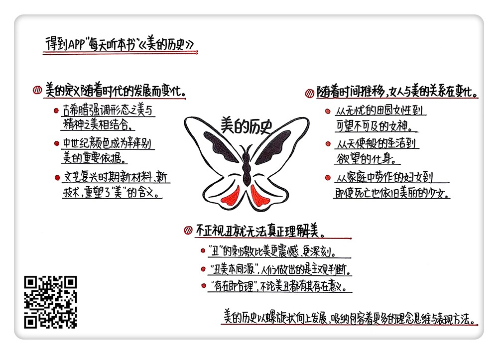

《美的历史》| 馥蕖解读
================================

购买链接：[亚马逊](https://www.amazon.cn/美的历史-翁贝托·艾柯/dp/B005WR9AVQ/ref=sr_1_1?ie=UTF8&qid=1509111444&sr=8-1&keywords=美的历史)

听者笔记
--------------------------------

> “美”是社会思潮在视觉领域的体现，美的定义随着时代的发展而不断变化。
>
> 在美的历史中，女性起着不可或缺的作用。从一开始对女性的外表、渴望等艺术表达，到后来对心灵美的刻画，都对描绘女性的美进行了不断地补充。
>
> 作者认为美的对立面不是丑，甚至有的时候，丑其实就是美，美的对立面应该是崇高。

关于作者
--------------------------------

翁贝托·艾柯被称为“20世纪后半期最耀眼的意大利作家”“百科全书式”的作家。他一生中留下了140多部、横跨各个领域的著作，内容涉及美学、哲学、文学、符号学等多个领域。 

关于本书
--------------------------------

在本书里，作者艾柯通过列举大量不同时期的艺术作品，结合当时的文化思想，试图探寻不同时期“美”的理想境界。本书并没有对“美”给出具体的定义，相反的是，作者认为“美”并不是一成不变的，它会在不同的历史时期，随着意识形态的改变，展现出不同的特点。 

核心内容
--------------------------------

本书思想核心是：“美”是一个不断更迭、反复交错的过程。比如某一时段被诗人歌咏的美，在若干世纪后才会被画家、雕塑家塑造出来；又比如，因为思想领域的不断变迁，后世的艺术家一方面受到上个风格极其强烈的影响，另一方面又急切地想要推翻这一影响，形成自己独立的风格。“美”的概念不断游走在各个形态中，没有统一的标准。 
 

一、不同时期中“美”的变迁 
--------------------------------

在这本书里，艾柯为我们列举了各个时期“美”的特点，指出“美”是社会思潮在视觉领域的体现，美的定义随着时代的发展而不断变化。

最早，古希腊人认为，“美”是其他特质的附庸。后来柏拉图将美独立出来，美从此有了自己的地位。毕达哥拉斯认为万物源于“数学”，由此，“对称”成为古典希腊艺术至高无上的审美原则之一。

中世纪并不如现在我们想象的那么黑暗，那时的人们自认为活在灿烂的环境中。光与色彩是中世纪美学的重要特点，哥特式教堂的玻璃窗就是这一特点的最好佐证。

15至16世纪，受到透视法、新柏拉图主义、神秘主义等影响，美学概念出现了双重取向。准确描绘物体比例变得不再重要，艺术家们更偏向于表达自己的主观感受，象征意味浓厚的物体出现在画面中，美充满了神话般的幻觉感。然而很快，艺术作品又趋于朴实，美又与实用主义相联系。

文艺复兴后期，“比例”不再是艺术创作的教条，而演变成了一种创作工具。美呈现出了多样的形态。风格主义强调表现创作者的内心，而紧随其后的巴洛克风格又充满了奔放的装饰。受到理性思潮的影响，美学观点进入了动荡时期。17世纪，巴洛克风格进入晚期，由戏剧领域开始，新古典主义诞生了。新古典主义者对传统理论的不断批判，引起了对“美”定义的争执，美的判断标准更加难以界定。

19世纪，浪漫主义蓬勃发展。人们对于社会的不安情绪反映在了美学上。悲剧、死亡主题的兴盛，放大了人们的情绪，以至于发展到了颓废主义。当然，在其中也出现了一些如丹弟主义、象征主义、印象派、维多利亚风格等各类不同的美学观点。在同一时期内，对美的不同理解反映了社会上各类思想交融、动荡不安。

新材料的出现催生了新艺术的出现，工业浪潮的影响使新艺术走向了功能主义。艺术与工业相结合，涌现出了具有装饰风格的工业制品。当商品大量涌现，“艺术”简单易得，美因此变得更加脆弱。商业、媒体塑造大众审美，让当今的美稍纵即逝，难以言说。

二、女性与美的关系变化
--------------------------------

作者认为在美的历史中，女性起着不可或缺的作用。在道德严苛却又直面情欲的中世纪，女性的美神圣不可侵犯，但又令人渴慕。在这种矛盾的作用下，产生了一系列以“得不到的爱”为题材的诗歌、小说、戏剧。而后，女性形象逐渐升华，艺术家描绘的女性形象，如天使般圣洁，艺术作品中众多的“维纳斯”，体现了这一点。

文艺复兴时期，女性参与到各类社会活动中来，甚至活跃在辩论与哲学的讨论中。这时的女性之美，不再只是诱惑与圣洁的象征，而是充满了个人化的风格。16至17世纪，随着宗教改革的进行，女性的形象重回家庭，女性的美演化成一种实用之美。巴洛克时期，浮夸奢华的社会风潮让对女性的描绘也变得高贵而甜美。18世纪，女性要求在社会舞台上发出自己的声音，此时的女性之美沾染上了理性思潮的特点，显现出独特的美感。随后，受到浪漫主义的影响，对女性美的解读突破了外表的局限，开始关注观者的情感波动。在关于女性的故事中，开始显现女性的嫉妒等性格弱点，同时女性的命运被安排上了悲剧色彩，女性的美往往体现在死亡的那一刻。在颓废主义时期，在充斥着堕落与颓废的社会中，花和女性，依然作为为数不多的“美”的象征，存在于艺术家的作品中。

时至今日，由现代社会打造出来的“美”的女性模型，传导着现代女性美的定义。不同类型的女性之美不断更替，成为促进消费的利器。

三、“美”的对立面是什么？ 
--------------------------------

作者将怪物、机器等一些丑恶或者令人心生恐惧的事物列举在书中，打破了人们常规认为的“美”。这是因为作者认为，在艺术史中，“丑”与“美”是紧密相连的，“丑”即是“美”。

在希腊神话中，守护秩序的阿波罗和破坏一切的戴奥尼索斯同时存在，证明了“美”并不是时时都令人愉悦的。

出于好奇心的影响，人类对于神秘事物的探索将永不停止。在中世纪时期，怪物就作为一种神秘而又富有象征色彩的存在，成为艺术家们的创作题材。人们不太关注这些东西“美”或“不美”，只是“探索怪物”这件事情令人着迷。这种探索到后期逐渐转移到对怪物的形态解剖上，怪物的自然意义逐渐取代了象征意义。

作者认为“丑”并不是美的反面，他引用了思想家康德等人的观点，认为美的对立面是崇高。“美”小而精致、“崇高”庞大粗野。“崇高”会给我们带来压迫性的感受，让人们感受到自己的渺小。这种压迫性的恐惧感虽然不同于美，却更能激荡人心。

破坏给人带来的快感，比顺从更加强烈。浪漫主义的冲突与反叛，让丑成为了美的补充。忧郁、阴暗、死亡这些有破坏性的词语，成为了常见的主题。人们用丑来展现美，或者说是用美来展现丑，丑与美不再有界限。由颓废主义衍生出来的撒旦主义更是把破坏与颠覆当作准则，崇尚魔鬼的力量。在这个时期，与常规的美学不同，丑占据了人们的生活，破坏带来的快感使丑具有了更大的吸引力。

今天，美与丑的界限更加模糊。人们的接受能力大大提升，对于能带来刺激的东西，不再辨认美丑，而是全盘接受。

金句
--------------------------------

1. 美是社会意识形态在视觉层面的体现。
2. 美的历史以螺旋状向上发展，越向上，开口就越大，吸纳包容着更多的理念思维与表现方法。 
3. 美好爱情故事的主题源于女性的美，而所有的痛苦、折磨，甚至灾难，也源于女性的美。
4. 万物都是均衡存在的，有了美的存在，丑也变得合理，丑物是维系世界和谐的一部分。
5. 人类与生俱来的好奇心是孕育丑的温床。未知的事物总是充满惊奇，令人着迷，哪怕这种东西观赏起来并不令人愉悦。

撰稿：馥蕖

脑图：摩西

转述：顾一菲