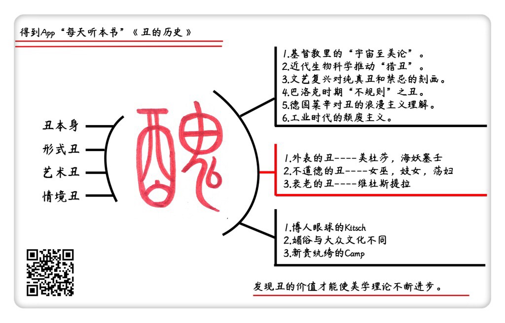

《丑的历史》| 吴彩鸾解读
================================

购买链接：[亚马逊](https://www.amazon.cn/丑的历史-翁贝托•艾柯/dp/B0091P6M7U/ref=sr_1_1?ie=UTF8&qid=1509111411&sr=8-1&keywords=丑的历史)

听者笔记
--------------------------------

> 丑不依附于美而自成体系地存在，并被人们认知，丑存在于生活的方方面面，甚至人类自身。
>
> 说到丑，就不得不提到女人的丑，似乎美丑都和女人天然相关。女人的丑被分为三种主要形态：外表的丑、不道德的丑、衰老的丑。
>
> 媚俗，是将丑的扭曲成美的，但仍然是丑的，而坎普，则是精英文化对庸俗文化的某种认同，是发自内心对一个“丑”的事物表示喜欢，你可以认为它是丑的，别人也可以认为它是美的。

关于作者
--------------------------------

翁贝托·艾柯，意大利著名美学家、符号语言学家、哲学家、历史学家和文学评论家，被誉为“当代达·芬奇”。作为全球最具影响力的研究学者之一，他在欧洲已成为知识和教养的象征，人们都以书架上有一本艾柯的书为荣。他那种“对花言巧语的厌恶、从不过激、从不做夸大其词的断言”的治学风格，潜移默化地影响着一代又一代读者。 

关于本书
--------------------------------

本书以丰富的图文资料展示了丑的种种形态，还原了人类对丑的审美观念史，并将丑从美的附庸地位中拯救出来，梳理出其自成体系的发展脉络，第一次给予“丑”独立而自尊的地位，也借此提醒我们反思人性的复杂。 

核心内容
--------------------------------

本书将丑分为四种类型：第一种是丑本身，比如呕吐物和尸体；第二种是形式的丑，比如不合比例的五官；第三种是艺术对丑的刻画，比如画家笔下的尸体；第四种就是情境的丑，比如阴森的楼道，或者忽明忽暗的房间。可见丑不能简单概括为美的反面，它存在于视觉、心理和伦理等各个方面，也会化身为恐怖、阴森、邪恶和下流。

丑是审美中非常重要的一部分，也是长期被忽视和低估的一部分。丑不仅不是美的附庸，还自成体系，有着更复杂、更丰富的规律。比如价值观解体的时代会出现媚俗，而宗教气氛浓厚的希腊世界与基督教世界则将丑视为和谐宇宙的一部分。到了艺术昌明之时，包括丑在内的一切事物都被重新拿来审视，当创造美的能力足够充沛的时候，美丽的刻画可以令丑陋重生。所以说不认识丑，就难以全面认识我们的文明。因为丑不只是独立于人的客观存在，还是我们内心罪恶的一种反映。
 

一、关于丑的几次胜利 
--------------------------------

一直以来被我们忽视和低估的丑，其实从希腊时期就在艺术品中占据了一席之地。到了基督教世界，“宇宙至美论”承认了丑在宇宙秩序中的作用，经院哲学就将美与丑比作光影的明暗对比。近代生物科学昌明之后，人们在面对丑陋之物时，好奇心代替了恐惧，科学代替了宗教的恐吓。文艺复兴艺术及巴洛克艺术则将丑作为刻画的对象，表达讽刺与同情，象征了某种古典精神的消亡。工业革命开始之后，令人作呕的事物成为艺术家手中的利剑，前卫运动则将丑作为美的典范。丑的胜利到此为止，彻底模糊了与美之间的界限。

经过这几次胜利，人们逐渐认识到丑不是美的附庸，而是自成体系的。人们对丑的态度也从原来的深恶痛绝，变成试着欣赏它的温柔甚至狂热地推崇丑。所以这几次“丑”的胜利意义深远。不了解这几次胜利，就不能说真正地了解丑，甚至也错过了有关美的内容。

美与丑相反相成的关系表现为，在寻找美的漫长过程中，人们迎头却碰上了丑：或者在表达美的过程中，不自觉地借用了丑的外形；或者沉浸在丑当中时，却发现这是美的所在；还或者发现神龛中所供奉的美一点也不美，那亦正亦邪的形象，竟然是自己的影子。这种逐步意识到丑之价值的过程，是美学理论史不断进步的过程，也是人们从古典世界进入现代世界，甚至后现代世界的过程。或者可以说，这是我们人类不断自我认识的过程。

二、关于女人的丑
--------------------------------

女人的丑和女人的美一样令人印象深刻，并且是丑的形态中不容忽视的一种。如果你翻开《美的历史》这本书，会发现某些女性形象似乎是专门为美而生的。但这并不表示女人的形象只与美丽有关，恰恰相反，正是因为女人与“美丽”这个词语之间的某些联系，人们更乐见其丑。一个赞美少女之美的人，很可能转身就奚落丑女之丑。

作者翁贝托指出，女人的丑大概分为三种：外表的丑，比如用毒蛇做头发的美杜莎；不道德的丑，比如妓女和荡妇；衰老的丑，比如老妇人。不论女人的丑在艺术中是怎样表达的，都离不开这三种形式，而外表过丑或者过美都会被认为象征着灵魂的邪恶。古典世界艺术品所刻画的女人之丑，很大程度上来源于对女性根深蒂固的仇恨，最典型的例子就是中世纪著名的“猎杀女巫事件”。但文艺复兴之后，女人的缺陷又成为感官刺激的来源，或情绪表达的载体，濒死的美女或者丑陋的老女人会成为诗歌中歌颂的对象，颓废主义则宣扬丑的放纵，在艺术品中歌颂死神般的女神。

托名为“丑女”的对女性根深蒂固的仇恨，背后反映了人性的黑暗和丑陋，而现代艺术中女性的皱纹与病痛，则作为载体表达了某种激烈或黯然神伤的情绪。这种情绪只能来源于丑的刺激，而非美的抚慰，所以现代艺术更偏爱丑陋的女人。

三、媚俗与坎普
--------------------------------

媚俗产生于大众文化，又反过来丰富了大众文化的多样性，与我们的生活最为息息相关。本书作者给出了媚俗的定义：媚俗不是以产生有刺激或者吸引力的效果为目的，也不是重复已出现过的风格元素，媚俗是对自身产生效果的功能自说自话，卖弄有名无实的体验，并且毫无保留地把自己当成艺术品出卖。作者指出，媚俗有种虚妄的色彩，这种虚妄背后是伦理的罪恶。媚俗之人不能只用审美标准来衡量，因为他已经是一个有心造恶的罪犯。一个媚俗之人，追求的不是美，而是美的效果，这是美学上的罪恶。而且媚俗总在价值解体的历史时期格外繁荣，而这样的时期，是以罪恶感和焦虑感为基础的。

坎普与媚俗不同，但坎普在一定程度上拯救了媚俗，因为某些被视为坎普的艺术作品，的确可以算媚俗之作。坎普艺术消解了部分媚俗之丑，则出于新派的纨绔子弟对粗俗事物的良好品味与喜剧态度。这种态度源于精英文化对庸俗文化的拯救，精英文化开始欣赏某一类的丑，甚至用丑来代替美的位置。自此，美与丑不再像古典时代那么非黑即白，因为你很难再说美就是好的，丑就是坏的。实际上，坎普爱好者不是粗俗的爱好者，他们只是更加包容，因为他们只想去品味而不是去批判，所以坎普也可以被称为一种“温柔的情感”。虽然欣赏媚俗之作，并且热爱粗俗，但坎普仍然认可良好的趣味，只不过相比传统审美，它认可了对劣等趣味的良好趣味。比如夸张的不规则的首饰，印着粗俗俚语的衬衫，专门用来模仿伤口的文身贴，恶搞的微信头像等等，这些东西在我们父母眼中不伦不类，但不妨碍我们自己以欣赏和趣味的眼光看待它们。简而言之，媚俗无疑是丑的，因为它反映了所处时代罪恶的骚动。但坎普解构了一切，它以纨绔子弟的喜剧精神，表达了一种可以容纳粗俗的感受力。

金句
--------------------------------

1. 正是因为女人与“美丽”这个词语之间的某些联系，人们更乐见其丑。一个赞美少女之美的人，很可能转身就奚落丑女之丑。
2. 老派纨绔子弟的乐趣在拉丁诗歌、稀有酒类和天鹅绒上衣上，但新派的纨绔子弟，也就是坎普的爱好者，他们的乐趣在那些最通俗、最常见的大众乐趣上。老派的纨绔子弟面对粗俗时，厌恶地皱着眉头，用洒了香水的手绢捂住鼻子，而新派的纨绔子弟热爱粗俗，他们努力去闻那些恶臭，并为自己坚强的神经洋洋得意。
3. 这一次，是巴洛克之美超越了善恶，打破了客观的模型，通过丑陋与死亡来表达美与生命力。人们不再对丑深恶痛绝，而是发现了它的温柔。
4. 媚俗之人不能只用审美标准来衡量，因为他已经是一个有心造恶的罪犯。一个媚俗之人，追求的不是美，而是美的效果，这是美学上的罪恶。而且媚俗总在价值解体的历史时期格外繁荣，而这样的时期，是以罪恶感和焦虑感为基础的。如此看来，媚俗还仅仅是“不够艺术”这么简单吗？
5. 梵高在创作《星空》这幅画的时候，完全处在一种自我表达的状态中，他并没有去考虑画廊老板是否会喜欢这种颜色，他只考虑这种配色是否符合他心中的艺术理想。而在梵高出名之后，模仿他画作来挣钱的人，就是媚俗。

撰稿：吴彩鸾

脑图：摩西

转述：成亚