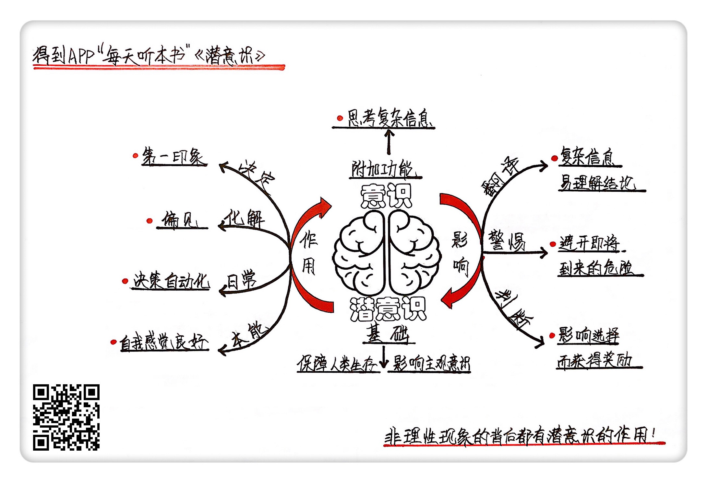

《潜意识》| 梁境心解读
=============================

购买链接：[亚马逊](https://www.amazon.cn/潜意识-控制你行为的秘密-列纳德•蒙洛迪诺/dp/B00C1SY730/ref=sr_1_1?ie=UTF8&qid=1508765970&sr=8-1&keywords=潜意识)

听者笔记
-----------------------------

> 潜意识和意识不同，潜意识处理了大量的信息，帮助我们快速判断事物、识别物体、躲避危险等。
>
> 因为人类擅长使用潜意识来处理问题，所以我们可以利用潜意识的特点来做很多事情：获得他人认可、避免果断决策、通过利用别人的潜意识来达成目的、增强自信、增强信心。

关于作者
-----------------------------

列纳德·蒙洛迪诺，美国著名理论物理学家，任教于加州理工学院。他和霍金共同写成了《时间简史》。蒙洛迪诺还创作过很多电影和电视剧剧本，其中包括《星际迷航》。
   
关于本书
-----------------------------

《潜意识》向人们揭示，在我们的每一个选择和行为的背后，都有一股难以察觉的力量。这本书在广受好评的同时，对我们的行为方式也产生了深远的影响。国际知名杂志《经济学人》对《潜意识》这本书的评价是：“作为理论物理学家，蒙洛迪诺成功拓展了通俗科普读物的边界；这本书将潜意识的重要作用摆上了科学的台面，这一结果令人惊叹。”通过这本书我们可以知道：潜意识产生的机制是什么，以及如何通过潜意识的积极作用为我们服务。     

核心内容
-----------------------------

核心内容分为三个部分，一、潜意识和意识的关系；二、潜意识对我们的作用是什么；三、如何利用潜意识的特性，为我们提供帮助。     
 

一、潜意识和意识的关系
-----------------------------

1. 我们往往以为，生活中我们做出的每一个选择和决定，都有着充分的客观理由，是我们理性思考的结果。
2. 人们相信自己的行为和判断都是由意识主导的，但实际上，潜意识在这些行为的背后也起到了很大的作用，甚至远超过意识的影响。
3. 意识和潜意识，它们像两套完全不同的铁路系统，各自在无数复杂的线路上运行，又在很多地方相连。两者的区别在于，潜意识是更为基础的，它从人类进化早期就开始不断发展，以满足我们最基本的生存需求。潜意识是所有脊椎动物大脑中的标配，动物们凭借潜意识躲避天敌、繁衍生息。意识却更像是一个附加的功能，它让人类可以思考和解决一些复杂的问题，但也无法脱离潜意识的影响。
4. 潜意识主宰着人的精神活动。无论你觉得自己正在无所事事还是绞尽脑汁，潜意识都在默默地、持之以恒地运转着。

二、潜意识对我们的作用是什么
-----------------------------

1. 我们大脑的三分之一都在处理视觉信息，从光的波长中分辨颜色，察觉物体的边缘和运动，辨认脸庞等等。这些视觉信息都是由潜意识来处理的。潜意识会完整地消化和翻译眼睛接收到的信息，然后将它们组织成一份简洁的报告，再交给我们的意识。

2. 潜意识为我们处理着大量的信息，把它们翻译成简单便于理解的结论，交给我们的意识。

【案例】

当我们看到屏幕上显示出的图片时，眼睛真正看到的其实是一个个像素。每一个像素都有自己的颜色，通过潜意识的分析，颜色相近、位置相邻的像素组成了形状，特定的形状又代表了特定的物体。于是，成千上万个像素被抽象成了我们熟悉的东西，这里是眼睛，那里是鼻子，我们就在屏幕上看到了一张人脸。甚至我们可以通过这张脸的面部表情来判断，它是难过还是高兴。

3. 潜意识还可以帮助我们躲避一些没有被意识到的危险。潜意识处理我们接收到的信息时，对我们所处的环境进行了观察并做出了简单的推断。当潜意识分析认为我们将面临危险的时候，这个推断就会以警告的形式被送往我们的意识。

【案例】

我们都经历过这样的时刻，一个人正走在路上目不转睛地盯着手机，突然不知道为什么就停了下来，猛一抬头，才发现自己如果不停下，马上就会被绊倒或者磕到头。我们往往只会感慨幸运和后怕，却不会想自己到底为什么停了下来。

4. 在生活中，我们都经常会做出方方面面的决定，在作出决定时，我们还会感知周围的环境，回忆过往的经历，再来做出判断，对事件做出回应。在这些过程里，我们都会受到潜意识的影响，但我们并没有明确的觉知。

【案例】

西班牙经济学家安东尼·罗杰尔曾做过一个有趣的实验，他找来一群志愿者，为他们每人提供同样的两杯红酒，告诉他们一杯很贵而另一杯很便宜，要求志愿者评价两杯酒是否有很大区别。相当一部分志愿者都认为贵的那一杯更好喝，但实际上，两杯酒的味道是相同的。也就是说，人们品尝红酒时，并不是只尝到了它的化学组成，酒的价格也在我们的潜意识里悄悄地影响着它的味道。

三、如何利用潜意识的特性，为我们的工作和生活提供帮助
-----------------------------

1. 我们可以利用潜意识的特性，让别人更容易认可我们。潜意识会让我们对人产生先入为主的印象。所以我们可以利用这种作用，让别人更容易认可我们。
2. 虽然我们对他人的评价往往看起来是理性的，但实际上，对他人的评价受潜意识的影响很深。换个角度来说，在与他人接触的时候，我们也要意识到潜意识里偏见的影响，做出尽量理性的判断。
3. 当别人向我们请求帮助时，只要对方能给出一个明确的理由，往往就能唤起我们给予帮助的欲望。而这个理由甚至不需要是充分的。因为潜意识要处理的问题太多，随着人类文明的发展，潜意识的职责变得越来越多，也越来越复杂，为了能抽出闲暇去应付更重要的工作，潜意识对一些日常决策进行了自动化。
4. 我们要看到潜意识赋予我们的力量。潜意识总是倾向于让我们相信自己非常优秀。这本质上是潜意识对我们的一种保护，让我们可以尽量不受到消极情绪的影响。潜意识让我们更加自信。
5. 心理学家发现，在潜意识中，人们都对自己有一个主观的判断，而人们的感情和行为会不自觉地和这种判断保持一致。而自我感觉良好可以让我们产生积极的心态，使我们更相信自己的能力。

【案例】

20世纪50年代，曾有人对心绞痛患者进行实验，声称要对他们心脏附近特定的几条动脉进行结扎，以此治疗心绞痛。而事实上只是在手术中打开再缝合上他们的胸腔，并没有对心脏进行任何操作。然而，患者却都表示症状得到了缓解。当我们相信事情会是某个样子的的时候，潜意识会引导我们在行为上进行配合，从而更容易获得想要的结果。     

金句
-----------------------------

1. 每个人都有一幅帘子，在社交中遮挡着真实的自己。
2. 我们无法抗拒我们的大脑自主吸收一些偏见，它弥漫在新闻、电视节目、电影和我们文化生活的方方面面。
3. 自卑和抑郁的情绪对人的方方面面都是有害的，为了让我们更加快乐，潜意识给了我们一种总是过度高估自己的本能驱动力。
4. 对自我有着准确的看法的人往往都患有中度抑郁或者感到自卑，与此相反，对自己有过高的自我评价的人往往非常健康幸福。

撰稿：梁境心

脑图：摩西

转述：于浩 