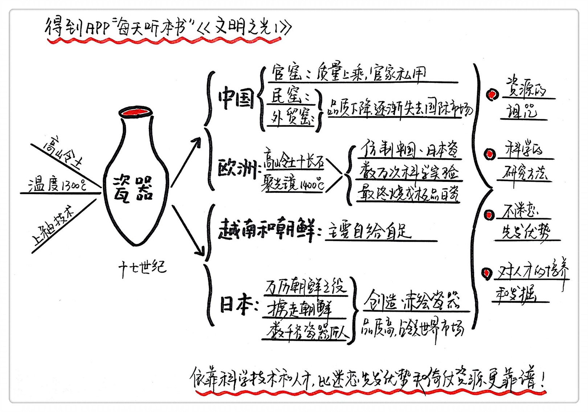

《文明之光1》| 张凯解读
=============================

购买链接：[亚马逊](https://www.amazon.cn/文明之光-吴军/dp/B06XPGZJ79/ref=sr_1_8?s=books&ie=UTF8&qid=1512226189&sr=1-8&keywords=硅谷之谜)

听者笔记
-----------------------------

> 瓷器发源于中国，因为高岭土、高温和上釉技术的发达，让中国的瓷器享誉欧洲。后来日本人从朝鲜奴役了一批制陶工人，因为资源匮乏，日本人只能对有限的资源精雕细琢，反倒造出了精品。欧洲的科学技术发展，采用严谨科学的研究手法，也很快探索出了陶瓷制作的秘密，而后蒸汽机的普及，让陶瓷进入了寻常百姓家。
>
> 陶瓷的发展史告诉我们，资源多不一定是优势，采用科学的方法才是王道，先开始的不一定能赢到最后，重视对人才的挖掘对技术的进步至关重要。

关于作者
-----------------------------

本书的作者是吴军，硅谷投资人，丰元资本创始合伙人，计算机科学家，著名的自然语言处理和搜索专家。他的著作《浪潮之巅》第一版荣获“蓝狮子2011年十大最佳商业图书”奖。而这本书《文明之光》也荣获2014年“中国好书”的称号。同时作者还是《得到》专栏“硅谷来信”作者。

关于本书
-----------------------------

这本书《文明之光》是作者走遍世界各地，探访现存的文明遗迹，查阅了世界各大博物馆相关的文物资料和文献之后写下的对于人类文明发展的见解。在这本书中，作者利用了他科学家的独特视角，带领大家清晰地了解到人类文明发展的因果和脉络。

核心内容
-----------------------------

第一部分，陶瓷在人类文明史中的角色。

第二部分，陶瓷制造的发展给我们的启示。
 

一、陶瓷在人类文明史发展中的角色
-----------------------------

瓷器是外国人认识中国的名片，是刺激西方化学和材料学发展的催化剂，是宣告人类工业文明开始的标志。

中国的陶瓷一度以高科技产品和奢侈品这两个身份在国际舞台上表演。中国的瓷器在外国人眼中就是高科技产品，谁拥有更多的中国瓷器，谁的综合国力就更强。在过去，外国人家里没有瓷器柜会被认为是没有品位。

普鲁士国王腓特烈一世在自己的宫殿里专门修了一个豪华的瓷器室，萨克森公国的国王奥古斯都二世曾经用600个近卫骑兵来和普鲁士国王换了150个大型龙纹瓷缸。

中国有生产陶瓷得天独厚的条件：高岭土，高温，和上釉技术。景德镇到处都是高岭土；在西汉时期我们就能用熔炉制造铁器；我们还早早就掌握了上釉技术，再加上我们森林茂密，燃料充足。还有个重要原因是依靠聪明才智。我们的祖先很早就利用南方多丘陵的地势建造出了大型的瓷窑。元代时候一个普通的青花瓷碗在国外能卖到30两银子。在很长一段时间里，青花瓷对外国人而言，根本无法模仿。

现在中国基本上已经退出了世界瓷器市场。17世纪时，我们的瓷器在国际市场上就开始走下坡路，只有官窑还保持着很高的水平，其他的民窑或是外贸窑的品质一落千丈。

日本的制瓷技术开始发展。重要的原因是因为他们注重对人才的挖掘。万历朝鲜之役之后，日本人绑架了1千多名朝鲜的瓷器制造工匠到日本。用了30年的时间就让日本的瓷器达到了欧洲商人的要求。日本创造出了一种全新的赤绘瓷器，这个发明直接改变了欧洲人对瓷器的品位，日本渐渐就成了亚洲瓷器的象征。

欧洲瓷器的崛起和欧洲的科学发展有关。奥古斯都二世囚禁两个炼金术师4年尝试炼陶瓷。在这4年的时间里他们一共做了3万多次试验，每一次试验之间的细小差异都记录了下来，终于让他们发现了陶土中各种元素之间的最佳配比。他们还用一种大型的聚光镜制造出了1400摄氏度的高温，烧制出第一批白瓷。

蒸汽机的出现，陶瓷实现大规模生产。高端瓷器被大规模生产后进入大众市场，瓷器在世界范围内开始变得供大于求。

二、陶瓷制造的发展给我们的启示
-----------------------------

1. 资源的诅咒

有时候资源多了反而不是好事。日本原材料相对贫乏，就必须进行深耕细作的加工。日本师傅带徒弟总是倾囊相授，徒弟在技能上超不过师傅是师傅的耻辱。这种精益求精的工匠精神能让陶瓷在普及的时代也能保持很高的价值。

2. 科学的研究方法才是王道

欧洲人通过定量分析和比较实验来一点点地弄清楚瓷器的成分和烧制原理，在研制过程中保留了全部的原始数据和实验报告。每取得一点点进步，后人都可以直接受益，而不是后人总是重复前人的失败。不偷巧是取得最后胜利的关键。

3. 不要迷恋先发优势

科技产品的发展其实是长跑，持续的改进和迭代才能带来持续的优势。

4. 对人才的挖掘

任何的高科技产业归根到底比拼的都是人，有人的地方就有商业，有人的地方就有创新。

金句：
-----------------------------

瓷器，不仅仅是一种盛器、一种商品，它曾经在世界文化交流中起着重要地作用，现在依然如此。西方世界通过它了解到东方的文明，并与东方展开了大规模贸易。瓷器贸易带来的巨大利润，又刺激了西方化学和材料学的发展，因为过去瓷器利润丰厚，瓷器制造业也成为历史上第一个采用蒸汽机进行大规模生产的行业，这宣告了人类工业革命的开始。从促进文明发展的各个角度来讲，世界上很难找到第二种商品能和瓷器相比。

撰稿：张凯

脑图：摩西

讲述：孙潇