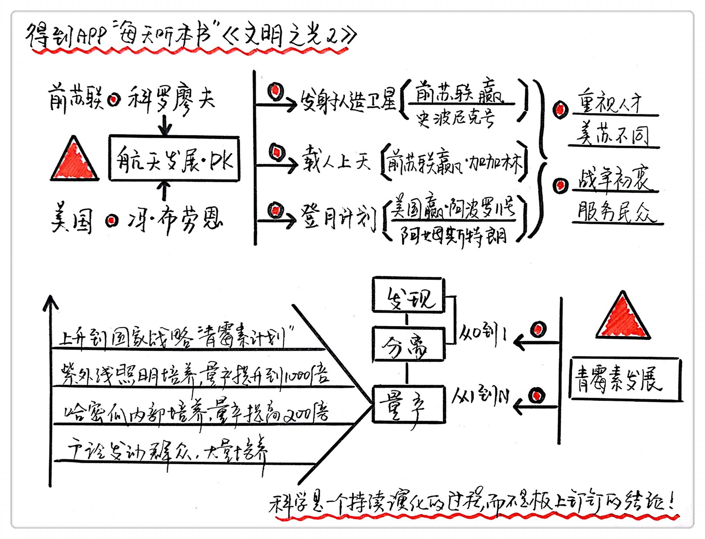

《文明之光2》| 张凯解读
=============================

购买链接：[亚马逊](https://www.amazon.cn/文明之光-吴军/dp/B06XPGZJ79/ref=sr_1_8?s=books&ie=UTF8&qid=1512226189&sr=1-8&keywords=硅谷之谜)

听者笔记
-----------------------------

> 美国和苏联对待人才的态度，以及对载人航天技术的不同方法，导致了美国在登月计划上的成功。
>
> 青霉素早被发现，但是实现量产却历经磨难，最后通过各种科学的方法实现了青霉素量产。

关于作者
-----------------------------

吴军，硅谷投资人，丰元资本创始合伙人，计算机科学家，著名的自然语言处理和搜索专家，《得到》专栏“硅谷来信”作者。

关于本书
-----------------------------

这本书《文明之光》是作者走遍世界各地，探访现存的文明遗迹，查阅了世界各大博物馆相关的文物资料和文献之后写下的对于人类文明发展的见解。在这本书中，作者利用了他科学家的独特视角，带领大家了解人类文明发展的因果和脉络。

核心内容
-----------------------------

一、苏美航天竞赛的历程；

二、青霉素的发展的故事。
 

一、苏美航天竞赛的历程
-----------------------------

苏美太空竞赛产生的科技成果被我们应用。我们婴儿用的尿不湿，最早就是给太空宇航员准备的，反辐射保暖衣和保温包、有记忆功能的床垫和枕头，原来都是太空服的一部分，数码相机成像的传感器，最初也是为了将登月图像传回地球发明的。

苏美航天竞赛的背后是两位天才的竞赛。一位是科罗廖夫，还有一位是冯·布劳恩。两位天才有两个共同点，一个是他们都是世界顶级的火箭设计专家，还有一点是他们都是囚犯。

科罗廖夫的一生都是以一个囚徒的身份献给了航天事业。在斯大林组织的一次大清洗中，被发配到西伯利亚，在监狱工厂进行军用火箭的设计工作。每天工作12个小时以上，没有任何自由。

冯·布劳恩，出生于德国的一个贵族家庭，20多岁就研制出了世界上第一枚V-2导弹。德国战败后，冯布劳恩成为了战俘。美国把研发火箭的所有信息都交到了冯布·劳恩手里，开始全面支持他造火箭。

1. 第一阶段，发射人造卫星，科罗廖夫获胜；

前苏联成功发射了世界上第一颗人造卫星史泼尼克一号，科罗廖夫设计出了多级火箭。在一级火箭工作结束后就能扔掉多余的重量，重新获得一个加速度，通过这个方式来达到第一宇宙速度。
同时期，冯·布劳恩一次接一次的失败，最终成功把一颗重量只有9公斤的卫星送上了天。

2. 第二阶段，载人航天，科罗廖夫获胜；

前苏联的宇航员尤里·加加林登上了东方一号的宇宙飞船。这次太空旅行持续了108分钟，大约绕了地球一周，在距离地面2500米的时候弹出了驾驶舱，最后安全着陆。他成功的主要原因是当时苏联的火箭技术远远领先美国。

3. 第三阶段，登月计划，冯·布劳恩完胜。

苏联开始争论的是大力发展洲际导弹还是大力发展载人火箭，经过长时间的争论，决定先造出大量的导弹，而科罗廖夫失去了部分资金支持。

美国的全力推进登月计划，这个工作甚至排在了征服沙漠和治疗疾病的前面。并采用流水线式的研究方法，如果发射的时候发现毛病是可以改进的地方，生产线上的火箭全部报废，重新再来，烧钱买到了时间。

苏联和美国对待人才的态度不同。苏联不给自由不给人权，把相关人才纯粹地当作囚徒，而美国能允许失败和犯错。

二、青霉素的发展
-----------------------------

从0到1的发明很多，但是走完从1到N的发明却是少之又少。

青霉素从无到有的发现过程其实很早就有，在我国唐代的时候，如果裁缝把手给划破了，就知道把长了绿毛的浆糊涂在伤口上可以帮助伤口愈合。在西方，第一个发现青霉素的人叫弗莱明，而把青霉素实现量产的人是弗洛里。弗洛里是英国牛津大学的病理学家。他尝试组织女孩大量地培养青霉菌、从青霉素使用者的尿液中回收等方法，但都失败了。

最后他们才发现了这个问题的关键点：平时提炼青霉素的菌种只能生长在培养液的表层，量产取决于培养皿的表面积。后来他们在发霉的哈密瓜里找到菌种，使青霉素的产量提高了200倍，用紫外线照射又使产量提升到了1000倍。

最后，生产青霉素成了仅次于曼哈顿计划的第二重要科研项目。美国战时生产委员会直接领导青霉素的生产，21家制药厂同时开工。青霉素生产委员会的主管就给各个制药厂写信，说你们要告诉每一个员工，今天每生产出一只青霉素，几天后就能在战场上救治一个伤员。并把标语贴到工厂里，印在工资条上。最终青霉素才得以量产，开始向全世界普及。

普通药品的出现都要经过艰难的过程，从0到1的过程固然重要，更重要的是从1到N。

金句：
-----------------------------

1. 无论是科罗廖夫和冯·布劳恩，他们的兴趣都不是用导弹将核武器打到对方领土，而是利用火箭载人进行太空旅行。不过颇有讽刺意味的是，他们和平利用太空的理想，恰恰是两个敌对的、正在进行军备竞赛的国家帮助实现的。
2. 完成一项重要的发明，其实并不那么简单。从0到1固然重要，但从1到N更重要。这一点，是真正参与过重大发明全过程的人的共识。因为重大的发明不是靠有灵感、有技术就办得到的，而只要参与过一次这样的全过程，就能够体会到其中的艰辛漫长。
3. 今天，在提倡创新的时代，中国最需要的恰恰是耐下心来，踏踏实实走完一项项重大发明创造无法跨越的相当漫长的全过程。既不能半途而废，也不可能从外界找到可供简单参考和抄袭的样本。把一项重大发明比作万里长征，那么从0到1的过程，不过是完成了长征的第一步而已，后面还有很多工作要做。
4. 回顾美苏太空竞争，如果仅仅概括成科罗廖夫和冯·布劳恩两个人的竞争，多少有点以偏概全。但是这两个人在这次竞争中起到了关键性的作用。一方面他们是造势时的英雄；另一方面，是两个超级大国成就了他们的英名。
5. 面对一个新生事物，大家常常会先看到它好的一面，而忽视它潜在的问题，人类对抗生素的认识便是如此。在科学上，不能证明有害和尚未证明有害，与已经证明无害完全是两回事，但是很多人却将两者混为一谈。

撰稿：张凯

脑图：摩西

转述：孙潇