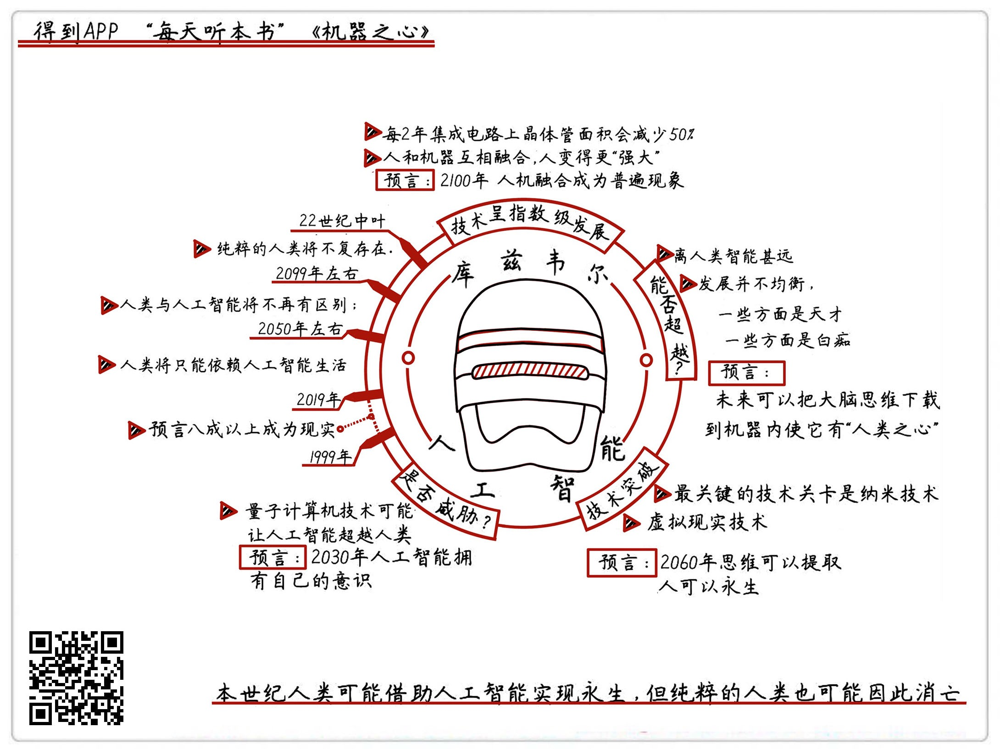

《机器之心》| 李楠解读
================================

购买链接：[亚马逊](https://www.amazon.cn/图书/dp/B01D0ST6JO/ref=sr_1_1?ie=UTF8&qid=1506523142&sr=8-1&keywords=机器之心)

听者笔记
--------------------------------

> 作者预测未来人工智能将与人体结合，制造工艺从纳米->皮米->费米，未来机器智能还可能出现自己的主观意识。

关于作者
--------------------------------

雷·库兹韦尔，集预言大师、科技大师、人类社会发展大师、“爱迪生正统接班人”等诸多称号于一体的大师。他是美国国家科技奖章得主，美国发明家名人堂成员，拥有19个荣誉博士学位，并三度获颁总统荣誉奖。比尔盖茨曾经评价他是，“在预测人工智能方面，我所知道的最厉害的人”。2012年12月17日，雷·库兹韦尔受 Google 创始人拉里·佩奇之邀加入 Google，担任 Google 的工程总监。Google 的绝密实验室 Google X在运作很多项目如 Google 眼镜、自动化住宅、智能手表、无人驾驶汽车、Wi-Fi 气球等，无不留下了库兹韦尔的印记。     
关于本书
--------------------------------

《机器之心》，出版于1999年，但如果你翻开它，一定会被其中对人工智能发展的预言震惊，他预言的便携电脑、无线网络、书籍电子化、自动驾驶汽车、谷歌眼镜、VR 系统、会谱曲的人工智能，全部如期出现在我们生活中了。而对未来，本书做出了更多惊人的预测。 
    
核心内容
--------------------------------

库兹韦尔在20年前，准确预言了接近九成的当今人工智能发展动态，对未来，他还有更多预测：人类身体中将植入各种电脑芯片、人造器官，而未来的机器人也会有更多跟人体一样的材质，人和机器的界限越来越模糊；通过和机器的结合，人的听觉、视觉与学习能力将成倍递增，甚至，人类在本世纪内就可能借助机器实现“长生不死”的梦想。同时，未来人工智能将可能拥有自主意识，摆脱人类的控制；2050年左右，人类将只能依赖人工智能生活；22世纪中叶，纯粹的人类可能将不复存在。     
 

一、库兹韦尔预言的人工智能发展趋势，以及主要技术关键点
--------------------------------

1. 人工智能的发展方向：与人体结合。根据摩尔定律，10年后计算机集成电路上的晶体管大小将达到原子大小。目前已知的技术和技术发展趋势，都将再也无法增加更多的晶体管，这将迫使机器也进入到它们的“进化”：跟人体相结合。
2. 人工智能会超越人类吗？目前来说，人工智能可以在某一单一领域超过人类，例如阿尔法狗可以战胜人类围棋大师，但人工智能体无法处理超出它们程序设定的问题，哪怕是再简单的问题，所以，还不能说它们已超越了人类。
3. 人工智能和人类的交融，有哪些最关键的技术关卡？纳米技术、VR 技术，以及未来的提取人脑思维的技术。
4. 未来的人类和机器人将如何发展，人工智能会威胁到人类的生存吗？作者认为，未来人体中会有更多后天植入的材质，而机器也会有更接近人体的质地，人和机器的界限将越来越模糊，作者预言纯粹的人类将在22世纪消失。对于人工智能体对人类的潜在威胁，取决于一旦它们获得自主思维能力，人类是否有相应的技术手段来限制它们。很多科学家预言过人工智能的威胁，霍金曾经说过：“人工智能的发明，是人类历史的一个里程碑，但同时，它也可能成为我们历史上的最后一个里程碑。”

二、库兹韦尔在1999年对截至2009年人工智能水平的预测及实现情况
--------------------------------

1. 便携式电脑，有的学校已经使用它授课。很显然，这就是 iPad 以及蓝牙。
2. 连接电缆消失，即时通讯实现，书籍、音乐、电影全部电子化等。这个也实现了。
3. 语音可以转为文字。这项技术也已经很成熟了，手机上很容易就能下载到这类的软件，转文字识别率已达到95%。
4. 文字可以转为语音。这个好多年前就实现了。
5. 为方便残疾人士的阅读器。这个有些地铁站里就有。
6. 可以同声将一种语言翻译成另一种语言的电话。这种技术也已经出现，并且投入应用了，同时能将一种语言翻译成多种语言，自己选择听什么语言就好。
7. 自动驾驶汽车。虽然因为价格以及路况等问题，自动驾驶汽车还没有普及，但是这项技术也已经比较成熟。特斯拉、奔驰等公司都推出了自动驾驶汽车。
8. 电子化战争的出现。黑客和各国网络安全部门的斗法，这个不用多说。
9. 远程医疗的普及。据说三四十年前就有，我国近几年也已经出现。
10. 国家将民众的情况保密，并加以合适的电子化办法封存。虽然今天纸质档案还未完全消失，但已经开始向电子化发展。

三、库兹韦尔在1999年对截至2019年人工智能水平的预测，及部分实现情况
--------------------------------

1. 带显示器的眼镜。这个技术又跑在预言前头了，Google 眼镜就是。
2. 虚拟现实模拟系统。就是 VR 技术了，今天已经开始向完全民用转变。
3. 手提显示器和仿真教师教育。今天大家都在用的智能手机，以及各类教育 App 程序就是。
4. 残障人士的自动化阅读与导航、神经和骨骼仿真系统。有些已经出现，但并没有普及。
5. 3D 投射影像通话和会议。这种东西现在叫全息投影，虽然还没像科幻电影里那么炫酷，但相关的设备已经可以买到了。
6. 电子化中间人，家用机器人的普及。已有，但未普及。
7. 人类和仿真人物建立联系和关系。这个还处于实验阶段。
8. 虚拟艺术家出现。这类“艺术家”应该已经不少了，无论是谱曲还是写诗歌、小说，人工智能都能办到——当然，对它们的作品水平，人类艺术家有不同看法。
9. 人类预期寿命为100岁，基因组密码大部分已被理解。这方面的进展速度，没能达到库兹韦尔的预期，不过，多一半的基因用途已经弄清楚了。
10. 哲学机器人出现。这个还没有相关的报道。

四、库兹韦尔在1999年对截至2059年人工智能水平的预测
--------------------------------

1. 计算机计算能力大大加强，显示器被植入眼部，各种植入神经都将出现。
2. 人类学习全部依赖于虚拟教师，机器创造出新的知识，并相互传递。
3. 残疾人士的高效导航系统，减少残障人士的不便。
4. 3D 虚拟技术到处可以应用，通信不需要人类干预即可完成。
5. 人口达到120亿，许多产业将不再有人类参与。
6. 人类与机器的鸿沟逐渐消失。
7. 许多杰出代表作品都是机器的产物。
8. 人类预期寿命达到120岁，仿生器官大量植入人体。
9. 机器智能开始出现自己的主观体验。

五、库兹韦尔在1999年对截至2099年人工智能水平的预测
--------------------------------

1. 皮米工程进入可行化阶段。
2. 纳米机器人集成工程完成，人类多个身体并存的情况比比皆是。
3. 没有神经植入的人将被视为异类。
4. 人类定义被颠覆。
5. 人工智能权利和力量开始超过人类，在那个时候，人工智能将是主流，而我们人类将是需要特殊保护的“濒危物种”。
6. 人脑逆向工程完成，机器与人类合二为一，平均寿命概念不复存在。
7. 费米工程开始提出。
8. 能源消耗将降到极低水平，包括宇宙在内的任何事物都可以模拟。向外拓展宇宙、寻找新定居行星已无实际意义。在更远的将来，智能体将会思考宇宙的命运。

金句
--------------------------------

1. 在2100年之后的世界，可能会出现类似这样一条法律：“拥有肌体成分达到50%以上，才能称之为人类。”
2. 当今时代人工智能的普遍特点就是：在某一方面天才，其他剩余所有方面全是白痴。譬如阿尔法狗，围棋方面它固然很厉害，但让它思考下雨要不要带伞的问题试试，不烧毁它的 CPU 才怪。
3. 把血肉之躯换成机器的外壳，然后再把我们的大脑思维放进机器外壳中，那么人类就能够更好地保护自己的大脑，甚至获得永生。
4. VR技术的出现，意味着虚拟技术已经从虚拟身体发展到虚拟世界，直至发展出一整个虚拟现实。如果照这个趋势，总有一天，VR 技术能让我们躺着就可以度过自己的一生。
5. 斯蒂芬·霍金曾经说过：“人工智能的发明，是人类历史的一个里程碑，但同时，它也可能成为我们历史上的最后一个里程碑。”

撰稿：李楠

脑图：摩西

转述：于浩