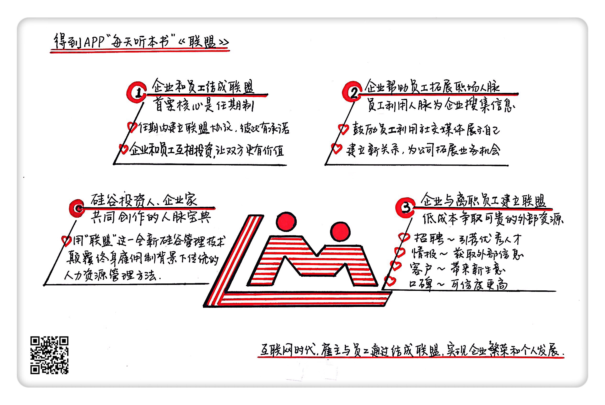

《联盟》| 刘家琦解读
=============================

购买链接：[亚马逊](https://www.amazon.cn/图书/dp/B00SIPO6XG/ref=sr_1_1?ie=UTF8&qid=1507725252&sr=8-1&keywords=联盟)

听者笔记
-----------------------------

> 公司和员工应该建立联盟关系，通过建立很多连续的任期，以达到互惠互利的功效。
>
> 公司应该利用员工的人脉为公司带来好处，建立相应的制度，给予员工足够的信任，让他们能最大限度地运用到私人的人脉关系。
>
> 对于离职员工，也应该保持一种独特的关系，让他们成为公司的特殊资源。

关于作者
-----------------------------

本书有3位作者，分别是里德·霍夫曼、本·卡斯诺查和克里斯·叶。其中第一作者里德·霍夫曼是硅谷鼎鼎大名的投资人和企业家——全世界最大的职场社交网站领英的创始人和执行总裁，曾任全球知名的第三方支付平台贝宝公司的高级副总裁，投资过60多家创业公司，是最早投资Facebook的天使投资人，十年间的回报超过2万倍，他被人称为“硅谷人脉王”。 

关于本书
-----------------------------

在《联盟》这本书里，作者从自己的实际管理经验出发，解答了以下问题：在互联网时代，公司和员工应该建立怎样的联盟关系？公司应该如何利用员工的人脉为公司带来好处？公司应该怎样对待已经离职的员工，才能让他们继续为公司的利益服务？ 

核心内容
-----------------------------

作者认为：终身雇佣的时代结束了，铁饭碗消失了。雇主和员工应该建立互惠互利的联盟关系，而联盟关系的核心是任期制。在联盟关系中，公司应该采取奖励措施鼓励员工拓展人脉，为公司获取重要的外部情报；而员工也应该利用公司的奖励制度认识更多的人。公司通过与前员工结为联盟，可以让前员工在新的公司、以新的身份与原来的公司保持互惠互利的合作关系。 
 

一、互联网时代，公司和员工应该建立联盟关系
-----------------------------

过去人们认为，雇主和员工是雇佣关系，只有退休才能把彼此分开。员工只要循规蹈矩，按部就班地工作，将来一定能得到稳定的升职和加薪。但是现在，终身雇佣制结束了。雇主和员工应该形成联盟关系。独立的双方达成一份联盟协议，有清晰的时间界限、明确的条款和互利互惠的承诺。这是双方建立信任、可以互相投资、让企业强大、让事业成功的一个框架。

终身雇佣不是家庭关系，而是球队关系。家庭关系听起来挺美好的。因为家人是一生的陪伴，给人一种归属感。但是这样比喻其实非常尴尬。因为家里是不会开除人的。如果你总是当着员工的面，把公司形容得亲如一家，那你裁员的时候就会遭遇非常难堪的情况。被开除的员工会觉得你伤害了他的感情，你背叛了他，会出现撕破脸的情况。

制作了热播剧《纸牌屋》的奈飞公司的CEO里德说：“我们是一个团队，不是什么家庭。”里德说的团队关系，在现实生活中最好的一个体现就是职业球队。一支球队有明确的目标：赢得比赛，赢得冠军。大家为了这个目标聚在一起。但是合同到期的时候，球员都可以自由转会，老板也可以选择裁员或者交易队员。企业应该更像是球队，而不是家庭。虽然没有终身雇佣了，但是互相信任、彼此付出、共同受益的原则依然适用。

如何把联盟关系落实到企业用人的具体实践中？作者给出的答案是：任期制。任期制就是不管一个人在公司要待多久，都要把时间化整为零，公司要和个人共同设立阶段性的目标，完成一个任期，再去共同设立下一个任期的目标。

任期比合同签约时间的内涵要丰富得多，在任期中最关键的是，双方都对工作任务和工作目标有着明确的预期，过去升职加薪都是看老板的意愿，完全不确定。即便员工得到了升值加薪，对未来依然感到不确定。很多企业中都会出现这样的情况，最大的问题是企业和个人都没有管理好双方的预期。

而任期制能做到什么？设计渐进式的承诺，从而形成联盟。通过把一个人在这家公司的职业生涯，规划成一连串的任期，就能更好地吸引并留住优秀的员工。在员工的签约工作时间内规划任期，从每个任期的一开始双方就开诚布公：在这一任期内，公司能帮员工实现怎样的目标，学到什么技能，增长哪些经验，任期结束时，能完成目标的话，会得到怎样的晋升；而员工又能帮公司实现怎样的目标，给公司带来什么利益和增长点。在下一个任期开始的时候，重复这样的过程，双方在信任的基础上设定新的目标，做出新的承诺，进一步巩固联盟的关系；如果这一任期结束，员工就想跳槽，或者公司进行裁员的话，双方都已经获得了各自的成长和收益，也可以友好地结束雇佣关系。在联盟关系中，双方不承诺终身雇佣与终身受雇这对关系，承诺的是阶段性的互惠——在一个任期内，员工让公司更有价值，公司也让员工更有价值。

二、公司应该利用员工的人脉为公司带来好处
-----------------------------

过去很多人不愿意动用自己的私人关系帮公司做事情，总感觉是公司利用了自己的资源，自己又没得到什么实质性的好处，还给亲朋好友添了麻烦。很多企业发现在这方面也请不动员工，所以就不重视员工拓展并利用个人人脉这件事。而在联盟关系中，本着互利互惠的原则，公司是可以利用员工人脉获取重要的外部情报的。一个聪明的员工应该清楚，在职场中，人脉是非常重要的资源。如果公司能鼓励自己拓展职业人脉，对自己当然也有好处。

那公司应该怎么表示出鼓励、支持呢？

1. 适当地鼓励员工在上班时间发发微博、发发朋友圈，尤其是身为大V网红的那些员工，鼓励他们积极地用社交媒体展示自己。
2. 除了商务宴请能够报销以外，公司可以给愿意积极开拓人脉的员工设立专项基金，鼓励他们报销社交会餐的费用，社交会餐也就是我们俗称的“饭局”。除了大额的宴请必须特批以外，一定金额内的餐费都可以直接报销。领英就有这样的基金，员工只要在报销的报告里面小结一下，他们从会餐中听到了什么有价值的信息、学到了什么有用的东西就可以了。
3. 公司可以举办一些餐会，还有俱乐部活动，邀请外边的人到公司来，可以是同行，也可以是同一座写字楼里面其他公司的员工。在大公司里，这样的社交活动需要付出的成本很低，但是对于员工和外部人士建立新的关系，拓展新的业务机会是大有好处的。
4. 一个公司内部的视野终究是封闭的，想要获取更多隐秘的、不在官方渠道披露的外部数据和信息，就要鼓励员工把触角伸出去，拓展人脉，搜集情报，寻找意外的发现和机会。只要获取情报的手段是符合法律和道德的，就可以动用一切资源。作者之前所在的支付公司贝宝就是通过全体员工的人脉搜集情报信息，优化产品支付体验，最终打败了另一家支付公司。

三、公司善待离职员工，让他们继续为公司的利益服务
-----------------------------

过去人们认为，离职的人对公司没有任何价值。想要挖掘一个员工的终身价值，只有终身雇佣制才能提供保证。而现在，通过打造前员工联盟，公司能收获从现有员工联盟中收获不到的巨大收益。没有了终身雇佣制，公司和个人之间依然可以建立终身联盟。这样能互惠终生的前员工联盟，给公司带来的好处，体现在招聘、情报、客户和口碑这4个方面。

1. 在招聘方面，保持与前员工的互动和联系，他们可以为你引荐合适的优秀人才，为新员工做担保。著名的咨询公司德勤会为成功介绍新员工的老员工发放现金奖励。而且前员工联盟还能成为招聘时的卖点，让新人明白进入这家公司，除了现有的同事，你能拓展的人脉还有很多前员工。
2. 在情报方面，前员工拥有更丰富的外部信息，他们对行业趋势的洞察、对不同公司优势劣势的把握，是只在一家公司干过的人比不了的。
3. 在客户方面，很多行业里，一个前员工只要念着老东家的好，就会给老东家推荐新客户，带来新的生意。像麦肯锡这样的咨询服务公司，做运营前员工联盟这件事就非常积极。他们做这件事情已经有50多年了，前员工会员超过24000人，就是因为前员工能带来源源不断的客户。
4. 在公司的品牌和形象方面，前员工的作用也非常大。前员工夸公司一句，胜过公司自卖自夸十句。因为一个人都已经离开了，没有利害关系了，还在夸自己的前雇主，说明这是真心话，外人会觉得可信度非常高。所以说，前员工虽然不能在公司的内部协作中创造新的价值，但是如果公司能继续重视他们，把这些关系好好建立起来、维护起来，就是用很低的成本争取到了宝贵的外部资源。一个人就算去了新的公司，通过前员工联盟，依然能和老东家保持互惠互利的关系。

金句
-----------------------------

1. 雇主和员工应该形成联盟关系。独立的双方达成一份联盟协议，有清晰的时间界限、明确的条款和互利互惠的承诺。这是双方建立信任、可以互相投资、让企业强大、让事业成功的一个框架。你让我更有价值，我让你也更有价值。
2. 奈飞公司的CEO里德就说：“我们是一个团队，不是什么家庭。”
3. 前员工夸公司一句，胜过公司自卖自夸十句。

撰稿：刘家琦

脑图：摩西

转述：顾一菲