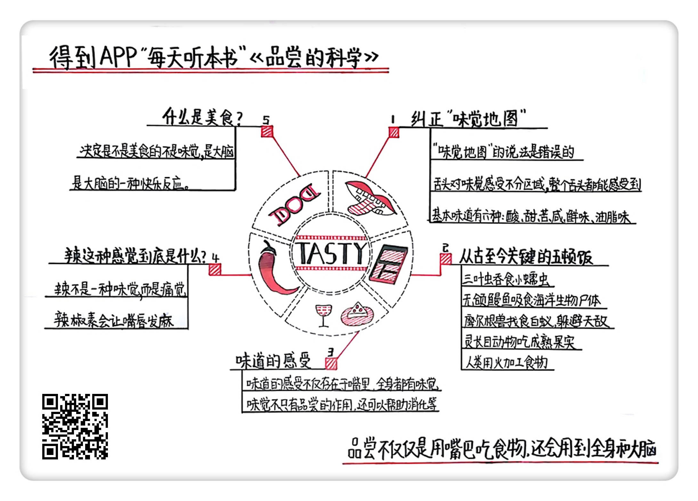

《品尝的科学》| 璐瑶解读
================================

购买链接：[亚马逊](https://www.amazon.cn/品尝的科学-从地球生命的第一口-到饮食科学研究最前沿-约翰·麦奎德/dp/B06ZZSMV44/ref=sr_1_1?ie=UTF8&qid=1509111478&sr=8-1&keywords=品尝的科学)

听者笔记
--------------------------------

> “味觉地图”是指过去人们认为舌头的各个区域分别负责品尝不同的味道，然而实际情况是，整个舌头，都可以感受到不同的味道。
>
> 而且不只是酸、甜、苦、咸，科学家还在舌头中发现了对鲜味、油脂的受体。
>
> 进食这件事从寒武纪三叶虫吞食小蠕虫，到人类学会使用火改变肉的口感，进食的历史，也是一部进化史。
>
> 能够体会味觉，并不是嘴的专利，人体的很多其他部位也有对味觉的受体。
>
> 辣，并不是一种味道，辣给人带来的感觉，是一种痛觉。
>
> 美食之所以是美食，其实是使人大脑兴奋快乐所带来的愉悦感，因此也可以通过大脑的愉悦程度来作为评判美食的标准。

关于作者
--------------------------------

约翰·麦奎德是一位记者，他与另一位记者一起撰写的报道《毁灭之路：新奥尔良的破坏与超级风暴来袭》获得了普利策新闻奖。但他不仅是位记者，还是位科普作家，曾经在全世界最大的博物馆体系“史密森学会”的众多刊物上发表过文章。他的其他作品还拿过美国科学促进会、美国生物科学协会和国际专业烹饪协会的大奖。

关于本书
--------------------------------

这本书的内容参考了大量的文献和书籍，作者也亲自拜访了很多厨师和科学家。可以说，这是一本可信度非常高，且比较前沿的关于品尝的科普书。通过这本书，我们可以了解到很多我们日常生活中知其然而不知其所以然的品尝的科学知识。

核心内容
--------------------------------

如果你认为品尝仅仅是把食物放进嘴巴里，然后用舌头来感觉味道，然后再通过口感来评价食物的好坏，那么这期音频会告诉你，品尝其实不仅仅如此。品尝这件事不单能追溯到几亿年前，还和我们的全身、以及大脑都有关系。

 
一、“味觉地图”几十年来对味觉的错误划分
--------------------------------

1. “味觉地图”将舌头分成了四个区域：舌尖用来感受甜味，舌根用来感受苦味，而舌头两侧的前端部分用来感受咸味，后端部分则用来感受酸味。

但是现在，科学家通过对味觉的分析发现，味道的感受根本就没有位置上的差异，整个舌头都能感受到不同的味道。

2. 人能感受到的基本味道不止有“酸甜苦咸”这四种，还有鲜味和油脂味。鲜味的感受是由鲜味受体负责的，但奇怪的是，鲜味一定要和其他的味道搭配在一起才能发挥出它的作用，单独吃是没有任何味道的。至于感受油脂味的油脂受体，它能够引发特有且令人愉悦的感受。

二、从古至今最重要的五顿饭
--------------------------------

从5亿年前的寒武纪时期，三叶虫吞吃小蠕虫的第一餐，到无颌鳗鱼靠追踪腐败的气味在海洋中找食物的第二餐，再到摩尔根兽用记忆和策略躲避天敌，寻找白蚁为食的第三餐；然后是猴子爬上树枝，用进化的视觉辨认出成熟的果实，吃到更美味食物的第四餐；最后到人类学会用火，改变了饮食习性的第五餐。这五顿饭，不仅是品尝的进化史，也是地球生物的演化史。

三、味道的感受是不是只存于在于单一的感官中
--------------------------------

1. 有少数人拥有“共感觉”，他们能够因为一种形态的感官刺激，引发另一种形态的感觉。有一位中年英国商人，他从大概6岁的时候开始，只要他听、说、读，甚至只是想到某些字的时候，嘴巴里就会产生味觉。这就是一种与味觉有关的共感觉。

2. 近年来，科学家还在人类的消化道、胰脏、肝脏、大脑和睾丸中发现了味觉受体。这意味着什么呢？意味着我们的全身各处都有“味觉”。但味觉在身体各处所发挥的作用不大一样，像舌头上的鲜味受体是用于感受鲜味的，但在小肠内发现的鲜味受体，则起到了促进消化和营养吸收的作用。

四、“辣”这种感觉到底是怎么回事
--------------------------------

辣并不是一种味觉，而是一种痛觉。虽然我们在吃辣的时候会流汗，觉得自己的体温变高了，但实际上并没有。之所以会这样，是因为“辣椒素受体”在发挥作用，它会放大我们的灼热感。有时候辣所引起的刺激太大时，还会让我们的神经细胞死亡，但是这些细胞没了也许更好，因为这种神经细胞越少，代谢会越好。

五、美食是什么
--------------------------------

1. 21世纪初期的时候，科学家发现了大脑分泌的快乐物质是“内啡肽”，在这之后的20年，又发现了会对内啡肽产生愉快反应的大脑区域，这个区域被叫做“享乐热点”。人们在吃糖的时候会引起大脑的“享乐热点”产生反应。但在实验室中，给那些缺盐的大鼠喂了相当于海水含盐量3倍的咸水，也同样引起了大鼠大脑中“享乐热点”的反应。
2. 研究者用电极对大脑进行扫描发现，虽然当我们的胃被某些食物填满了，不会再对这些食物产生快乐反应了，但我们却还可以对其他的食物作出快乐反应。就像人们在吃完主菜后还可以愉快地吃下甜品一样。 

金句
--------------------------------

1. 科学对味觉的探索才刚刚起步，过去数千年来，人们对味觉这个感官不太重视，认为味觉太特殊了，不值得研究，所以人们对味觉的研究远比视觉、嗅觉等其他感官的研究要晚得多。
2. 在早期时代，吃东西只是为了填饱肚子，但随着进化，吃不再是单纯的吃，更重要的还有吃东西时食物在嘴巴里的感受，那种美妙的味道，还有味道所引起的愉悦感。
3. 味道不只有品尝的作用，嘴巴只是整个味道系统中很小的一部分，对品尝的研究会从嘴巴开始，然后继续延伸下去。
4. 辣是一种痛觉，还会放大我们感受到的灼热感。
5. 判断什么是美食，好不好吃确实是一部分的决定因素，但做出这个决定的并不是味觉，而是大脑。大脑会对美食有快乐的反应。

撰稿：璐瑶

脑图：摩西

讲述：成亚