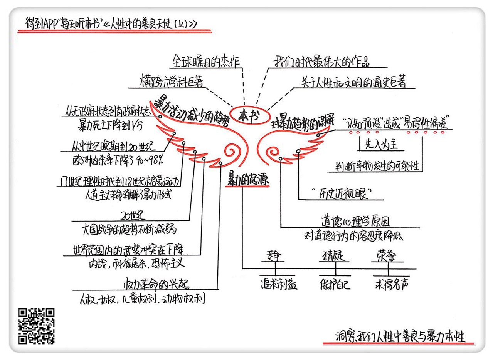

《人性中的善良天使（上）》| 韩巍解读
==========================================

购买链接：[亚马逊](https://www.amazon.cn/图书/dp/B00PI5VE6Q/ref=sr_1_1?ie=UTF8&qid=1507554115&sr=8-1&keywords=人性中的善良天使)

听者笔记
------------------------------------------

> 作者列举了大量的例子证明暴力正在不断减少。人们可能对此表示质疑，作者又提出了认知预设和“历史近视眼”以及“易德性偏差”的理论。

关于作者
------------------------------------------

斯蒂芬·平克，哈佛大学心理学教授，当代著名的实验心理学家、认知心理学家、语言学家和科普作家，曾入选《时代周刊》“当今世界影响力最大的100人”之一。2016年，平克入选美国国家科学院院士。

关于本书
------------------------------------------

在本书里，斯蒂芬·平克引用了大量图表和数据，解读了暴力减少的六大趋势，并分析了日常生活中我们对暴力趋势产生误判的原因。随后，他从心理学、认知科学等角度出发，讨论了人性中倾向暴力的“心魔”与守卫我们远离暴力的“善良天使”。人性之外，平克也解读了社会因素对于暴力减少的影响。

核心内容
------------------------------------------

本书思想核心是：六大趋势体现了暴力的减少：从原始社会到国家出现，暴力事件有了明显的下降；从中世纪到20世纪的欧洲，凶杀率下降了90%，而且人们对于暴力的态度因为人道主义革命的影响也有了巨大的转变；二战以后，大国之间的战争几乎消失，各类武装冲突也越来越有节制；20世纪下半叶以来，由于权利革命的兴起，家暴、霸凌、虐待动物等暴力行为也都在减少。“历史近视眼”“认知预设”等因素造成了我们对暴力趋势的误判；人性中“捕食”“统治”“复仇”等因素使人倾向暴力，但“移情”“自制”“道德”等善良天使会推动我们远离暴力；人性之外，国家、商贸、都市化等社会、经济、制度原因是带来暴力减少的外在动因。
 

一、关于暴力减少的六大趋势
------------------------------------------

第一个趋势要追溯到公元前8000年。如果按照暴力死亡率来比较，我们会惊讶地发现，从欧洲到亚马逊，从澳大利亚到菲律宾，平克列举了39个没有国家的社会，包括原始部落、狩猎采集群体等等，他们的平均暴力死亡率高达15%到25%，而有了国家之后，哪怕算上20世纪的世界大战和大屠杀，平均暴力死亡率也只有5%。也就是说，第一个趋势是人类从无政府状态过渡到有政府状态，暴力死亡下降到了原先的五分之一。

第二个趋势的起点是中世纪的晚期。从中世纪晚期到20世纪，欧洲的凶杀率下降了90%到98%。这个数据来自于犯罪学家曼纽尔·艾斯纳，艾斯纳使用了尸检报告、法庭案例、地方档案等等，力图确保数据的可信度。

第三个趋势横跨的时间段很短，只有从17世纪理性时代到18世纪末启蒙运动的一百多年，但成效却是非常显著的。平克把这一切归功于文明和启蒙，人道主义革命的兴起推动了这些暴力形式的消解。

接下来让我们回到20世纪看一下第四个趋势：大国战争。二战结束了，还会有第三次世界大战吗？会不会是核战争等更加可怕的形式呢？这个话题一直是各个学科讨论的热门主题，可以说是众说纷纭，谁也说服不了谁。事实上，二战结束以来，无论是战争的数量还是量级都在降低。平克在这一个趋势里还列举了一系列有趣的数字：“零”。二战之后使用核武器的数量是零，冷战中敌对国直接交火的数量是零，二战后大国交战的次数是零，发达国家交战次数是零，发达国家征服其他国家扩张领土也是零。

第五个趋势显示：世界范围内各类武装冲突其实也在下降。在这里，平克把武装冲突分成了三个类别：内战、种族屠杀和恐怖主义。我们通常认为内战对无辜的平民百姓具有很大的杀伤力，但事实上真正导致平民死亡的是饥荒和疾病，而不是战争本身，就算算上所有的死亡人数，这类战争造成的伤亡仍然是在减弱的。其次，种族屠杀。数据告诉我们这一切都在减少：20世纪60年代到70年代，印度尼西亚、布隆迪、巴基斯坦、乌干达、柬埔寨、越南都曾发生过种族屠杀。其中，在柬埔寨，从1975到1979年间有250万人被杀害。而冷战结束后的20年内，尽管也发生了波斯尼亚和卢旺达等大屠杀，但总体数目和死亡率已经大大降低。最后一个是大家都很关注的恐怖主义。我们仍然能从各种数据库中看到一种趋势：全球的恐怖活动在20世纪70年代上升，到90年代起下降。

最后一个要讨论的趋势是“权利革命”。20世纪下半叶以来，维护人权、女权、儿童权利、动物权利等等的运动在全球范围内兴起。家暴、霸凌、虐待动物等暴力行为也都在减少。

二、关于“认知预设”
------------------------------------------

在解答为什么日常生活中我们感受不到暴力在减少时，平克提出了“认知预设”的概念：所谓的“预设”，是指人类常常会有一些先入为主的观念，这种预设虽然会方便我们更迅速地做出判断，但也有可能会限制我们对世界的认识。比方说，有一句俗话是“一朝被蛇咬，十年怕井绳”，因为被蛇咬过，或者从广泛意义来说，因为某件事受到过伤害，我们心里多了一分防备，以后发生类似的事就能快速反应，更好地保护自己，但也正是因为这种防备，让我们可能会错过很多东西。为什么会有认知预设呢？是因为我们的大脑每天要处理无数的信息，所以在估算事件概率的时候，常常会从印象最深的记忆开始算起，而图像是最容易给我们留下印象的。图像记忆里，又要数那些有冲击力和震撼力的图片排在前头。暴力争斗、血腥战争的图像自然是最有冲击力的，所以更容易转化成我们的认知预设，那些温和平静的场景就被我们忽略掉了。

三、关于“历史近视眼”和“易得性偏差”
------------------------------------------

“历史近视眼”和“易得性偏差”也是造成我们对暴力趋势产生误判的原因。这个词比较好理解，我们站在历史长河边回头看的时候，总是近一点的事物看得更清楚一点，知道的细节也越多，所以才叫“近视眼”。而易得性偏差又叫“可得性偏差”，认知心理学家阿莫斯和卡尼曼最早提出了这个概念。就是说，我们会根据信息获取的难易程度来判断事情发生的可能性。如果一件事我们越是容易知道，我们就越会觉得这件事容易发生。如今，我们的信息获得大多来自于各种媒体，如报纸、电视、网络等。在信息泛滥的今天，为了获得人们的关注，媒体会更倾向于用有冲击力的消息来增加点击量，各种标题党也由此产生，暴力新闻也更受欢迎。正因为关于暴力的信息获取如此容易，我们才会觉得暴力事件更有可能发生，也觉得我们所处的时代更加暴力。

金句
------------------------------------------

1. 在《利维坦》中，霍布斯分析了暴力的动机：第一是竞争，追求利益；第二是猜疑，保护自己；第三是荣誉，求一个名声或者说面子。
2. 人类从无政府状态过渡到有政府状态，暴力死亡下降到了原先的五分之一。
3. “认知预设”虽然方便我们更迅速地做出判断，但也有可能会限制我们对世界的认识。
4. 如果一件事我们越是容易知道，我们就越会觉得这件事容易发生，也即所谓的“易得性偏差”。
5. 我们觉得暴力变多了，可能是因为我们对道德的要求越来越严格了。

撰稿：韩巍

脑图：摩西

转述：杰克糖